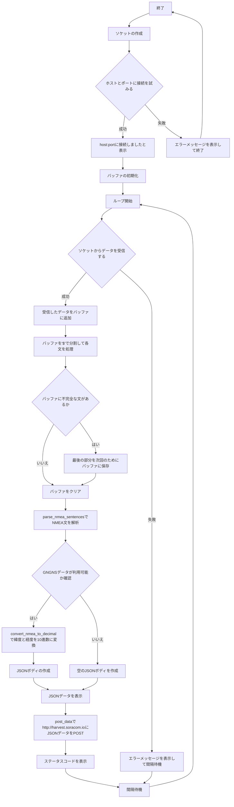

:::message
「[一般消費者が事業者の表示であることを判別することが困難である表示](https://www.caa.go.jp/policies/policy/representation/fair_labeling/guideline/assets/representation_cms216_230328_03.pdf)」の運用基準に基づく開示: この記事は記載の日付時点で[株式会社ソラコム](https://soracom.jp/)に所属する社員が執筆しました。ただし、個人としての投稿であり、株式会社ソラコムとしての正式な発言や見解ではありません。
:::

# やりたいこと

IoTデバイスからクラウドにデータを送信する際にGPSなどのGNSSによる測位データを載せたいことがあります。
やり方はいくつかありますが、今回は以下のようなシチュエーションを想定した構成で考えてみます。


ちなみにこの構成が最適解とならない場合もあるため、他の選択肢を挙げておきますので比較検討したうえでこの構成を使っていただければと思います。
- GNSS対応LTEルーターが測位データのみ直接送信する
(クラウドアプリケーション側でデータを連携する必要あり）
- GNSS非対応ルーターを使い、GPSトラッカーを別で用意して測位データのみ直接送信する
(クラウドアプリケーション側でデータを連携する必要あり）
- コンピュータ側にGPSモジュールを接続する


# 環境
- Robustel R1520-4L
    - LTE アンテナ
    - GPS アンテナ
- SORACOM IoT SIM
- PC （本ブログでは、M2 Mac Book Proを使用）
    - Python 3.11.7
    - ブラウザ（本ブログではGoogle Chrome バージョン: 125.0.6422.112（Official Build） （arm64）)
- LANケーブル

# セットアップ
1. R1520のSIM1スロットにSORACOM IoT SIMを挿入
2. PCのEthernetポートと、R1520のETH0ポートをLANケーブルで接続
4. PCのEthernetポートをDHCPに設定（R1520のDHCPサーバーを使います）
6. R1520を起動（ACアダプタを接続し、電源供給を開始する）
7. http://192.168.0.1　にアクセスし、適切なusername,passwordを使ってログイン


# 手順
## R1520をルーターとして使えるようにする
Interface からWWAN1をPrimary Linkにします。
(設定をsubmitしたらSave&Apply)


以下のようになっていればOKです。


いつものAPNやuser,passwordを入れてないけど大丈夫か？と思いますが、Automatic APN Selectionが効いているようです。


APNを手動で設定する場合の設定はこんな感じでいけます。


## R1520のGPSサーバー機能を有効化する
GPSのサービス設定は「Services」 -> 「GPS」のところにあります。

Gneneral SettingsのEnable GPSと、Sync GPSをONにしてGPSの機能を有効化します。


RS232 Report SettingsはシリアルインターフェースからNMEAデータを垂れ流しにする機能のようですが、今回は使いません。

中段にある「GPS Servers」の右端の「＋」を押して、設定を開きます。
Local AderessはこのルーターのLAN側IPを設定して、Local Portはお好みのポートを入れます。
（今回は、デフォルトのLAN側I/FのIPアドレスある、192.168.0.1と、なんとなく50010ポートを設定して、すべてのsentenceをONにしました。）


submitをクリックすると、右上の「Save&Apply」が黄色くなりますので、そこをクリックすると反映されます。

一旦Reboot（おまじない）して、再度http://192.168.0.1　にログインします。

「Services」 -> 「GPS」で「Status」タブを開きます。
ちゃんと測位ができていると、以下のように表示されます。


## ルーター配下に接続したPCでR1520からNMEAメッセージを取得
### コマンドラインからサーバーに接続
R1520のGPS Serverに対して手動でアクセスできるかどうかを確認します。

```
curl -v telnet://192.168.0.1:50010
```
以下のように、192.168.0.1:50010にTCPセッションを張って、なんだかそれっぽいデータが取れればOKとなります。


ここでアクセスできない場合は何かがおかしいので各種設定を確認しましょう。

ここまでで動きはわかったとおもいますが、クライアントであるPCからTCPのソケットを接続すると、サーバー側からデータが降ってくるという仕組みのようです。

### pythonでとってSORACOM Harvest Dataに投げてみる
あとはTCPソケットを開いて、バッファに投げ込まれたデータをいい感じに整形して後段の処理に必要なデータを渡してあげることを考えます。

作ったpythonスクリプトは以下の通りです。

各部の解説はコードの後ろに記載します。
:::details コード本体（▶️クリックして開く）
```python
import socket
import time
import json
import requests

def parse_nmea_sentence(sentence):
    parts = sentence.split(',')
    if sentence.startswith("$GPGGA"):
        return {
            "type": "GPGGA",
            "time": parts[1],
            "latitude": parts[2],
            "latitude_direction": parts[3],
            "longitude": parts[4],
            "longitude_direction": parts[5],
            "quality": parts[6],
            "num_satellites": parts[7],
            "horizontal_dilution": parts[8],
            "altitude": parts[9],
            "altitude_units": parts[10],
            "geoid_separation": parts[11],
            "geoid_separation_units": parts[12],
            "age_of_diff_corr": parts[13] if len(parts) > 13 else None,
            "diff_ref_station_id": parts[14].split('*')[0] if len(parts) > 14 else None
        }
    elif sentence.startswith("$GPRMC"):
        return {
            "type": "GPRMC",
            "time": parts[1],
            "status": parts[2],
            "latitude": parts[3],
            "latitude_direction": parts[4],
            "longitude": parts[5],
            "longitude_direction": parts[6],
            "speed_over_ground": parts[7],
            "track_angle": parts[8],
            "date": parts[9],
            "magnetic_variation": parts[10] if len(parts) > 10 else None,
            "magnetic_variation_direction": parts[11].split('*')[0] if len(parts) > 11 else None
        }
    elif sentence.startswith("$GPVTG"):
        return {
            "type": "GPVTG",
            "true_track_degrees": parts[1],
            "true_track_indicator": parts[2],
            "magnetic_track_degrees": parts[3],
            "magnetic_track_indicator": parts[4],
            "ground_speed_knots": parts[5],
            "ground_speed_knots_unit": parts[6],
            "ground_speed_kmph": parts[7],
            "ground_speed_kmph_unit": parts[8].split('*')[0]
        }
    elif sentence.startswith("$GPGSV"):
        return {
            "type": "GPGSV",
            "num_messages": parts[1],
            "message_number": parts[2],
            "num_sv_in_view": parts[3],
            "sv_info": parts[4:]
        }
    elif sentence.startswith("$GNGSA"):
        return {
            "type": "GNGSA",
            "mode": parts[1],
            "fix_type": parts[2],
            "satellite_ids": parts[3:15],
            "pdop": parts[15],
            "hdop": parts[16],
            "vdop": parts[17].split('*')[0]
        }
    elif sentence.startswith("$GNGNS"):
        return {
            "type": "GNGNS",
            "time": parts[1],
            "latitude": parts[2],
            "latitude_direction": parts[3],
            "longitude": parts[4],
            "longitude_direction": parts[5],
            "mode_indicator": parts[6],
            "num_satellites": parts[7],
            "hdop": parts[8],
            "altitude": parts[9],
            "geoid_separation": parts[10],
            "dgps_age": parts[11],
            "dgps_station_id": parts[12].split('*')[0]
        }
    elif sentence.startswith("$GLGSV"):
        return {
            "type": "GLGSV",
            "num_messages": parts[1],
            "message_number": parts[2],
            "num_sv_in_view": parts[3],
            "sv_info": parts[4:]
        }
    return None

def parse_nmea_sentences(sentences):
    parsed_data = {
        "GPGGA": None,
        "GPRMC": None,
        "GPVTG": None,
        "GPGSV": None,
        "GNGSA": None,
        "GNGNS": None,
        "GLGSV": None
    }
    
    for sentence in sentences:
        parsed_sentence = parse_nmea_sentence(sentence)
        if parsed_sentence:
            parsed_data[parsed_sentence["type"]] = parsed_sentence

    return parsed_data

def convert_nmea_to_decimal(degree_minutes, direction):
    if not degree_minutes:
        return None
    parts = degree_minutes.split(".")
    if len(parts) != 2:
        return None
    degrees = int(parts[0][:-2])
    minutes = float(parts[0][-2:] + "." + parts[1])
    decimal_degrees = degrees + minutes / 60
    if direction in ['S', 'W']:
        decimal_degrees = -decimal_degrees
    return decimal_degrees

def post_data(url, data):
    headers = {'Content-Type': 'application/json'}
    try:
        response = requests.post(url, headers=headers, json=data)
        print(f"POST {url} - Status Code: {response.status_code}")
        print("Response Text:", response.text)
    except Exception as e:
        print(f"Error posting data: {e}")

def receive_gps_data(host, port, interval=10):
    with socket.socket(socket.AF_INET, socket.SOCK_STREAM) as s:
        try:
            s.connect((host, port))
            print(f"Connected to {host}:{port}")

            buffer = ""

            while True:
                try:
                    data = s.recv(4096).decode('utf-8')
                    if not data:
                        print("No data received. Waiting for more data...")
                        time.sleep(interval)
                        continue

                    buffer += data
                    sentences = buffer.split('$')
                    buffer = sentences.pop()  # Save the last part to buffer

                    nmea_sentences = [f"${sentence.strip()}" for sentence in sentences if sentence.strip()]
                    for sentence in nmea_sentences:
                        print(sentence)

                    parsed_data = parse_nmea_sentences(nmea_sentences)
                    
                    # Check if GNGNS data is available
                    if parsed_data["GNGNS"] is not None:
                        # Calculate latitude and longitude values
                        latitude = convert_nmea_to_decimal(parsed_data["GNGNS"]["latitude"], parsed_data["GNGNS"]["latitude_direction"])
                        longitude = convert_nmea_to_decimal(parsed_data["GNGNS"]["longitude"], parsed_data["GNGNS"]["longitude_direction"])

                        # Create JSON body
                        json_body = {
                            "GNGNS_time": parsed_data["GNGNS"]["time"],
                            "GNGNS_latitude": latitude if latitude is not None else "",
                            "GNGNS_longitude": longitude if longitude is not None else "",
                            "GNGNS_altitude": parsed_data["GNGNS"]["altitude"],
                            "GNGNS_satellites": parsed_data["GNGNS"]["num_satellites"]
                        }
                    else:
                        # No GNGNS data available
                        json_body = {
                            "GNGNS_time": "",
                            "GNGNS_latitude": "",
                            "GNGNS_longitude": "",
                            "GNGNS_altitude": ""
                        }

                    # Convert JSON to string and print
                    json_data = json.dumps(json_body, indent=2)
                    print("JSON Data:", json_data)

                    # Send POST request with JSON body
                    post_data("http://harvest.soracom.io", json_body)

                    time.sleep(interval)
                except Exception as e:
                    print(f"Error receiving or sending data: {e}")
                    time.sleep(interval)
        except Exception as e:
            print(f"Error: {e}")

if __name__ == "__main__":
    host = '192.168.0.1'
    port = 50010
    receive_gps_data(host, port)

```
:::

1. parse_nmea_sentence(sentence)

GPSサーバーから取得したNMEAセンテンスの解読を行う部分になります。
実際は以下のような形でASCIIで改行無しでバッファにガンガン溜まってきます。
```
$GLGSV,3,3,09,78,14,250,*51$GPGGA,043957.00,3545.303666,N,13939.703979,E,1,09,0.7,65.2,M,39.0,M,,*56$GPGSV,3,3,12,19,65,319,44,22,34,222,35,11,11,279,,20,,,*47$GPRMC,043957.00,A,3545.303666,N,13939.703979,E,0.0,0.0,250524,5.0,W,A*29$GPVTG,0.0,T,5.0,M,0.0,N,0.0,K,A*26$GNGSA,A,3,,,,,,,,,,,,,1.1,0.7,0.8,3*3C$GNGNS,043957.00,3545.303666,N,13939.703979,E,AAN,13,0.7,65.2,39.0,,*27
```
ここで、$から始まるのが各センテンスと呼ばれるもので、このコードでは`GPGGA`、`GPRMC`、`GPVTG`、`GPGSV`、`GNGSA`、`GNGNS`、`GLGSV`あたりのフォーマットを解読できるようにしています。

これらのセンテンスのデータフォーマット（それぞれの値が何の意味を持つか）についてはNMEA0183という規格に従っています。
[こちらのページ](https://www.nmea.org/nmea-0183.html)の「INFORMATION, AMENDMENTS, CORRIGENDA, AND ERRATA」からダウンロードできるファイルの中にある、「Technical Bulletin Navigation Satellite Systems Amendment to NMEA0183 Version 4.10 20180514」というドキュメントを参照してください。
*1 これはこれでそのうち和訳しておきたい
*2 ここの処理はなんか使いやすいライブラリがありそうな気がするけど見つからず・・・（知ってる方いたら教えてください）

2. parse_nmea_sentences(sentences)
これは、`def parse_nmea_sentence(sentence):`でparseしたNMEAセンテンスをあとで取り出しやすいように一つにまとめてJSON形式で保管する処理です。
入力(sentences)は、バッファに溜まったデータをNMEAセンテンスごとに格納したリストになります。
```python
[
"$GLGSV,3,3,10,67,07,056,39,68,45,022,34*63",
"$GPGGA,093004.00,3545.296188,N,13939.709654,E,1,08,0.6,60.3,M,39.0,M,,*50",
"$GPGSV,3,3,11,29,23,274,,30,40,071,,50,,,44*76",
"$GLGSV,3,3,10,67,07,056,40,68,45,022,36*6F",
"$GPGGA,093005.00,3545.296190,N,13939.709654,E,1,08,0.6,60.3,M,39.0,M,,*58",
"$GPGSV,3,3,11,29,23,274,,30,40,071,,50,,,44*76",
"$GPRMC,093005.00,A,3545.296190,N,13939.709654,E,0.0,0.0,260524,5.0,W,A*20",
"$GPVTG,0.0,T,5.0,M,0.0,N,0.0,K,A*26",
"$GNGSA,A,3,,,,,,,,,,,,,0.9,0.6,0.6,3*3A",
"$GNGNS,093005.00,3545.296190,N,13939.709654,E,AAN,16,0.6,60.3,39.0,,*2D"
]
```
4. convert_nmea_to_decimal(degree_minutes, direction)
緯度軽度の情報を10進数に変換する処理です。
NMEAセンテンス内の緯度軽度情報は、`ddmm.mmmm`なので、60進を10進に変換する数式が入っています。
（最初これに気づかず直感で100倍したところ、地図にプロットしたら約40km場所がずれていて気づきました。）
 
5. post_data(url, data)
どこかのurlにHTTP POSTリクエストを送信する関数です。
特に再送などの処理は入れていないので、場合によっては修正が必要となります。
(失敗したらログに出すだけ)

6. receive_gps_data(host, port, interval=10)
このスクリプトのメインとなる関数です。
引数のhost,portはR1520のGPS ServerのIPアドレスと、ポート番号を渡します。
intervalはループ処理の間隔でデフォルトは10秒としてあります。
GNSS衛星による測位は1秒に1回行われるので、intervalの秒数分のNMEAセンテンスがバッファにたまりますが、`parse_nmea_sentences`の処理により、バッファに溜まっている最新のデータのみがデータとして採用されます。

問題なく測位データを取得し、データがSORACOM Harvest Dataに蓄積されていると以下のようになっているはずです。


