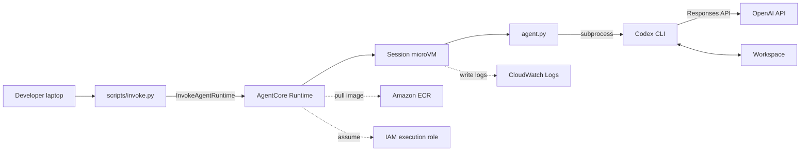

## TL;DR

- AgentCore Runtime の HTTP エージェントとして `agent.py` を置きます
- `agent.py` は `/invocations` の入力を `codex exec` に渡します
- OpenAI API キーは Runtime の環境変数として渡し、コンテナ内で `codex login --with-api-key` を非対話で実行します
- コンテナイメージを ECR に push し、`CreateAgentRuntime` で AgentCore Runtime を作成します
- クライアント側は `boto3.client("bedrock-agentcore").invoke_agent_runtime(...)` を呼びます
- セッション ID はユーザーや会話ごとに一意に作り、関連する呼び出しでだけ再利用します

## はじめに

Amazon Bedrock AgentCore Runtime は、AI エージェントやツールコードをコンテナとしてデプロイし、セッションごとに隔離された実行環境で動かせるランタイムです。

この記事では、その AgentCore Runtime の中で OpenAI Codex CLI を動かし、外側からは `InvokeAgentRuntime` で呼び出せる「中身が Codex CLI のチャットボット」のような構成を作ってみます。

これは本番向けの推奨アーキテクチャではなく、「AgentCore Runtime の microVM に Codex CLI を入れたら、本当にクラウド上で `codex exec` できるのか？」を試した検証ログです。できるかどうかを見に行っただけなので、セキュリティ設計、費用最適化、監査ログ、入力ポリシー、秘密情報の運用、マルチユーザー対応などは、全く考慮されていません。

:::message alert
この記事の構成は PoC です。AgentCore Runtime の利用、ECR、CloudWatch Logs、OpenAI API キーでの Codex 利用にはそれぞれ料金が発生する可能性があります。

また、Codex CLI はコード編集やシェル操作を前提にしたツールです。この記事の構成をそのまま不特定多数向けのチャット UI や信頼できない入力に開放しないでください。
:::

検証は 2026-06-03 時点の手元環境で行いました。AgentCore Runtime や Codex CLI は更新が速い領域なので、実際に試す場合は公式ドキュメントもあわせて確認してください。


## 全体構成



AgentCore Runtime 側から見ると、これは普通の HTTP エージェントです。`/invocations` と `/ping` を持つコンテナをデプロイします。

一方、コンテナ内部では Codex CLI をライブラリとして組み込むのではなく、`subprocess.run(["codex", "exec", ...])` で起動しています。このため、外側の API は AgentCore Runtime のまま、中身だけ Codex CLI にできます。

今回やることはここまでです。

- AgentCore Runtime に Codex CLI 入りコンテナを載せる
- `InvokeAgentRuntime` で外から呼び出す
- セッション microVM 内で `codex exec` が動くことを確認する

逆に、今回は次のようなことは深追いしません。

- 本番向けの IAM 最小権限設計
- Secrets Manager 連携
- VPC 内閉域化
- 複数ユーザー向けの入力制御
- 監査ログ設計
- 永続ストレージ設計
- コスト最適化

この記事をトレースする場合はくれぐれも自己責任でお願いします。

## 事前準備

この記事では、以下が準備済みである前提です。

- AWS アカウント
- Amazon ECR に push できる権限
- AgentCore Runtime を作成できる権限
- OpenAI API キー
- Docker buildx
- Python 3.12
- `boto3` / `botocore`

検証に使ったファイルやスクリプト一式はこちらのリポジトリに置いています。参考にしてください。

https://github.com/takao2704/agentcore-codex-poc

検証時の主なバージョンは次の通りです。

```bash
boto3==1.40.51
botocore==1.40.51
Codex CLI v0.136.0  # AgentCore Runtime 内で確認
```

例では次のようなプレースホルダーを使います。

```bash
export AWS_REGION=us-west-2
export AWS_ACCOUNT_ID=<AWS_ACCOUNT_ID>
export ECR_REPOSITORY=bedrock-agentcore-codex-poc
export AGENTCORE_RUNTIME_NAME=codex_microvm_poc
export AGENTCORE_EXECUTION_ROLE_ARN=<AGENTCORE_EXECUTION_ROLE_ARN>
```

OpenAI API キーはコンテナ内の環境変数として渡します。リポジトリや Dockerfile には直接書かないでください。

## ステップ 1: AgentCore 用の HTTP エージェントを書く

AgentCore Runtime の HTTP エージェントとして、`bedrock-agentcore` の `BedrockAgentCoreApp` を使います。

最小の形は次のようなイメージです。

```python
from bedrock_agentcore import BedrockAgentCoreApp, PingStatus

app = BedrockAgentCoreApp()

# ヘルスチェック用のエンドポイント。ここでは常に HEALTHY を返すだけにしています。
@app.ping
def ping() -> PingStatus:
    return PingStatus.HEALTHY

# `/invocations` のエンドポイント。ここで `codex exec` を起動します。
@app.entrypoint
def invoke(payload: dict, context) -> dict:
    prompt = payload.get("input", {}).get("prompt") or payload.get("prompt")
    return {"output": {"message": f"received: {prompt}"}}


if __name__ == "__main__":
    app.run(port=8080)
```

今回の自由研究で構築した環境では、この `invoke()` の中で `codex exec` を起動します。

:::message alert
下の例では、検証を単純にするために `--ignore-rules` を付けています。これは「まず動くかを見る」ための設定です。

通常の開発用途では、リポジトリの `AGENTS.md` や運用ルールを無視しないほうが自然です。特に、信頼できない入力をそのまま Codex CLI に渡す構成にはしないでください。
:::

```python
import subprocess

result = subprocess.run(
    [
        "codex",
        "exec",
        "--skip-git-repo-check",
        "--ephemeral",
        "--sandbox",
        "workspace-write",
        "--ignore-rules",
        prompt,
    ],
    cwd="/tmp/workspace",
    capture_output=True,
    text=True,
    timeout=timeout_seconds,
    check=False,
)
```

ポイントは、AgentCore Runtime の外側には Codex CLI を直接見せないことです。外側の API はあくまで AgentCore Runtime の `InvokeAgentRuntime` です。

## ステップ 2: クラウド上の Codex CLI に API キーを渡す

次に、AgentCore Runtime 内で動く Codex CLI が OpenAI API を呼べるようにします。

OpenAI の Codex ドキュメントでは、Codex CLI は ChatGPT サインインと API キーサインインの両方をサポートしています。API キーでサインインした場合、利用は OpenAI Platform 側の API 利用として扱われます。

今回の自由研究では、AgentCore Runtime の環境変数として `OPENAI_API_KEY` を渡しました。ただし、手元の検証では、コンテナに `OPENAI_API_KEY` を置くだけでは `codex exec` がそのまま Bearer 認証として使ってくれませんでした。

そこで、最初の `codex exec` の前に、コンテナ内で次を実行します。

```bash
printenv OPENAI_API_KEY | codex login --with-api-key
```

Python 側では、`CODEX_HOME` をコンテナ内の専用ディレクトリへ向け、`auth.json` がなければログインするようにしました。

```python
from pathlib import Path
import subprocess

# AgentCore Runtime の環境変数から OPENAI_API_KEY を渡し、codex login --with-api-key で認証キャッシュを作る
def ensure_codex_auth(env: dict[str, str], workdir: str) -> None:
    auth_json = Path(env["CODEX_HOME"]) / "auth.json"
    if auth_json.exists():
        return

    api_key = env["OPENAI_API_KEY"]
    subprocess.run(
        ["codex", "login", "--with-api-key"],
        cwd=workdir,
        env=env,
        input=f"{api_key}\n",
        capture_output=True,
        text=True,
        timeout=30,
        check=True,
    )
```

`auth.json` は認証情報なので、絶対にリポジトリに含めないでください。

また、AgentCore Runtime の Control API 応答に環境変数が含まれる場合があります。この記事用のスクリーンショットも、API キーや ARN はすべてマスクしています。実運用では Secrets Manager などを使う設計も検討してください。

## ステップ 3: コンテナイメージを作る

AgentCore Runtime 用のコンテナには、Python、Node.js、Codex CLI、必要なら `bubblewrap` を入れます。

```dockerfile
FROM node:20-bookworm-slim

ENV PYTHONUNBUFFERED=1 \
    DOCKER_CONTAINER=1 \
    PORT=8080 \
    CODEX_WORKSPACE=/mnt/workspace \
    CODEX_FALLBACK_WORKSPACE=/tmp/workspace \
    AGENT_CODEX_HOME=/home/node/.codex

RUN apt-get update \
    && apt-get install -y --no-install-recommends \
        bubblewrap \
        ca-certificates \
        git \
        python3 \
        python3-pip \
    && rm -rf /var/lib/apt/lists/*

RUN npm install -g @openai/codex@latest

WORKDIR /app

COPY requirements.txt ./
RUN python3 -m pip install --break-system-packages --no-cache-dir -r requirements.txt

COPY agent.py ./

RUN mkdir -p /app /tmp/workspace /home/node/.codex \
    && chown -R node:node /app /tmp/workspace /home/node/.codex

USER node

EXPOSE 8080

CMD ["python3", "-m", "agent"]
```

検証時は `@openai/codex@latest` を使い、AgentCore Runtime 内では `OpenAI Codex v0.136.0` と表示されました。

再現性を重視する場合は、`@latest` ではなく検証済みバージョンに固定してください。今回はあくまで自由研究なので、多少ラフにしています。雑に見えるかもしれませんが、今日は走るかどうかを見に来ています。

## ステップ 4: AWS へデプロイする

AWS へのデプロイは、大きく次の流れです。

1. AgentCore Runtime の実行ロールを作る
2. コンテナイメージを Amazon ECR に push する
3. `CreateAgentRuntime` で Runtime を作成する
4. Runtime が `READY` になることを確認する

まず実行ロールを作ります。実行ロールには、少なくとも ECR からのイメージ取得と CloudWatch Logs への書き込みを許可します。

手元の環境では `scripts/create_execution_role.py` を用意しました。

```bash
export AWS_REGION=us-west-2
export ECR_REPOSITORY=bedrock-agentcore-codex-poc

python3 scripts/create_execution_role.py
export AGENTCORE_EXECUTION_ROLE_ARN="$(cat .agentcore/execution-role-arn)"
```

次に、AgentCore Runtime で使うコンテナイメージを `linux/arm64` 向けにビルドし、ECR に push します。

```bash
export AWS_REGION=us-west-2
export ECR_REPOSITORY=bedrock-agentcore-codex-poc

./scripts/build_and_push.sh
```

このスクリプトでは、ECR リポジトリがなければ作成し、Docker login、`docker buildx build --platform linux/arm64 --push` まで実行します。push したイメージ URI は `.agentcore/image-uri` に保存しました。

最後に AgentCore Runtime を作成します。

```bash
export AWS_REGION=us-west-2
export AGENTCORE_RUNTIME_NAME=codex_microvm_poc
export AGENTCORE_EXECUTION_ROLE_ARN="$(cat .agentcore/execution-role-arn)"
export OPENAI_API_KEY=<OPENAI_API_KEY>

python3 scripts/create_runtime.py
```

`CreateAgentRuntime` では、コンテナ URI、実行ロール、ネットワーク設定、ライフサイクル設定、環境変数を渡します。

```python
import boto3

client = boto3.client("bedrock-agentcore-control", region_name="us-west-2")

response = client.create_agent_runtime(
    agentRuntimeName="codex_microvm_poc",
    agentRuntimeArtifact={
        "containerConfiguration": {
            "containerUri": "<AWS_ACCOUNT_ID>.dkr.ecr.us-west-2.amazonaws.com/bedrock-agentcore-codex-poc:latest",
        }
    },
    roleArn="<AGENTCORE_EXECUTION_ROLE_ARN>",
    networkConfiguration={"networkMode": "PUBLIC"},
    lifecycleConfiguration={
        "idleRuntimeSessionTimeout": 900,
        "maxLifetime": 28800,
    },
    environmentVariables={
        "OPENAI_API_KEY": "<OPENAI_API_KEY>",
    },
    protocolConfiguration={"serverProtocol": "HTTP"},
)
```

既存 Runtime に新しいイメージを反映する場合は、手元では `scripts/update_runtime.py` を使いました。

```bash
export AWS_REGION=us-west-2
export AGENTCORE_EXECUTION_ROLE_ARN="$(cat .agentcore/execution-role-arn)"
export OPENAI_API_KEY=<OPENAI_API_KEY>

python3 scripts/update_runtime.py
```

実際に `GetAgentRuntime` と AWS マネジメントコンソールで、Runtime が `READY` になっていることを確認できました。


:::message alert
`OPENAI_API_KEY` は CloudFormation テンプレートや GitHub リポジトリに直書きしないでください。

今回は AgentCore Runtime の環境変数として渡しましたが、これは簡単に試すための形です。本番では Secrets Manager、ローテーション、参照権限、ログマスクを設計してください。
:::

## ステップ 5: ローカル PC から invoke する

デプロイ後は、ローカル PC から `boto3` で `InvokeAgentRuntime` を呼びます。

```python
import json
import boto3

client = boto3.client("bedrock-agentcore", region_name="us-west-2")

response = client.invoke_agent_runtime(
    agentRuntimeArn="arn:aws:bedrock-agentcore:us-west-2:<AWS_ACCOUNT_ID>:runtime/<RUNTIME_ID>",
    runtimeSessionId="codex-poc-1234567890abcdef1234567890abcdef",
    qualifier="DEFAULT",
    payload=json.dumps({
        "input": {
            "prompt": "Reply with exactly: hello from agentcore codex",
            "timeout_seconds": 180,
        }
    }).encode("utf-8"),
)

print(response["response"].read().decode("utf-8"))
```

AgentCore Runtime の `runtimeSessionId` は 33 文字以上が必要です。ユーザーや会話ごとに一意な ID を作り、同じ会話や同じ作業に属する呼び出しでだけ再利用します。別ユーザーや別会話で使い回すと、セッション分離の意味が薄くなります。

本来であれば、簡単なwebサーバーやチャット UI を作って、そこから `InvokeAgentRuntime` を呼ぶのが自然ですが、今回はさくっとできるかどうか試したかったので、手元の Python スクリプトから直接呼べるような形にしています。
簡単に試してもらうための簡単なラッパーとして `scripts/invoke.py` を用意しました。

```bash
export AWS_PROFILE=<AWS_PROFILE>
export AWS_REGION=us-west-2
export AGENTCORE_RUNTIME_ARN=arn:aws:bedrock-agentcore:us-west-2:<AWS_ACCOUNT_ID>:runtime/<RUNTIME_ID>
export AGENTCORE_SESSION_ID=codex-poc-$(uuidgen | tr -d '-')

uv run --with-requirements requirements-client.txt \
  python scripts/invoke.py --timeout-seconds 180 \
  "Reply with exactly: hello from agentcore codex" | jq "."
```

確認できたレスポンスは次のような形です。

```json
{
  "output": {
    "session_id": "codex-poc-20260603-article-screenshot-0001",
    "workdir": "/tmp/workspace",
    "codex_home": "/home/node/.codex",
    "last_message": "hello from agentcore codex",
    "exit_code": 0,
    "stdout": "hello from agentcore codex\n",
    "duration_seconds": 3.589,
    "timed_out": false
  }
}
```

実際の確認画面です。


`stderr` には Codex CLI の実行情報や token 使用量が出ます。

## 補足: InvokeAgentRuntimeCommand について

AgentCore Runtime には、同じセッション内でコマンドを実行する `InvokeAgentRuntimeCommand` もあります。公式ドキュメントでは、テスト、ビルド、`git` 操作のような決定的な処理には `InvokeAgentRuntimeCommand` を使い、推論が必要な処理には `InvokeAgentRuntime` を使う、という使い分けが説明されています。

今回の手元環境では、`boto3==1.40.51` / `botocore==1.40.51` のモデルに `invoke_agent_runtime_command` がまだ見えていませんでした。

そのため、この記事では通常のチャット型呼び出しとして `InvokeAgentRuntime` を使っています。もし同じ構成を試す場合は、まず `boto3` / `botocore` を更新し、利用中の SDK に `InvokeAgentRuntimeCommand` が露出しているか確認するとよさそうです。

## セキュリティと運用上の注意

しつこいですが、この構成は「やってみたら動くのか」を確かめる自由研究です。

便利ではありますが、Codex CLI をサーバー側で実行する構成なので、入力をそのまま任意のユーザーに開放すると危険です。少なくとも次の点は、きちんと設計してから先に進む必要があります。

- invoke できる IAM principal を限定する
- AgentCore Runtime の実行ロールを最小権限にする
- Codex CLI の sandbox は `workspace-write` など必要最小限にする
- `--ignore-rules` を本番前提にしない
- 作業ディレクトリに永続化すべきでない情報を置かない
- CloudWatch Logs に秘密情報が出ないようにする
- OpenAI API キーの保管とローテーションを設計する
- 不特定多数に公開するチャット UI のバックエンドにはしない


## まとめ

Amazon Bedrock AgentCore Runtime に Codex CLI 入りのコンテナを載せることで、外側からは `InvokeAgentRuntime` で呼び出しつつ、中では `codex exec` を実行する構成を作れました。

検証で重要だったポイントは次の 3 つです。

1. AgentCore Runtime の HTTP 契約に合わせて `/invocations` と `/ping` を実装する
2. Codex CLI には Runtime 環境変数の `OPENAI_API_KEY` を渡し、`codex login --with-api-key` で認証キャッシュを作る
3. ECR への push、実行ロール、`CreateAgentRuntime`、`InvokeAgentRuntime` まで通すと、クラウド上の Codex CLI からレスポンスを返せる

自由研究としては、AgentCore Runtime を「Codex CLI を閉じ込める実行境界」として使えることが確認できました。


参考:

- Amazon Bedrock AgentCore Runtime の仕組み: https://docs.aws.amazon.com/bedrock-agentcore/latest/devguide/runtime-how-it-works.html
- AgentCore Runtime のセッション: https://docs.aws.amazon.com/bedrock-agentcore/latest/devguide/runtime-sessions.html
- AgentCore Runtime の invoke: https://docs.aws.amazon.com/bedrock-agentcore/latest/devguide/runtime-invoke-agent.html
- AgentCore Runtime でコマンドを実行する API: https://docs.aws.amazon.com/bedrock-agentcore/latest/devguide/runtime-execute-command.html
- Codex の認証: https://developers.openai.com/codex/auth