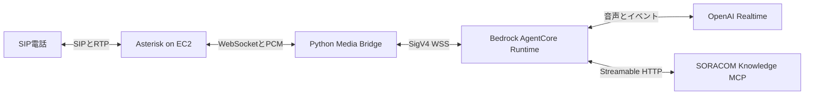
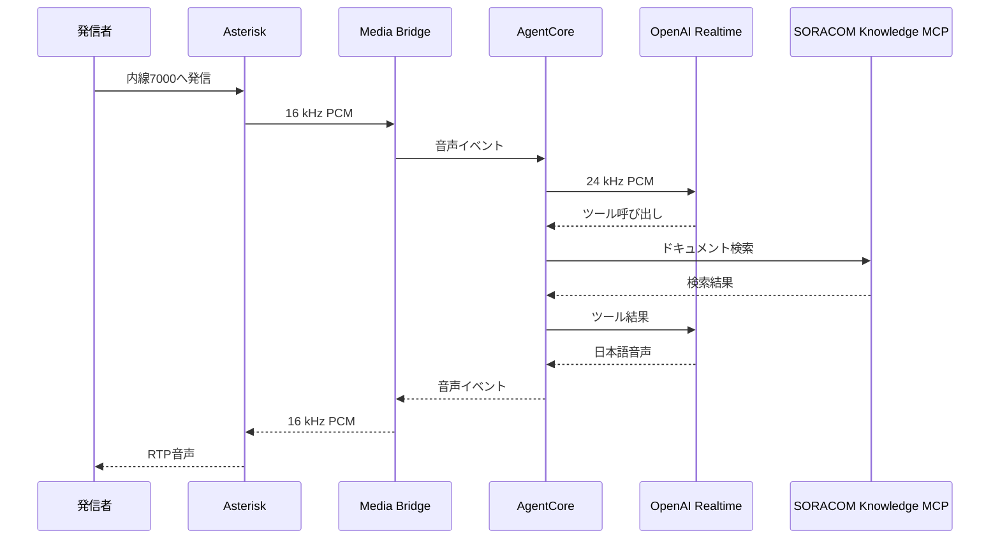

:::message
「[一般消費者が事業者の表示であることを判別することが困難である表示](https://www.caa.go.jp/policies/policy/representation/fair_labeling/guideline/assets/representation_cms216_230328_03.pdf)」の運用基準に基づく開示: この記事は記載の日付時点で[株式会社ソラコム](https://soracom.jp/)に所属する社員が執筆しました。ただし、個人としての投稿であり、株式会社ソラコムとしての正式な発言や見解ではありません。
:::

:::message
この記事は2026年7月時点の検証結果をもとにしています。利用できるモデル、API、料金、サービス仕様は変更される可能性があるため、実装時は各サービスの公式ドキュメントも確認してください。
:::

## TL;DR

- 電話のSIPとRTPはEC2上のAsteriskで終端し、AIとの音声ストリームはPython製Media Bridgeで中継します。
- Amazon Bedrock AgentCore Runtimeを、OpenAI Realtimeと外部ツールをつなぐエージェント実行基盤として使います。
- SORACOM Knowledge MCPの3ツールを登録し、質問に応じて検索と本文取得を選ぶAgentic RAGとして動かします。
- 電話特有の回り込みと回答の途中切れは、音声経路の制御とモデルの出力制御を分けて扱います。

## はじめに

今回作ったのは、スマートフォンから内線へ電話すると、日本語のAIが応答するデモです。SORACOMについて聞くと、必要なときだけ公式ドキュメントを調べます。

ブラウザーから音声モデルへつなぐだけなら、WebRTCやWebSocketで済みます。電話から使うには、その手前でSIP、RTP、コーデック、ダイヤルプランを扱わなければなりません。今回はさらに外部ドキュメントを参照するので、ツール呼び出しの経路と、検索へ渡す情報の制限も決めました。

Asterisk、Amazon Bedrock AgentCore Runtime、OpenAI Realtime、SORACOM Knowledge MCPの役割をどう分けたかを書きます。デプロイと設定の手順は[実装編](/articles/asterisk-agentcore-openai-realtime-voice-agent)へ分けました。

## 今回の検証範囲

今回の構成は、1台のEC2と1つのAI用内線を使うPoCです。SIPトランク、既存PBXとの接続、冗長化、同時通話の負荷試験、有人転送は含みません。

AIは電話システム全体へ埋め込まず、1つの内線として追加しました。この形なら、あとからSIPトランクや既存PBXへつなぐときも転送先として扱えます。

## 全体構成



| コンポーネント | 担当すること | 担当しないこと |
|---|---|---|
| Asterisk | SIP登録、着信、RTP、コーデック変換、ダイヤルプラン | AIモデルの選択、ツール実行 |
| Media Bridge | 2つのWebSocketの中継、PCMのフレーム化、フロー制御 | 回答内容の判断 |
| AgentCore Runtime | エージェントのホスティング、セッション分離、Identity、ツール実行 | SIPとRTPの終端 |
| OpenAI Realtime | 音声の理解と生成、ターン検出、ツール選択 | 電話回線の制御 |
| SORACOM Knowledge MCP | SORACOM公式情報の検索と取得 | 通話や音声の処理 |

電話がつながらない問題と、AIが答えられない問題を同じプロセスへ詰め込むと、SIP、音声変換、モデル、ツールのどこで止まったのか分かりません。通話試験では実際にこの順でログを追ったので、処理を分けておいて助かりました。

## 通話から回答までの流れ



SORACOMと関係のない挨拶などではMCPを呼びません。モデル自身の知識だけでは正確に答えにくい質問を受けたときに、Realtimeモデルがツールの利用を選びます。

## AsteriskとAIを直接つながない理由

Asteriskの`chan_websocket`は、音声をBinary WebSocketフレーム、制御イベントをText WebSocketフレームで扱えます。RTPのパケット化と送信タイミングはAsteriskへ任せられるため、AI側でRTPスタックを実装する必要がありません。

AsteriskとAgentCore Runtimeでは、音声の形式とWebSocket上のプロトコルが異なります。

```text
Asterisk: 16 kHz、16 bit、モノラルPCM
AgentCore側: Base64化したPCMを含むJSONイベント
OpenAI Realtime: 24 kHz PCM
```

この変換をMedia Bridgeへまとめました。Asteriskから受け取る20 ms分のPCMは640 byteです。

```text
16,000 samples/sec × 2 bytes × 0.02 sec = 640 bytes
```

モデルから戻る任意長の音声を640 byte単位へそろえ、16 kHzと24 kHzの変換はAgentCore側で行います。電話側とAI側の変更をMedia Bridgeで吸収できるため、Asteriskのダイヤルプランをモデル固有の実装から切り離せます。

## AgentCoreの担当

AgentCore Runtimeには、通話ごとのエージェント実行を任せました。

- Media BridgeからSigV4で署名したWebSocket接続を受ける
- 通話ごとにセッションIDとユーザーIDを分離する
- AgentCore IdentityからOpenAI APIキーを取得する
- Realtimeモデルへ音声を中継する
- モデルが選んだMCPツールを実行する
- 音声と制御イベントをMedia Bridgeへ返す

OpenAI APIキーはPBX用EC2へ配置せず、AgentCore Runtimeの実行ロールとIdentityの権限内に置けます。

## SORACOM Knowledge MCPを組み込む

この電話AIでは、SORACOM Knowledge MCPをアーキテクチャの一部として扱います。利用するのは、公開されている読み取り専用の3ツールです。

| ツール | 役割 | 利用する場面 |
|---|---|---|
| `search_soracom_docs` | サービスガイド、操作手順、料金、IoTレシピの検索 | サービスの概要や使い方を探す |
| `search_api_docs` | API、CLI、SAM権限の検索 | 実装方法や権限を調べる |
| `get_document` | 検索結果URLの本文取得 | 検索結果の抜粋だけでは回答できない |

Realtimeモデルへ3ツールを登録し、質問に応じて検索の要否、検索先、本文取得の要否を選ばせます。この実装はAgentic RAGとして動きます。

たとえば「SORACOM Airとは何ですか」なら`search_soracom_docs`で概要を探します。検索結果だけでは足りない場合に限って`get_document`を呼び、取得した情報を電話向けの短い日本語へまとめます。APIの引数を尋ねられた場合は`search_api_docs`を選べます。

### 外部検索へ渡す情報を制限する

MCP endpointはAgentCore Runtimeの外部にあります。音声で聞き取った文字列をそのまま検索へ渡すと、SIM ID、IMSI、電話番号、メールアドレス、APIキーなどが混ざる可能性があります。

- 代表的な識別子パターンを検索前に検出し、該当する入力を拒否する
- 利用者へ具体的な値を除いて質問し直すよう案内する
- `get_document`の取得先をSORACOM公式ドメインのHTTPS URLへ限定する
- 検索結果を最大5件、抜粋を1件あたり最大1,600文字へ縮める
- MCPツールを読み取り専用の3つに限定する

正規表現による検出はDLPの代わりにはなりません。実際の識別子や認証情報を話さない運用、ログに残す情報の制限、利用者への告知が別途必要です。

## 電話向けの対話制御

音声モデルの動作確認だけなら全二重でも進められます。しかしスマートフォンをスピーカーフォンにすると、AIの音声を端末のマイクが拾い、利用者の新しい発話として再認識することがありました。

デモでは、AIが話している間だけ入力音声を止める半二重モードを採用しました。応答完了後も短い待ち時間を置き、端末に残った音が減衰してから入力を再開します。その代わり、AIの発話中に利用者が割り込むbarge-inは使えません。

回答の長さは別の問題です。プロンプトで「1〜2文」と指定しても、技術的な出力上限にはなりません。一方で出力トークンの上限を小さくすると、自然な文末より先に音声が切れます。

- プロンプトでは、結論から話し、簡単な質問は1〜2文、長い回答は最大3点に絞る
- 出力トークンには余裕を持たせ、応答完了イベントのstatusとreasonを監視する

今回は「短く話すこと」をプロンプト、「途中で切らないこと」を出力上限とログで別々に調整しました。

## ログの追い方

無音になったときは、次の順にイベントを追いました。

1. Asteriskから`MEDIA_START`が届く
2. Media BridgeがAgentCore WebSocketへ接続する
3. OpenAI Realtimeの認証が成功する
4. 入力音声のtranscriptが生成される
5. 必要な場合だけtool useが始まる
6. 日本語音声がAsteriskへ戻る
7. 応答完了イベントが`complete`になる

会話transcriptは障害調査に役立ちますが、個人情報を含む可能性があります。通常は保存せず、制御されたデバッグ通話でだけ一時的に有効化します。定常監視には接続、ツール利用、音声出力、終了理由などの制御イベントを使います。

## PoCに入れていないもの

今回は次の項目を実装していません。

- 同時通話数、バックプレッシャー、障害時の再接続
- SIPトランクまたは既存PBXとの接続とアクセス制御
- AgentCore、Realtime API、EC2、回線を含むコスト
- MCPのtimeout、再試行、circuit breaker
- 録音や文字起こしの告知、同意、保存期間
- PIIのマスキングと監査ログ
- AIが回答できない場合の有人転送
- DTMFによるメニューと緊急離脱

この中で先に追加したいのは有人転送です。AI、外部API、ネットワークのどこかが止まっても、通常の内線や窓口へ戻せないと電話として困ります。

## まとめ

今回の構成では、Asteriskに電話処理だけを残し、Media Bridgeで音声を変換し、AgentCore上のエージェントからRealtimeとMCPを呼びます。最初からMCPまで含めておくと、公式情報を検索したかどうかも通話セッションのログで追えました。

Asteriskの設定、MCPの接続コード、通話試験、回り込みと途中切れの調整は[実装編](/articles/asterisk-agentcore-openai-realtime-voice-agent)にまとめています。

## 参考資料

- [Asterisk WebSocket channel driver](https://docs.asterisk.org/Configuration/Channel-Drivers/WebSocket/)
- [Amazon Bedrock AgentCore - WebSocketによる双方向ストリーミング](https://docs.aws.amazon.com/bedrock-agentcore/latest/devguide/runtime-get-started-websocket.html)
- [Amazon Bedrock AgentCore - Credential providerの設定](https://docs.aws.amazon.com/bedrock-agentcore/latest/devguide/resource-providers.html)
- [OpenAI Realtime conversations](https://developers.openai.com/api/docs/guides/realtime-conversations)
- [OpenAI GPT-Realtime-2.1](https://developers.openai.com/api/docs/models/gpt-realtime-2.1)
- [SORACOM Knowledge MCPサーバーで利用できるツール](https://users.soracom.io/ja-jp/tools/soracom-knowledge-mcp-server/tools/)
- [サンプルリポジトリ: takao2704/voice-agent-demo](https://github.com/takao2704/voice-agent-demo)
