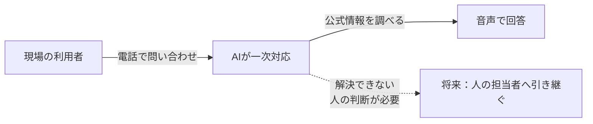
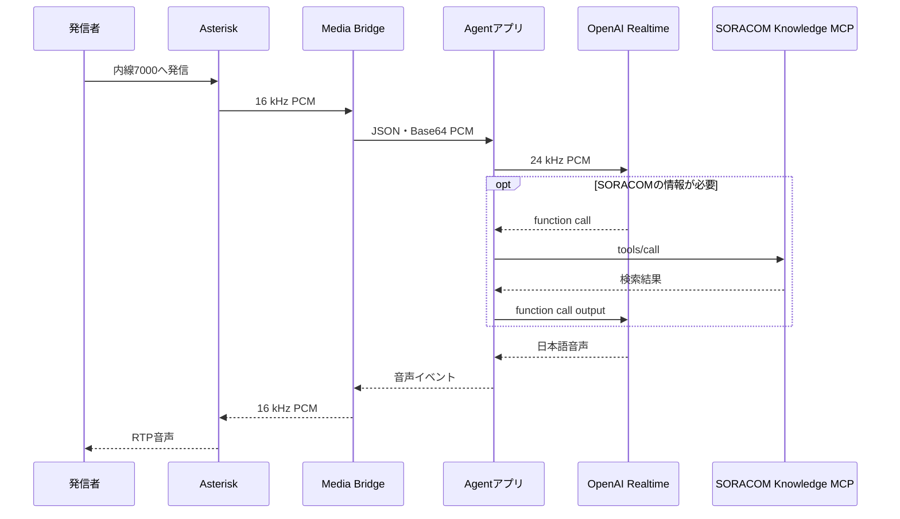
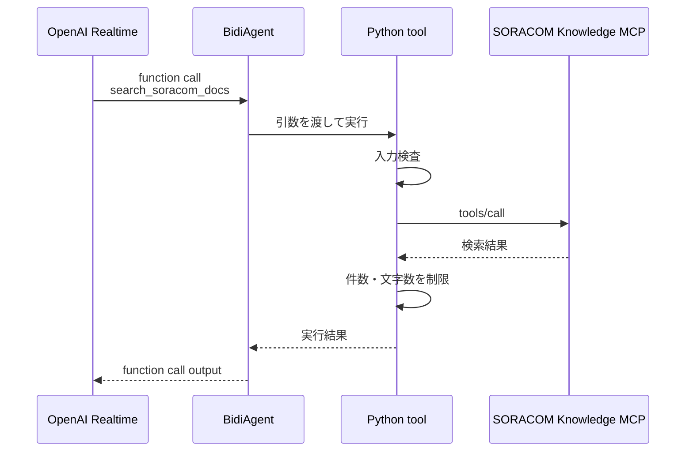

:::message
「[一般消費者が事業者の表示であることを判別することが困難である表示](https://www.caa.go.jp/policies/policy/representation/fair_labeling/guideline/assets/representation_cms216_230328_03.pdf)」の運用基準に基づく開示: この記事は記載の日付時点で[株式会社ソラコム](https://soracom.jp/)に所属する社員が執筆しました。ただし、個人としての投稿であり、株式会社ソラコムとしての正式な発言や見解ではありません。
:::

:::message
この記事は2026年7月時点の検証結果をもとにしています。利用できるモデル、API、料金、サービス仕様は変更される可能性があるため、実装時は各サービスの公式ドキュメントも確認してください。
:::

## TL;DR

- 現場から電話で問い合わせ、AIが一次対応し、必要なら人へ引き継ぐ窓口を目指しました。そのためのシステム構成を検討し、PoCではAIをPBXの1内線として動かしています。
- SIPとRTPはEC2上のAsteriskで終端し、Python製Media BridgeでPCMを中継しました。有人転送などの通話制御はPBX側へ追加できます。
- 日本語の低遅延な音声対話にはOpenAI RealtimeのSpeech-to-Speechを選び、AgentアプリはAmazon Bedrock AgentCore Runtimeで動かしました。
- Agentアプリは音声入力とOpenAI Realtimeの間で音声ストリーミングを中継し、必要に応じてMCP Serverへ問い合わせます。取得した情報をRealtimeへ返す処理もAgentアプリが担当します。

## はじめに

設備のある現場から、普段の電話に近い操作で問い合わせられる窓口を作りたいと考えました。そこで、スマートフォンから話しかけると、日本語のAIがSORACOMの公式ドキュメントを調べて一次回答するデモを作りました。解決できない場合や人の判断が必要な場合は、将来、同じ通話を担当者へ引き継ぐ想定です。

サンプルコードは次のリポジトリで公開しています。

https://github.com/takao2704/voice-agent-demo

音声Agentへfunction toolやMCPを接続する方法は、先の入門編で説明しました。

https://zenn.dev/takao2704/articles/voice-agent-tools-mcp-basics

最初は、Asterisk、AgentCore、OpenAI Realtime、MCPを順につなげば終わると思っていました。実際に組むには、電話の終端、Agentコードの実行場所、MCPの呼び出し元を個別に決める必要がありました。

## 目指したUX

設備のある現場では、作業を止めてパソコンを開き、チャットに質問を打ち込むのは現実的ではありません。スマートフォンでも、手が汚れていたり作業用の手袋を着けていたりすると文字を打ちにくくなります。電話なら、番号を選んだ後は話すだけです。

このPoCで実装したのは、AIが公式情報を調べて回答するところまでです。あとから同じ通話を人の担当者へ渡せるよう、未実装の通話制御はAsterisk側に残しています。

## アーキテクチャ選定条件

- 現場から電話に近い操作で問い合わせられる
- AIが一次対応し、将来は同じ通話を人の担当者へ引き継げる
- 日本語で、発話から応答までの待ち時間を短くする
- 必要な場合だけ、読み取り専用ツールで外部の公式情報を調べる
- 電話を受けるEC2へOpenAI APIキーを置かない
- 音声モデルとツールを変更しても、PBXの設定へ影響を広げない

検証環境は、1台のEC2と1つのAI用内線を使うPoCです。

AIはPBXの1内線として追加しました。人の内線や別のAI内線も、PBX側で転送先に追加できます。問い合わせ内容に応じて振り分けるには、転送先を決める処理が別途必要です。

## アーキテクチャ概要

| 判断する場所 | 採用した方式 | この構成での理由 |
|---|---|---|
| 電話からAgentまで | Asteriskの`chan_websocket`とMedia Bridge | SIPとRTPをPBXで終端し、AIを一次対応用の内線として扱う。将来の有人転送はダイヤルプランへ追加できる |
| Agent内の音声処理 | Speech-to-Speech | 文字起こし、応答生成、音声合成を1つのRealtimeセッションで扱う |
| ツール接続 | Agentアプリが実行するfunction tool | MCPへ渡す引数の検査、取得先の制限、検索結果の縮約を自分のコードで行う |
| Agentの実行場所 | Amazon Bedrock AgentCore Runtime | 通話ごとのWebSocketセッションとAWS実行ロールをPBXから分離する |
| APIキーの管理 | Amazon Bedrock AgentCore Identity | OpenAI APIキーをPBX用EC2へ置かず、Agentアプリから必要なときに取得する |
| 外部ツール | SORACOM Knowledge MCP | SORACOM公式情報の検索と本文取得を3つの読み取り専用ツールに限定する |

### 全体構成

破線は将来追加する有人転送の経路で、今回のPoCには含みません。

| コンポーネント | 種類 | 担当 |
|---|---|---|
| スマートフォンの電話 | 音声UI | 利用者の音声入出力 |
| Asterisk | PBXアプリケーション | SIP登録、着信、RTP、コーデック変換、ダイヤルプラン |
| `chan_websocket` | Asteriskのチャネルドライバー | AsteriskとMedia Bridgeの音声転送 |
| Media Bridge | 自作アプリケーション | 2つのWebSocket、PCMのフレーム化、フロー制御 |
| AgentCore Runtime | マネージド実行基盤 | Agentアプリのホスティング、WebSocket受付、AWS実行ロール、セッション分離 |
| AgentCore Identity | マネージド認証サービス | OpenAI APIキーを保管し、Agentアプリへ払い出す |
| Agentアプリ | 自作アプリケーション | 通話セッション、音声変換、ツールの入力検査、外部APIの呼び出し |
| Strands Agentsの`BidiAgent` | Agentライブラリ | Realtimeの音声・ツールイベントとPython関数をつなぐ |
| OpenAI Realtime | 音声モデルAPI | 音声の理解と生成、ターン検出、ツール選択 |
| Python tool | function toolの実装 | 引数を検査し、MCP ClientとしてSORACOM Knowledge MCPを呼ぶ |
| MCP | プロトコル | Agentとツールサーバーの接続方法 |
| SORACOM Knowledge MCP | MCP Serverアプリケーション | SORACOM公式情報の検索と取得 |

AgentアプリはAgentCore Runtime上で動きます。通話ごとに`BidiAgent`を作り、RealtimeのイベントとPython toolを接続します。Realtimeは音声を理解して返答を生成し、必要なら使うツールを選びます。

AsteriskとMedia Bridgeは電話の音声をAgentアプリへ届けますが、回答内容やツールの選択には関与しません。Asterisk、Media Bridge、Agentアプリ、Realtime、MCPの順にログを追うと、処理が止まった場所を切り分けられます。

### 通話フロー

SORACOMと関係のない挨拶などではMCPを呼びません。SORACOMの仕様や手順を確認する必要があるとRealtimeが判断した場合だけ、function callからMCPの`tools/call`へ進みます。

## 技術選定の詳細

### AsteriskとMedia Bridge

AIをPBXの1内線にした一番の理由は、通話の振り分けをRealtimeモデルから切り離すためです。一次対応から人へ移る経路はPBX側へ追加できます。複数のAIを使う場合も、それぞれを別の内線として増やせます。

ダイヤルプランや電話側のコーデックをAgentから分離するため、AsteriskでSIPとRTPを終端しました。OpenAI RealtimeのSIP endpointへ電話を直結する方法は選んでいません。

SORACOM Air RTC Gatewayとの接続も見込んでいます。SORACOM Air RTC Gatewayは、VoLTE対応IoTデバイスの音声を指定したVoIPプロバイダやIP PBXへ伝送できます。AIをPBXの内線として残しておけば、今回スマートフォンで検証した経路を、SORACOM IoT SIMからの通話にも使えます。

https://soracom.jp/services/soracom-air-rtc-gateway/

Asteriskの`chan_websocket`は、音声をBinary WebSocketフレーム、制御イベントをText WebSocketフレームで扱えます。RTPのパケット化と送信タイミングをAsteriskへ任せられるため、Agent側へRTPスタックを実装する必要がありません。

https://docs.asterisk.org/Configuration/Channel-Drivers/WebSocket/

ただし、AsteriskとAgentCoreではWebSocket上のデータ形式が異なります。そこでMedia Bridgeを置き、AsteriskのPCMとAgentCoreへ送るJSONイベントを相互変換しました。電話側とAI側の変更をここで吸収し、Asteriskのダイヤルプランをモデル固有の処理から切り離します。

### Speech-to-Speech

STT、テキストAgent、TTSを順番につなぐChained Voice Pipelineなら、中間テキストを確認しやすく、既存のテキストAgentも再利用できます。一方、APIをまたぐ回数が増え、発話の区切りごとに待ち時間が積み上がります。

今回は、発話から応答までの待ち時間を抑えることと、音声セッション内でfunction callを扱えることを優先しました。そのため、OpenAI RealtimeのSpeech-to-Speechを選んでいます。検証では`gpt-realtime-2.1`と`cedar`を使い、1つのRealtimeセッションで音声入力、ターン検出、日本語の応答音声、function callを扱います。中間テキストを業務フローで承認する要件が加わる場合は、Chained Voice Pipelineを再検討します。

https://developers.openai.com/api/docs/models/gpt-realtime-2.1

### AgentCore RuntimeとIdentity

AgentCore RuntimeはAgentアプリを動かす実行基盤です。通話が始まるとMedia Bridgeが一意なセッションIDでWebSocketへ接続し、Agentアプリはその接続専用の`BidiAgent`を作ります。

https://strandsagents.com/docs/user-guide/concepts/bidirectional-streaming/agent/

- Media BridgeからSigV4で署名したWebSocket接続を受ける
- 通話ごとにセッションを分離する
- AgentアプリをAWS実行ロールで動かす
- AgentアプリがAgentCore IdentityからOpenAI APIキーを取得する

Runtime上のAgentアプリが、Realtimeへの接続、PCMの変換、MCPツールの実行を担当します。

PBXとAgentアプリを同じEC2で動かす方が簡単です。それでも今回は、OpenAI APIキーとAgentの実行権限をPBXから分離し、通話ごとのセッションをAgent側で管理したかったのでAgentCoreを選びました。

### function toolとMCP

今回は、MCP ClientをAgentアプリ側に置きました。OpenAI Realtimeからfunction callを受け、入力を検査してSORACOM Knowledge MCPを呼び、結果をfunction call outputとして返します。入力や検索結果を自分のコードで制限したかったためです。

OpenAI RealtimeへMCP Serverを登録して直接実行させる[Remote MCP tool](https://platform.openai.com/docs/api-reference/realtime)もありますが、今回は使っていません。

SORACOM Knowledge MCPが公開している読み取り専用ツールのうち、次の3つを使います。

| ツール | 役割 | 利用する場面 |
|---|---|---|
| `search_soracom_docs` | サービスガイド、操作手順、料金、IoTレシピの検索 | サービスの概要や使い方を探す |
| `search_api_docs` | API、CLI、SAM権限の検索 | 実装方法や権限を調べる |
| `get_document` | 検索結果URLの本文取得 | 検索結果の抜粋だけでは回答できない |

Agentアプリの`BidiAgent`へ3つのPython toolを登録すると、Realtimeにはfunction toolとして提示されます。Realtimeは質問に応じて検索の要否とツールを選びます。function callを受けたPython関数はMCP ClientとしてSORACOM Knowledge MCPへ接続し、対応する`tools/call`を実行します。

[AgentCore Gateway](https://docs.aws.amazon.com/bedrock-agentcore/latest/devguide/gateway-core-concepts.html)は、Lambda、OpenAPI、MCP Serverなどを1つのMCPエンドポイントへ集約し、認証や公開するツールをまとめて管理するサービスです。このPoCの接続先は既存のSORACOM Knowledge MCPだけで、使う3つの読み取り専用ツールもAgentアプリ側で固定しています。そこでGatewayは挟まず、Python toolからMCP Serverへ直接接続しました。

接続先が増え、認証やポリシーを共通化したくなった段階でGatewayを検討します。

たとえば「SORACOM Airとは何ですか」なら`search_soracom_docs`で概要を探します。検索結果だけでは足りない場合に限って`get_document`を呼び、取得した情報を電話向けの短い日本語へまとめます。APIの引数を尋ねられた場合は`search_api_docs`を選べます。

## まとめ

PoCでは、現場から電話で問い合わせ、AIが公式情報を調べて答えるところまで動かしました。次に加えたいのは、AIで解決できない通話を人へ引き継ぐ経路です。

電話の処理はAsteriskとMedia Bridge、音声対話はOpenAI Realtimeが担当します。Agentの実行と認証はAgentCore RuntimeとIdentity、公式情報の取得はSORACOM Knowledge MCPの担当です。AIをPBXの1内線にしたので、有人転送はPBX側の通話制御として追加できます。音声モデルやMCPの経路まで組み直す必要はありません。

## 参考資料

- [Asterisk WebSocket channel driver](https://docs.asterisk.org/Configuration/Channel-Drivers/WebSocket/)
- [Amazon Bedrock AgentCore - WebSocketによる双方向ストリーミング](https://docs.aws.amazon.com/bedrock-agentcore/latest/devguide/runtime-get-started-websocket.html)
- [Amazon Bedrock AgentCore - Credential providerの設定](https://docs.aws.amazon.com/bedrock-agentcore/latest/devguide/resource-providers.html)
- [Amazon Bedrock AgentCore Gateway - Core concepts](https://docs.aws.amazon.com/bedrock-agentcore/latest/devguide/gateway-core-concepts.html)
- [Strands Agents - BidiAgent](https://strandsagents.com/docs/user-guide/concepts/bidirectional-streaming/agent/)
- [OpenAI Realtime conversations](https://developers.openai.com/api/docs/guides/realtime-conversations)
- [OpenAI Realtime API reference](https://platform.openai.com/docs/api-reference/realtime)
- [OpenAI GPT-Realtime-2.1](https://developers.openai.com/api/docs/models/gpt-realtime-2.1)
- [SORACOM Air RTC Gateway](https://soracom.jp/services/soracom-air-rtc-gateway/)
- [SORACOM Knowledge MCPサーバーで利用できるツール](https://users.soracom.io/ja-jp/tools/soracom-knowledge-mcp-server/tools/)
- [サンプルリポジトリ: takao2704/voice-agent-demo](https://github.com/takao2704/voice-agent-demo)
