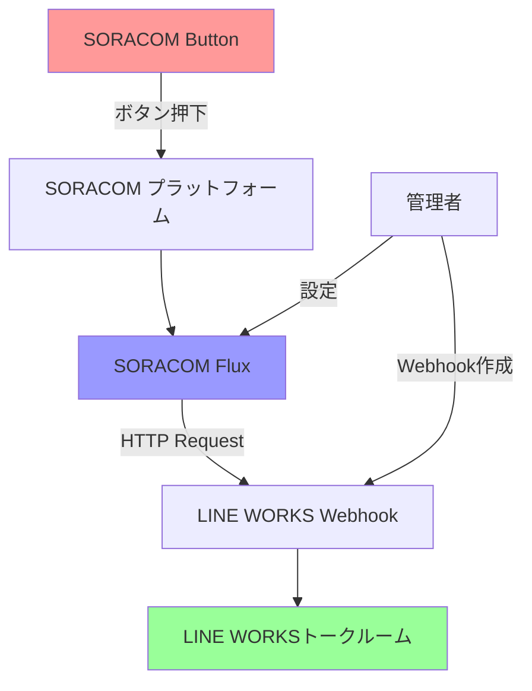
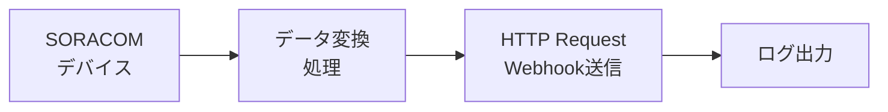

:::message
「[一般消費者が事業者の表示であることを判別することが困難である表示](https://www.caa.go.jp/policies/policy/representation/fair_labeling/guideline/assets/representation_cms216_230328_03.pdf)」の運用基準に基づく開示: この記事は記載の日付時点で[株式会社ソラコム](https://soracom.jp/)に所属する社員が執筆しました。ただし、個人としての投稿であり、株式会社ソラコムとしての正式な発言や見解ではありません。
:::

## はじめに

SORACOM Buttonは簡単にIoTシステムを構築できる便利なデバイスですが、単体では通知先が限られています。今回は、SORACOM FluxとLINE WORKSのIncoming Webhookを組み合わせることで、ボタンが押されたときに指定したLINE WORKSグループへ自動で通知を送る仕組みを構築してみましょう。

## 実現できること

この記事で構築するシステムでは、以下のようなことが実現できます：

- SORACOM Buttonを押すだけで、LINE WORKSの指定したトークルームにメッセージを送信
- ボタンの種類（シングルクリック、ダブルクリック、ロングプレス）に応じて異なるメッセージを送信
- 押下時刻や場所情報も含めた詳細な通知
- 複数のボタンからの通知を一元管理

### 想定される利用シーン

- **設備点検完了報告**: 現場作業者が点検完了時にボタンを押して報告
- **緊急時の連絡**: 異常発生時にボタンを押して即座にチームに通知
- **在庫補充依頼**: 店舗や倉庫で在庫が少なくなった際の補充依頼
- **会議室利用状況**: 会議室の利用開始・終了をワンプッシュで共有

## 必要なもの

### ハードウェア
- SORACOM Button（LTE-M Button powered by AWS、SORACOM Button Plus等）
- SORACOMのSIMカード（ボタンに内蔵済み）

### サービス・アカウント
- SORACOMアカウント
- LINE WORKSアカウント（管理者権限推奨）
- SORACOM Flux（月額料金が発生します）

### 事前準備
- SORACOM Buttonの初期設定完了
- LINE WORKSでのIncoming Webhook設定
- SORACOM Console へのアクセス権限

## 全体の構成

今回構築するシステムの全体像は以下のようになります：



## STEP 1: SORACOM Buttonの設定

### 1-1. デバイスの登録

まず、SORACOM ButtonをSORACOMアカウントに登録します。

1. [SORACOMコンソール](https://console.soracom.io/)にログイン
2. 左メニューから「デバイス管理」→「デバイス」を選択
3. 「デバイス登録」ボタンをクリック
4. デバイスタイプで「SORACOM Button」を選択
5. デバイスのIMEIやシリアル番号を入力して登録

### 1-2. SIMの確認と設定

SORACOM Buttonには専用のSIMが内蔵されています。

1. 左メニューから「SIM管理」を選択
2. 該当するSIMを見つけて詳細を確認
3. SIMの状態が「アクティブ」になっていることを確認
4. 必要に応じてSIMグループを作成・割り当て

### 1-3. 初回ボタンテスト

1. SORACOM Buttonの電源ボタンを長押しして起動
2. LEDが緑色に点灯することを確認
3. ボタンを1回押してテスト送信
4. SORACOMコンソールの「ログ」でデータ送信を確認

:::message alert
SORACOM Buttonは初回利用時にネットワーク接続の設定が必要な場合があります。LEDの点滅パターンでネットワーク状態を確認してください。
:::

## STEP 2: LINE WORKS Incoming Webhookの設定

### 2-1. Incoming Webhookアプリの作成

1. [LINE WORKS Developer Console](https://developers.worksmobile.com/)にアクセス
2. 「新しいアプリ」→「Incoming Webhook」を選択
3. アプリ情報を入力：
   - アプリ名: 「SORACOM通知」など
   - 説明: 「SORACOM Buttonからの通知を受信」

### 2-2. Webhook URLの取得と設定

1. 作成したアプリの「Webhook設定」を開く
2. 通知を送りたいトークルームを選択
3. **Webhook URL**をコピー（この値を後でSORACOM Fluxで使用）
4. 必要に応じてアイコンとボット名を設定

:::message
Webhook URLは秘匿情報です。他人に教えないよう注意してください。このURLを知っている人は誰でもトークルームにメッセージを送信できます。
:::

### 2-3. テスト送信

curlコマンドでテスト送信して動作確認：

```bash
curl -X POST "https://auth.worksmobile.com/oauth2/v2.0/bot/xxxxx/message/webhook" \
  -H "Content-Type: application/json" \
  -d '{
    "content": {
      "type": "text",
      "text": "テスト通知です"
    }
  }'
```


## STEP 3: SORACOM Fluxの設定

### 3-1. Flux アプリの作成

1. SORACOMコンソールの左メニューから「データ処理」→「SORACOM Flux」を選択
2. 「アプリ作成」ボタンをクリック
3. アプリ名を入力（例：「Button-to-LineWorks」）
4. 説明を入力（任意）

### 3-2. フローの構築

SORACOM Fluxでは以下のようなフローを構築します：



### 3-3. トリガーの設定

1. 「トリガー」として「SORACOM デバイス」を選択
2. トリガー条件を設定：
   - **デバイス**: 登録したSORACOM Buttonを選択
   - **イベント**: 「ボタン押下」を選択

### 3-4. データ変換処理の追加

1. 「処理」→「データ変換」を追加
2. JavaScript処理で受信データを解析：

```javascript
// SORACOM Buttonからのデータを解析
const payload = event.payload;
const deviceId = event.deviceId;
const timestamp = new Date(event.timestamp);

// ボタンの種類を判定
let clickType = '不明';
let message = '';

if (payload.clickType === 1) {
    clickType = 'シングルクリック';
    message = '📍 点検が完了しました';
} else if (payload.clickType === 2) {
    clickType = 'ダブルクリック';  
    message = '⚠️ 異常を検出しました';
} else if (payload.clickType === 3) {
    clickType = 'ロングプレス';
    message = '🚨 緊急事態が発生しました';
}

// LINE WORKS送信用のデータを構築
const lineWorksMessage = {
    content: {
        type: 'text',
        text: `${message}\n\n` +
              `デバイス: ${deviceId}\n` +
              `押下種類: ${clickType}\n` +
              `時刻: ${timestamp.toLocaleString('ja-JP')}`
    }
};

return {
    message: lineWorksMessage,
    deviceId: deviceId,
    clickType: clickType,
    timestamp: timestamp.toISOString()
};
```

### 3-5. Webhook送信の設定

1. 「処理」→「HTTP リクエスト」を追加
2. 以下の設定を行う：

**基本設定:**
- **URL**: （STEP2で取得したWebhook URL）
- **メソッド**: POST
- **Content-Type**: application/json

**リクエストボディ:**
```json
{
  "content": {
    "type": "text", 
    "text": "{{message.content.text}}"
  }
}
```

**設定例:**
- URL: `https://auth.worksmobile.com/oauth2/v2.0/bot/xxxxx/message/webhook`
- ヘッダー: `Content-Type: application/json` のみ
- 認証: 不要（URLに認証情報が含まれている）


## STEP 4: 動作テストと確認

### 4-1. Fluxアプリのデプロイ

1. SORACOM Fluxでフローの構築が完了したら「保存」をクリック
2. 「デプロイ」ボタンでアプリを本番環境にデプロイ
3. デプロイ状況を確認し、エラーがないことを確認

### 4-2. エンドツーエンドテスト

#### テスト手順

1. **SORACOM Buttonを押下**
   - シングルクリック、ダブルクリック、ロングプレスを各1回実行

2. **SORACOM コンソールでログ確認**
   - 「データ処理」→「SORACOM Flux」→該当アプリ
   - 「実行ログ」でデータ処理状況を確認

3. **LINE WORKSで通知確認**
   - 設定したトークルームに通知が届いているか確認
   - メッセージ内容が正しいか確認

#### 期待される通知例

**シングルクリック時:**
```
📍 点検が完了しました

デバイス: button-xxxx-xxxx
押下種類: シングルクリック  
時刻: 2024/12/16 14:30:15
```

**ダブルクリック時:**
```
⚠️ 異常を検出しました

デバイス: button-xxxx-xxxx
押下種類: ダブルクリック
時刻: 2024/12/16 14:31:22
```

**ロングプレス時:**
```
🚨 緊急事態が発生しました

デバイス: button-xxxx-xxxx
押下種類: ロングプレス
時刻: 2024/12/16 14:32:45
```

### 4-3. トラブルシューティング

#### よくある問題と解決方法

**1. SORACOM Buttonからデータが送信されない**
- LEDの点滅パターンを確認
- SIMの状態が「アクティブ」か確認
- ネットワーク接続状況を確認

**2. Fluxでエラーが発生する**
- 実行ログでエラー詳細を確認
- JavaScriptの構文エラーをチェック
- 環境変数が正しく設定されているか確認

**3. LINE WORKSに通知が届かない**
- アクセストークンの有効期限を確認
- Bot権限とトークルーム参加状況を確認
- API URLとパラメータが正しいか確認

**4. 認証エラーが発生する**
- Consumer KeyとSecretが正しいか確認
- OAuth scopeが適切か確認
- トークンの取得処理に問題がないか確認

## 応用例とカスタマイズ

### 5-1. 複数デバイスの管理

複数のSORACOM Buttonを使用する場合の設定例：

```javascript
// デバイスごとの設定
const deviceConfig = {
    'button-office-001': {
        location: '本社1F受付',
        responsible: 'reception-team'
    },
    'button-factory-002': {
        location: '工場A棟',
        responsible: 'factory-team'
    }
};

const config = deviceConfig[event.deviceId] || {
    location: '不明な場所',
    responsible: 'general'
};

const message = `${baseMessage}\n` +
              `場所: ${config.location}\n` +
              `担当: ${config.responsible}`;
```

### 5-2. 時間帯による通知制御

業務時間外の通知を制御する例：

```javascript
const now = new Date();
const hour = now.getHours();
const isBusinessHour = hour >= 9 && hour < 18;

if (!isBusinessHour && payload.clickType !== 3) {
    // 緊急時以外は業務時間外は通知しない
    return { skip: true };
}
```

### 5-3. エスカレーション機能

重要度に応じて通知先を変更する例：

```javascript
let notificationTarget = 'general-room';

if (payload.clickType === 3) {
    // 緊急時は管理者グループに通知
    notificationTarget = 'emergency-room';
} else if (payload.clickType === 2) {
    // 異常時は保守チームに通知  
    notificationTarget = 'maintenance-room';
}
```

## まとめ

この記事では、SORACOM ButtonとLINE WORKSをSORACOM Fluxで連携する方法を詳しく解説しました。

### 構築したシステムの特徴

- **簡単操作**: ボタンを押すだけで通知送信
- **柔軟な通知**: 押下方法に応じてメッセージを変更
- **リアルタイム**: 即座にチーム全体に情報共有
- **拡張性**: 複数デバイス、時間制御、エスカレーション等に対応

### 今後の発展可能性

- **位置情報の活用**: GPS付きButtonで場所情報も通知
- **画像連携**: SoraComカメラとの連携で状況を可視化
- **データ蓄積**: SORACOM Harvestでボタン押下履歴を分析
- **他サービス連携**: Slack、Teams、メール等への同時通知

SORACOM FluxとLINE WORKSの組み合わせにより、従来の業務フローを大幅に効率化できます。ぜひ皆さんの業務でも活用してみてください！

:::message
この記事で紹介した設定や料金は2024年12月時点の情報です。最新の情報は各サービスの公式ドキュメントをご確認ください。
:::
