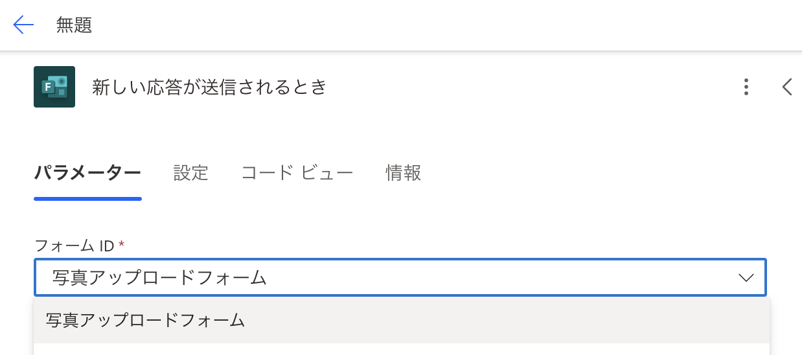
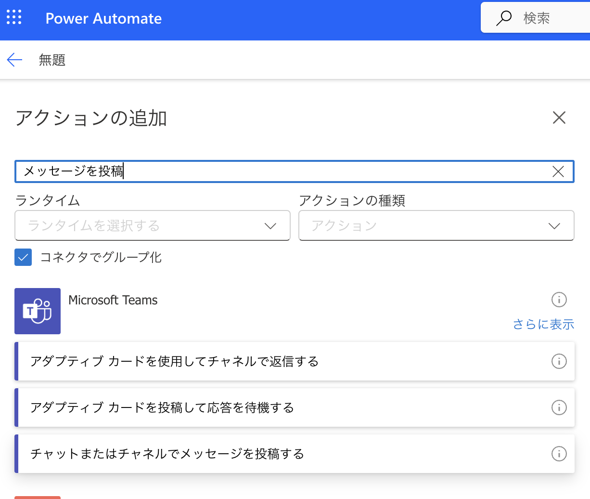
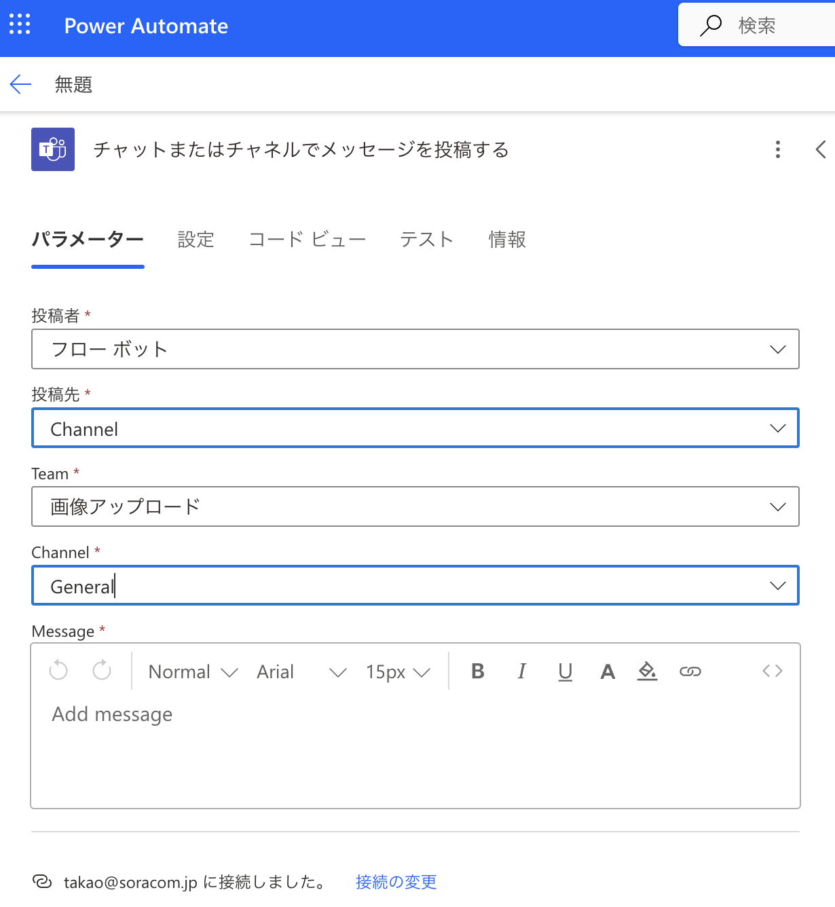
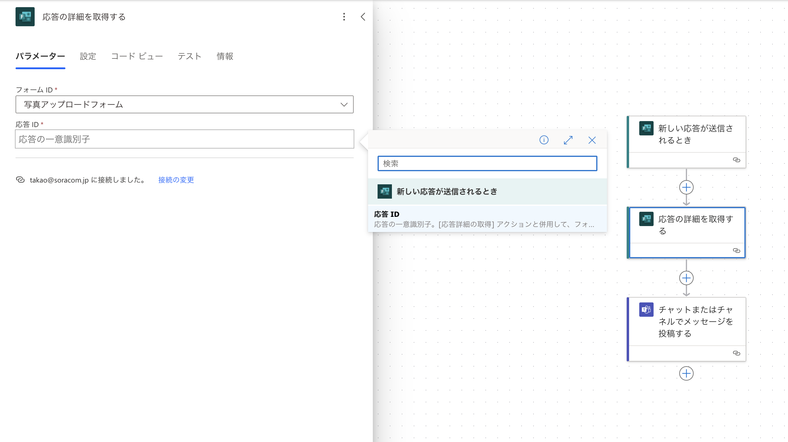

:::message
「[一般消費者が事業者の表示であることを判別することが困難である表示](https://www.caa.go.jp/policies/policy/representation/fair_labeling/guideline/assets/representation_cms216_230328_03.pdf)」の運用基準に基づく開示: この記事は記載の日付時点で[株式会社ソラコム](https://soracom.jp/)に所属する社員が執筆しました。ただし、個人としての投稿であり、株式会社ソラコムとしての正式な発言や見解ではありません。
:::

## やりたいこと
センチュリー・システムズのLTEルーターに搭載されている、DO（デジタル出力）を遠隔操作してLチカ（LEDをチカっと光らせる行為）を行います。


## 概要
センチュリーシステムズ社のMAシリーズのゲートウェイは接点出力信号を持っており、OSはLinux（Ubuntu）を採用しています。
ゲートウェイにHTTPサーバーを立てておき、リクエストをトリガにしてゲートウェイのDOを遠隔操作できるようにしておきます。
デバイスにHTTPリクエストを送信する仕組みとしては、[2025/3/10にリリース](https://changelog.soracom.io/ja/ssh-to-http-woshi-tutedebaisunikomandoyarikuesutowosong-xin-siteshi-xing-jie-guo-woshou-kequ-reruyouninarimasita-downlink-api-9nRT2)された[DownlinkAPI](https://users.soracom.io/ja-jp/docs/device-downlink/)を利用します。



## 必要なもの
- センチュリー・システムズのLTEルーター（今回は MA-S120/L）
- USBケーブル(片側はmicro-Bコネクタ、もう片側はPCのUSBポートのタイプによります。)
- PC(シリアルコンソール接続用)
- シリアルコンソールケーブル
- SORACOM アカウント
- SORACOM Air for Cellular SIMカード（標準サイズ）

## 手順
### ルーターのセットアップ
1. **ルーターのセットアップ**

   ルーターのセットアップを行います。詳細は[こちら](https://blog.soracom.com/ja-jp/2023/02/20/ma-s120-introduction/)を参照してください。

   https://blog.soracom.com/ja-jp/2023/02/20/ma-s120-introduction/

2. **ファイアウォール設定**
   `Firewall 設定`の画面から、`Filter 設定`のタブを選択し、TCPの80番ポートと50080番ポートを開放します。
   

  　

3. **lighttpdのインストールとCGIの設定**

   まず、ルーターにシリアルコンソールでアクセスし、以下のコマンドを実行してlighttpdをインストールします。
   :::message
   初期のid,passwordは`root`,`root`です。
   :::

   :::message
   ローカルからSSH接続することも可能で、その場合の初期のid,passwordは`user1`,`user1`です。
   その場合の以下のコマンドは`sudo`を付けて実行してください。
   :::

   ```bash
   apt-get update
   apt-get install lighttpd
   ```
   途中で、
   `Do you want to continue? [Y/n]`
   が出てきたら `Y` を入力してください。

   次に、設定ファイルを編集します。
   `/etc/lighttpd/lighttpd.conf`のポートを`50080`に変更します。

   nanoやviなどのエディタを使って
   `server.port = 80`
   の行を見つけ出して、`80`を`50080`に変更します。

   ```diff conf:/etc/lighttpd/lighttpd.conf
   + server.port = 50080
   - server.port = 80
   ```


   続いて、CGIを有効にするための設定を追加します。
   
   `/etc/lighttpd/conf-available/10-cgi.conf`の内容を以下のとおりにします。
   
   ```conf conf:/etc/lighttpd/conf-available/10-cgi.conf
   server.modules += ( "mod_rewrite", "mod_cgi" )
   
   $HTTP["url"] =~ "^/cgi-bin/" {
       alias.url += (
           "/cgi-bin/" => "/usr/lib/cgi-bin/"
       )
       # 拡張子なしファイルをCGIとする場合
       cgi.assign = ( "" => "" )
   }
   
   # url.rewrite-onceでマッピングを行う
   url.rewrite-once = (
     "^/DO([0-9]+)/open$"  => "/cgi-bin/DO$1/open",
     "^/DO([0-9]+)/close$" => "/cgi-bin/DO$1/close"
   )
   ```

   リライト機能とCGIを有効化します。

   ```bash
   lighty-enable-mod rewrite
   lighty-enable-mod cgi
   ```

   設定を反映させるためにlighttpdを再起動します。

   ```bash
   systemctl restart lighttpd
   ```

4. **シェルスクリプトの設置**

   必要なディレクトリを作成し、スクリプトを配置します。

   ```bash
   sudo mkdir -p /usr/lib/cgi-bin/DO0/
   sudo mkdir -p /usr/lib/cgi-bin/DO1/
   ```

   スクリプトを配置し、実行権限を付与します。

   ```bash
   sudo touch /usr/lib/cgi-bin/DO0/open
   sudo touch /usr/lib/cgi-bin/DO0/close
   sudo touch /usr/lib/cgi-bin/DO1/open
   sudo touch /usr/lib/cgi-bin/DO1/close
   sudo chmod +x /usr/lib/cgi-bin/DO0/open
   sudo chmod +x /usr/lib/cgi-bin/DO0/close
   sudo chmod +x /usr/lib/cgi-bin/DO1/open
   sudo chmod +x /usr/lib/cgi-bin/DO1/close
   ```

   以下は`/usr/lib/cgi-bin/DO0/close`のスクリプト例です。
   httpのレスポンスヘッダと、LEDの制御を行っています。
   LEDの制御は、`/sys/class/leds/DO0/brightness`に`1`を書き込むことで接点を閉じ、`0`を書き込むことで接点を開くことができます。

   `DO0`と`DO1`の違い、`open`と`close`の違いに注意してスクリプトを作成してください。

   ```bash cgi:/usr/lib/cgi-bin/DO0/close
   #!/bin/sh
   echo "Status: 200 OK"
   echo "Content-type: application/json"
   echo ""
   echo 1 > /sys/class/leds/DO0/brightness  
   echo '{"result":"close"}'
   ```

5. **tmpfilesでのパーミッション調整**

   `/etc/tmpfiles.d/leds.conf`を作成して以下を記述し、CGIからLED制御が可能なように設定します。

   ```bash
   f /sys/class/leds/DO0/brightness 0660 root www-data -
   f /sys/class/leds/DO1/brightness 0660 root www-data -
   ```

   設定を反映させます。

   ```bash
   systemd-tmpfiles --create
   ```

6. **動作確認**

   curlコマンドで動作を確認します。

   ```bash
   curl http://localhost:50080/DO0/open
   curl http://localhost:50080/DO0/close
   curl http://localhost:50080/DO1/open
   curl http://localhost:50080/DO1/close
   ```

   `/sys/class/leds/DO*/brightness`に1や0が書き込まれていることを確認します。

   ```bash
   cat /sys/class/leds/DO0/brightness
   cat /sys/class/leds/DO1/brightness
   ```

   以下のコマンドで、ここまでの設定を永続化させます。
   ```bash
   overlaycfg -s other
   reboot
   ```

   再起動後も権限設定やスクリプトが維持されていることを確認しましょう。

### SORACOM Fluxを使ったテスト
SORACOM Fluxの設定をしていきます。
SORACOM Flux is 何？という方は[こちら](https://users.soracom.io/ja-jp/docs/flux/overview/)をご覧ください。
1. **設定の概要**
   
   以下のようなことを実施するフローを作っていきます。
   - IoTデバイストリガ
   - SORACOM API アクション(上段)
    接点を開くAPI（`GET /DO0/open`）を実行
    - アクションの実行条件：`payload.command == "open"`
     
    - API : sendDownlinkHTTP
     
    - HTTP ボディ : 
     ```json
       {
         "method": "GET",
         "path": "/DO0/open",
         "port": 50080,
         "skipVerify": true,
         "ssl": false
       }
     ```
    - SORACOM API アクション(下段)
    接点を閉じるAPI（`GET /DO0/close`）を実行
    - アクションの実行条件：`payload.command == "close"`
    - API : sendDownlinkHTTP
    - HTTP ボディ : 
     ```json
       {
         "method": "GET",
         "path": "/DO0/close",
         "port": 50080,
         "skipVerify": true,
         "ssl": false
       }
     ```
2. **テスト実行**
  作成したフローをテスト実行します。
  IoTデバイストリガのボックスをクリックします。
  `テスト実行`のタブで、bodyに`{"command":"open"}`または、`{"command":"close"}`を入力して`実行`をクリックしテスト実行の結果、接点が開閉されることを確認します。
  

  テスト実行の様子
  

以上、お疲れ様でした！


## まとめ&蛇足
lighttpdを使用してCGIを有効にし、シェルスクリプトを実行することで、HTTPリクエストを受けて接点を開閉することができるようになりました。

### HTTPサーバーの選定理由
 今回のデバイスはLinuxゲートウェイとはいえ、リソースが限られているため軽量なHTTPサーバーを選定する必要がありました。
 lighttpdは軽量で高速なHTTPサーバーとして知られており、CGIの設定も簡単に行えるため今回の用途に適していると考えました。
 また、デバイスの仕組みとして接点の開閉をデバイスファイルへの0or1の簡単な書き込みで実現できるため、シェルスクリプトを使用して簡単に実装するためCGIが利用しやすいサーバーを選択しました。
 
 HTTPサーバー雑比較

  | サーバー | 軽さ | CGIとの親和性 |
  | --- | --- | --- |
  | Apache | 重い | 高 |
  | nginx | 軽い | 低 |
  | lighttpd | 軽い | 高 |

###　今後の展開など
今回は単純に接点をON/OFFするだけのコマンドとHTTPのレスポンスを返すだけのスクリプトを作成しましたが、実際の運用では、もう少しエラーハンドリングなどが必要なケースもあります。
また、今回はGETリクエストでの操作でしたが、POSTリクエストにしたほうがRESTfulなAPIとしては適しているかなという気もします。
本ブログの方法でデバイスの接点をコマンドで開閉できるようになったことで、別のデバイスが接点を閉じた際に、このデバイスのLEDが点灯するなどの応用も考えられますので応用編のブログではそれにチャレンジしてみたいと思います。

### appendix
もう少しエラーハンドリングをちゃんとしたい場合のスクリプト例です。

   ```bash
   #!/bin/sh
   # エラーを拾いやすくする
   set -eu

   # エラーレスポンスを返す関数
   error_response() {
     local status_code="$1"
     local message="$2"

     echo "Status: $status_code"
     echo "Content-Type: application/json"
     echo ""
     echo '{"result":"error","message":"'"$message"'"}'
     exit 0
   }

   # 1) 実際の書き込みを試行 (LED ON)
   if ! echo 0 > /sys/class/leds/DO0/brightness 2>/dev/null; then
     error_response "500 Internal Server Error" "Failed to write brightness"
   fi

   # 2) 書き込み後の値を読み取る
   ACTUAL_VALUE=$(cat /sys/class/leds/DO0/brightness 2>/dev/null || true)

   # 3) 期待値(1)と一致しなければエラー
   if [ "$ACTUAL_VALUE" != "0" ]; then
     error_response "500 Internal Server Error" "Unexpected value: '$ACTUAL_VALUE'"
   fi

   # 4) 問題なく 1 が読み取れたら成功
   NOW=$(date +%FT%T%z)

   echo "Status: 200 OK"
   echo "Content-Type: application/json"
   echo ""
   echo '{"result":"success","state":"open","time":"'"$NOW"'"}'
   ```
