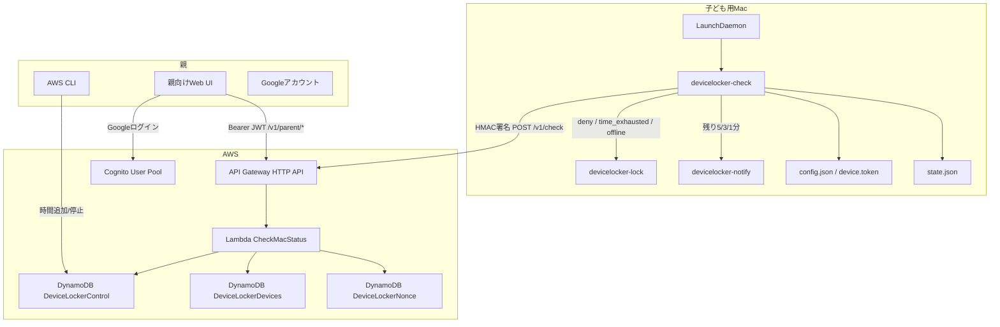
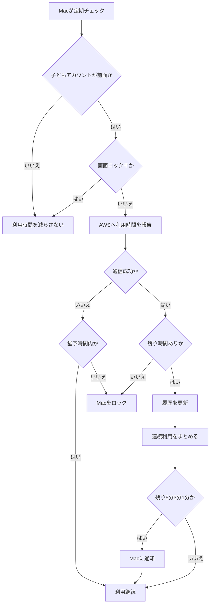

## はじめに

子ども用に中古の M1 Mac を買いました。
きっかけは、子どもが Scratch で 3D っぽい重めの描画プログラムを作ったり、Minecraft をコマンドで触るために Switch ではなく Java 版で遊びたい、と言い出したことでした。

ただ、パソコンを渡すなら、無制限に使える状態にはしたくありません。小学生の本分は勉強（と友達と仲良く遊ぶこと）なので、パソコンの利用時間が勉強時間と同じくらい、できれば勉強時間のほうが多くなるように調整したいと考えていました。

macOS のスクリーンタイムでも利用時間の制限はできます。ただ、家庭内でやりたいことは、単に「1 日 1 時間まで」と決めることではありませんでした。「勉強した分だけ使える時間が増え、パソコンを使うとその残高が減る」というルールにしたかったのですが、標準機能だけできっちり満たすのは難しいと感じました。

この記事は、完成したロックツールの手順書というより、家庭内の小さな課題を観察しながら、AI と相談しつつ実装と体験設計を往復した記録です。

スクリーンタイムや MDM を使う選択肢もありますが、今回は自由研究として、AWS 側に残り利用時間を持たせ、Mac 側の常駐エージェントが定期的にサーバー判定を見に行く仕組みを vibe coding で作りました。

もともとのユースケースは、10 歳の小学生が使う Mac です。将来的には、算数ドリルをやった量に応じて Mac の利用可能時間が増え、Mac を使うとその時間が減っていくようにしたい、というものでした。

ただし、最初からドリル連動まで作ると、学習記録、保護者 UI、Mac 制御、クラウド連携が一気に混ざります。そこで今は、親が手動で時間を追加し、子どもが Mac を使うと残り時間が減るところまでに絞っています。

この仕組みには、あえて完全には塞いでいないハックの余地もあります。コードは GitHub で公開しています。

https://github.com/takao2704/devicelocker

子どもが仕組みを読み、どうすれば無制限に使えるかを考えて挑戦してくれるといいなと思いながら、楽しみに待っています。

検証した主な環境は macOS 14.8.7、Python 3、AWS Lambda Python 3.12 です。

## 残り時間を中心に置く

最初は、寝る前にベッドでスマホを触りながら殴り書きしたメモから始めました。そこから AI と会話しながら、やりたい体験、必要な状態、実装の順番を切り分けていきました。

ここでいきなり AWS の構成図を描き始めると、作りたいものがただの管理ツールになってしまいます。まずは「親は何を楽にしたいのか」「子どもはどの瞬間に困るのか」を言葉にしてから、API や DynamoDB の形を決めていきました。

最初の設計レビューでは、「ある時刻まで利用を許可する」`AllowUntil` のようなモデルも候補にしていました。しかし、実際のユースケースを聞くと、これは少し違いました。

やりたいことは「20:00 まで使える」ではなく、「ドリルをしたので 30 分ぶん使える」「Mac を使ったので残り時間が減る」です。つまり、時刻ベースの許可ではなく、利用可能時間の残高を持つほうが自然です。

そこで設計を `RemainingSeconds` 中心に切り替えました。

- 親が時間を追加すると `RemainingSeconds` が増える
- Mac が使われると `usageDeltaSeconds` を API に送る
- Lambda が `RemainingSeconds` から実際に消費した秒数を引く
- 残りがあれば `allow`、ゼロなら `deny` を返す

この変更で、将来の「算数ドリル 1 ページで 5 分追加」のような報酬ルールも同じモデルに載せやすくなりました。今は親が手動で時間を足しますが、追加元が手動操作でもドリル連動でも、最終的には `RemainingSeconds` を増やすだけにできます。

## 全体構成

構成図だけを見ると AWS と macOS LaunchDaemon の話ですが、体験としては「親が状態を見る」「子どもが Mac を使う」「AWS が残り時間を判定する」の 3 つを分けています。

Mac 側は root 所有の LaunchDaemon として 10 秒ごとに起動します。ただし通常時に毎回 AWS へ問い合わせるのではなく、`allow` 状態では 60 秒ごと、残り時間ゼロまたは `deny` 状態では 10 秒ごとに確認します。

AWS 側は以下を持ちます。

- `DeviceLockerControl`: 残り秒数、承認状態、履歴を保持
- `DeviceLockerDevices`: 端末 ID と device token を保持
- `DeviceLockerNonce`: 署名済みリクエストのリプレイ防止用 nonce を短期間保持

親の操作は、CLI も残しつつ、普段使いは Cognito + Google アカウント認証付きの親向け Web UI に寄せています。

## 技術選定

技術選定では、きれいな構成よりも「家庭内で動かし続けやすいこと」と「あとから体験を足しやすいこと」を優先しました。

家でしか使わないものなので、オンプレミスで小さなサーバーを立てる選択肢もあります。ただ、サーバーレス構成なら使っていない時間のランニングコストをほとんど気にせず済むため、クラウド側は API Gateway + Lambda + DynamoDB に寄せました。

| 領域 | 選んだもの | 理由 |
| --- | --- | --- |
| Mac 側の常駐処理 | LaunchDaemon + Python | 子ども用標準ユーザーの操作に依存せず、定期チェックを安定して軽く動かしたかったため |
| ロック手段 | screen lock delay の事前設定 + ディスプレイスリープ | macOS 14.8.7 で実機確認し、復帰時にパスワード入力へつなげやすかったため |
| バックエンド | API Gateway + Lambda | 残り時間の判定 API として小さく始められ、運用するサーバーを持たなくてよいため |
| 状態管理 | DynamoDB | 残り秒数、履歴、端末、nonce のような小さな状態を分けて持ちやすいため |
| 親の認証 | Cognito + Google アカウント | 認証なしだと子ども側から触られるため。親はスマホから開くことが多いので、パスワード入力を増やさず Google アカウントで入れる形にしたかったため |
| 親向け UI | 静的な Web UI | 残り時間や履歴の見え方を素早く試し、あとから UI を足しやすいため |
| リクエスト保護 | device token + HMAC + nonce | 家庭内利用としての念のための対策。端末固有の token なしでは単純ななりすましをしにくくするため |

厳密な改ざん耐性や MDM での強制管理を目指すなら別の選択肢になりますが、今回は家庭内で使いながら育てやすいように、少ない部品で動かせる構成に寄せました。

## 判断ロジック

判断ロジックは、実装の細部よりも次のポイントを先に決めました。

- 消費対象: 子どもアカウントが前面で、画面ロックされていない時間だけを減らす
- 残高管理: Mac 側ではなく AWS 側の `RemainingSeconds` を正とする
- 判定: 残り時間があれば `allow`、ゼロなら `deny`
- 失敗時: 通信失敗は短い猶予内なら許可し、猶予超過ならロックする
- 見せ方: 通知と履歴合算で、子どもにも親にも状況が伝わるようにする

全体の流れは次のようになります。

この流れにしたことで、親のメンテナンス中や画面ロック中には時間が減らず、実際に使った分だけ残高が減り、残り時間や利用履歴も親子の体験として見えるようになります。

## 親向け UI の体験設計

親の普段の入口は Web UI です。家庭内で使うものなので、細かい管理画面というより、「今どうなっているかを見て、その場で時間を足す、止める、履歴を見る」ことを 1 画面で済ませる方針にしました。

この UI は、使いながら少しずつ形にしていきました。Mac 側のロックが動いたあと、実際に家庭で使うなら「もうすぐご飯だけどあと何分残っているのか」「いまオンラインなのか」「さっき何分使ったのか」「手で足した時間は履歴に残るのか」が気になってきます。その違和感を見つけるたびに、親向け体験として必要な表示を足していきました。

トップ画面では、次の情報をまとめて見られるようにしています。

- 残り時間: 子どもがあと何分使えるか
- オンライン状態: Mac エージェントが最後にいつ確認したか
- 今日のドリル: 将来のドリル連動に向けた当日の状態
- 手動追加: 親がその場で 5 分、10 分のように時間を足す操作
- 一時停止/再開: 食事や外出などで一時的に使わせない操作
- 最近の履歴: 時間追加、Mac 利用、停止/再開の流れ

親向け Web UI の画面例です。残り時間を大きく見せ、手動追加と一時停止を同じ画面に置くことで、日常的な操作を迷いにくくしています。

履歴は、親の操作と Mac 利用を同じタイムラインで見せています。Mac エージェントは定期的に利用時間を報告するため、そのまま表示すると「Mac利用」が細かく並びます。そこで、短い間隔で続いた Mac 利用は連続利用としてまとめ、親から見たときに「いつからいつまで使ったか」が分かる表示にしました。

過去 1 週間の時間増減も同じ画面で見られるようにしています。残り時間だけだと、その日なぜ増えたのか、どれくらい使ったのかが分かりにくいため、手動追加や利用消費の流れを後から追えるようにしています。

報酬ルールの編集では、項目名、単位名、1 単位あたりの追加時間、複数入力の可否を設定できます。今は親が手動で時間を足しますが、将来的に「算数ドリル 1 ページで 5 分追加」のような自動連動を入れても、同じルール設定から `RemainingSeconds` に加算できます。

親向け UI の具体的なコードや起動方法は [README](https://github.com/takao2704/devicelocker#readme) にまとめています。この記事では、細かな実装手順よりも、どんな体験を成立させるためにどの情報を出したかに絞っています。

## まとめ

この記事では、子ども用 Mac の利用時間管理を、家庭内プロダクトとして vibe coding で作った話を書きました。

今回の要点は次の通りです。

- Scratch の重めの描画や Minecraft Java 版をやりたい、という理由で子ども用 Mac を買うことになった
- 無制限に使える状態ではなく、勉強時間と Mac 利用時間のバランスを取れるようにしたかった
- 「20:00 まで許可」ではなく、「ドリルなどで得た残り時間を消費する」モデルにした
- 親向け UI では、残り時間、オンライン状態、手動追加、一時停止、履歴を 1 画面で見られるようにした
- Mac 側は LaunchDaemon で動き、子どもアカウントが前面にいる時間だけを消費する
- 実装は API Gateway + Lambda + DynamoDB と、Mac 側の Python エージェントで構成した
- コードは GitHub で公開していて、子どもが突破に挑戦してくる余地も含めて楽しみにしている

作ってみて重要だったのは、単に「残り時間がゼロならロックする」ではなく、家庭内運用で起きる細かい状態をプロダクトの体験として扱うことでした。

- 親アカウント利用中は時間を減らさない
- 画面ロック中は時間を減らさない
- オフライン時は短い猶予を置いてからロックする
- device token と HMAC 署名で最低限のなりすましを防ぐ
- nonce で単純な再送を防ぐ
- 親が見やすいように連続利用履歴をまとめる
- 残り時間が少なくなったら Mac 側に通知する

入口は子ども用 Mac の時間管理でしたが、作ってみると、これはデバイスの状態を遠隔で監視し、必要に応じて制御するという、普通にいつもやっている IoT のアプリケーションでした。

Mac が状態を送り、クラウド側が判断し、端末側が制御を実行する。IoT というのは、最初から「IoT をやるぞ」と意気込んで始めるものというより、何かやりたいことや解きたい問題があり、その手段がたまたま IoT だった、というものなのだなと感じました。

家の中の困りごとを AWS や macOS LaunchDaemon、DynamoDB、Lambda でつないでみたら、使いながら UI やルールを少しずつ作っていく、なかなか面白い題材になりました。

もし子どもが GitHub のコードを読んでこの仕組みの突破に挑戦してきたら、それもまた面白い展開です。親としては、無制限にパソコンを使うためのハックまで含めて、仕組みを一緒に話せる題材になることを期待しています。

## 参考

- [Creating Launch Daemons and Agents - Apple Developer Documentation Archive](https://developer.apple.com/library/archive/documentation/MacOSX/Conceptual/BPSystemStartup/Chapters/CreatingLaunchdJobs.html)
