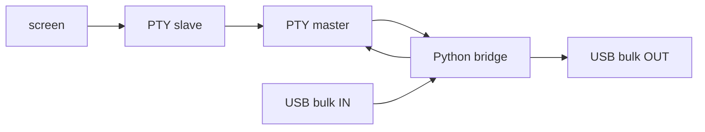

:::message
「[一般消費者が事業者の表示であることを判別することが困難である表示](https://www.caa.go.jp/policies/policy/representation/fair_labeling/guideline/assets/representation_cms216_230328_03.pdf)」の運用基準に基づく開示: この記事は記載の日付時点で[株式会社ソラコム](https://soracom.jp/)に所属する社員が執筆しました。ただし、個人としての投稿であり、株式会社ソラコムとしての正式な発言や見解ではありません。
:::

## はじめに

SORACOM Onyx は、内部に Quectel EG25-G を搭載し、USB コネクタ経由で EG25-G の USB インターフェースに接続する構成の LTE USB ドングルです。
公式ユーザーガイドでも、SORACOM Onyx は Quectel EG25-G を通信モジュールとして使用していることが説明されています。

[SORACOM Onyx の AT コマンド実行手順](https://users.soracom.io/ja-jp/guides/usb-dongles/soracom-onyx/at-command/)

https://users.soracom.io/ja-jp/guides/usb-dongles/soracom-onyx/at-command/

macOS に接続すると、USB デバイスとしては Quectel EG25-G が見えているのに、AT コマンドを打つための `/dev/cu.*` シリアルポートが出ないことがあります。
通常であれば USB シリアルドライバーがモデムの AT コマンド用インターフェースを `/dev/cu.*` として見せてくれますが、ドライバーが入っていない環境では、そのデバイスノードが作られません。

今回の検証では、macOS 上で SORACOM Onyx 内部の EG25-G が以下の USB デバイスとして見えていました。

```text
Vendor: Quectel
Product: EG25-G
VID: 0x2c7c
PID: 0x0125
Firmware: EG25GGBR07A08M2G
```

一方で、`/dev/cu.*` は出ていませんでした。
そこで、macOS のシリアルドライバーに頼らず、PyUSB で USB bulk endpoint を直接読み書きして AT コマンドを送るヘルパーを用意しました。

さらに、`screen /tmp/eg25-at 115200` のように普段のシリアルコンソールと同じ感覚で使えるように、USB bulk endpoint とローカルの PTY（pseudo terminal）をブリッジするツールも作りました。

ここで扱うのは「macOS で `/dev/cu.*` が出ない SORACOM Onyx に、どうやって AT コマンドを送るか」という検証端末側の補助テクニックです。

## Onyx を挿しただけの macOS 側の状態

まず、SORACOM Onyx を macOS に挿しただけの状態を確認します。
ここで見たいのは、USB デバイスとして認識されているかと、`screen` から開ける `/dev/cu.*` が増えているかの 2 点です。

USB 関連の data type 名は macOS のバージョンによって異なることがあるため、必要に応じて先に確認します。

```bash
system_profiler -listDataTypes | grep USB
```

今回の環境では `SPUSBHostDataType` が表示されました。
一方で、`system_profiler SPUSBDataType` は何も出力しませんでした。
`system_profiler SPUSBDataType` を実行して出力が空になる場合は、以下のように `SPUSBHostDataType` を使うと確認できます。

```bash
system_profiler SPUSBHostDataType
```

`system_profiler SPUSBHostDataType` は出力が長いため、必要に応じて以下のように絞り込むと確認しやすくなります。

```bash
system_profiler SPUSBHostDataType | grep -Ei -A 12 'EG25|Quectel|2c7c|0125'
```

今回の環境では、macOS の USB デバイスとしては Quectel EG25-G が認識されていました。
確認できた情報は以下です。

```text
Vendor: Quectel
Product: EG25-G
VID: 0x2c7c
PID: 0x0125
Firmware: EG25GGBR07A08M2G
```

ここで確認できているのは、あくまで macOS から USB デバイスとして見えているという状態です。
この時点で、AT コマンドを送るためにそのまま `screen` で開けるシリアルポートが作られているとは限りません。

次に `/dev/cu.*` を確認します。

```bash
ls /dev/cu.*
```

今回の環境では、Onyx を挿しても `/dev/cu.usbmodem*` や `/dev/cu.usbserial*` のような Onyx / EG25-G らしい callout device は増えませんでした。
つまり、macOS は Onyx 内部の EG25-G を USB デバイスとしては認識しているものの、AT コンソールとして開けるシリアルポートは用意していない状態でした。
そのため、以下のような操作はできません。

```bash
screen /dev/cu.usbserial-XXXX 115200
```

整理すると、Onyx を挿した直後の状態は以下です。

| 観点 | 状態 |
|---|---|
| USB デバイスとしての認識 | されている |
| VID / PID | `0x2c7c` / `0x0125` |
| Product | `EG25-G` |
| `/dev/cu.*` の追加 | 今回の環境ではなし |
| そのまま `screen` で開ける AT ポート | なし |

この状態でも、USB デバイス自体は見えているため、PyUSB で USB interface と endpoint を直接扱う余地があります。
この記事では、その USB bulk endpoint を直接読み書きすることで AT コマンドを送ります。

## やりたいこと

やりたいことは、macOS でシリアルポートが出ない SORACOM Onyx に対して、AT コマンドを送れる状態にすることです。

具体的には、Onyx 内部の EG25-G に対して `AT` や `ATI` を送り、応答を確認できる状態にします。
さらに、SIM 情報、PDP context、DNS 解決結果などを AT コマンドで確認できるようにします。

## 事前準備

今回の例では、macOS 上で Python 3、PyUSB、libusb を使います。
PyUSB は USB デバイスへアクセスする Python ライブラリで、macOS ではバックエンドとして `libusb` も必要です。

```bash
brew install libusb
```

この記事で使うヘルパーは、以下のリポジトリに置いています。

https://github.com/takao2704/soracom-onyx-at-console

clone して、仮想環境にインストールします。

```bash
git clone https://github.com/takao2704/soracom-onyx-at-console.git
cd soracom-onyx-at-console
python3 -m venv .venv
source .venv/bin/activate
python3 -m pip install -e .
```

`screen` を使って対話的に AT コマンドを打つため、macOS 標準の `screen` コマンドも使います。

```bash
screen --version
```

USB interface は 1 つのプロセスだけが claim できます。
他のターミナルソフト、モデム管理ツール、以前起動したブリッジプロセスが同じ interface を掴んでいると失敗するため、うまくいかない場合はそれらを終了してから再実行します。

この記事では、リポジトリが提供する以下の 2 つのコマンドを使います。

```text
eg25-at
eg25-pty
```

## 全体像

通常の構成では、USB シリアルドライバーが USB デバイスと `/dev/cu.*` の間を仲介します。


今回は `/dev/cu.*` が出ないため、ドライバーの代わりに Python スクリプトで USB endpoint と PTY をつなぎます。


ポイントは、PTY を使うことで `screen` からは通常のシリアルポートのように見えることです。
ただし、実体は `/dev/cu.*` ではなく、Python が作成した擬似端末です。

## PyUSB で AT コマンドを送る仕組み

USB デバイスは、複数の interface と endpoint を持っています。
EG25-G の AT コマンド用 interface には、読み取り用の bulk IN endpoint と、書き込み用の bulk OUT endpoint があります。

`eg25-at` では、以下の流れで AT コマンドを送ります。

1. `VID=0x2c7c`, `PID=0x0125` の USB デバイスを探す
2. USB configuration を取得する
3. 候補 interface を順に調べ、bulk IN / bulk OUT のペアを探す
4. interface を claim する
5. bulk OUT endpoint に `AT\r` のようなコマンドを書き込む
6. bulk IN endpoint から応答を読む
7. `OK` または `ERROR` を見つけたら 1 コマンド分の応答として扱う

実際には interface 番号が環境やデバイス構成によって変わる可能性があるため、候補を順番に試しています。
今回の環境では interface 2 が AT コマンドに応答しました。

確認には以下のように使えます。

```bash
eg25-at --list
```

一発で AT コマンドを送る場合は以下です。

```bash
eg25-at AT ATI AT+QCCID
```

この方法は、自動検証やログ取得には便利です。
一方で、AT コマンドを対話的に打ちたい場合は、毎回スクリプトを起動するよりも `screen` のようなターミナルソフトから使える方が楽です。

## PTY ブリッジの仕組み

`screen` は、基本的にはシリアルポートや端末デバイスを開いて読み書きします。
そこで `eg25-pty` では、Python の `pty.openpty()` で擬似端末を作ります。

擬似端末には master 側と slave 側があります。
`screen` には slave 側を開かせ、Python スクリプトは master 側を読み書きします。



`eg25-pty` の中では、主に 2 つの方向の転送を行います。

- `screen` から入力された文字列を PTY master で読み、USB bulk OUT に書く
- USB bulk IN から受け取った応答を PTY master に書き、`screen` に表示させる

USB から PTY への転送は別スレッドで動かし、PTY から USB への転送は `select` で入力を待ちながら処理しています。
PTY は raw mode にして、改行や制御文字を端末側で余計に変換しないようにしています。

## 使い方

まず、ブリッジを起動します。

```bash
eg25-pty --symlink /tmp/eg25-at
```

このコマンドは、内部で PTY を作り、その slave 側へのシンボリックリンクとして `/tmp/eg25-at` を作成します。
別のターミナルから以下のように開きます。

```bash
screen /tmp/eg25-at 115200
```

ここで指定している `115200` は、`screen` のコマンドライン形式に合わせるための値です。
実際には USB bulk endpoint と PTY のブリッジなので、物理 UART のようなボーレート設定は使われません。

起動後は、通常の AT コンソールのようにコマンドを入力できます。

```text
AT
ATI
AT+CIMI
AT+QCCID
```

終了するときは、`screen` 側で `Ctrl-a` の後に `k`、ブリッジ側で `Ctrl-c` を押します。
ブリッジを終了すると、`/tmp/eg25-at` のシンボリックリンクも削除されます。

## 今回の検証で使った AT コマンド

SIM 情報の確認には以下を使いました。

```text
AT+CIMI
AT+QCCID
```

PDP context と DNS の確認には以下を使いました。

```text
AT+CGDCONT=1,"IP","soracom.io"
AT+CGACT=1,1
AT+CGCONTRDP=1
```

DNS 解決の確認には以下を使いました。

```text
AT+QIDNSGIP=1,"harvest.soracom.io"
```

このように、PTY ブリッジを使うと、macOS に `/dev/cu.*` が出ていない状態でも、手元のターミナルから AT コマンドを対話的に確認できます。

## 実装リポジトリ

`eg25-at` と `eg25-pty` の実装は以下に置いています。

https://github.com/takao2704/soracom-onyx-at-console

まず使うだけなら、事前準備で `python3 -m pip install -e .` したあとに `eg25-at` / `eg25-pty` を実行すれば十分です。
実装の詳細を確認したい場合は、リポジトリの `src/soracom_onyx_at_console/eg25_at.py` と `src/soracom_onyx_at_console/eg25_pty.py` を参照してください。

## 注意点

この方法は、macOS に正式なシリアルドライバーを入れる代わりに、USB bulk endpoint を直接扱うための回避策です。
通常の `/dev/cu.*` デバイスを作るわけではありません。

また、AT コマンド用 interface は環境によって異なる可能性があります。
自動検出でうまくいかない場合は、`--list` で interface と endpoint を確認し、`--interface` で明示します。
今回の環境では interface 2 が AT コマンドに応答しましたが、読者の環境では `--list` の結果に合わせて指定してください。

```bash
eg25-at --list
eg25-pty --interface 2 --symlink /tmp/eg25-at
```

他のプロセスが同じ USB interface を掴んでいる場合は、interface の claim に失敗することがあります。
その場合は、他のターミナルソフトやモデム関連ツールを終了してから再実行します。

## まとめ

macOS で SORACOM Onyx 内部の EG25-G が USB デバイスとして見えているのに `/dev/cu.*` が出ない場合でも、PyUSB を使えば AT コマンド用の USB bulk endpoint を直接読み書きできます。

一発実行には `eg25-at`、対話的な操作には `eg25-pty` を使います。
PTY ブリッジを挟むことで、`screen /tmp/eg25-at 115200` のように、普段のシリアルコンソールに近い形で AT コマンドを扱えるようになります。
