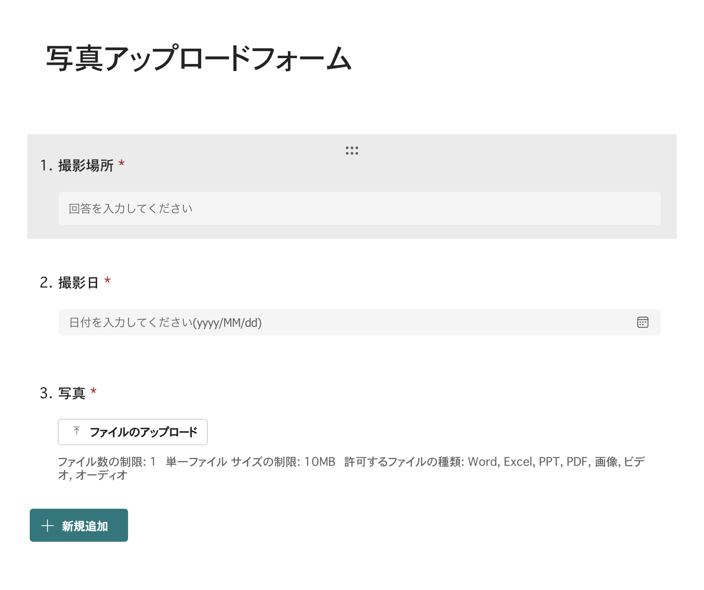
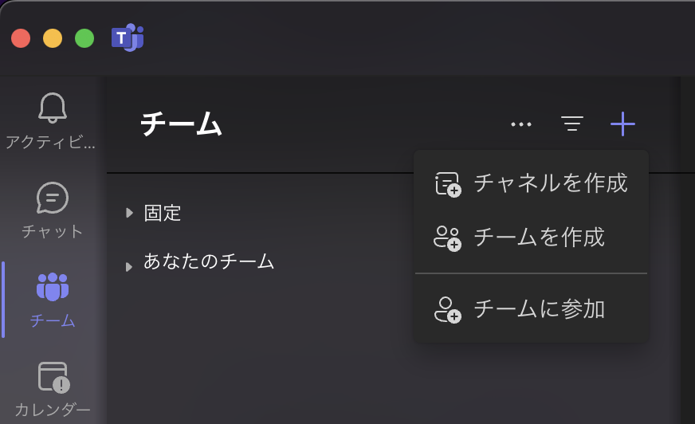
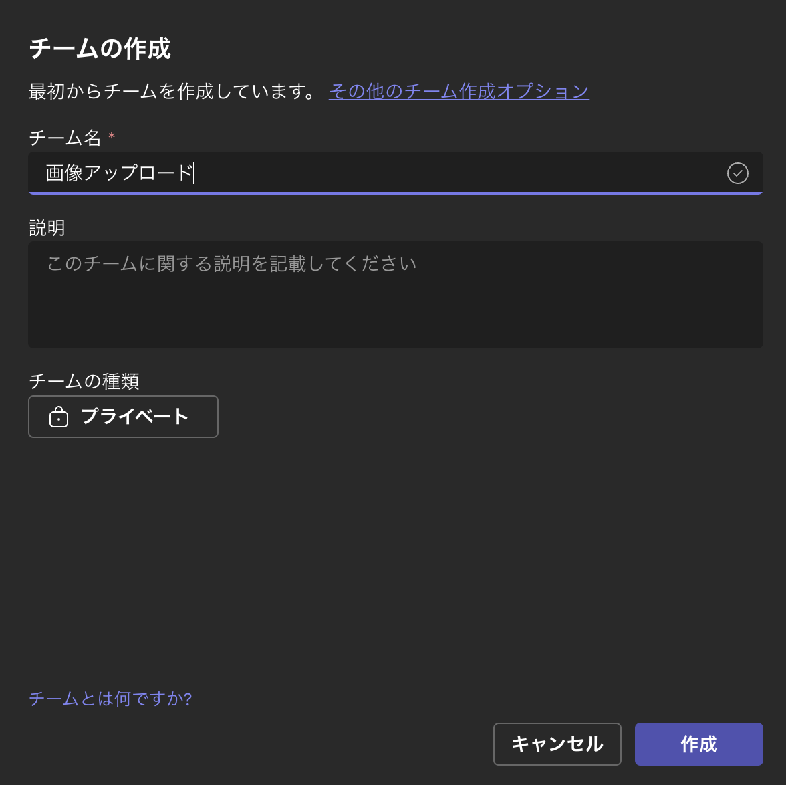

## はじめに
Microsoft365でスマートフォンで撮影した写真を管理する仕組みを作っていきます。
まずは、Microsoft FormsとPower Automateを使って写真を送信し、送信結果をTeamsに通知する仕組みを作ります。

一連の作業を行うことで、以下のようなフローを実現していきます。

## 事前準備
office 365のアカウントを持っていることが前提です。
以下のサービスが利用できることを確認してください。
- Microsoft Forms
- Power Automate
- SharePoint または OneDrive

## フォームの作成
1. https://www.office.com/ にアクセスし、Microsoft Formsを開きます。

    

2. 新しいフォームを作成します。

    

3. フォームのタイトルを入力します。

    

4. 新規追加ボタンをクリックし、フォームに質問を追加します。

    

    

    

    

## Microsoft Teamsのチームを作成
1. Microsoft Teamsを開きます。
2. チームを作成します。

    

3. チームの名前を入力し、チームを作成します。
    
    

4. チームが作成されると、チームのメンバーを追加します。

## Power Automateの作成
1. Power Automateを開きます。

    

2. 新しいフローを作成します。

    「+作成」から、「自動化したクラウドフロー」を選択します。

    

3. トリガーを選択します。

    検索窓に「Forms」を入力し、「新しい応答が送信されるとき」を選択し「作成」をクリックします。

    

4. フォームを選択します。

    

5. フォームの質問に対応するアクションを追加します。

    

6. アクションを追加します。

    検索窓に「Forms」と入力し、「フォームの応答の詳細を取得」を選択します。

    

6. アクションの設定を行います。

    フォームのIDを選択し、フォームの応答IDを選択します。

    

6. アクションを追加します。

    

6. 検索窓に「メッセージを投稿」と入力し、「Microsoft Teams」の「チャットまたはチャネルでメッセージを投稿する」を選択します。

    

7. 投稿先のチーム,チャネルを選択します。

    

8. メッセージの本文を設定します。

    まずは以下のように入力して、
    

    前のアクションで取得した内容を入力したい箇所にカーソルを合わせた状態で稲妻マークをクリックして入力します。

    

    

    同じ要領で追加していきます。
    

9. 保存ボタンをクリックし、フローを保存します。

    

10. ここまでの内容で一度テストを行います。

    保存したformを開き、プレビューから回答を送信します。
    

11. Teamsのチャンネルにメッセージが投稿されていることを確認します。

    
    
    
    
## まとめ

ここまででまずはFlowからPowerAutomateをつかってOffice365のサービスを連携させる方法を確認しました。
