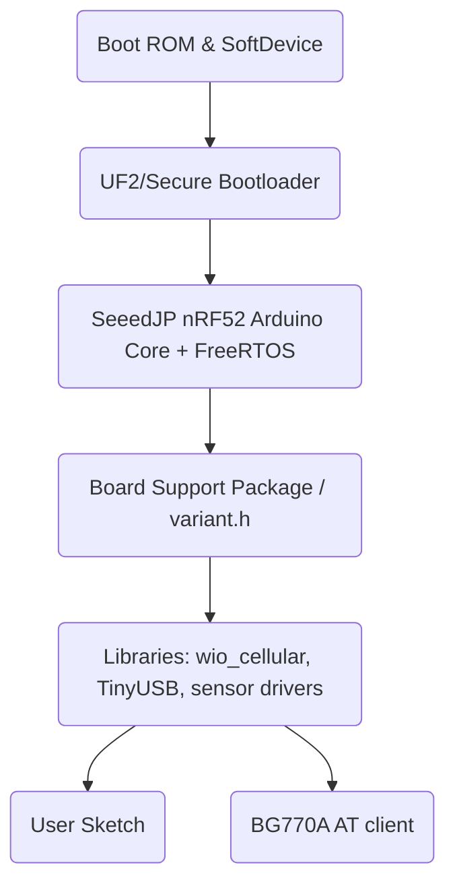
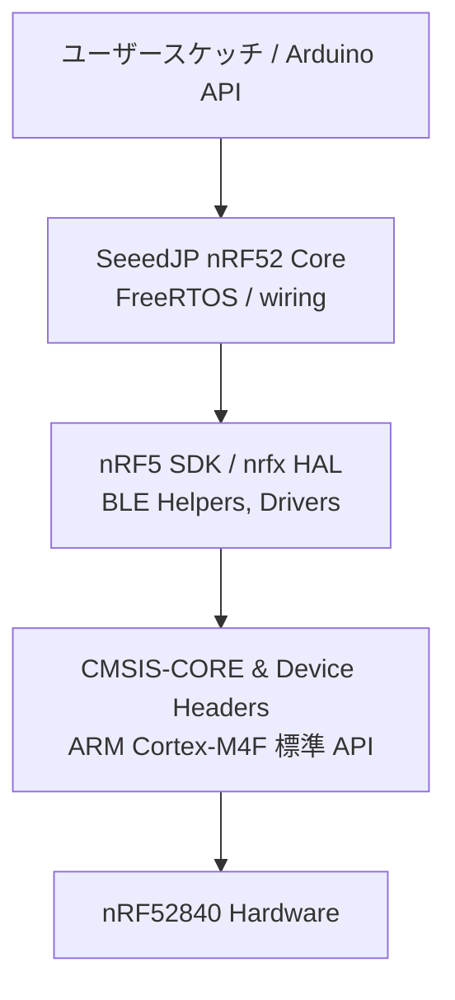
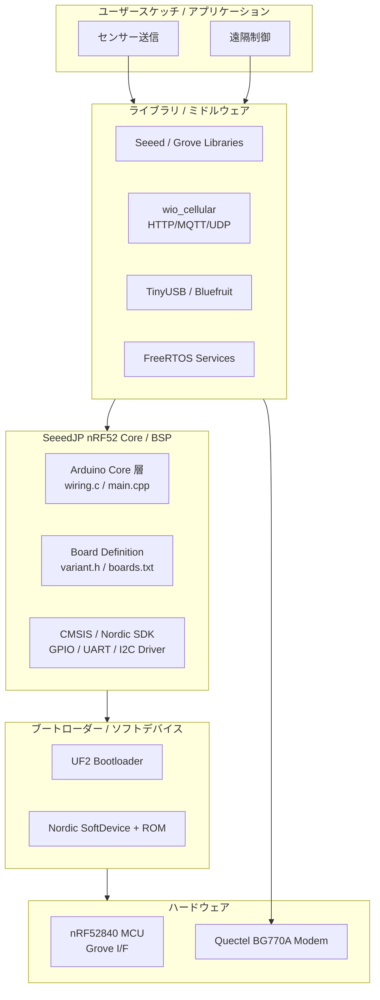

## はじめに

Seeed Studio Wio BG770A（以下 Wio BG770A）は LTE-M と NB-IoT に対応したクアルコム系モデム BG770A を搭載するマイコンボードです。SORACOM Air for Cellular を組み合わせることで、屋外でも安定した遠隔監視やメッセージングが可能になります。本記事では必要な機材から SORACOM コンソール設定、簡単なセンサーデータ送信、可視化までを順に紹介し、初めての方でも動作確認までを完了できるようにします。

## ハードウェア概要

まずは役割分担だけ押さえておきましょう。センサーは Grove -> nRF52840 -> BG770A（LTE）という流れでクラウドへ届きます。

- **アプリケーション MCU（nRF52840）**: Arduino/FreeRTOS アプリ、Grove 入力、USB ログを担当。
- **セルラーモデム（Quectel BG770A-GL）**: LTE-M / NB-IoT 接続と TCP/HTTP/MQTT を内蔵、AT コマンドで制御。
- **電源/アンテナ**: TPS62148 系 DC-DC で USB/バッテリーを自動切替、u.FL コネクタで LTE アンテナを外付け。

操作できる主要インターフェースを表にまとめました。

| インターフェース | 役割 | 備考 |
| --- | --- | --- |
| USB Type-C | 電源供給 / UF2 書き込み / シリアルモニタ | 2 系統 CDC（Arduino ログ / AT ポート） |
| Grove コネクタ x4 | センサー・アクチュエータ接続 | I2C / UART / Analog / Digital を割り当て済み |
| u.FL LTE アンテナ端子 | LTE-M / NB-IoT 通信 | 外付けアンテナ必須 |
| Li-Po バッテリー端子 (JST-PH) | バッテリー駆動 | USB と自動切替 |
| SWD パッド | nRF52840 デバッグ / 書き込み | J-Link 等で利用 |
| Nano SIM スロット / eSIM | SORACOM Air SIM 搭載 | plan-D などを挿入 |

これだけ把握しておけば、配線や操作対象を迷わずセットアップできます。

### 電源系統のポイント

- USB Type-C（5V）と Li-Po（3.7V）の入力は電源マネージャで自動切替され、TPS62148 ベースの DC-DC が 3.3V/1.8V を生成します。
- nRF52840／Grove 周辺は 3.3V レール、BG770A のベースバンドは 1.8V 系を使用します。送信時はピーク 500mA 程度流れるため、USB ポートやバッテリーの供給能力を確保してください。
- Grove 電源のオン/オフは `PIN_VGROVE_ENABLE` を `VGROVE_ENABLE_ON/OFF` に合わせて制御します（`variant.h` に定義）。`PIN_VDD_EXT` はモデム側の入力ピンなので `digitalWrite()` では扱いません。
- 省電力運用では BG770A の PSM/eDRX と nRF52840 の低消費電力モードを併用し、Li-Po の保護回路（NTC など）が機能しているかも確認しましょう。

## Wio BG770Aのアーキテクチャ

Wio BG770A は Arduino 互換 MCU とセルラーモデムを分離した二層構造で、センサーデータは `Grove -> nRF52840 -> UART ブリッジ -> BG770A -> LTE-M -> SORACOM` という順に流れます。アプリ MCU 側はロジック・省電力制御・センサー集約を担い、BG770A 側がキャリア接続と TCP/HTTP を処理します。

この構成により、センサーデータは `Grove -> nRF52840 -> UART ブリッジ -> BG770A -> LTE-M -> SORACOM` という流れでクラウドに到達します。アプリケーション MCU 側で TLS を実装する代わりに、AT コマンドで BG770A のネイティブ HTTP/MQTT クライアントを呼び出すこともでき、用途に応じて役割を分担できます。

### ハードウェアブロックの詳細

- データプレーン: Grove から取得した I2C/UART/ADC 信号は nRF52840 の GPIO に集約され、`Serial1`（UART）経由で BG770A に転送されます。BG770A には Qualcomm 9205 系のセルラー向け SoC が内蔵され、モデム内部ファームが LTE-M/NB-IoT スタックを実装しています。
- マネジメントプレーン: USB Type-C は 2 系統の CDC デバイスを公開し、1 つは Arduino スケッチのログ、もう 1 つは BG770A の AT ポートへルーティングされます。SWD パッドを使えば nRF52840 を直接デバッグできます。
- 電源系: TI の TPS62148 ステップダウン型 DC-DC などの電源回路が USB／Li-Po を自動切替し、3.3V/1.8V のデュアルレールを生成します。BG770A には RF フロントエンド用に別系統の LDO があり、送信ピーク 500mA を確保するために大容量コンデンサが配置されています。
- RF/アンテナ: メイン LTE アンテナは u.FL、GNSS 用フットプリントは未実装ながらパッドが用意され、外付けアクティブアンテナを追加できます。アンテナ周辺には GND スロットが刻まれ、人体装着時でも VSWR が安定します。

## ソフトウェアスタック

ハードウェア同様、ソフトウェアも「ブートローダー → Arduino/FreeRTOS コア → ライブラリ → ユーザースケッチ」の積み木になっています。どこで何が動いているかを先に押さえておくと、PlatformIO/Arduino IDE でのビルドやデバッグ時に迷いません。

Arduino IDE から見ると、以下の順でソフトウェアが積み上がっています。



### ファームウェアアーキテクチャの詳細

Wio BG770A のソフトウェアスタックは、Nordic SoC と Quectel モデムを別プロセッサとして扱う多層構造です。ROM/SoftDevice が BLE と低レベル初期化を担当し、その上で UF2 ブートローダーが UF2 ファイルを書き込み、GitHub の [SeeedJP/Adafruit_nRF52_Arduino](https://github.com/SeeedJP/Adafruit_nRF52_Arduino)（FreeRTOS/TinyUSB/Bluefruit を含むコア）が Arduino API を提供します。`wio_cellular` や Grove ライブラリはこのコアの上で動き、最終的にユーザースケッチが AT コマンドで BG770A を制御します。

#### nRF5 SDK と CMSIS の位置づけ

Arduino コアの下では、Nordic が提供する nRF5 SDK と ARM 標準の CMSIS が階層的に組み合わさっています。



- **CMSIS 層**: `core_cm4.h` や `nrf52840.h` によってレジスタや NVIC を定義し、Cortex-M の基本 API を提供します。
- **nRF5 SDK / nrfx HAL**: CMSIS のレジスタ定義を利用した Nordic 独自ドライバ群（GPIO/UART/I2C など）や BLE/Middleware を提供します。
- **SeeedJP nRF52 Core**: Arduino API、FreeRTOS、TinyUSB などをまとめ、上位アプリから SDK/HAL を透過的に使えるようにしています。

この積み木構造により、ユーザースケッチは Arduino API を書くだけで、裏では CMSIS → nRF5 SDK → ハードウェアへの制御が順番に呼び出されます。

### Arduinoが呼び出すライブラリスタック

Arduino スケッチから BG770A のモデムや周辺機能を操作するまでの呼び出し階層は次のとおりです。

```
User Sketch (setup/loop, FreeRTOS task)
 ├─ Seeed/Grove Libraries (Seeed_BME280, Grove_* など)
 │   └─ Wire/SPI/UART API (Arduino HAL)
 ├─ wio_cellular (HTTP/MQTT/UDP helper, power state helper)
 │   └─ HardwareSerial SerialBG77 (UART bridge)
 ├─ Adafruit_TinyUSB / Bluefruit (USB CDC, BLE stack)
 │   └─ SeeedJP nRF52 Core (variant pins, drivers, Arduino API)
 │       └─ Nordic SDK + CMSIS + FreeRTOS
 │           └─ SoftDevice (BLE stack) + UF2 bootloader
 └─ BG770A AT firmware (Quectel RTOS)  ← UART 経由
```

ポイント:

- ユーザースケッチは標準の Arduino API を呼び出し、その下で SeeedJP nRF52 コアがピン定義やクロック設定を解決します。
- Grove 系ライブラリは `Wire.h`/`SPI.h`/`HardwareSerial` を通じて nRF52840 のペリフェラルへアクセスし、`variant.h` のマッピングに従ってピン番号を解決します。
- セルラー通信は `wio_cellular` が AT コマンドを生成し、`SerialBG77` を介して BG770A モデムへ送信します。応答解析や再接続処理もライブラリ側で吸収されます。
- USB/BLE 関連は Adafruit が提供する TinyUSB・Bluefruit コンポーネントを SeeedJP コアが取り込み、Arduino 側からは `Serial` や `BLEPeripheral` といった高水準 API で扱えます。
- 最下層の BG770A モデムは Quectel のリアルタイム OS で実行され、SORACOM との通信確立や省電力設定は AT コマンド経由で制御されます。

| レイヤー | 役割 |
| --- | --- |
| User Sketch / Seeed/Grove Libraries | `setup()/loop()` と Grove 用ライブラリがアプリロジックを実装し、`Wire/SPI/UART` など Arduino HAL 経由でペリフェラルを呼び出します。 |
| wio_cellular + SerialBG77 | HTTP/MQTT/UDP ヘルパーや省電力 API を提供し、最終的に `HardwareSerial SerialBG77` を通じて AT コマンドを BG770A へ送ります。 |
| TinyUSB / Bluefruit | USB CDC や BLE API を Arduino から利用できるようにするミドルウェアで、ログ出力や BLE アプリを簡単に実装できます。 |
| SeeedJP nRF52 Core | `variant.h`/`boards.txt`、Arduino ランタイム、FreeRTOS、nrfx/CMSIS ドライバを束ね、上位レイヤーに統一 API を提供します。 |
| SoftDevice + UF2 + BG770A ファーム | BLE スタックとブートローダーは MCU に常駐し、BG770A 側は Quectel RTOS が AT コマンドを処理してセルラー接続を担当します。 |

### ライブラリ構造の模式図

上記の関係を図式化すると次のようになります。上に行くほどユーザー実装に近く、下に行くほどハードウェア寄りの層です。



### 階層横断のミニサンプル

以下のスケッチは、Grove センサー値の取得（Seeed ライブラリ）→ USB CDC ログ出力（Adafruit TinyUSB）→ BG770A モデム経由での HTTP POST（wio_cellular）の順に各階層の API を呼び出す最小例です。

```cpp
#include <Seeed_BME280.h>     // Groveセンサー
#include <Adafruit_TinyUSB.h> // USB CDC
#include <WioCellular.h>      // BG770A制御

Seeed_BME280 env;
Adafruit_USBD_CDC usbSerial;
WioCellularTcpClient2<WioCellularModule> tcpClient(WioCellular);

void setup() {
  usbSerial.begin(115200);
  while (!usbSerial) { delay(10); }

  env.init(); // Grove -> Wire -> nRF52840

  WioCellular.begin();        // ボード初期化 (UART/電源経路)
  WioCellular.powerOn();      // BG770A 起動
  WioNetwork.config.apn = "soracom.io";
  WioNetwork.config.searchAccessTechnology = WioCellularNetwork::SearchAccessTechnology::LTEM;
  WioNetwork.begin();         // APN / バンド設定をATコマンドで流し込む
  WioNetwork.waitUntilCommunicationAvailable(60000);
}

void loop() {
  float temp = env.getTemperature();
  float hum  = env.getHumidity();

  usbSerial.printf("temp=%.2f hum=%.2f\n", temp, hum); // TinyUSB -> CDC

  if (tcpClient.open(WioNetwork.config.pdpContextId, "harvest.soracom.io", 80) &&
      tcpClient.waitForConnect()) {
    String payload = String("POST / HTTP/1.1\r\nHost: harvest.soracom.io\r\n"
                            "Content-Type: application/json\r\nContent-Length: 32\r\n\r\n") +
                     "{\"temp\":" + String(temp) + ",\"hum\":" + String(hum) + "}";
    tcpClient.send(payload.c_str(), payload.length());   // wio_cellular -> AT -> BG770A
  }
  tcpClient.close();

  delay(600000);
}
```

上記コードでは Arduino 層（`setup/loop`）から順に Grove ライブラリ → SeeedJP コア → wio_cellular → BG770A モデムの API を通過しており、各レイヤーの役割と呼び出し方を俯瞰できます。

`WioCellularTcpClient2` クラスは WioCellular ライブラリ v0.3.x で提供されており（`src/client/WioCellularTcpClient2.hpp`）、TCP ソケットのオープン/送受信をラップします。

### FreeRTOSサービスの呼び出し例

SeeedJP コアは FreeRTOS 10 を同梱しているため、`loop()` 内で逐次処理する代わりに RTOS のタスクや同期プリミティブを直接呼び出せます。以下の例では、センサー測定タスクとセルラー送信タスクを分離し、キューとミューテックスなど FreeRTOS のサービスを活用しています。

```cpp
#include <FreeRTOS.h>
#include <queue.h>
#include <semphr.h>
#include <Seeed_BME280.h>
#include <WioCellular.h>

struct EnvData { float temp; float hum; };

QueueHandle_t envQueue;
SemaphoreHandle_t modemMutex;
Seeed_BME280 sensor;

void sensorTask(void*) {
  sensor.init();
  while (true) {
    EnvData data{sensor.getTemperature(), sensor.getHumidity()};
    xQueueOverwrite(envQueue, &data);   // 最新値で上書き
    vTaskDelay(pdMS_TO_TICKS(60000));   // FreeRTOS delay
  }
}

void modemTask(void*) {
  EnvData data{};
  while (true) {
    if (xQueueReceive(envQueue, &data, portMAX_DELAY) == pdPASS) {
      if (xSemaphoreTake(modemMutex, pdMS_TO_TICKS(5000)) == pdPASS) {
        // wio_cellular 経由で送信、送信後にミューテックスを開放
        sendToSoracom(data);            // ユーザー定義関数
        xSemaphoreGive(modemMutex);
      }
    }
  }
}

void setup() {
  WioCellular.begin();
  WioCellular.powerOn();
  WioNetwork.begin();

  envQueue = xQueueCreate(1, sizeof(EnvData));
  modemMutex = xSemaphoreCreateMutex();

  xTaskCreate(sensorTask, "sensor", 4096, nullptr, 2, nullptr);
  xTaskCreate(modemTask, "modem", 4096, nullptr, 1, nullptr);

  vTaskDelete(nullptr); // setup() タスクを終了し FreeRTOS スケジューラへ
}

void loop() {
  // FreeRTOS 運用時は loop() を空にするか、必要なら低優先度処理を置く
  vTaskDelay(pdMS_TO_TICKS(1000));
}
```

`sendToSoracom()` は先述の `tcpClient` 実装を関数化した想定です。`FreeRTOS.h` や `queue.h`/`semphr.h` をインクルードすれば、Arduino 環境からでも `xTaskCreate`, `xQueueReceive`, `xSemaphoreTake` などのサービスを直接利用できます。タスクを使う場合はスタックサイズ（ここでは 4096 ワード）や優先度を調整し、長時間処理はタスク間で分散させると BG770A のセルラー処理とセンサー処理を並列に走らせやすくなります。

### FreeRTOSが担う主な役割

Wio BG770A 上の FreeRTOS は以下の機能を担当し、アプリケーション MCU（nRF52840）側の処理を整理しています。

- **タスクスケジューリング**: `setup()` から派生した `loopTask` とユーザーが生成したタスクを優先度付きでスケジューリングし、BG770A への AT 通信やセンサー処理を同時進行させます。
- **同期プリミティブ**: `xSemaphore*`, `xMutex*`, `xTaskNotify*` などでモデムアクセスの排他制御や計測タスクとのハンドオフを実現します。
- **キュー/ストリームバッファ**: センサーデータや AT レスポンスを `xQueueSend`/`xQueueReceive`、`xStreamBufferSend` で受け渡し、オーバーヘッドを抑えたデータ共有を行います。
- **ソフトウェアタイマー**: `xTimerCreate` により周期送信、接続監視、再接続リトライなどのタイミング管理を行い、`delay()` に頼らない非同期実装を可能にします。
- **アイドル処理と省電力協調**: FreeRTOS のアイドルフックや tickless idle を利用して BLE SoftDevice や BG770A の省電力制御と矛盾しないスリープ/ウェイクを手配します。
- **割り込みサービスとの連携**: `FromISR` 系 API で UART/ADC 割り込みからタスク通知を行い、AT 受信やセンサー割り込みを低レイテンシでタスクへ引き渡します。

これらの機能により、ユーザーコードは FreeRTOS が提供するマルチタスク基盤の上で `wio_cellular` や Grove ライブラリを使い分けるだけで、モデム制御・センサー計測・ログ出力を明確に分割できます。

### DFU・ブートローダーとユーザーファームの関係

Wio BG770A（nRF52840）のフラッシュは大きく「Boot ROM/SoftDevice」「UF2 ブートローダー」「ユーザーファーム」の 3 層構成です。Arduino／PlatformIO がビルドするのは最上位のアプリケーション領域のみで、下位レイヤーは工場出荷時に書き込まれたまま利用します。

- **Boot ROM & SoftDevice**: Nordic が提供する ROM コードと SoftDevice S140 が最下層に常駐し、BLE スタックやセキュリティ資源を管理します。この領域は通常書き換えません。
- **UF2 ブートローダー**: Seeed/Adafruit 系の UF2 ブートローダーが SoftDevice の直後に配置され、USB MSC（`WIO_BG770A` ドライブ）としてマウントされます。`*.uf2` ファイルをコピーするとブートローダーがユーザ領域へ書き込みます。PlatformIO/Arduino の「Upload」はこのブートローダーに依存しており、`firmware.uf2` を生成して転送するだけです。
- **ユーザーファーム（Arduino/PlatformIO ビルド成果物）**: `setup()/loop()`、FreeRTOS タスク、`wio_cellular` など全てのユーザコードがここに展開されます。リンカスクリプトはベクタテーブルを `0x26000`（例）以降に再配置し、ブートローダーはこの領域の CRC を検証してから実行を移譲します。

DFU（Device Firmware Update）フローは次の通りです。

1. アプリケーションが `NVIC_SystemReset()` またはリセットボタン 2 回押しでブートローダーモードに入る。
2. UF2 ブートローダーが USB MSC で待機し、コピーされた UF2 ファイル（実体は 256 バイトブロックのリロケータブル BIN）をフラッシュに書き込む。
3. 書き込み完了後、自動リセットして新しいユーザーファームを SoftDevice 上で起動。

コマンドラインで nRFUtil を使った DFU（`.zip` パッケージ経由）も可能ですが、日常的な開発では UF2 コピーが最も簡単です。Bootloader/SoftDevice を誤って消さない限り、ユーザーファームを失敗しても再び UF2 をコピーするだけで復旧できます。逆にブートローダーを更新したい場合は J-Link などで SWD 書き込みを行う必要があるため、一般的な開発では触れないようにしましょう。

- Boot ROM / SoftDevice: nRF52840 の ROM で BLE stack（SoftDevice S140）と初期化コードが動作し、ハードウェアの基本的な権限を管理します。
- UF2 ブートローダー: Seeed 独自の UF2 対応ブートローダーが搭載され、USB MSC と CDC 経由で書き込み可能です。必要に応じて SWD で `nrfjprog` から直接書き込むこともできます。
- Arduino Core + FreeRTOS: `~/Library/Arduino15/packages/SeeedJP/hardware/nrf52/<version>/` に展開される SeeedJP nRF52 コアは Adafruit_nRF52_Arduino ベースで、FreeRTOS 10 が `loopTask` とシステムタスクをスケジューリングします。BLE を使う場合は SoftDevice と FreeRTOS が `app_sched` で仲介します。
- Board Support Package: `variants/Seeed_Wio_BG770A/variant.h` でピンマップ、`boards.txt` でクロック/USB 設定が定義されます。Grove ポートの「D30/A6/P0.30」のような多重ラベルはこのファイルに基づきます。
- ライブラリ層: `wio_cellular` が BG770A の AT コマンドをラップし、HTTP/MQTT/UDP の簡易 API や省電力設定（PSM/eDRX）ヘルパーを提供します。TinyUSB/Adafruit_TinyUSB は USB CDC/MassStorage を司り、センサー用には `Seeed_BME280` や `Grove_Temperature_And_Humidity_Sensor` などの Arduino ライブラリを併用します。
- ユーザースケッチ: `setup()` と `loop()` が FreeRTOS のタスクとして実行され、BG770A とは `SerialBG77`（実体は HardwareSerial）経由または `wio_cellular` の高級 API で通信します。複数スレッドが必要なときは `xTaskCreate` を呼び出して FreeRTOS タスクを追加します。

SeeedJP コアが Adafruit_nRF52_Arduino から派生しているため、Adafruit がメンテナンスする TinyUSB、Bluefruit（BLE）スタック、`Adafruit_TinyUSB` ユーティリティの多くをそのまま利用できます。ドキュメントやサンプルは Adafruit の nRF52 ボード向け資料と互換性が高く、Wio BG770A 専用のボード定義と `wio_cellular` ライブラリを組み合わせることで Seeed 向けに最適化されています。

BG770A モデム内部は Quectel 独自のリアルタイム OS で動作し、`AT+QCFG`, `AT+QHTTPPOST`, `AT+QLWEVTIND` などの AT コマンドで機能を公開します。アプリケーション MCU 側が接続状態を制御し、SORACOM 側の SIM グループポリシーと組み合わせることで、通信・電力・セキュリティ要件を段階的に満たせます。

## Wio BG770AとSORACOMの組み合わせの特徴

- LTE-M（Cat-M1）対応: SORACOM Air plan-D / plan-K2 / plan-US などのマルチバンド SIM で広域カバレッジを得られます。
- 超低消費電力: eDRX や PSM を設定することで乾電池駆動の遠隔ノードにも適します。
- マイコンとモデムが分離: Arduino 環境からコードを書き込み、BG770A へ AT コマンドで細かい制御ができます。
- SORACOM プラットフォーム連携: Beam/ Funnel/ Harvest Data を利用するとクラウド連携やダッシュボード化が簡単です。

## 必要なもの

- Wio BG770A 本体（付属 LTE アンテナおよび Grove ケーブル）
- USB Type-C ケーブル（データ通信対応）
- SORACOM Air for Cellular SIM（plan-D D-300 推奨）と管理用の SORACOM アカウント
- センサーモジュール（例: Grove - Temperature & Humidity Sensor）
- macOS または Windows PC（Arduino IDE 2.x もしくは PlatformIO をインストール可能なもの）
- ネットワーク設定を共有するためのインターネット接続

## 全体フロー

1. SORACOM コンソールで SIM を登録し、APN やグループ設定を行います。
2. 開発 PC にドライバとツールチェーン（Arduino CLI/IDE、Seeed ボードパッケージ）をセットアップします。
3. センサーを接続し、サンプルスケッチを Wio BG770A に書き込みます。
4. デバッグポートから AT コマンドでネットワーク状態を確認し、セルラー接続を確立します。
5. SORACOM Harvest Data や Lagoon でアップロードされたデータを可視化し、動作検証を行います。

## SORACOM側の準備

1. コンソール（https://console.soracom.io ）にログインし、`SIM 管理` で IoT SIM を登録します。IMEI をタグに残しておくと棚卸しが容易です。
2. 新しいグループを作成し、`基本設定` で APN を `soracom.io`、ユーザー名 `sora`、パスワード `sora` に設定します。
3. `SORACOM Beam` を有効化しておくと、デバイスから HTTPS を直接書かなくてもセキュアなエンドポイントへフォワードできます。今回は `Harvest Data` を有効化し、短期間のデータ保存を確認します。
4. `SIM 管理` 画面で対象 SIM を選択し、作成したグループへ紐付けます。CLI でタグ付けする場合は以下のように実行します。

```bash
soracom sims update --imsi 123456789012345 --tags '{"device":"wio-bg770a","owner":"lab"}'
```

## 開発環境セットアップ

1. Arduino IDE 2.x もしくは `arduino-cli` をインストールします。CLI 利用例:

```bash
brew install arduino-cli
arduino-cli config init
arduino-cli core update-index
arduino-cli core install Seeeduino:nrf52
```

2. Seeed Studio の BSP には Wio BG770A ボードが含まれます。IDE では「ボードマネージャー」で `Seeed nRF52 Boards` を検索してインストールしてください。
3. シリアルドライバ（macOS の場合は CDC デバイス）が自動認識されないときは、`/dev/cu.wioBG770A` のようなデバイス名を確認して追加ドライバを導入します。
4. 付属センサーを Grove ポートへ接続し、`Tools > Board` で Wio BG770A を選択、`Tools > Port` で USB シリアルを指定します。

### VS Code + PlatformIOを利用する場合

VS Code をメイン環境にしたい場合は PlatformIO IDE 拡張を入れるとビルド／アップロードが一貫します。

1. VS Code に「PlatformIO IDE」拡張を追加し、`PIO Home > Platforms > Embedded` から `Nordic nRF52` プラットフォームをインストールします（最新 `platform = nordicnrf52@>=11` には Seeed Wio BG770A のボード定義が含まれます。古い環境では `platform_packages` へ `framework-arduinoadafruitnrf52@>=1.110.0` を追加し、SeeedJP が公開している `seeed_wio_bg770a.json` を `~/.platformio/platforms/nordicnrf52/boards/` に配置してください）。
2. `pio project init --board seeed_wio_bg770a --project-option "framework=arduino"` で新規プロジェクトを生成し、`lib_deps` に必要ライブラリを追加します。
3. Wio BG770A は UF2 ドラッグ＆ドロップで書き込むため、`upload_protocol = custom` と `upload_command` を設定し、ビルド後に自動コピーさせます（もしくは `.pio/build/wio_bg770a/firmware.uf2` を手動で USB ドライブへコピー）。
4. `PlatformIO: Build`、`PlatformIO: Upload`、`PlatformIO: Monitor` コマンドでビルド／転送／モニタを行い、`monitor_speed = 115200` を指定します。

`platformio.ini` の例:

```ini
[env:wio_bg770a]
platform = nordicnrf52@11.0.0
board = seeed_wio_bg770a
framework = arduino
monitor_speed = 115200
build_flags =
  -DARDUINO_WIO_BG770A
lib_deps =
  SeeedJP/WioCellular@^0.3.13
  Seeed Studio/Seeed BME280@^1.1.0
upload_protocol = custom
upload_command = cp $SOURCE /Volumes/WIO_BG770A/WIO_BG770A.uf2
```

macOS の場合は Wio BG770A を USB 接続すると `WIO_BG770A` というボリュームが自動マウントされるので、そのパスを `upload_command` に指定します。Windows では `upload_command = copy /Y $SOURCE E:\` のようにドライブレターを合わせてください。`pio run -t build` で生成される `firmware.uf2` を手動コピーする運用でも構いません。

## ファームウェア例: 温湿度データをSORACOMへ送信

以下は 10 分おきに温湿度を計測し、BG770A モデム経由で HTTP POST するサンプルです。`https://harvest.soracom.io` に送信された JSON は後ほど Harvest Data で参照できます。

```cpp
#include <Seeed_BME280.h>
#include <HTTPClient.h>

Seeed_BME280 bme;
const char* endpoint = "http://harvest.soracom.io";

void setup() {
  Serial.begin(115200);
  bme.init();
}

void loop() {
  float temp = bme.getTemperature();
  float hum = bme.getHumidity();

  HTTPClient http;
  http.begin(endpoint);
  http.addHeader("Content-Type", "application/json");
  String payload = String("{\"temp\":") + temp + ",\"hum\":" + hum + "}";
  int code = http.POST(payload);
  Serial.printf("POST status: %d\n", code);
  http.end();

  delay(600000); // 10 minutes
}
```

ライブラリの依存解決には `arduino-cli lib install Seeed_BME280` を利用すると便利です。頻繁に送信する場合は省電力のために送信間隔を延ばし、PSM を組み合わせてください。

## デバイスのセルラー設定と確認

Wio BG770A にはアプリケーション MCU から BG770A へ AT コマンドをブリッジするファームが入っています。USB を PC に接続し、シリアルターミナル（115200 bps）で以下のように確認します。

```bash
screen /dev/tty.usbmodem14101 115200
AT
OK
AT+CGDCONT=1,"IP","soracom.io"
OK
AT+COPS?
+COPS: 0,0,"44010",7
OK
AT+CSQ
+CSQ: 18,99
OK
AT+CMEE=2
```

`AT+QIACT=1` で PDP コンテキストを有効化したあと、`AT+QHTTPPOST` などを使えば直接 HTTP 送信もできます。BG770A 固有の省電力設定は `AT+CEDRXCFG` や `AT+QPSMS` で制御します。

## データ確認と可視化

Harvest Data を有効化している場合は、コンソールの `Harvest Data` 画面から SIM を選択すると直近 40 日までのデータを確認できます。CLI で取得したい場合は API を呼び出します。

```bash
curl -X GET "https://api.soracom.io/v1/data/123456789012345?limit=5" \
  -H "X-Soracom-API-Key: <API_KEY>" \
  -H "X-Soracom-Token: <TOKEN>"
```

よりリッチな可視化が必要なときは Lagoon プロジェクトを作成し、データソースに Harvest Data を指定してパネルを作成します。しきい値や地図表示を付けることで監視しやすくなります。

## 検証シナリオ

- SIM を有効化した直後は `AT+CGATT?` が `1` になるまで待機し、Attach 状態を確認します。
- ネットワーク品質は `AT+CSQ`（RSSI）と `AT+CESQ`（RSRQ/RSRP）で観測し、アンテナの向きを調整します。
- アプリケーションからの送信ログと Harvest Data 上の受信タイムスタンプを比較し、遅延や欠損がないかを確認します。
- 省電力モードを設定した後は `AT+QPSMS?` の応答でサイクルが正しく反映されているかを検証します。
- SORACOM コンソールの `イベントハブ` を有効化し、接続や切断イベントが期待どおりに発生するかをチェックします。

## トラブルシュート

- アタッチ失敗: SIM が別グループに紐付いている、または IMEI ロックが有効になっているケースがあります。`SIM 管理 > 詳細` で状態を確認し、不要な制限を解除します。
- PDP コンテキストエラー: `AT+CGDCONT` の APN や `AT+QCFG="band"` の設定が不一致だと `+CME ERROR: 100` になります。APN を `soracom.io`、認証情報を `sora/sora` に揃えてください。
- HTTP POST がタイムアウトする: 送信間隔が短すぎてキャリアの再送制限に抵触することがあります。ハートビートとバルク送信を分け、`AT+QIACT` を必要なときだけ有効化します。
- ファーム書き込みが失敗する: USB ハブ経由だと電力不足になりやすいので、PC 本体のポートへ直接接続します。`Tools > Port` が表示されない場合はケーブルが充電専用でないか確認します。
- センサー値が NaN になる: Grove ケーブルの接続ミスや I2C アドレス競合が原因です。別のポートへ差し替え、ライブラリで `bme.begin(0x76)` のようにアドレスを指定します。

## コストとセキュリティのポイント

- plan-D D-300 SIM の基本料金に加え、Harvest Data 利用時は 1 SIM あたり 5 円/日が加算されます。商用監視では Beam or Funnel で外部クラウドへ集約した方が安価です。
- BG770A の IMEI を SORACOM コンソールにタグ付けしておくと、紛失時にアクセスログを追跡しやすくなります。
- Beam 経由の HTTPS 転送では TLS 終端を SORACOM 側に任せられるため、デバイスに証明書を配布せずにセキュリティを維持できます。
- Lagoon ダッシュボードを共有する場合は閲覧専用ユーザーを作成し、API キーを個人ごとに発行します。
- OTA 更新や遠隔制御を行う際は、SORACOM Napter などのオンデマンドリモートアクセス機能を使い、不要時はセッションを閉じて攻撃面を狭めます。

## まとめ

Wio BG770A は LTE-M と NB-IoT の両方をサポートし、SORACOM のセルラー回線と管理機能を組み合わせることで迅速に IoT プロトタイプを構築できます。SIM 登録、ボードセットアップ、サンプルスケッチ、Harvest Data での検証までを一度経験しておけば、実運用では Beam や Funnel を追加するだけでクラウド連携を拡張できます。まずは本記事の手順で接続までを確実に成功させ、用途に応じて省電力設定や可視化を発展させてください。
