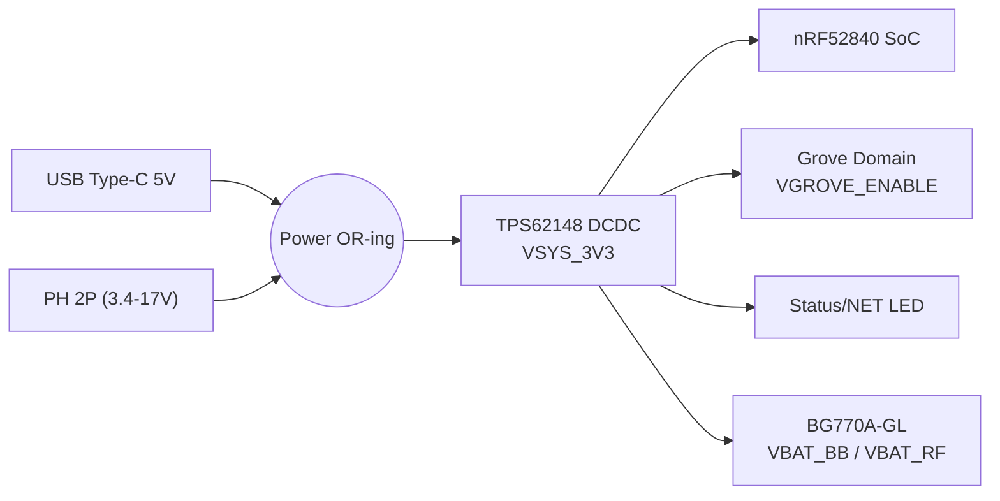
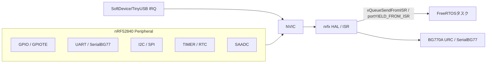

:::message
「[一般消費者が事業者の表示であることを判別することが困難である表示](https://www.caa.go.jp/policies/policy/representation/fair_labeling/guideline/assets/representation_cms216_230328_03.pdf)」の運用基準に基づく開示: この記事は記載の日付時点で[株式会社ソラコム](https://soracom.jp/)に所属する社員が執筆しました。ただし、個人としての投稿であり、株式会社ソラコムとしての正式な発言や見解ではありません。
:::

:::message
本記事は[積みボード/デバイスくずしAdvent Calendar 2025](https://qiita.com/advent-calendar/2025/tsumiboard)の1日目の記事です。
日頃積んだままになっているIoTデバイスに電源とSIMを入れて動かしつつ、今度もう一度動かしたくなったときにすぐ動かせるようにするための手順やノウハウをまとめ超個人的な備忘録です。
:::

## はじめに

今回引っ張り出してきたボードは Seeed Studio の [Wio BG770A Cellular IoT 開発ボード](https://www.seeedstudio.com/Wio-BG770A-Cellular-IoT-Development-Board-p-5525.html) で、Quectel 製 BG770A-GL LTE モデムと Nordic nRF52840 を搭載したセルラー IoT デバイスです。
このデバイスは昨年（2024年）に大流行していて、色んな人が記事を書いているためもう何番煎じかもわからないくらいですが、せっかく動かしたので書きます。
同じことを違う人の視点でまとめることでも、新たな発見があるかもしれませんし、インターネッツに記事が溢れているということはそれだけでこのデバイスのためにもなると思うので。

今日の内容はseeedstudioの公式wikiにある内容とほぼ同等で、私が実際に動かすにあたって注意したり気になったポイントや補足情報を加えたものになります。

このデバイスの記事の構成をフォーマットにして、他の積みデバイスでも同じようにまとめていく予定です。

それではやっていきましょう。

## ハードの概要を知る

基本的な情報は[公式のwikiのハードウェアマニュアル](https://seeedjp.github.io/Wiki/Wio_BG770A/hardware)に掲載されています。
見た目はこんな感じです。


まずは動かす前に、Wio BG770A のハードウェア構成ざっくり把握しましょう。
話はそれからです。

### ブロックダイアグラム

ブロック図を見てみましょう。


https://seeedjp.github.io/Wiki/Wio_BG770A/hardware より転載

ブロック図から読み取れるポイントは三つあります。
まず、USB Type‑C／PH からの電源は DCDC を経由して VSYS_3V3 (3.3V) に変換され、nRF52840 と Grove ドメインへ共通供給されます。次に、nRF52840 SoC が Grove Digital/Analog/I2C/UART ポートや USB CDC を直接制御し、センサー系の取りまとめ役になっています。最後に、セルラーモジュール BG770A-GL とは UART/DIO で接続され、nRF52840 から AT コマンドを送り出す構造になっています。


| ブロック | 役割 |
| --- | --- |
| nRF52840 SoC | Arduino/FreeRTOS アプリを実行し、Grove 各ポートや USB ログ、BG770A への UART を管理します。 |
| Cellular Module BG770A-GL | LTE-M / NB-IoT 接続と TCP/HTTP/MQTT を内蔵し、AT コマンドで制御されます。 |
| 電源ブロック | USB/PH 2P 入力を DC-DC で 3.3V に変換し、Grove や BG770A/SoC に安定供給します。 |
| Grove ドメイン | Digital/Analog/I2C/UART ポートを提供し、`VGROVE_ENABLE` で電源を制御できます。 |
| アンテナ & SIM | u.FL で LTE/GNSS アンテナを外付けし、nanoSIM/eSIM スロットから SORACOM Air SIM を利用します。 |

### インターフェース一覧

コネクタとして外部接続可能なインターフェースは以下のとおりです。

| インターフェース | 役割 | 備考 |
| --- | --- | --- |
| USB Type-C | 電源供給、UF2 書き込み、USB CDC (2 ポート) | 5V 入力は DC-DC で VSYS_3V3 に変換され、図面の DCDC ブロック経由で nRF52840/BG770A へ供給 |
| PH 2P (3.4〜17V) | 外部 DC 電源入力 | USB と同一の VSYS ラインへ OR-ing される |
| Grove Digital (J1) | 汎用 GPIO（D30/D31） | アナログ (A6/A7)でも利用可 |
| Grove Analog (J8) | Analog/DAC（A4/A5） | デジタル (D28/D29)でも利用可 |
| Grove I2C (J6) | I2C バス（SCL/SDA） | デジタル (D4/D5), アナログ (A2/A3)でも利用可 |
| Grove UART (J7) | `Serial1` (TXD/RXD) | デジタル (D13/D14) でも利用可 BG770A とは別の UART |
| SIM スロット / eSIM | SORACOM Air SIM | nanoSIM |
| LTE アンテナ (u.FL) | LTE-M/NB-IoT 用外付けアンテナ | 付属のPCBアンテナ |
| GNSS アンテナ (u.FL) | BG770AのGNSS用アンテナ | LTEとは排他で利用可能 |
| SWD (TC2030, 2x10) | nRF52840 デバッグ/書き込み | J-Link 等で利用 |

### 電源構成

USB Type-C（5V）と PH 2P（3.4〜17V）の入力はダイオードの突き合わせによる電源 OR-ing 回路で自動切替され、TPS62148 ベースの DC-DC が 3.3V を生成しているようです。
内部デバイスへの電源供給は3.3V系できれいに統一されています。
groveへの電源供給は、`VGROVE_ENABLE` ピンで制御できるようになっており、省電力運用時にセンサー群の電源を落とすことが可能。省電力考えられてる。




## ソフトウェアアーキテクチャの詳細

ライブラリ周りをざっくり把握しましょう。

### ソフトウェアスタック


青枠が IDE でコンパイルされるレイヤー、白枠（SoftDevice/UF2）は MCU にプリインストール済みのバイナリ層です。

| レイヤー | 役割 |
| --- | --- |
| User Sketch | `setup()/loop()` や自作ライブラリ。`wio_cellular`、Grove API を通じてハードを制御するアプリ本体。 |
| Arduino Core (SeeedJP/Adafruit_nRF52_Arduino) | `pinMode`, `Serial`, TinyUSB, Bluefruit など Arduino API を提供するランタイムとボード設定。 |
| Real-time OS (FreeRTOS) | `loop()` をタスク化し、複数タスク・同期プリミティブ・タイマを提供する。 |
| nrfx HAL / CMSIS | Nordic の `nrfx` ドライバと ARM CMSIS により UART/I2C/GPIO などを抽象化。 |
| Nordic SDK コンポーネント | nrfx 以外の補助ライブラリ（例: nrf_log、BLE helper、Flash Data Storage など）を指し、Arduino Core から必要に応じてリンクされる。 |
| SoftDevice (BLE stack) | Nordic 純正の BLE スタック。バイナリ提供で、アプリは API を呼び出すだけ。 |
| UF2 Bootloader | USB ドラッグ＆ドロップで `.uf2` を書き込むためのブートローダー。 |

```text
User Sketch (setup/loop, FreeRTOS task)
 ├─ Seeed/Grove Libraries (Seeed_BME280, Grove_* など)
 │   └─ Wire/SPI/UART API (Arduino HAL)
 ├─ wio_cellular (HTTP/MQTT/UDP helper, power state helper)
 │   └─ HardwareSerial SerialBG77 (UART bridge)
 ├─ Adafruit_TinyUSB / Bluefruit
 │   └─ SeeedJP nRF52 Core
 │       └─ nrfx HAL / CMSIS
 └─ SoftDevice + UF2 (MCU 常駐)
 └─ BG770A AT firmware (Quectel RTOS)  ← UART 経由
```

上のスタック図と同じく、ユーザースケッチが呼び出すライブラリ（Grove, `wio_cellular`）が順に Arduino HAL、SeeedJP nRF52 Core、nrfx/CMSIS を経由し、最終的には UART（`SerialBG77`）から BG770A の AT ファームウェアに到達する関係を示しています。TinyUSB/Bluefruit は USB/BLE 用のミドルウェアとして Core に同梱され、必要に応じて `Serial` や `BLEPeripheral` API を提供します。SoftDevice と UF2 ブートローダーは MCU に常駐しており、BLE 通信と書き込み処理を支えています。

### FreeRTOS タスク設計概要

FreeRTOSがどのようにArduinoスケッチを動かしているか、基本的なタスク設計のポイントを押さえましょう。

ソースをざっと見た感じ、以下のような特徴があります。

- `setup()` 実行後に FreeRTOS スケジューラが起動し、`loopTask`（優先度 1）が `loop()` を繰り返し呼び出す。`FreeRTOSConfig.h` で `configMAX_PRIORITIES=5`、`configTIMER_TASK_PRIORITY=2`。
- 追加タスクは `xTaskCreate()` で生成し、センサー・通信・監視など役割分担させる。キューやセマフォで同期する。
- `delay()` や `yield()` は `vTaskDelay`／`taskYIELD` を呼ぶため、他タスクへの CPU 譲渡が自動的に行われる。
- 省電力運用では `VGROVE_ENABLE` の制御、PSM/eDRX 設定に加え、FreeRTOS の tickless idle や `vTaskSuspend` を併用して無駄な消費を抑える。

主なFreeRTOSタスクの役割と優先度は以下のとおりです。
| タスク | 優先度(typical) | 役割 |
| --- | --- | --- |
| `loopTask` | 1 (TASK_PRIO_LOW) | `setup()` 後に起動し、ユーザースケッチの `loop()` を繰り返し呼び出すメインタスク。 |
| TinyUSB タスク | 2 | USB CDC/HID/MassStorage の処理。`Serial` を使ったログ出力時に必要。 |
| BLE/Bluefruit タスク | 2 | SoftDevice と連携する BLE イベント処理。 |
| Timer サービス | 2 (`configTIMER_TASK_PRIORITY`) | ソフトウェアタイマや `xTimer*` API のコールバックを処理。 |
| Idle タスク | 0 | システムがアイドル時に実行。tickless idle で省電力に移行。 |
| （ユーザー追加タスク）センサー/通信/監視など | 任意 (例: 2〜3) | `xTaskCreate()` で作成し、用途に応じて優先度を設定。 |

### `xTaskCreate()` について
ユーザー追加タスクは、Arduino スケッチ内で `xTaskCreate()` を使って生成します。例えば、以下のようなタスク設計が考えられます。この辺は実践編で実際に動かしながら確認していきましょう。

| タスク例 | 役割 | 利用ライブラリ / API の例 |
| --- | --- | --- |
| センサー計測タスク | Grove I2C センサー（SCD40 など）を一定周期で読み取り、キューに投入 | `Wire`、各種 Grove ライブラリ |
| 通信タスク | キューからデータを受け取り `wio_cellular` で HTTP/TCP/UDP 送信、再送・再接続を担当 | `WioCellular`, `WioNetwork` |
| GPS/メタデータタスク | UART (SIM28 など) で位置情報や電圧・RTC 時刻を取得し、ペイロードに付加 | `Serial1`, `TinyGPS++` 等 |
| 監視／ウォッチドッグタスク | タスク状態や電圧、イベントを監視し、異常時は再起動・ログ出力を実施 | `xTaskGet*`, `analogRead`, ログ API |
| ログ／ストレージタスク | USB CDC や SD へログ保存、ホストへデバッグ出力 | `Serial`, `TinyUSB`, `SD` |

これらは `xTaskCreate(taskFunc, "name", stackSize, NULL, priority, NULL);` のように生成し、各タスク内で `xQueueSend` などを使って協調します。必要なライブラリはスケッチ側でインクルードし、タスクの中から利用します。

### 割り込みについて

最後に割り込み処理の流れを模式図で示します。



- nRF52840 の各ペリフェラル（GPIO/GPIOTE, UART, I2C/SPI, TIMER/RTC, SAADC など）が NVIC へ IRQ を発行し、`nrfx` HAL が受け取ります。
- `nrfx` からは `xQueueSendFromISR` や `portYIELD_FROM_ISR` で FreeRTOS タスクへ通知し、`SerialBG77` を経由して BG770A の URC も処理します。
- SoftDevice や TinyUSB も内部で IRQ を発生させ、BLE イベントや USB 転送をタスクへ橋渡しします。
- `loop()` 内の API 呼び出しは割り込みではなく通常のタスク処理であり、独自 ISR を使いたい場合は `attachInterrupt()` や `nrfx_*` ハンドラを実装します。


## PlatformIO 環境構築

wioの場合、公式wikiにPlatformIOを使った開発手順が詳しく載っているので、そちらを参考に進めることができます。
https://seeedjp.github.io/Wiki/Wio_BG770A/kb/kb5.html

### VS Code + PlatformIO の導入手順

VS Code の拡張機能から PlatformIO IDE をインストールします。
私の環境は以下のとおりです。
```
MacBook Pro 2022 M2  
macOS Sequoia 15.7.2
Visual Studio Code バージョン: 1.106.2
```

1. 拡張機能ビューで


1. 「PlatformIO IDE」を検索し、インストールボタンを押します。


1. インストールができると、左側のアクティビティバーに グレイ型エイリアンのようなPlatformIO のアイコンが追加されます。


1. PlatformIO アイコンをクリックし、PlatformIO ホームを開きます。


1. 「Create New Project」をクリックします。


1. 「New Project」をクリックして表示されるダイアログで、プロジェクト名（例：20251201wiotest）、ボード：`Nordic nRF52-DK`、フレームワーク：`Arduino` を選択し、「Finish」ボタンを押します。


1. プロジェクトが作成され、ワークスペースが開きます。


1. `platformio.ini` ファイルを開き、以下のように編集します。
    ```ini
    [platformio]
    src_dir = .

    [env:seeed_wio_bg770a]
    platform = https://github.com/SeeedJP/platform-nordicnrf52
    platform_packages =
        framework-arduinoadafruitnrf52 @ https://github.com/SeeedJP/Adafruit_nRF52_Arduino.git
    framework = arduino
    board = seeed_wio_bg770a
    build_flags =
        -DBOARD_VERSION_1_0 ; Board version 1.0
        -DCFG_LOGGER=3      ; 3:None, 2:Segger RTT, 1:Serial1, 0:Serial
        ;-D ENABLE_TRACE    ; Enable trace
        ;-O0                ; No optimization
    lib_archive = no ; https://github.com/platformio/platform-nordicnrf52/issues/119
    ```
    これで PlatformIO のプロジェクト設定は完了です。あとはソースコードを `src` フォルダに配置してビルド・アップロードできます。

1. `/src/main.cpp`を開きます。


1. 以下のサンプルコードをコピー＆ペーストします。
    ```cpp
    /*
     * blink.ino
     * Copyright (C) Seeed K.K.
     * MIT License
     */

    #include <Arduino.h>
    #include <Adafruit_TinyUSB.h>

    void setup() {
    }

    void loop() {
        digitalWrite(LED_BUILTIN, HIGH);
        delay(200);
        digitalWrite(LED_BUILTIN, LOW);
        delay(800);
        }
    ```

1. Wio BG770A を UF2 モードで接続します。
USB接続状態で、resetボタンを2回押すと、UF2モードで接続されます。


1.  ビルドとアップロードを行います。PlatformIO の「Upload」ボタンをクリックします。

左下の→アイコンでもOKです。


1. ビルドとアップロードが成功すると、Wio BG770A の内蔵LEDが点滅し始めます。


## まとめ

ハードの全容と、ソフト設計の勘所が掴めたので、次の基本編では wio_cellular を使って実際に通信やインターフェースを操作する手順と実装 を解説します。
