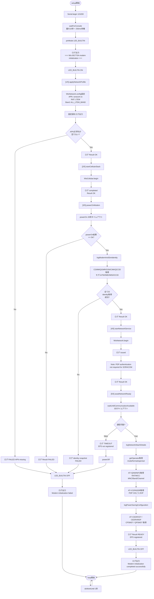

:::message
「[一般消費者が事業者の表示であることを判別することが困難である表示](https://www.caa.go.jp/policies/policy/representation/fair_labeling/guideline/assets/representation_cms216_230328_03.pdf)」の運用基準に基づく開示: この記事は記載の日付時点で[株式会社ソラコム](https://soracom.jp/)に所属する社員が執筆しました。ただし、個人としての投稿であり、株式会社ソラコムとしての正式な発言や見解ではありません。
:::

:::message
本記事は[積みボード/デバイスくずしAdvent Calendar 2025](https://qiita.com/advent-calendar/2025/tsumiboard)の2日目の記事です。
日頃積んだままになっているIoTデバイスに電源とSIMを入れて動かしつつ、今度もう一度動かしたくなったときにすぐ動かせるようにするための手順やノウハウをまとめ超個人的な備忘録です。
:::

## はじめに

概要編で把握したアーキテクチャを前提に、本編では BG770A の初期化、SORACOM への接続、までを一気通貫で整理します。WioCellular/WioNetwork API の呼び出し順を把握しつつ、実機デバッグや省電力の第一歩まで掘り下げていきましょう。

## SORACOM に接続する

### まずはプログラムを動かす

下記の折りたたみを開いてプログラムをコピーしてください。
:::details cellular_basic.ino

```cpp
/*
 * cellular_basic.ino
 * Focused demo that runs only the modem initialization sequence.
 * 
 *
 * Steps:
 *   1. Configure radio profile (APN / RAT / band)
 *   2. Start the WioCellular stack
 *   3. Power on the BG770A module
 *   4. Bring up WioNetwork (PDP context)
 *   5. Wait until the modem reports communication available
 *
 * Each stage emits detailed Serial logs so you can trace failures.
 */

#include <Adafruit_TinyUSB.h>
#include <WioCellular.h>
#include <cctype>
#include <string>
#include <vector>

static constexpr auto SEARCH_ACCESS_TECHNOLOGY =
    WioCellularNetwork::SearchAccessTechnology::LTEM;
static constexpr auto LTEM_BAND = WioCellularNetwork::ALL_LTEM_BAND;
static constexpr int SEARCH_ACCESS_TECHNOLOGY_MODE =
    static_cast<int>(SEARCH_ACCESS_TECHNOLOGY);

static const char APN[] = "soracom.io";
static constexpr int PDP_CONTEXT_ID = 1;
static constexpr int PDP_AUTH_MODE = 2;  // default to CHAP
static constexpr int PDP_AUTH_MODE_QICSGP = PDP_AUTH_MODE;
static const char PDP_AUTH_USER[] = "sora";
static const char PDP_AUTH_PASSWORD[] = "sora";

static constexpr int POWER_ON_TIMEOUT = 1000 * 20;
static constexpr int NETWORK_TIMEOUT = 1000 * 60 * 3;
static constexpr int LOOP_IDLE_MS = 1000;
static constexpr int CONSOLE_WAIT_TIMEOUT = 1000 * 10;

static void waitForConsole();
static void logResult(const char *label, WioCellularResult result);
static bool logModemAndSimIdentity();
static bool logIdentityField(const char *label, WioCellularResult result,
                             const std::string &value);
static bool logNetworkAttachDetails();
static void logPowerSavingConfiguration();
static const char *operatorSelectionModeToString(int mode);
static const char *operatorFormatToString(int format);
static const char *accessTechnologyToString(int act);
static std::string trim(const std::string &text);
static std::vector<std::string> parseQnwinfoFields(const std::string &payload);
static bool applyNetworkProfile();
static bool startCellularStack();
static bool powerOnModem();
static bool startNetworkService();
static bool awaitNetworkReady();
static bool configurePdpAuthentication();

void setup() {
  Serial.begin(115200);
  waitForConsole();
  pinMode(LED_BUILTIN, OUTPUT);

  Serial.println();
  Serial.println("=== Wio BG770A modem initialization ===");

  digitalWrite(LED_BUILTIN, HIGH);
  const bool success = applyNetworkProfile() && startCellularStack() &&
                       powerOnModem() && startNetworkService() &&
                       awaitNetworkReady();
  digitalWrite(LED_BUILTIN, LOW);

  if (success) {
    Serial.println("[INIT] Modem initialization completed successfully.");
  } else {
    Serial.println("[INIT] Modem initialization failed. See logs above.");
  }
}

void loop() {
  WioCellular.doWorkUntil(LOOP_IDLE_MS);
}

static void waitForConsole() {
  const uint32_t start = millis();
  while (!Serial && millis() - start < CONSOLE_WAIT_TIMEOUT) {
    delay(10);
  }
  delay(250);  // allow host to settle before printing first logs
}

static void logStepHeader(const char *title, int stepIndex, int totalSteps) {
  Serial.printf("[INIT][%d/%d] %s\n", stepIndex, totalSteps, title);
}

static bool applyNetworkProfile() {
  logStepHeader("Applying radio profile", 1, 5);
  WioNetwork.config.apn = APN;
  WioNetwork.config.searchAccessTechnology = SEARCH_ACCESS_TECHNOLOGY;
  WioNetwork.config.ltemBand = LTEM_BAND;
  WioNetwork.config.pdpContextId = PDP_CONTEXT_ID;

  Serial.printf("  APN: %s\n", WioNetwork.config.apn.c_str());
  Serial.printf("  Search RAT: %d\n", SEARCH_ACCESS_TECHNOLOGY_MODE);
  Serial.printf("  LTE-M band mask: %s\n",
                WioNetwork.config.ltemBand.c_str());
  Serial.printf("  PDP CID: %d\n", WioNetwork.config.pdpContextId);
  const char *authDescription =
      (PDP_AUTH_MODE == 0)   ? "none"
      : (PDP_AUTH_MODE == 1) ? "PAP"
                             : (PDP_AUTH_MODE == 2) ? "CHAP" : "unknown";
  Serial.printf("  Auth mode: %d (%s), user: %s\n", PDP_AUTH_MODE,
                authDescription, PDP_AUTH_USER);
  const bool validApn = !WioNetwork.config.apn.empty();
  Serial.printf("  Check: APN string is %s\n", validApn ? "set" : "empty");
  Serial.printf("  Result: %s\n", validApn ? "OK" : "FAILED (APN missing)");
  return validApn;
}

static bool startCellularStack() {
  logStepHeader("Booting WioCellular stack", 2, 5);
  WioCellular.begin();
  Serial.println("  WioCellular.begin() completed");
  Serial.println("  Check: API has no status; success assumed if it returns");
  Serial.println("  Result: OK");
  return true;
}

static bool powerOnModem() {
  logStepHeader("Powering on BG770A module", 3, 5);
  Serial.printf("  Timeout: %d ms\n", POWER_ON_TIMEOUT);
  const auto result = WioCellular.powerOn(POWER_ON_TIMEOUT);
  logResult("  powerOn", result);
  const bool powered = result == WioCellularResult::Ok;
  Serial.printf("  Check: WioCellular.powerOn() returned %s\n",
                WioCellularResultToString(result));
  bool identityOk = false;
  if (powered) {
    identityOk = logModemAndSimIdentity();
    Serial.printf("  Check: identity snapshot %s\n",
                  identityOk ? "OK" : "FAILED");
  }
  const bool stepOk = powered && identityOk;
  Serial.printf("  Result: %s\n", stepOk ? "OK" : "FAILED");
  return stepOk;
}

static bool startNetworkService() {
  logStepHeader("Starting WioNetwork service (PDP context)", 4, 5);
  WioNetwork.begin();
  Serial.println("  WioNetwork.begin() issued");
  Serial.println("  Check: API has no status; success assumed if it returns");
  const bool authOk = configurePdpAuthentication();
  Serial.printf("  Check: PDP authentication %s\n",
                authOk ? "OK (at least one command accepted)"
                       : "FAILED (both commands rejected)");
  Serial.printf("  Result: %s\n", authOk ? "OK" : "FAILED");
  return authOk;
}

static bool awaitNetworkReady() {
  logStepHeader("Waiting for communication availability", 5, 5);
  Serial.printf("  Timeout: %d ms\n", NETWORK_TIMEOUT);
  if (!WioNetwork.waitUntilCommunicationAvailable(NETWORK_TIMEOUT)) {
    Serial.println(
        "  Check: waitUntilCommunicationAvailable() returned false");
    Serial.println("  Result: TIMEOUT (EPS not registered)");
    WioCellular.powerOff();
    return false;
  }
  Serial.println("  Check: waitUntilCommunicationAvailable() returned true");
  const bool detailOk = logNetworkAttachDetails();
  Serial.printf("  Check: attachment detail query %s\n",
                detailOk ? "OK" : "FAILED");
  logPowerSavingConfiguration();
  Serial.println("  Result: READY (EPS registered)");
  return true;
}

static void logResult(const char *label, WioCellularResult result) {
  Serial.printf("%s -> %s\n", label, WioCellularResultToString(result));
}

static bool logIdentityField(const char *label, WioCellularResult result,
                             const std::string &value) {
  Serial.printf("    %s -> %s\n", label, WioCellularResultToString(result));
  if (result == WioCellularResult::Ok) {
    Serial.printf("      value: %s\n", value.c_str());
  }
  return result == WioCellularResult::Ok;
}

static bool logModemAndSimIdentity() {
  Serial.println("    Capturing modem/SIM identity...");
  bool ok = true;

  {
    std::string model;
    const auto result = WioCellular.queryCommand(
        "AT+CGMM", [&model](const std::string &response) -> bool {
          model = response;
          return true;
        },
        300);
    ok &= logIdentityField("Modem model (AT+CGMM)", result, model);
  }
  {
    std::string revision;
    const auto result = WioCellular.getModemInfo(&revision);
    ok &= logIdentityField("Firmware revision (AT+QGMR)", result, revision);
  }
  {
    std::string imei;
    const auto result = WioCellular.getIMEI(&imei);
    ok &= logIdentityField("IMEI (AT+GSN)", result, imei);
  }
  {
    std::string imsi;
    const auto result = WioCellular.getIMSI(&imsi);
    ok &= logIdentityField("IMSI (AT+CIMI)", result, imsi);
  }
  {
    std::string iccid;
    const auto result = WioCellular.getSimCCID(&iccid);
    ok &= logIdentityField("ICCID (AT+QCCID)", result, iccid);
  }
  return ok;
}

static bool logNetworkAttachDetails() {
  Serial.println("  Querying operator/band information...");
  bool ok = true;

  {
    int mode = 0;
    int format = 0;
    std::string oper;
    int act = 0;
    const auto result =
        WioCellular.getOperator(&mode, &format, &oper, &act);
    Serial.printf("    getOperator -> %s\n",
                  WioCellularResultToString(result));
    if (result == WioCellularResult::Ok) {
      Serial.printf("      operator: %s\n", oper.c_str());
      Serial.printf("      mode: %d (%s)\n", mode,
                    operatorSelectionModeToString(mode));
      Serial.printf("      format: %d (%s)\n", format,
                    operatorFormatToString(format));
      Serial.printf("      access tech: %d (%s)\n", act,
                    accessTechnologyToString(act));
    } else {
      ok = false;
    }
  }

  {
    std::string payload;
    const auto result = WioCellular.queryCommand(
        "AT+QNWINFO", [&payload](const std::string &response) -> bool {
          if (response.rfind("+QNWINFO:", 0) == 0) {
            payload = response.substr(10);
            return true;
          }
          return false;
        },
        500);
    Serial.printf("    AT+QNWINFO -> %s\n",
                  WioCellularResultToString(result));
    if (result == WioCellularResult::Ok && !payload.empty()) {
      payload = trim(payload);
      Serial.printf("      raw: %s\n", payload.c_str());
      const auto fields = parseQnwinfoFields(payload);
      if (fields.size() >= 1) {
        Serial.printf("      RAT: %s\n", fields[0].c_str());
      }
      if (fields.size() >= 2) {
        Serial.printf("      Operator (MCC/MNC): %s\n", fields[1].c_str());
      }
      if (fields.size() >= 3) {
        Serial.printf("      Band: %s\n", fields[2].c_str());
      }
      if (fields.size() >= 4) {
        Serial.printf("      Channel/Frequency: %s\n", fields[3].c_str());
      }
    } else {
      ok = false;
    }
  }

  return ok;
}

static void logPowerSavingConfiguration() {
  Serial.println("  Querying power-saving configuration...");
  {
    std::string response;
    const auto result = WioCellular.queryCommand(
        "AT+CEDRXS?", [&response](const std::string &res) -> bool {
          if (res.rfind("+CEDRXS:", 0) == 0) {
            response = res;
            return true;
          }
          return false;
        },
        500);
    Serial.printf("    AT+CEDRXS? -> %s\n",
                  WioCellularResultToString(result));
    if (!response.empty()) {
      Serial.printf("      %s\n", response.c_str());
    }
  }
  {
    std::string response;
    const auto result = WioCellular.queryCommand(
        "AT+CEDRXRDP", [&response](const std::string &res) -> bool {
          if (res.rfind("+CEDRXRDP:", 0) == 0) {
            response = res;
            return true;
          }
          return false;
        },
        500);
    Serial.printf("    AT+CEDRXRDP -> %s\n",
                  WioCellularResultToString(result));
    if (!response.empty()) {
      Serial.printf("      %s\n", response.c_str());
    }
  }
  {
    std::string response;
    const auto result = WioCellular.queryCommand(
        "AT+CPSMS?", [&response](const std::string &res) -> bool {
          if (res.rfind("+CPSMS:", 0) == 0) {
            response = res;
            return true;
          }
          return false;
        },
        500);
    Serial.printf("    AT+CPSMS? -> %s\n",
                  WioCellularResultToString(result));
    if (!response.empty()) {
      Serial.printf("      %s\n", response.c_str());
    }
  }
  {
    std::string response;
    const auto result = WioCellular.queryCommand(
        "AT+QPSMS?", [&response](const std::string &res) -> bool {
          if (res.rfind("+QPSMS:", 0) == 0) {
            response = res;
            return true;
          }
          return false;
        },
        500);
    Serial.printf("    AT+QPSMS? -> %s\n",
                  WioCellularResultToString(result));
    if (!response.empty()) {
      Serial.printf("      %s\n", response.c_str());
    }
  }
}

static const char *operatorSelectionModeToString(int mode) {
  switch (mode) {
  case 0:
    return "automatic";
  case 1:
    return "manual";
  case 2:
    return "deregistered";
  case 3:
    return "set only";
  case 4:
    return "manual/automatic";
  default:
    return "unknown";
  }
}

static const char *operatorFormatToString(int format) {
  switch (format) {
  case 0:
    return "long alphanumeric";
  case 1:
    return "short alphanumeric";
  case 2:
    return "numeric (MCCMNC)";
  default:
    return "unknown";
  }
}

static const char *accessTechnologyToString(int act) {
  switch (act) {
  case 0:
    return "GSM";
  case 1:
    return "GSM Compact";
  case 2:
    return "UTRAN";
  case 3:
    return "GSM w/EGPRS";
  case 4:
    return "UTRAN w/HSDPA";
  case 5:
    return "UTRAN w/HSUPA";
  case 6:
    return "UTRAN w/HSDPA+HSUPA";
  case 7:
    return "E-UTRAN (LTE)";
  case 8:
    return "E-UTRAN (NB-IoT)";
  case 9:
    return "E-UTRAN (LTE-M)";
  default:
    return "unknown";
  }
}

static std::string trim(const std::string &text) {
  size_t start = 0;
  while (start < text.size() &&
         std::isspace(static_cast<unsigned char>(text[start]))) {
    ++start;
  }
  size_t end = text.size();
  while (end > start &&
         std::isspace(static_cast<unsigned char>(text[end - 1]))) {
    --end;
  }
  return text.substr(start, end - start);
}

static std::vector<std::string> parseQnwinfoFields(
    const std::string &payload) {
  std::vector<std::string> fields;
  std::string current;
  bool inQuote = false;
  for (char ch : payload) {
    if (ch == '"') {
      inQuote = !inQuote;
      continue;
    }
    if (ch == ',' && !inQuote) {
      fields.push_back(trim(current));
      current.clear();
    } else {
      current.push_back(ch);
    }
  }
  if (!current.empty()) {
    fields.push_back(trim(current));
  }
  return fields;
}

static bool configurePdpAuthentication() {
  Serial.printf(
      "  Configuring PDP authentication (cid=%d, mode=%d, user=%s)\n",
      PDP_CONTEXT_ID, PDP_AUTH_MODE, PDP_AUTH_USER);
  std::string command = "AT+CGAUTH=" + std::to_string(PDP_CONTEXT_ID) + "," +
                        std::to_string(PDP_AUTH_MODE) + ",\"" +
                        PDP_AUTH_USER + "\",\"" + PDP_AUTH_PASSWORD + "\"";
  Serial.printf("    Command: %s\n", command.c_str());
  const auto result = WioCellular.executeCommand(command.c_str(), 500);
  Serial.printf("    Check: AT+CGAUTH returned %s\n",
                WioCellularResultToString(result));
  bool ok = result == WioCellularResult::Ok;
  if (!ok) {
    Serial.println("    Note: CGAUTH rejected (probably not required by SIM)");
    Serial.println("    CGAUTH failed, trying AT+QICSGP fallback");
    std::string fallback =
        "AT+QICSGP=" + std::to_string(PDP_CONTEXT_ID) + ",1,\"" + APN +
        "\",\"" + PDP_AUTH_USER + "\",\"" + PDP_AUTH_PASSWORD + "\"," +
        std::to_string(PDP_AUTH_MODE_QICSGP);
    Serial.printf("    Command: %s\n", fallback.c_str());
    const auto fbResult = WioCellular.executeCommand(fallback.c_str(), 1000);
    Serial.printf("    Check: AT+QICSGP returned %s\n",
                  WioCellularResultToString(fbResult));
    ok = fbResult == WioCellularResult::Ok;
  }
  Serial.printf("    Auth Result: %s\n", ok ? "OK" : "FAILED");
  return ok;
}

```

:::

このサンプルは BG770A の初期化手順を最小限のコードにまとめたもので、後続の節で参照する関数をすべて含んでいます。

書き込み手順は[こちらの記事](https://zenn.dev/takao2704/articles/getting-started-with-wiobg770a_soracom1#vs-code-%2B-platformio-%E3%81%AE%E5%B0%8E%E5%85%A5%E6%89%8B%E9%A0%86)を参照してください。書き込み後、以下の手順でモデム初期化と SORACOM への接続を確認します。

### シリアルログの読み方

シリアルモニタでモニタリングをすると、以下のようなログが出力されます。`[INIT][1/5]` から `[5/5]` までの流れが EPS Attach 完了 (= `waitUntilCommunicationAvailable()` が `true`) へ向かうシーケンスです。

```
Reconnecting to /dev/cu.usbmodem1101 .   Connected!

=== Wio BG770A modem initialization ===
[INIT][1/5] Applying radio profile
  APN: soracom.io
  Search RAT: 1
  LTE-M band mask: 0x2000000000f0e189f
  PDP CID: 1
  Auth mode: 2 (CHAP), user: sora
  Check: APN string is set
  Result: OK
[INIT][2/5] Booting WioCellular stack
  WioCellular.begin() completed
  Check: API has no status; success assumed if it returns
  Result: OK
[INIT][3/5] Powering on BG770A module
  Timeout: 20000 ms
  powerOn -> Ok
  Check: WioCellular.powerOn() returned Ok
    Capturing modem/SIM identity...
    Modem model (AT+CGMM) -> Ok
      value: BG770A-GL
    Firmware revision (AT+QGMR) -> Ok
      value: BG770AGLAAR02A05_JP_01.200.01.200
    IMEI (AT+GSN) -> Ok
      value: 8655xxxxxxxxxxxx
    IMSI (AT+CIMI) -> Ok
      value: 295xxxxxxxxxxxxx
    ICCID (AT+QCCID) -> Ok
      value: 8942310xxxxxxxxxxxxxxxx
  Check: identity snapshot OK
  Result: OK
[INIT][4/5] Starting WioNetwork service (PDP context)
  WioNetwork.begin() issued
  Check: API has no status; success assumed if it returns
  Configuring PDP authentication (cid=1, mode=2, user=sora)
    Command: AT+CGAUTH=1,2,"sora","sora"
    Check: AT+CGAUTH returned Ok
    Auth Result: OK
  Check: PDP authentication OK (at least one command accepted)
  Result: OK
[INIT][5/5] Waiting for communication availability
  Timeout: 180000 ms
  Check: waitUntilCommunicationAvailable() returned true
  Querying operator/band information...
    getOperator -> Ok
      operator: NTT DOCOMO
      mode: 0 (automatic)
      format: 0 (long alphanumeric)
      access tech: 7 (E-UTRAN (LTE))
    AT+QNWINFO -> Ok
      raw: "eMTC","440","LTE BAND 19",6100
      RAT: eMTC
      Operator (MCC/MNC): 440
      Band: LTE BAND 19
      Channel/Frequency: 6100
  Check: attachment detail query OK
  Querying power-saving configuration...
    AT+CEDRXS? -> Ok
      +CEDRXS: 0
    AT+CEDRXRDP -> Ok
      +CEDRXRDP: 0
    AT+CPSMS? -> Ok
      +CPSMS: 0,,,"00101100","00001010"
    AT+QPSMS? -> Ok
      +QPSMS: 0,,,"43200","20"
  Result: READY (EPS registered)    
[INIT] Modem initialization completed successfully.

```

プログラムは以下のような構成になっています。図は初期化シーケンスを整理したものです。
:::details モデム初期化フロー

:::


## モデム初期化フロー

`cellular_basic.ino` では 5 段階のログを出しながらモデムを初期化しています。以下の表は `[INIT][n/5]` ログと対応する各ステップの役割を整理したものです。順番を守ることで、BG770A への給電、UART 設定、URC 待受が安定します。

| Step | 関数 | 役割 | 補足 |
| --- | --- | --- | --- |
| 1 | `applyNetworkProfile()` | `WioNetwork.config.apn` や `searchAccessTechnology`（例: `LTEM`）を設定し、LTE-M 用バンドマスクを `ltemBand` に適用する | APN が空なら即座に `FAILED` を返し、以降の処理へ進ませない |
| 2 | `startCellularStack()` | `WioCellular.begin()` で内部タスク・UART を起動する | 戻り値がないため「戻ってきた＝成功」。ログでは API 仕様も併記 |
| 3 | `powerOnModem()` | `WioCellular.powerOn(POWER_ON_TIMEOUT)` を発行して BG770A を給電起動し、`WioCellularResult::Ok` を確認する | 成功時に `logModemAndSimIdentity()` を呼び、`AT+CGMM` や `AT+CIMI` の結果を記録して SIM 情報のベースラインを残す |
| 4 | `startNetworkService()` | `WioNetwork.begin()` で PDP コンテキストを立ち上げ、`configurePdpAuthentication()` が `AT+CGAUTH`→`AT+QICSGP` を試行する | SORACOM SIM では認証不要なため `CommandRejected` が想定内。少なくとも 1 コマンドが受理されたかログで判断する |
| 5 | `awaitNetworkReady()` | `WioNetwork.waitUntilCommunicationAvailable(NETWORK_TIMEOUT)` が `true` になるまで待機し、失敗時は `WioCellular.powerOff()` で安全に落とす | 成功後は `logNetworkAttachDetails()` が `getOperator()` / `AT+QNWINFO` を整形して表示し、バンドや RAT を確認する |

初期化全体は以下のような合成条件で評価され、途中で一つでも失敗するとログに「FAILED」と表示されます。

```cpp
const bool success = applyNetworkProfile() && startCellularStack() &&
                     powerOnModem() && startNetworkService() &&
                     awaitNetworkReady();
```

それではここから各関数の詳細を見ていきましょう。

### 1. モデム制御フロー関連

初期化時に呼び出されるモデム制御系 API を一覧化しました。次の表を見ながら、どの関数がどの ATコマンドを叩いているかを追うとログ解析がしやすくなります。

| 関数 (呼び出し元) | API | 主な引数 | 役割/注意点 |
| --- | --- | --- | --- |
| `startCellularStack()` | `WioCellular.begin()` | なし | WioCellular 内部タスク・UART を初期化。戻り値なしのため「戻って来た＝成功」として扱う。 |
| `powerOnModem()` | `WioCellular.powerOn(int timeout)` | `timeout` (ms) | PWRKEY 制御と RDY URC 待ち。`timeout` 内に AT 応答がなければ `WioCellularResult::RdyTimeout` が返るので、結果を必ずログ化して失敗時は後続処理を止める。 |
| `awaitNetworkReady()` | `WioNetwork.begin()` | なし | PDP コンテキスト起動と URC 購読を開始。 |
|  | `WioNetwork.waitUntilCommunicationAvailable(int timeout)` | `timeout` (ms) | EPS Attach を待機。false の場合は `WioCellular.powerOff()` でモデムを安全に落としている。 |
|  | `WioCellular.powerOff()` | なし | Attach 失敗時のリカバリで呼び出し。PWRKEY 制御と電源断を行う。 |

---

### 2. SIM／モデム情報の取得 (`logModemAndSimIdentity`)

IMSI や ICCID などの識別情報を取得するコマンドを次の表にまとめました。`logModemAndSimIdentity()` の出力と突き合わせる際に参照してください。

```cpp
static bool logModemAndSimIdentity() {
  Serial.println("    Capturing modem/SIM identity...");
  bool ok = true;

  {
    std::string model;
    const auto result = WioCellular.queryCommand(
        "AT+CGMM", [&model](const std::string &response) -> bool {
          model = response;
          return true;
        },
        300);
    ok &= logIdentityField("Modem model (AT+CGMM)", result, model);
  }
  {
    std::string revision;
    const auto result = WioCellular.getModemInfo(&revision);
    ok &= logIdentityField("Firmware revision (AT+QGMR)", result, revision);
  }
  {
    std::string imei;
    const auto result = WioCellular.getIMEI(&imei);
    ok &= logIdentityField("IMEI (AT+GSN)", result, imei);
  }
  {
    std::string imsi;
    const auto result = WioCellular.getIMSI(&imsi);
    ok &= logIdentityField("IMSI (AT+CIMI)", result, imsi);
  }
  {
    std::string iccid;
    const auto result = WioCellular.getSimCCID(&iccid);
    ok &= logIdentityField("ICCID (AT+QCCID)", result, iccid);
  }
  return ok;
}
```


| API | 呼び出し | 返り値 | 補足 |
| --- | --- | --- | --- |
| `WioCellular.queryCommand("AT+CGMM", handler, timeout)` | モデム型番取得 | `WioCellularResult` | プレーン AT コマンド呼び出し。ラムダで応答文字列を取り出し、モデル名をシリアルに表示。 |
| `WioCellular.getModemInfo(std::string *revision)` | FW バージョン取得 | `WioCellularResult` | 内部で `AT+QGMR` を実行。nullptr を渡すと格納されない点に注意。 |
| `WioCellular.getIMEI(std::string *imei)` | IMEI 取得 | `WioCellularResult` | `AT+GSN` をラップ。 |
| `WioCellular.getIMSI(std::string *imsi)` | SIM IMSI 取得 | `WioCellularResult` | `AT+CIMI` をラップ。PIN ロック時は失敗するのでログを確認する。 |
| `WioCellular.getSimCCID(std::string *iccid)` | ICCID 取得 | `WioCellularResult` | `AT+QCCID` のパース結果。 |

各 API は `WioCellularResult::Ok` を成功条件としており、`logIdentityField()` で結果と値をセットでシリアル表示している (`cellular_basic.ino` 102-149 行付近)。

---

### 3. ネットワーク詳細の確認 (`logNetworkAttachDetails`)

EPS Attach 後に確認したい項目（キャリア名や利用中バンド）を `logNetworkAttachDetails()` では一括取得します。表ではコマンドごとの取得内容を整理しています。

```cpp
static bool logNetworkAttachDetails() {
  Serial.println("  Querying operator/band information...");
  bool ok = true;

  {
    int mode = 0;
    int format = 0;
    std::string oper;
    int act = 0;
    const auto result =
        WioCellular.getOperator(&mode, &format, &oper, &act);
    Serial.printf("    getOperator -> %s\n",
                  WioCellularResultToString(result));
    if (result == WioCellularResult::Ok) {
      Serial.printf("      operator: %s\n", oper.c_str());
      Serial.printf("      mode: %d (%s)\n", mode,
                    operatorSelectionModeToString(mode));
      Serial.printf("      format: %d (%s)\n", format,
                    operatorFormatToString(format));
      Serial.printf("      access tech: %d (%s)\n", act,
                    accessTechnologyToString(act));
    } else {
      ok = false;
    }
  }

  {
    std::string payload;
    const auto result = WioCellular.queryCommand(
        "AT+QNWINFO", [&payload](const std::string &response) -> bool {
          if (response.rfind("+QNWINFO:", 0) == 0) {
            payload = response.substr(10);
            return true;
          }
          return false;
        },
        500);
    Serial.printf("    AT+QNWINFO -> %s\n",
                  WioCellularResultToString(result));
    if (result == WioCellularResult::Ok && !payload.empty()) {
      payload = trim(payload);
      Serial.printf("      raw: %s\n", payload.c_str());
      const auto fields = parseQnwinfoFields(payload);
      if (fields.size() >= 1) {
        Serial.printf("      RAT: %s\n", fields[0].c_str());
      }
      if (fields.size() >= 2) {
        Serial.printf("      Operator (MCC/MNC): %s\n", fields[1].c_str());
      }
      if (fields.size() >= 3) {
        Serial.printf("      Band: %s\n", fields[2].c_str());
      }
      if (fields.size() >= 4) {
        Serial.printf("      Channel/Frequency: %s\n", fields[3].c_str());
      }
    } else {
      ok = false;
    }
  }

  return ok;
}
```

| API/コマンド | 取得情報 | メモ |
| --- | --- | --- |
| `WioCellular.getOperator(&mode, &format, &oper, &act)` | 選択キャリア名/PLMN 表示フォーマット/アクセス技術 | mode=0 なら自動選択、format=0 は長いアルファベット表記、act=7/9 などで RAT を判別。 |
| `WioCellular.queryCommand("AT+QNWINFO", handler, 500)` | RAT、MCC/MNC、利用中バンド、周波数 | 例: `"eMTC","440","LTE BAND 19",6100`。パース用に `parseQnwinfoFields()` を実装し、ダブルクォーテーションを除去して表示。 |
| `WioCellular.queryCommand("AT+CGPADDR=<cid>", handler, 500)` | PDP アドレス (IPv4) | `+CGPADDR: 1,"10.xxx.xxx.xxx"` を引用符でパースし、`PDP CID n IP: ...` とログ出力。レスポンスが空/異常な場合は `value: <empty>` を出して失敗を明示。 |

`AT+CGPADDR` は `logAssignedIpAddress()` として `logNetworkAttachDetails()` の直後に呼び出され、Attach が成功しても IP が未取得のケースを即座に検出できるようになった。どのコマンドも `[INIT][5/5]` ログで続けて表示される。

---

### 4. 電力制御 (eDRX/PSM) 状態の確認 (`logPowerSavingConfiguration`)

BG770AはLTE-Mの通信モジュールであるため省電力関連の機能を使ってこそ威力を発揮します。逆に省電力機能を使わないのであれば積極的にwioBG770Aを選ぶ理由はありません。各コマンドの役割を押さえてから `logPowerSavingConfiguration()` のログを読むと状況を把握しやすくなります。


```cpp 
static void logPowerSavingConfiguration() {
  Serial.println("  Querying power-saving configuration...");
  {
    std::string response;
    const auto result = WioCellular.queryCommand(
        "AT+CEDRXS?", [&response](const std::string &res) -> bool {
          if (res.rfind("+CEDRXS:", 0) == 0) {
            response = res;
            return true;
          }
          return false;
        },
        500);
    Serial.printf("    AT+CEDRXS? -> %s\n",
                  WioCellularResultToString(result));
    if (!response.empty()) {
      Serial.printf("      %s\n", response.c_str());
    }
  }
  {
    std::string response;
    const auto result = WioCellular.queryCommand(
        "AT+CEDRXRDP", [&response](const std::string &res) -> bool {
          if (res.rfind("+CEDRXRDP:", 0) == 0) {
            response = res;
            return true;
          }
          return false;
        },
        500);
    Serial.printf("    AT+CEDRXRDP -> %s\n",
                  WioCellularResultToString(result));
    if (!response.empty()) {
      Serial.printf("      %s\n", response.c_str());
    }
  }
  {
    std::string response;
    const auto result = WioCellular.queryCommand(
        "AT+CPSMS?", [&response](const std::string &res) -> bool {
          if (res.rfind("+CPSMS:", 0) == 0) {
            response = res;
            return true;
          }
          return false;
        },
        500);
    Serial.printf("    AT+CPSMS? -> %s\n",
                  WioCellularResultToString(result));
    if (!response.empty()) {
      Serial.printf("      %s\n", response.c_str());
    }
  }
  {
    std::string response;
    const auto result = WioCellular.queryCommand(
        "AT+QPSMS?", [&response](const std::string &res) -> bool {
          if (res.rfind("+QPSMS:", 0) == 0) {
            response = res;
            return true;
          }
          return false;
        },
        500);
    Serial.printf("    AT+QPSMS? -> %s\n",
                  WioCellularResultToString(result));
    if (!response.empty()) {
      Serial.printf("      %s\n", response.c_str());
    }
  }
}
```

| コマンド | 内容 | 備考 |
| --- | --- | --- |
| `AT+CEDRXS?` | eDRX 設定 (要求値) | `+CEDRXS: <mode>,<act>,<Requested_eDRX_value>`。戻り値 `0` なら無効。 |
| `AT+CEDRXRDP` | eDRX 実施状況 | `+CEDRXRDP: <mode>,<act>,<Paging_time_window>,<eDRX_cycle>` 形式。 |
| `AT+CPSMS?` | 3GPP PSM タイマ | `+CPSMS: <mode>,,,<Requested_Periodic_TAU>,<Requested_Active_Time>`。`mode=0` で PSM 無効。 |
| `AT+QPSMS?` | Quectel 拡張 PSM 状態 | `+QPSMS: <mode>,,,<Periodic_TAU_sec>,<Active_Time_sec>`。 |

すべて `WioCellular.queryCommand()` を利用しており、応答が存在した場合のみ raw 文字列を記録 (`cellular_basic.ino` 232-279 行)。

---


## まとめと次回予告

ここまでで、Wio BG770A モデムの初期化手順とシリアルログへの表示ができるようになりました。
いよいよ、データを送受信するための準備が整いました。次回は インターフェースを接続してセンサからのデータ取得と各種プロトコルでのデータ送信を試していきます。