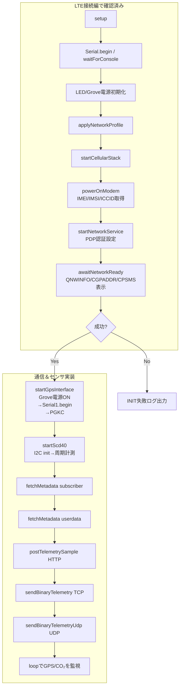
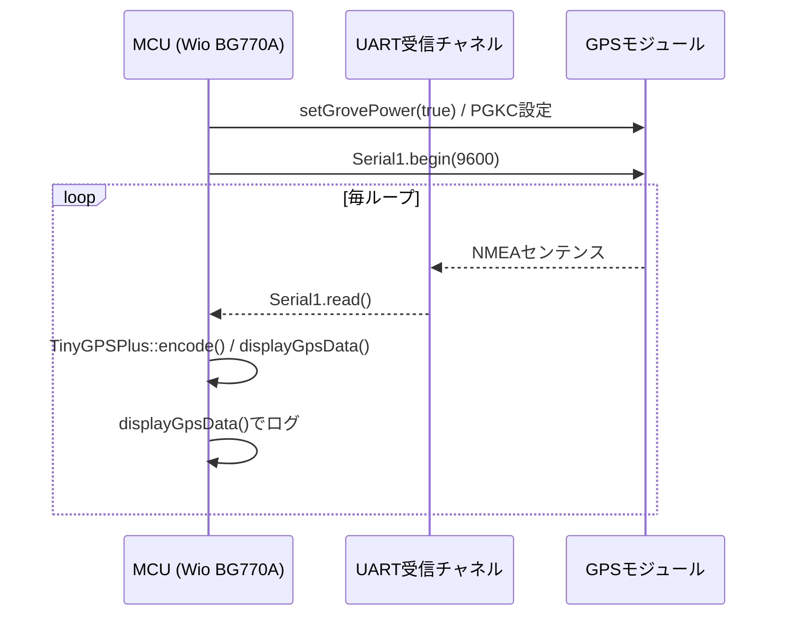
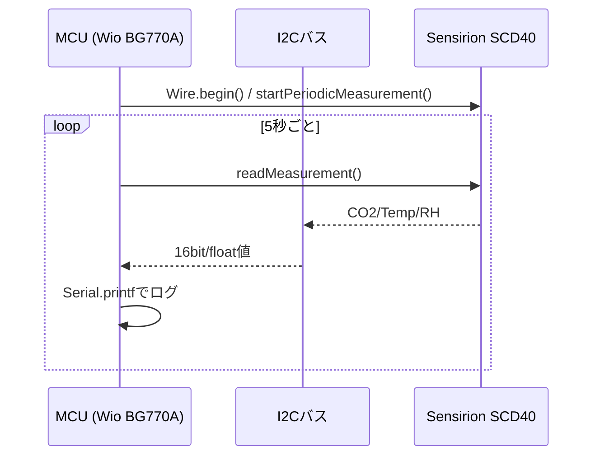

:::message
「[一般消費者が事業者の表示であることを判別することが困難である表示](https://www.caa.go.jp/policies/policy/representation/fair_labeling/guideline/assets/representation_cms216_230328_03.pdf)」の運用基準に基づく開示: この記事は記載の日付時点で[株式会社ソラコム](https://soracom.jp/)に所属する社員が執筆しました。ただし、個人としての投稿であり、株式会社ソラコムとしての正式な発言や見解ではありません。
:::

:::message
本記事は[積みボード/デバイスくずしAdvent Calendar 2025](https://qiita.com/advent-calendar/2025/tsumiboard)の3日目の記事です。
日頃積んだままになっているIoTデバイスに電源とSIMを入れて動かしつつ、今度もう一度動かしたくなったときにすぐ動かせるようにするための手順やノウハウをまとめ超個人的な備忘録です。
:::

## はじめに

本記事は「Wio BG770AとSORACOM 入門」シリーズの第3回で、前回の[LTE接続編](https://zenn.dev/takao2704/articles/getting-started-with-wiobg770a_soracom2)で扱ったコードを前提にしています。LTE 接続が一通り確認できていることをスタートラインに、今回は通信まわりの高レイヤー API とセンサ制御をまとめて一体化させます。SORACOM Unified Endpoint へ HTTP/JSON・TCP・UDP を飛ばす方法と、GPS（UART）と CO₂ センサ（I2C）を読み出しする部分の実装について個別に確認していきます。

wioにセンサを接続するところから始めていきましょう


## 仕様センサ
- GPS
  SeeedGrove-GPS (Air530Z) 
  https://www.seeedstudio.com/SeeedGrove-GPS-Air530-p-4584.html
- CO2センサ
  CO2 Unit with Temperature and humidity Sensor (SCD40)
  https://shop.m5stack.com/products/co2-unit-with-temperature-and-humidity-sensor-scd40

## 使用ライブラリ

- **WioCellular / WioNetwork**
  BG770A の電源制御・APN 設定・PDP コンテキスト確立を担います。`applyNetworkProfile()` と `startNetworkService()` で LTE-M バンドや CHAP 認証を設定し、`WioCellular.doWork()` が URC 監視を継続します。
https://github.com/SeeedJP/wio_cellular
- **WioCellularArduinoTcpClient / WioCellularTcpClient2 / WioCellularUdpClient2**  
  Unified Endpoint への TCP/UDP ソケットを抽象化するクライアント群です。Arduino 互換 API（`connect`/`write`/`available`）と AT ソケット API の両方を切り替えられるため、HTTP（高レイヤー）とバイナリ送信（低レイヤー）を同一スケッチで扱えます。
https://github.com/SeeedJP/wio_cellular
- **ArduinoHttpClient**  
  `HttpClient` クラスを提供し、`metadata.soracom.io` への GET や `uni.soracom.io` への POST をシンプルに表現します。タイムアウト制御も 1 箇所で指定可能です。
https://github.com/arduino-libraries/ArduinoHttpClient
- **TinyGPSPlus**  
  Grove GPS から受け取った NMEA をパースし、緯度・経度・衛星数・PDOP/VDOP を抽出します。`TinyGPSCustom` を併用して GSA センテンスの特定フィールドだけを追跡しています。
https://github.com/m5stack/TinyGPSPlus
- **Sensirion I2c Scd4x**  
  SCD40/41 の初期化と周期読み出しを行う公式ライブラリです。`startScd40()` でシリアル番号取得→計測開始、`pollScd40()` で CO₂/温湿度を取得しログ化します。
https://github.com/Sensirion/arduino-i2c-scd4x
- **Adafruit_TinyUSB / 標準ライブラリ**  
  USB CDC の安定化と `std::string`/`vector`/`cstring` 等のユーティリティを提供し、ログ整形やペイロード生成で活用しています。

:::details platformio.ini

```ini
[platformio]
src_dir = .

[env:seeed_wio_bg770a]
platform = https://github.com/SeeedJP/platform-nordicnrf52
platform_packages =
    framework-arduinoadafruitnrf52 @ https://github.com/SeeedJP/Adafruit_nRF52_Arduino.git
framework = arduino
board = seeed_wio_bg770a
build_flags =
    -DBOARD_VERSION_1_0
    -DCFG_LOGGER=3
lib_archive = no
lib_deps =
    seeedjp/WioCellular
    arduino-libraries/ArduinoHttpClient
    https://github.com/m5stack/TinyGPSPlus.git
    sensirion/Sensirion I2C SCD4x
```
:::

## インターフェースを制御する

### まずはプログラムを動かす

下記の折りたたみを開いて `comm_basic.ino` を取得し、Wio BG770A に書き込んでください。自分のワークフローに応じた場所へコピーしてからビルドしてください。LTE接続編のスケッチに対し、HTTP/TCP/UDP クライアント、GPS、SCD40 ハンドラが追加されている点が今回の差分です。

1. 前回の記事の手順で Wio BG770A を PC に接続し、シリアルモニタを開ける状態にする。  
2. `comm_basic.ino` をスケッチフォルダに置き、必要なら `platformio.ini` や `library.properties` を同階層にコピーする。  
3. ビルド＆書き込み後、シリアルに `[INIT][1/5] ...` が流れることを確認する。

:::details comm_basic.ino

```cpp
/*
 * comm_basic.ino
 * End-to-end demo for BG770A:
 *   - Modem initialization and LTE attachment
 *   - HTTP metadata fetch + JSON POST
 *   - TCP/UDP binary telemetry
 *   - GPS (ATGM336H/AT6668) + SCD40 CO2 sensor polling
 *
 * Each stage emits detailed Serial logs so you can trace failures.
 */

#include <Adafruit_TinyUSB.h>
#include <WioCellular.h>
#include <ArduinoHttpClient.h>
#include <TinyGPSPlus.h>
#include <client/WioCellularUdpClient2.hpp>
#include <SensirionI2cScd4x.h>
#include <Wire.h>
#include <cstring>
#include <cctype>
#include <cstdlib>
#include <string>
#include <vector>

static constexpr auto SEARCH_ACCESS_TECHNOLOGY =
    WioCellularNetwork::SearchAccessTechnology::LTEM;
static constexpr auto LTEM_BAND = WioCellularNetwork::ALL_LTEM_BAND;
static constexpr int SEARCH_ACCESS_TECHNOLOGY_MODE =
    static_cast<int>(SEARCH_ACCESS_TECHNOLOGY);

static const char APN[] = "soracom.io";
static constexpr int PDP_CONTEXT_ID = 1;
static constexpr int PDP_AUTH_MODE = 2;  // default to CHAP
static constexpr int PDP_AUTH_MODE_QICSGP = PDP_AUTH_MODE;
static const char PDP_AUTH_USER[] = "sora";
static const char PDP_AUTH_PASSWORD[] = "sora";

static constexpr int POWER_ON_TIMEOUT = 1000 * 20;
static constexpr int NETWORK_TIMEOUT = 1000 * 60 * 3;
static constexpr int LOOP_IDLE_MS = 10;   // loop idle to balance workload
static constexpr int CONSOLE_WAIT_TIMEOUT = 1000 * 10;
static const char HTTP_HOST[] = "metadata.soracom.io";
static const char HTTP_PATH_SUBSCRIBER[] = "/v1/subscriber";
static const char HTTP_PATH_USERDATA[] = "/v1/userdata";
static const char HTTP_POST_HOST[] = "uni.soracom.io";
static const char HTTP_POST_PATH[] = "/";
static const char TCP_HOST[] = "uni.soracom.io";
static constexpr int TCP_PORT = 23080;
static constexpr int HTTP_PORT = 80;
static constexpr int HTTP_TIMEOUT = 1000 * 10;
static constexpr int TCP_TIMEOUT = 1000 * 10;
static constexpr size_t SOCKET_RESPONSE_BUFFER = 128;
static constexpr float TELEMETRY_TEMPERATURE = 20.0f;
static constexpr double TELEMETRY_LATITUDE = 35.677097;
static constexpr double TELEMETRY_LONGITUDE = 139.73295;
static constexpr size_t TELEMETRY_PAYLOAD_SIZE =
    sizeof(TELEMETRY_TEMPERATURE) + sizeof(TELEMETRY_LATITUDE) +
    sizeof(TELEMETRY_LONGITUDE);
// ATGM336H-6N default: 115200 bps @ 8N1
// Note: This module seems configured for 9600 bps
static constexpr uint32_t GPS_BAUD_RATE = 9600;
static constexpr bool GPS_LOG_RAW_NMEA = false;
// Increase when you intentionally lower the polling frequency below "every loop"
static constexpr size_t GPS_RAW_BUFFER_SIZE = 2048;
// 0 = read every loop. Raise (e.g., 50–100 ms) if you must back off polling;
// then increase GPS_RAW_BUFFER_SIZE accordingly.
static constexpr uint32_t GPS_POLL_INTERVAL_MS = 0;
static constexpr uint32_t GPS_STARTUP_DELAY_MS = 500;
static constexpr uint32_t SCD4X_READ_INTERVAL_MS = 5000;
static constexpr uint32_t SCD4X_STARTUP_DELAY_MS = 2000;
static constexpr int GPS_MAX_PRN_VALUE = 400;
static constexpr uint32_t GSA_STALE_TIMEOUT_MS = 4000;
static constexpr uint32_t GSA_RESET_INTERVAL_MS = 1200;

static void waitForConsole();
static void logResult(const char *label, WioCellularResult result);
static bool logModemAndSimIdentity();
static bool logIdentityField(const char *label, WioCellularResult result,
                             const std::string &value);
static bool logNetworkAttachDetails();
static bool logAssignedIpAddress();
static void logPowerSavingConfiguration();
static const char *operatorSelectionModeToString(int mode);
static const char *operatorFormatToString(int format);
static const char *accessTechnologyToString(int act);
static std::string trim(const std::string &text);
static std::vector<std::string> parseQnwinfoFields(const std::string &payload);
static bool applyNetworkProfile();
static bool startCellularStack();
static bool powerOnModem();
static bool startNetworkService();
static bool awaitNetworkReady();
static bool configurePdpAuthentication();
static bool fetchMetadata(const char *pathLabel, const char *path);
static bool postTelemetrySample();
static bool sendBinaryTelemetry();
static bool sendBinaryTelemetryUdp();
static void buildTelemetryPayload(uint8_t *buffer, size_t bufferSize);
static void logBytesHex(const char *label, const uint8_t *buffer, size_t size);
static void setGrovePower(bool enabled);
static void pollGpsStream();
static void displayGpsData();
static void startGpsInterface();
static void configureGpsModule();
static void processGsaSentence(const char *line);
static void addGsaPrn(int prn);
static void resetGsaPrnSetIfStale(uint32_t now, uint32_t timeoutMs);
static void clearGsaPrnSet();
static bool parseGsaPrnToken(const char *token, int *outPrn);
static void startScd40();
static void pollScd40();

static bool GpsEnabled = false;
static TinyGPSPlus Gps;
static TinyGPSCustom GpsPdop(Gps, "GNGSA", 15); // PDOP field in GNGSA sentence
static TinyGPSCustom GpsVdop(Gps, "GNGSA", 17); // VDOP field in GNGSA sentence
static char GpsRawLine[GPS_RAW_BUFFER_SIZE];
static size_t GpsRawLength = 0;
static int GsaUsedPrns[32];
static size_t GsaUsedCount = 0;
static uint32_t LastGsaUpdateMs = 0;
static SensirionI2cScd4x Scd4x;
static bool Scd4xEnabled = false;
static uint32_t LastScd4xReadMs = 0;
void setup() {
  Serial.begin(115200);
  waitForConsole();
  pinMode(LED_BUILTIN, OUTPUT);
  pinMode(PIN_VGROVE_ENABLE, OUTPUT);
  setGrovePower(false);

  Serial.println();
  Serial.println("=== Wio BG770A modem initialization ===");

  digitalWrite(LED_BUILTIN, HIGH);
  const bool success = applyNetworkProfile() && startCellularStack() &&
                       powerOnModem() && startNetworkService() &&
                       awaitNetworkReady();
  digitalWrite(LED_BUILTIN, LOW);

  if (success) {
    Serial.println("[INIT] Modem initialization completed successfully.");
    startGpsInterface();
    startScd40();
    const bool subscriberOk =
        fetchMetadata("subscriber", HTTP_PATH_SUBSCRIBER);
    const bool userdataOk = fetchMetadata("userdata", HTTP_PATH_USERDATA);
    Serial.printf("[HTTP] Subscriber metadata %s\n",
                  subscriberOk ? "completed" : "failed");
    Serial.printf("[HTTP] Userdata metadata %s\n",
                  userdataOk ? "completed" : "failed");
    const bool postOk = postTelemetrySample();
    Serial.printf("[HTTP] Telemetry POST %s\n",
                  postOk ? "completed" : "failed");
    const bool tcpOk = sendBinaryTelemetry();
    Serial.printf("[TCP] Binary telemetry %s\n",
                  tcpOk ? "completed" : "failed");
    const bool udpOk = sendBinaryTelemetryUdp();
    Serial.printf("[UDP] Binary telemetry %s\n",
                  udpOk ? "completed" : "failed");
  } else {
    Serial.println("[INIT] Modem initialization failed. See logs above.");
  }
}

void loop() {
  if (GpsEnabled) {
    pollGpsStream();
  }
  if (Scd4xEnabled) {
    pollScd40();
  }
  // Use shorter interval to prevent GPS buffer overflow
  WioCellular.doWork(LOOP_IDLE_MS);
  delay(LOOP_IDLE_MS);
}

static void waitForConsole() {
  const uint32_t start = millis();
  while (!Serial && millis() - start < CONSOLE_WAIT_TIMEOUT) {
    delay(10);
  }
  delay(250);  // allow host to settle before printing first logs
}

static void logStepHeader(const char *title, int stepIndex, int totalSteps) {
  Serial.printf("[INIT][%d/%d] %s\n", stepIndex, totalSteps, title);
}

static bool applyNetworkProfile() {
  logStepHeader("Applying radio profile", 1, 5);
  WioNetwork.config.apn = APN;
  WioNetwork.config.searchAccessTechnology = SEARCH_ACCESS_TECHNOLOGY;
  WioNetwork.config.ltemBand = LTEM_BAND;
  WioNetwork.config.pdpContextId = PDP_CONTEXT_ID;

  Serial.printf("  APN: %s\n", WioNetwork.config.apn.c_str());
  Serial.printf("  Search RAT: %d\n", SEARCH_ACCESS_TECHNOLOGY_MODE);
  Serial.printf("  LTE-M band mask: %s\n",
                WioNetwork.config.ltemBand.c_str());
  Serial.printf("  PDP CID: %d\n", WioNetwork.config.pdpContextId);
  const char *authDescription =
      (PDP_AUTH_MODE == 0)   ? "none"
      : (PDP_AUTH_MODE == 1) ? "PAP"
                             : (PDP_AUTH_MODE == 2) ? "CHAP" : "unknown";
  Serial.printf("  Auth mode: %d (%s), user: %s\n", PDP_AUTH_MODE,
                authDescription, PDP_AUTH_USER);
  const bool validApn = !WioNetwork.config.apn.empty();
  Serial.printf("  Check: APN string is %s\n", validApn ? "set" : "empty");
  Serial.printf("  Result: %s\n", validApn ? "OK" : "FAILED (APN missing)");
  return validApn;
}

static bool startCellularStack() {
  logStepHeader("Booting WioCellular stack", 2, 5);
  WioCellular.begin();
  Serial.println("  WioCellular.begin() completed");
  Serial.println("  Check: API has no status; success assumed if it returns");
  Serial.println("  Result: OK");
  return true;
}

static bool powerOnModem() {
  logStepHeader("Powering on BG770A module", 3, 5);
  Serial.printf("  Timeout: %d ms\n", POWER_ON_TIMEOUT);
  const auto result = WioCellular.powerOn(POWER_ON_TIMEOUT);
  logResult("  powerOn", result);
  const bool powered = result == WioCellularResult::Ok;
  Serial.printf("  Check: WioCellular.powerOn() returned %s\n",
                WioCellularResultToString(result));
  bool identityOk = false;
  if (powered) {
    identityOk = logModemAndSimIdentity();
    Serial.printf("  Check: identity snapshot %s\n",
                  identityOk ? "OK" : "FAILED");
  }
  const bool stepOk = powered && identityOk;
  Serial.printf("  Result: %s\n", stepOk ? "OK" : "FAILED");
  return stepOk;
}

static bool startNetworkService() {
  logStepHeader("Starting WioNetwork service (PDP context)", 4, 5);
  WioNetwork.begin();
  Serial.println("  WioNetwork.begin() issued");
  Serial.println("  Check: API has no status; success assumed if it returns");
  const bool authOk = configurePdpAuthentication();
  Serial.printf("  Check: PDP authentication %s\n",
                authOk ? "OK (at least one command accepted)"
                       : "FAILED (both commands rejected)");
  Serial.printf("  Result: %s\n", authOk ? "OK" : "FAILED");
  return authOk;
}

static bool awaitNetworkReady() {
  logStepHeader("Waiting for communication availability", 5, 5);
  Serial.printf("  Timeout: %d ms\n", NETWORK_TIMEOUT);
  if (!WioNetwork.waitUntilCommunicationAvailable(NETWORK_TIMEOUT)) {
    Serial.println(
        "  Check: waitUntilCommunicationAvailable() returned false");
    Serial.println("  Result: TIMEOUT (EPS not registered)");
    WioCellular.powerOff();
    return false;
  }
  Serial.println("  Check: waitUntilCommunicationAvailable() returned true");
  const bool detailOk = logNetworkAttachDetails();
  Serial.printf("  Check: attachment detail query %s\n",
                detailOk ? "OK" : "FAILED");
  const bool ipOk = logAssignedIpAddress();
  Serial.printf("  Check: PDP address query %s\n",
                ipOk ? "OK" : "FAILED");
  logPowerSavingConfiguration();
  Serial.println("  Result: READY (EPS registered)");
  return true;
}

static void logResult(const char *label, WioCellularResult result) {
  Serial.printf("%s -> %s\n", label, WioCellularResultToString(result));
}

static bool logIdentityField(const char *label, WioCellularResult result,
                             const std::string &value) {
  Serial.printf("    %s -> %s\n", label, WioCellularResultToString(result));
  if (result == WioCellularResult::Ok) {
    Serial.printf("      value: %s\n", value.c_str());
  }
  return result == WioCellularResult::Ok;
}

static bool logModemAndSimIdentity() {
  Serial.println("    Capturing modem/SIM identity...");
  bool ok = true;

  {
    std::string model;
    const auto result = WioCellular.queryCommand(
        "AT+CGMM", [&model](const std::string &response) -> bool {
          model = response;
          return true;
        },
        300);
    ok &= logIdentityField("Modem model (AT+CGMM)", result, model);
  }
  {
    std::string revision;
    const auto result = WioCellular.getModemInfo(&revision);
    ok &= logIdentityField("Firmware revision (AT+QGMR)", result, revision);
  }
  {
    std::string imei;
    const auto result = WioCellular.getIMEI(&imei);
    ok &= logIdentityField("IMEI (AT+GSN)", result, imei);
  }
  {
    std::string imsi;
    const auto result = WioCellular.getIMSI(&imsi);
    ok &= logIdentityField("IMSI (AT+CIMI)", result, imsi);
  }
  {
    std::string iccid;
    const auto result = WioCellular.getSimCCID(&iccid);
    ok &= logIdentityField("ICCID (AT+QCCID)", result, iccid);
  }
  return ok;
}

static bool logNetworkAttachDetails() {
  Serial.println("  Querying operator/band information...");
  bool ok = true;

  {
    int mode = 0;
    int format = 0;
    std::string oper;
    int act = 0;
    const auto result =
        WioCellular.getOperator(&mode, &format, &oper, &act);
    Serial.printf("    getOperator -> %s\n",
                  WioCellularResultToString(result));
    if (result == WioCellularResult::Ok) {
      Serial.printf("      operator: %s\n", oper.c_str());
      Serial.printf("      mode: %d (%s)\n", mode,
                    operatorSelectionModeToString(mode));
      Serial.printf("      format: %d (%s)\n", format,
                    operatorFormatToString(format));
      Serial.printf("      access tech: %d (%s)\n", act,
                    accessTechnologyToString(act));
    } else {
      ok = false;
    }
  }

  {
    std::string payload;
    const auto result = WioCellular.queryCommand(
        "AT+QNWINFO", [&payload](const std::string &response) -> bool {
          if (response.rfind("+QNWINFO:", 0) == 0) {
            payload = response.substr(10);
            return true;
          }
          return false;
        },
        500);
    Serial.printf("    AT+QNWINFO -> %s\n",
                  WioCellularResultToString(result));
    if (result == WioCellularResult::Ok && !payload.empty()) {
      payload = trim(payload);
      Serial.printf("      raw: %s\n", payload.c_str());
      const auto fields = parseQnwinfoFields(payload);
      if (fields.size() >= 1) {
        Serial.printf("      RAT: %s\n", fields[0].c_str());
      }
      if (fields.size() >= 2) {
        Serial.printf("      Operator (MCC/MNC): %s\n", fields[1].c_str());
      }
      if (fields.size() >= 3) {
        Serial.printf("      Band: %s\n", fields[2].c_str());
      }
      if (fields.size() >= 4) {
        Serial.printf("      Channel/Frequency: %s\n", fields[3].c_str());
      }
    } else {
      ok = false;
    }
  }

  return ok;
}

static bool logAssignedIpAddress() {
  Serial.println("  Querying PDP address...");
  std::string payload;
  const std::string command =
      "AT+CGPADDR=" + std::to_string(WioNetwork.config.pdpContextId);
  const auto result = WioCellular.queryCommand(
      command.c_str(),
      [&payload](const std::string &response) -> bool {
        if (response.rfind("+CGPADDR:", 0) == 0) {
          payload = response;
          return true;
        }
        return false;
      },
      500);
  Serial.printf("    AT+CGPADDR -> %s\n",
                WioCellularResultToString(result));
  if (result != WioCellularResult::Ok || payload.empty()) {
    Serial.println("      value: <empty>");
    return false;
  }
  const auto firstQuote = payload.find('"');
  const auto secondQuote =
      (firstQuote != std::string::npos)
          ? payload.find('"', firstQuote + 1)
          : std::string::npos;
  if (firstQuote == std::string::npos || secondQuote == std::string::npos) {
    Serial.printf("      raw: %s (no quoted IP)\n", payload.c_str());
    return false;
  }
  const auto ip =
      payload.substr(firstQuote + 1, secondQuote - firstQuote - 1);
  Serial.printf("      PDP CID %d IP: %s\n", WioNetwork.config.pdpContextId,
                ip.c_str());
  return true;
}

static void logPowerSavingConfiguration() {
  Serial.println("  Querying power-saving configuration...");
  {
    std::string response;
    const auto result = WioCellular.queryCommand(
        "AT+CEDRXS?", [&response](const std::string &res) -> bool {
          if (res.rfind("+CEDRXS:", 0) == 0) {
            response = res;
            return true;
          }
          return false;
        },
        500);
    Serial.printf("    AT+CEDRXS? -> %s\n",
                  WioCellularResultToString(result));
    if (!response.empty()) {
      Serial.printf("      %s\n", response.c_str());
    }
  }
  {
    std::string response;
    const auto result = WioCellular.queryCommand(
        "AT+CEDRXRDP", [&response](const std::string &res) -> bool {
          if (res.rfind("+CEDRXRDP:", 0) == 0) {
            response = res;
            return true;
          }
          return false;
        },
        500);
    Serial.printf("    AT+CEDRXRDP -> %s\n",
                  WioCellularResultToString(result));
    if (!response.empty()) {
      Serial.printf("      %s\n", response.c_str());
    }
  }
  {
    std::string response;
    const auto result = WioCellular.queryCommand(
        "AT+CPSMS?", [&response](const std::string &res) -> bool {
          if (res.rfind("+CPSMS:", 0) == 0) {
            response = res;
            return true;
          }
          return false;
        },
        500);
    Serial.printf("    AT+CPSMS? -> %s\n",
                  WioCellularResultToString(result));
    if (!response.empty()) {
      Serial.printf("      %s\n", response.c_str());
    }
  }
  {
    std::string response;
    const auto result = WioCellular.queryCommand(
        "AT+QPSMS?", [&response](const std::string &res) -> bool {
          if (res.rfind("+QPSMS:", 0) == 0) {
            response = res;
            return true;
          }
          return false;
        },
        500);
    Serial.printf("    AT+QPSMS? -> %s\n",
                  WioCellularResultToString(result));
    if (!response.empty()) {
      Serial.printf("      %s\n", response.c_str());
    }
  }
}

static const char *operatorSelectionModeToString(int mode) {
  switch (mode) {
  case 0:
    return "automatic";
  case 1:
    return "manual";
  case 2:
    return "deregistered";
  case 3:
    return "set only";
  case 4:
    return "manual/automatic";
  default:
    return "unknown";
  }
}

static const char *operatorFormatToString(int format) {
  switch (format) {
  case 0:
    return "long alphanumeric";
  case 1:
    return "short alphanumeric";
  case 2:
    return "numeric (MCCMNC)";
  default:
    return "unknown";
  }
}

static const char *accessTechnologyToString(int act) {
  switch (act) {
  case 0:
    return "GSM";
  case 1:
    return "GSM Compact";
  case 2:
    return "UTRAN";
  case 3:
    return "GSM w/EGPRS";
  case 4:
    return "UTRAN w/HSDPA";
  case 5:
    return "UTRAN w/HSUPA";
  case 6:
    return "UTRAN w/HSDPA+HSUPA";
  case 7:
    return "E-UTRAN (LTE)";
  case 8:
    return "E-UTRAN (NB-IoT)";
  case 9:
    return "E-UTRAN (LTE-M)";
  default:
    return "unknown";
  }
}

static std::string trim(const std::string &text) {
  size_t start = 0;
  while (start < text.size() &&
         std::isspace(static_cast<unsigned char>(text[start]))) {
    ++start;
  }
  size_t end = text.size();
  while (end > start &&
         std::isspace(static_cast<unsigned char>(text[end - 1]))) {
    --end;
  }
  return text.substr(start, end - start);
}

static std::vector<std::string> parseQnwinfoFields(
    const std::string &payload) {
  std::vector<std::string> fields;
  std::string current;
  bool inQuote = false;
  for (char ch : payload) {
    if (ch == '"') {
      inQuote = !inQuote;
      continue;
    }
    if (ch == ',' && !inQuote) {
      fields.push_back(trim(current));
      current.clear();
    } else {
      current.push_back(ch);
    }
  }
  if (!current.empty()) {
    fields.push_back(trim(current));
  }
  return fields;
}

static bool configurePdpAuthentication() {
  Serial.printf(
      "  Configuring PDP authentication (cid=%d, mode=%d, user=%s)\n",
      PDP_CONTEXT_ID, PDP_AUTH_MODE, PDP_AUTH_USER);
  std::string command = "AT+CGAUTH=" + std::to_string(PDP_CONTEXT_ID) + "," +
                        std::to_string(PDP_AUTH_MODE) + ",\"" +
                        PDP_AUTH_USER + "\",\"" + PDP_AUTH_PASSWORD + "\"";
  Serial.printf("    Command: %s\n", command.c_str());
  const auto result = WioCellular.executeCommand(command.c_str(), 500);
  Serial.printf("    Check: AT+CGAUTH returned %s\n",
                WioCellularResultToString(result));
  bool ok = result == WioCellularResult::Ok;
  if (!ok) {
    Serial.println("    Note: CGAUTH rejected (probably not required by SIM)");
    Serial.println("    CGAUTH failed, trying AT+QICSGP fallback");
    std::string fallback =
        "AT+QICSGP=" + std::to_string(PDP_CONTEXT_ID) + ",1,\"" + APN +
        "\",\"" + PDP_AUTH_USER + "\",\"" + PDP_AUTH_PASSWORD + "\"," +
        std::to_string(PDP_AUTH_MODE_QICSGP);
    Serial.printf("    Command: %s\n", fallback.c_str());
    const auto fbResult = WioCellular.executeCommand(fallback.c_str(), 1000);
    Serial.printf("    Check: AT+QICSGP returned %s\n",
                  WioCellularResultToString(fbResult));
    ok = fbResult == WioCellularResult::Ok;
  }
  Serial.printf("    Auth Result: %s\n", ok ? "OK" : "FAILED");
  return ok;
}

static void buildTelemetryPayload(uint8_t *buffer, size_t bufferSize) {
  if (buffer == nullptr || bufferSize < TELEMETRY_PAYLOAD_SIZE) {
    return;
  }
  size_t offset = 0;
  std::memcpy(buffer + offset, &TELEMETRY_TEMPERATURE,
              sizeof(TELEMETRY_TEMPERATURE));
  offset += sizeof(TELEMETRY_TEMPERATURE);
  std::memcpy(buffer + offset, &TELEMETRY_LATITUDE,
              sizeof(TELEMETRY_LATITUDE));
  offset += sizeof(TELEMETRY_LATITUDE);
  std::memcpy(buffer + offset, &TELEMETRY_LONGITUDE,
              sizeof(TELEMETRY_LONGITUDE));
}

static void logBytesHex(const char *label, const uint8_t *buffer,
                        size_t size) {
  Serial.print(label);
  Serial.print(": ");
  for (size_t i = 0; i < size; ++i) {
    Serial.printf("%02X", buffer[i]);
    if (i + 1 < size) {
      Serial.print(' ');
    }
  }
  Serial.println();
}

static void setGrovePower(bool enabled) {
  digitalWrite(PIN_VGROVE_ENABLE,
               enabled ? VGROVE_ENABLE_ON : VGROVE_ENABLE_OFF);
  delay(4);
}

static void pollGpsStream() {
  static uint32_t lastDisplayMs = 0;
  static uint32_t lastPollMs = 0;
  static char NmeaLine[128];
  static size_t NmeaLen = 0;
  constexpr uint32_t DISPLAY_INTERVAL_MS = 5000;  // Display every 5 seconds
  const uint32_t now = millis();

  // Optional throttling: skip polling until interval passes
  if (GPS_POLL_INTERVAL_MS > 0 &&
      now - lastPollMs < GPS_POLL_INTERVAL_MS) {
    if (now - lastDisplayMs >= DISPLAY_INTERVAL_MS) {
      lastDisplayMs = now;
      displayGpsData();
    }
    return;
  }
  lastPollMs = now;

  while (Serial1.available()) {
    const int ch = Serial1.read();
    if (ch < 0) {
      continue;
    }

    // Build a minimal line buffer for GSA parsing
    if (ch != '\r') {
      if (ch == '\n') {
        NmeaLine[NmeaLen] = '\0';
        processGsaSentence(NmeaLine);
        NmeaLen = 0;
      } else if (NmeaLen + 1 < sizeof(NmeaLine)) {
        NmeaLine[NmeaLen++] = static_cast<char>(ch);
      } else {
        NmeaLen = 0;  // overflow guard
      }
    }

    // Feed character to TinyGPSPlus parser
    Gps.encode(static_cast<char>(ch));

    // Optional: Log raw NMEA data
    if (GPS_LOG_RAW_NMEA) {
      if (GpsRawLength < GPS_RAW_BUFFER_SIZE - 1) {
        GpsRawLine[GpsRawLength++] = static_cast<char>(ch);
        if (ch == '\n') {
          GpsRawLine[GpsRawLength] = '\0';
          Serial.print("[GPS/RAW] ");
          Serial.print(GpsRawLine);
          GpsRawLength = 0;
        }
      } else {
        GpsRawLength = 0;
      }
    }
  }

  // Display GPS data periodically
  if (now - lastDisplayMs >= DISPLAY_INTERVAL_MS) {
    lastDisplayMs = now;
    displayGpsData();
  }
}

static void displayGpsData() {
  Serial.println();
  Serial.println("=== GPS Status ===");

  Serial.printf("  Satellites: %d\n", Gps.satellites.value());

  // Display DOP values if available
  if (GpsPdop.isValid()) {
    Serial.printf("  PDOP: %s\n", GpsPdop.value());
  } else {
    Serial.println("  PDOP: N/A");
  }

  Serial.printf("  HDOP: %.2f\n", Gps.hdop.hdop());

  if (GpsVdop.isValid()) {
    Serial.printf("  VDOP: %s\n", GpsVdop.value());
  } else {
    Serial.println("  VDOP: N/A");
  }

  // Satellites used in current solution (PRN list from GNGSA)
  const uint32_t now = millis();
  // millis() subtraction is wrap-safe on Arduino (unsigned overflow)
  const bool freshGsa =
      (GsaUsedCount > 0) && (now - LastGsaUpdateMs <= GSA_STALE_TIMEOUT_MS);
  if (freshGsa) {
    Serial.print("  Used PRNs: ");
    for (size_t i = 0; i < GsaUsedCount; ++i) {
      if (i > 0) {
        Serial.print(',');
      }
      Serial.print(GsaUsedPrns[i]);
    }
    Serial.println();

    // Highlight QZSS PRNs (typically 193-199, some firmware 183-189)
    Serial.print("  QZSS PRNs used: ");
    bool anyQz = false;
    for (size_t i = 0; i < GsaUsedCount; ++i) {
      const int prn = GsaUsedPrns[i];
      if ((prn >= 193 && prn <= 199) || (prn >= 183 && prn <= 189)) {
        if (anyQz) {
          Serial.print(',');
        }
        Serial.print(prn);
        anyQz = true;
      }
    }
    if (!anyQz) {
      Serial.println("none (not listed in GSA)");
    } else {
      Serial.println();
    }
  } else {
    Serial.println("  Used PRNs: N/A (no recent GSA)");
  }

  if (Gps.location.isValid()) {
    Serial.printf("  Location: %.6f, %.6f\n",
                  Gps.location.lat(), Gps.location.lng());
    Serial.printf("  Age: %lu ms\n", Gps.location.age());
  } else {
    Serial.println("  Location: No fix");
  }

  if (Gps.altitude.isValid()) {
    Serial.printf("  Altitude: %.2f m\n", Gps.altitude.meters());
  } else {
    Serial.println("  Altitude: N/A");
  }

  if (Gps.speed.isValid()) {
    Serial.printf("  Speed: %.2f km/h\n", Gps.speed.kmph());
  } else {
    Serial.println("  Speed: N/A");
  }

  if (Gps.date.isValid() && Gps.time.isValid()) {
    Serial.printf("  Date/Time: %04d-%02d-%02d %02d:%02d:%02d UTC\n",
                  Gps.date.year(), Gps.date.month(), Gps.date.day(),
                  Gps.time.hour(), Gps.time.minute(), Gps.time.second());
  } else {
    Serial.println("  Date/Time: N/A");
  }

  Serial.printf("  Characters processed: %lu\n", Gps.charsProcessed());
  Serial.printf("  Sentences with fix: %lu\n", Gps.sentencesWithFix());
  Serial.printf("  Failed checksum: %lu\n", Gps.failedChecksum());
}

static void startGpsInterface() {
  Serial.println("[GPS] Initializing Grove GPS interface...");
  setGrovePower(true);
  Serial.println("[GPS] Grove power enabled");
  delay(GPS_STARTUP_DELAY_MS);
  Serial.println("[GPS] Startup delay completed");

  Serial1.begin(GPS_BAUD_RATE);
  Serial.println("[GPS] Serial1.begin() completed");

  // Clear buffer with timeout protection
  const uint32_t clearStart = millis();
  constexpr uint32_t CLEAR_TIMEOUT = 1000;
  while (Serial1.available() && (millis() - clearStart < CLEAR_TIMEOUT)) {
    Serial1.read();
  }
  Serial.println("[GPS] Buffer cleared");

  Serial.printf("[GPS] Grove UART powered, listening at %lu baud\n",
                static_cast<unsigned long>(GPS_BAUD_RATE));

  configureGpsModule();
  GpsEnabled = true;
  Serial.println("[GPS] Initialization completed, NMEA reception started");
}

static void configureGpsModule() {
  // PGKC command set (ATGM336H/AT6668)
  // - 101: NMEA出力間隔（ms）
  // - 115: GNSSコンステレーション（GPSを主系に設定）
  // - 113/114: QZSS NMEA出力および測位機能を有効化
  // - 242: NMEAセンテンス構成（RMC/VTG/GGA/GSA/GSVのみ出力）
  // - 147: UARTボーレート（現行の 9600bps を明示）
  static const char *const INIT_COMMANDS[] = {
      "$PGKC101,1000*02",           // 1Hz 更新間隔
      "$PGKC115,1,0,0,0*2B",        // メイン測位系をGPSへ固定
      "$PGKC113,1*31",              // QZSS NMEA出力を有効化
      "$PGKC114,0*37",              // QZSS測位機能を有効化
      "$PGKC242,0,1,1,1,1,1,0,0*2A",// 出力センテンス構成
      "$PGKC147,9600*0E",           // ボーレートを9600bpsに固定
  };

  Serial.println("[GPS] Sending configuration commands...");
  for (const char *cmd : INIT_COMMANDS) {
    Serial1.print(cmd);
    Serial1.print("\r\n");
    delay(50);
  }
}

static void resetGsaPrnSetIfStale(uint32_t now, uint32_t timeoutMs) {
  if (now - LastGsaUpdateMs > timeoutMs) {
    clearGsaPrnSet();
  }
}

static void addGsaPrn(int prn) {
  if (prn <= 0) {
    return;
  }
  for (size_t i = 0; i < GsaUsedCount; ++i) {
    if (GsaUsedPrns[i] == prn) {
      return;
    }
  }
  if (GsaUsedCount < sizeof(GsaUsedPrns) / sizeof(GsaUsedPrns[0])) {
    GsaUsedPrns[GsaUsedCount++] = prn;
  }
}

static void clearGsaPrnSet() {
  GsaUsedCount = 0;
}

static bool parseGsaPrnToken(const char *token, int *outPrn) {
  if (token == nullptr || !std::isdigit(static_cast<unsigned char>(token[0]))) {
    return false;
  }
  char *end = nullptr;
  long v = std::strtol(token, &end, 10);
  if (end == token) {
    return false;
  }
  // Ignore trailing checksum marker if it appears by accident
  if (end && *end != '\0' && *end != '*') {
    return false;
  }
  if (v <= 0 || v > GPS_MAX_PRN_VALUE) { // guard unrealistic values like 130152
    return false;
  }
  *outPrn = static_cast<int>(v);
  return true;
}

static void processGsaSentence(const char *line) {
  if (line == nullptr || line[0] != '$') {
    return;
  }
  // Match $--GSA (GN/GN/GL/BD/GA/QZ etc.)
  if (std::strlen(line) < 6 || std::strncmp(line + 3, "GSA", 3) != 0) {
    return;
  }

  char buf[128];
  std::strncpy(buf, line, sizeof(buf) - 1);
  buf[sizeof(buf) - 1] = '\0';

  uint32_t now = millis();
  resetGsaPrnSetIfStale(now, GSA_STALE_TIMEOUT_MS);
  // GSAは1秒ごとに連続で複数行出るため、前回からの間隔が長いときだけクリアして最新セットに更新
  if (now - LastGsaUpdateMs > GSA_RESET_INTERVAL_MS) {
    clearGsaPrnSet();
  }

  char *save = nullptr;
  char *token = ::strtok_r(buf, ",", &save);
  int field = 0;
  while (token != nullptr) {
    ++field;
    if (field >= 3 && field <= 14 && token[0] != '\0') {
      int prn = 0;
      if (parseGsaPrnToken(token, &prn)) {
        addGsaPrn(prn);
      }
    }
    token = ::strtok_r(nullptr, ",", &save);
  }
  LastGsaUpdateMs = now;
}

static void startScd40() {
  Serial.println("[SCD4x] Initializing I2C CO2 sensor...");
  // Note: Wire.begin() returns void on this platform; assume success
  Wire.begin();
  delay(SCD4X_STARTUP_DELAY_MS);

  uint16_t error = 0;
  Scd4x.begin(Wire, 0x62);

  uint64_t serial = 0;
  error = Scd4x.getSerialNumber(serial);
  if (error) {
    Serial.printf("[SCD4x] getSerialNumber failed (err=%u)\n", error);
  } else {
    Serial.printf("[SCD4x] Serial: 0x%012llX\n",
                  static_cast<unsigned long long>(serial));
  }

  error = Scd4x.stopPeriodicMeasurement();
  if (error) {
    Serial.printf("[SCD4x] stopPeriodicMeasurement failed (err=%u)\n", error);
  }
  error = Scd4x.reinit();
  if (error) {
    Serial.printf("[SCD4x] reinit failed (err=%u)\n", error);
  }
  error = Scd4x.startPeriodicMeasurement();
  if (error) {
    Serial.printf("[SCD4x] startPeriodicMeasurement failed (err=%u)\n", error);
    Scd4xEnabled = false;
    return;
  }

  Scd4xEnabled = true;
  LastScd4xReadMs = millis();
  Serial.println("[SCD4x] Started periodic measurement (first sample ~5s)");
}

static void pollScd40() {
  const uint32_t now = millis();
  if (now - LastScd4xReadMs < SCD4X_READ_INTERVAL_MS) {
    return;
  }
  LastScd4xReadMs = now;

  uint16_t co2 = 0;
  float temperature = 0.0f;
  float humidity = 0.0f;
  const uint16_t error = Scd4x.readMeasurement(co2, temperature, humidity);
  if (error) {
    Serial.printf("[SCD4x] readMeasurement failed (err=%u)\n", error);
    return;
  }
  if (co2 == 0xFFFF) {
    Serial.println("[SCD4x] Invalid sample (data not ready)");
    return;
  }
  Serial.printf("[SCD4x] CO2: %u ppm, Temp: %.2f C, RH: %.2f %%\n",
                co2, temperature, humidity);
}

static bool fetchMetadata(const char *pathLabel, const char *path) {
  Serial.println();
  Serial.printf("=== HTTP GET: %s metadata ===\n", pathLabel);
  Serial.printf("  Target: http://%s%s\n", HTTP_HOST, path);

  WioCellularArduinoTcpClient<WioCellularModule> tcpClient{
      WioCellular, WioNetwork.config.pdpContextId};
  HttpClient httpClient{tcpClient, HTTP_HOST, HTTP_PORT};
  httpClient.setTimeout(HTTP_TIMEOUT);

  Serial.println("  Sending HTTP GET request...");
  const int err = httpClient.get(path);
  if (err != 0) {
    Serial.printf("  ERROR: httpClient.get returned %d\n", err);
    httpClient.stop();
    return false;
  }

  const int statusCode = httpClient.responseStatusCode();
  Serial.printf("  Status code: %d\n", statusCode);
  if (statusCode < 0) {
    httpClient.stop();
    return false;
  }

  const int contentLength = httpClient.contentLength();
  Serial.printf("  Content length: %d\n", contentLength);

  const String body = httpClient.responseBody();
  Serial.println("  Response body:");
  Serial.println(body);

  httpClient.stop();
  return statusCode >= 200 && statusCode < 300;
}

static bool postTelemetrySample() {
  Serial.println();
  Serial.println("=== HTTP POST: telemetry upload ===");
  Serial.printf("  Target: http://%s%s\n", HTTP_POST_HOST, HTTP_POST_PATH);

  WioCellularArduinoTcpClient<WioCellularModule> tcpClient{
      WioCellular, WioNetwork.config.pdpContextId};
  HttpClient httpClient{tcpClient, HTTP_POST_HOST, HTTP_PORT};
  httpClient.setTimeout(HTTP_TIMEOUT);

  static constexpr const char PAYLOAD[] =
      "{\"temperature\":20,\"latitude\":35.677097,\"longitude\":139.73295}";
  Serial.printf("  Payload: %s\n", PAYLOAD);
  const int err = httpClient.post(HTTP_POST_PATH, "application/json", PAYLOAD);
  if (err != 0) {
    Serial.printf("  ERROR: httpClient.post returned %d\n", err);
    httpClient.stop();
    return false;
  }

  const int statusCode = httpClient.responseStatusCode();
  Serial.printf("  Status code: %d\n", statusCode);
  if (statusCode < 0) {
    httpClient.stop();
    return false;
  }

  const int contentLength = httpClient.contentLength();
  Serial.printf("  Content length: %d\n", contentLength);

  const String body = httpClient.responseBody();
  Serial.println("  Response body:");
  Serial.println(body);

  httpClient.stop();
  return statusCode >= 200 && statusCode < 300;
}

static bool sendBinaryTelemetry() {
  Serial.println();
  Serial.println("=== TCP SEND: binary telemetry ===");
  Serial.printf("  Target: %s:%d\n", TCP_HOST, TCP_PORT);

  WioCellularArduinoTcpClient<WioCellularModule> tcpClient{
      WioCellular, WioNetwork.config.pdpContextId};
  if (!tcpClient.connect(TCP_HOST, TCP_PORT)) {
    Serial.println("  ERROR: Failed to open TCP socket");
    return false;
  }

  uint8_t payload[TELEMETRY_PAYLOAD_SIZE];
  buildTelemetryPayload(payload, sizeof(payload));
  logBytesHex("  Payload bytes", payload, sizeof(payload));

  const int written = tcpClient.write(payload, sizeof(payload));
  if (written != static_cast<int>(sizeof(payload))) {
    Serial.printf("  ERROR: Wrote %d/%zu bytes\n", written,
                  sizeof(payload));
    tcpClient.stop();
    return false;
  }
  Serial.println("  Payload sent");

  uint8_t response[SOCKET_RESPONSE_BUFFER];
  size_t responseSize = 0;
  const uint32_t start = millis();
  while (tcpClient.available() == 0 && millis() - start < TCP_TIMEOUT) {
    WioCellular.doWork(2);
  }
  while (tcpClient.available() > 0 && responseSize < sizeof(response)) {
    const int byte = tcpClient.read();
    if (byte < 0) {
      break;
    }
    response[responseSize++] = static_cast<uint8_t>(byte);
  }
  if (tcpClient.available() > 0) {
    while (tcpClient.read() >= 0) {
      if (tcpClient.available() <= 0) {
        break;
      }
    }
  }
  if (responseSize == 0) {
    Serial.println("  Response: <none>");
  } else {
    logBytesHex("  Response", response, responseSize);
  }

  tcpClient.stop();
  return true;
}

static bool sendBinaryTelemetryUdp() {
  Serial.println();
  Serial.println("=== UDP SEND: binary telemetry ===");
  Serial.printf("  Target: %s:%d\n", TCP_HOST, TCP_PORT);

  wiocellular::client::WioCellularUdpClient2<WioCellularModule> udpClient{
      WioCellular};
  if (!udpClient.open(WioNetwork.config.pdpContextId, TCP_HOST, TCP_PORT)) {
    Serial.printf("  ERROR: UDP open failed (%s)\n",
                  WioCellularResultToString(udpClient.getLastResult()));
    return false;
  }
  if (!udpClient.waitForConnect(TCP_TIMEOUT)) {
    Serial.printf("  ERROR: UDP waitForConnect failed (%s)\n",
                  WioCellularResultToString(udpClient.getLastResult()));
    udpClient.close();
    return false;
  }

  uint8_t payload[TELEMETRY_PAYLOAD_SIZE];
  buildTelemetryPayload(payload, sizeof(payload));
  logBytesHex("  Payload bytes", payload, sizeof(payload));

  if (!udpClient.send(payload, sizeof(payload))) {
    Serial.printf("  ERROR: UDP send failed (%s)\n",
                  WioCellularResultToString(udpClient.getLastResult()));
    udpClient.close();
    return false;
  }
  Serial.println("  Payload sent");

  uint8_t response[SOCKET_RESPONSE_BUFFER];
  size_t responseSize = 0;
  if (udpClient.receive(response, sizeof(response), &responseSize,
                        TCP_TIMEOUT)) {
    if (responseSize == 0) {
      Serial.println("  Response: <none>");
    } else {
      logBytesHex("  Response", response, responseSize);
    }
  } else {
    Serial.printf("  Response: <receive failed: %s>\n",
                  WioCellularResultToString(udpClient.getLastResult()));
  }

  udpClient.close();
  return true;
}


```
:::

このサンプルは BG770A の初期化手順を最小限のコードにまとめたもので、後続の節で参照する関数をすべて含んでいます。

書き込み手順は[こちらの記事](https://zenn.dev/takao2704/articles/getting-started-with-wiobg770a_soracom1#vs-code-%2B-platformio-%E3%81%AE%E5%B0%8E%E5%85%A5%E6%89%8B%E9%A0%86)を参照してください。

### シリアルログの読み方

シリアルモニタには前回同様のLTEモジュールの初期化のログが出力されます
（ `[INIT][x/5]` など）。
その後、`[GPS]` ログとして流れます。以下のフローチャートと照合しながら読み進めてください。

```
Reconnecting to /dev/cu.usbmodem1101 ....        Connected!

=== Wio BG770A modem initialization ===

///
前回と同様のため省略
///

[INIT] Modem initialization completed successfully.
[GPS] Initializing Grove GPS interface...
[GPS] Grove power enabled
[GPS] Startup delay completed
[GPS] Serial1.begin() completed
[GPS] Buffer cleared
[GPS] Grove UART powered, listening at 9600 baud
[GPS] Sending configuration commands...
[GPS] Initialization completed, NMEA reception started
[SCD4x] Initializing I2C CO2 sensor...
[SCD4x] Serial: 0x00000000000lX
[SCD4x] Started periodic measurement (first sample ~5s)

=== HTTP GET: subscriber metadata ===
  Target: http://metadata.soracom.io/v1/subscriber
  Sending HTTP GET request...
  Status code: 200
  Content length: 1892
  Response body:
{"imsi":"295050916161752","msisdn":"423646001438152","ipAddress":null,"operatorId":"OP0033566196","apn":"soracom.io","type":"s1.4xfast","groupId":"691b8183-93d8-4de2-bbba-92981484a2c6","createdAt":1735202402713,"lastModifiedAt":1765034456789,"expiredAt":null,"registeredTime":null,"expiryAction":null,"terminationEnabled":false,"status":"active","tags":{"name":"takao_01s_05"},"sessionStatus":{"sessionId":"01KBT40W70GY9WFCJ7NJ3E7FSZ","lastUpdatedAt":1765034455945,"imei":"865502060042511","cell":{"radioType":"LTE","mcc":440,"mnc":10,"tac":5784,"eci":39683600},"ueIpAddress":"10.241.243.231","dnsServers":["100.127.0.53","100.127.1.53"],"online":true,"placement":{"infrastructureProvider":"aws","region":"ap-northeast-1"}},"previousSession":{"sessionId":"01KBT26APNMC17S7BGNPZ45303","imei":"865502060042511","cell":{"radioType":"LTE","mcc":440,"mnc":10,"tac":5784,"eci":39683600},"ueIpAddress":"10.241.243.231","dnsServers":["100.127.0.53","100.127.1.53"],"subscription":"plan01s","createdTime":1765032536763,"deletedTime":1765034454779},"imeiLock":null,"speedClass":"s1.4xfast","simId":"8942310224000601522","moduleType":"trio","plan":1,"iccid":"8942310224000601522","serialNumber":"8942310224000601522","localInfo":{"location":{"eci":263120670,"tac":35088,"mnc":51,"mcc":440,"radioType":"lte"},"imsi":"295050916161752","imei":"357750172392937","iccid":"8942310224000601522","createdTime":1738567307285,"status":"updated","lastModifiedTime":1738567307297},"subscription":"plan01s","lastPortMappingCreatedTime":1762170259065,"packetCaptureSessions":null,"lastModifiedTime":1765034456789,"expiryTime":null,"createdTime":1735202402713,"locationRegistrationStatus":{"cs":{"plmn":"44010","lastModifiedTime":1765034456789},"eps":{"plmn":"44010","lastModifiedTime":1764808388881}},"presetSecondary":false,"ipProhibited":false,"mtSmsProhibited":false,"moSmsProhibited":false,"ussdProhibited":false}

=== HTTP GET: userdata metadata ===
  Target: http://metadata.soracom.io/v1/userdata
  Sending HTTP GET request...
  Status code: 200
  Content length: 19
  Response body:
{"message":"hello"}
[HTTP] Subscriber metadata completed
[HTTP] Userdata metadata completed

=== HTTP POST: telemetry upload ===
  Target: http://uni.soracom.io/
  Payload: {"temperature":20,"latitude":35.677097,"longitude":139.73295}
  Status code: 201
  Content length: 0
  Response body:

[HTTP] Telemetry POST completed

=== TCP SEND: binary telemetry ===
  Target: uni.soracom.io:23080
  Payload bytes: 00 00 A0 41 20 9C 4F 1D AB D6 41 40 4D F3 8E 53 74 77 61 40
  Payload sent
  Response: 32 30 31 0A
[TCP] Binary telemetry completed

=== UDP SEND: binary telemetry ===
  Target: uni.soracom.io:23080
  Payload bytes: 00 00 A0 41 20 9C 4F 1D AB D6 41 40 4D F3 8E 53 74 77 61 40
  Payload sent
  Response: 32 30 31
[UDP] Binary telemetry completed

=== GPS Status ===
  Satellites: 0
  PDOP: N/A
  HDOP: 25.50
  VDOP: N/A
  Used PRNs: N/A (no recent GSA)
  Location: No fix
  Altitude: N/A
  Speed: N/A
  Date/Time: N/A
  Characters processed: 69
  Sentences with fix: 0
  Failed checksum: 0
[SCD4x] CO2: 1345 ppm, Temp: 19.55 C, RH: 54.36 %

///
GPS捕捉中のログ省略
///

=== GPS Status ===
  Satellites: 20
  PDOP: 1.3
  HDOP: 0.70
  VDOP: 1.0
  Used PRNs: 1,4,3,6,17,195,21,33,8,28,11,19,194,42,10,43,13,14,38
  QZSS PRNs used: 195,194
  Location: 35.755022, 139.661737
  Age: 559 ms
  Altitude: 43.20 m
  Speed: 0.00 km/h
  Date/Time: 2025-12-06 15:24:56 UTC
  Characters processed: 182480
  Sentences with fix: 395
  Failed checksum: 1
[SCD4x] CO2: 1238 ppm, Temp: 16.62 C, RH: 68.13 %

```


:::details プログラムのフロー



:::

図中の左側（LTE接続編で確認済み）ブロックは前回の記事で詳細を説明した初期化シーケンスです。本稿で新たに扱うのは右側の「通信＆センサ実装」部分で、ここから先を追いかければ今回の差分だけを効率よく確認できます。

`powerOnModem()` 以前で止まる場合は SIM の装着やアンテナ、`awaitNetworkReady()` でタイムアウトする場合はエリアや B1/B8 設定を疑います。GPS や SCD40 のログが流れないときは `setGrovePower(true)` が呼ばれているか、Grove ケーブルの接触を確認しましょう。

## 各種プロトコルでの通信

### HTTP
:::message
準備：
SORACOM SIMグループ設定の [メタデータサービス] をクリックして「ON」にします。
https://users.soracom.io/ja-jp/docs/air/use-metadata/#%e3%83%a1%e3%82%bf%e3%83%87%e3%83%bc%e3%82%bf%e3%82%b5%e3%83%bc%e3%83%93%e3%82%b9%e3%82%92%e8%a8%ad%e5%ae%9a%e3%81%99%e3%82%8b
:::

#### GET

`fetchMetadata()` は `metadata.soracom.io` に対して 2 回の GET（subscriber / userdata）を連続実行し、HTTP レベルでの疎通テストと SIM 属性の確認を同時に行います。TCP クライアントを `HttpClient` に差し込み、タイムアウトやレスポンスをその場で標準出力へ吐き出す構成は LTE接続編と同じ作法です。

```cpp
WioCellularArduinoTcpClient<WioCellularModule> tcpClient{
    WioCellular, WioNetwork.config.pdpContextId};
HttpClient httpClient{tcpClient, HTTP_HOST, HTTP_PORT};
httpClient.setTimeout(HTTP_TIMEOUT);
const int err = httpClient.get(path);
const int statusCode = httpClient.responseStatusCode();
const String body = httpClient.responseBody();
httpClient.stop();
```

| 関数 | 所属ライブラリ | 役割 |
| --- | --- | --- |
| `WioCellularArduinoTcpClient` | WioCellular | PDP コンテキスト ID を指定して BG770A 上に TCP ソケットを確保 |
| `HttpClient::setTimeout()` | ArduinoHttpClient | メタデータ API 応答を待つ最大時間を 10 秒に固定 |
| `HttpClient::get()` | ArduinoHttpClient | 指定パスへ HTTP GET を送信 |
| `HttpClient::responseStatusCode()` | ArduinoHttpClient | ステータスコードを取得し 2xx かどうかで判定 |
| `HttpClient::contentLength()` / `responseBody()` | ArduinoHttpClient | レスポンスヘッダと JSON 本文をそのままログ化 |
| `HttpClient::stop()` | ArduinoHttpClient | HTTP セッションをクローズしソケットを解放 |

実行結果は以下の通りとなります。
1. Subscriber メタデータには IMSI や MSISDN、APN、グループ ID、セッション情報などが JSON 形式で含まれます。
```
=== HTTP GET: subscriber metadata ===
  Target: http://metadata.soracom.io/v1/subscriber
  Sending HTTP GET request...
  Status code: 200
  Content length: 1892
  Response body:
{"imsi":"295050916161752","msisdn":"423646001438152","ipAddress":null,"operatorId":"OP0033566196","apn":"soracom.io","type":"s1.4xfast","groupId":"691b8183-93d8-4de2-bbba-92981484a2c6",
.....
```

2. Userdata メタデータには SIM に紐づくユーザーデータが JSON 形式で含まれます。
```
=== HTTP GET: userdata metadata ===
  Target: http://metadata.soracom.io/v1/userdata
  Sending HTTP GET request...
  Status code: 200
  Content length: 19
  Response body:
{"message":"hello"}
[HTTP] Subscriber metadata completed
[HTTP] Userdata metadata completed
```

#### POST
:::message
準備：
SORACOM Harvest Dataを利用するため、[SORACOM Harvest Dataの有効化](https://users.soracom.io/ja-jp/docs/harvest/enable-data/)を事前に行ってください。
https://users.soracom.io/ja-jp/docs/harvest/enable-data/
:::

`postTelemetrySample()` では `HttpClient::post()` を使い、温度・緯度・経度を含む JSON を Unified Endpoint (`http://uni.soracom.io/`) に送信します。送信前後でペイロードや Content-Length を必ず出力し、Harvest Data に到達した値と突き合わせやすい形に整えています。
今回のコードでは、温度、緯度、経度の値をダミーデータで固定していますが、実際のアプリケーションではセンサーデータを取得して動的に生成していくことになります。

```cpp
HttpClient httpClient{tcpClient, HTTP_POST_HOST, HTTP_PORT};
static constexpr const char PAYLOAD[] =
    "{\"temperature\":20,\"latitude\":35.677097,\"longitude\":139.73295}";
const int err =
    httpClient.post(HTTP_POST_PATH, "application/json", PAYLOAD);
const int statusCode = httpClient.responseStatusCode();
const String body = httpClient.responseBody();
httpClient.stop();
```

| 関数 | 所属ライブラリ | 役割 |
| --- | --- | --- |
| `HttpClient::post()` | ArduinoHttpClient | Unified Endpoint へ JSON を送信 |
| `HttpClient::responseStatusCode()` | ArduinoHttpClient | 200 番台かどうかで成功判定 |
| `HttpClient::contentLength()` | ArduinoHttpClient | サーバー側の応答バイト数を把握 |
| `HttpClient::responseBody()` | ArduinoHttpClient | Unified Endpoint が返した本文をそのまま出力 |
| `WioCellularArduinoTcpClient` | WioCellular | TCP トランスポートを提供（POST でも GET と同じ実装） |

実行結果は以下の通りです。ステータスコード 201 が返ってきていることを確認してください。
```
=== HTTP POST: telemetry upload ===
  Target: http://uni.soracom.io/
  Payload: {"temperature":20,"latitude":35.677097,"longitude":139.73295}
  Status code: 201
  Content length: 0
  Response body:
[HTTP] Telemetry POST completed
```

### バイナリ送信

TCPとUDPの両方で20バイトのバイナリペイロードを送信し、サーバー側でのデコード結果を確認します。ペイロードは `buildTelemetryPayload()` で `float + double + double` の固定長構造体として生成され、TCP/UDP 両方の送信関数で共有されます。

ペイロードは `buildTelemetryPayload()` が `float`（温度）と `double`（緯度・経度）をこの順番で `memcpy` し、nRF52840 のリトルエンディアン表現をそのまま 20 バイトに並べています。Unified Endpoint 側で `struct.unpack('<fdd', payload)` のように読み出せば同じ値を復元できます。

```cpp
static void buildTelemetryPayload(uint8_t *buffer, size_t bufferSize) {
  if (buffer == nullptr || bufferSize < TELEMETRY_PAYLOAD_SIZE) {
    return;
  }
  size_t offset = 0;
  std::memcpy(buffer + offset, &TELEMETRY_TEMPERATURE,
              sizeof(TELEMETRY_TEMPERATURE));
  offset += sizeof(TELEMETRY_TEMPERATURE);
  std::memcpy(buffer + offset, &TELEMETRY_LATITUDE,
              sizeof(TELEMETRY_LATITUDE));
  offset += sizeof(TELEMETRY_LATITUDE);
  std::memcpy(buffer + offset, &TELEMETRY_LONGITUDE,
              sizeof(TELEMETRY_LONGITUDE));
}
```

| オフセット | 型 | 意味 | サイズ |
| --- | --- | --- | --- |
| 0 byte | `float` | `TELEMETRY_TEMPERATURE`（既定値 20.0） | 4 byte |
| 4 byte | `double` | `TELEMETRY_LATITUDE`（35.677097） | 8 byte |
| 12 byte | `double` | `TELEMETRY_LONGITUDE`（139.73295） | 8 byte |


### バイナリパーサーの準備

SORACOM Harvest Dataにはデバイスから送信されたバイナリデータをJSONに変換して保存する必要があります。
今回は上述のデータ・フォーマットに合わせて以下の構文でバイナリパーサーを設定します。
```
temperature::float:32:little-endian latitude::float:64:little-endian longitude::float:64:little-endian
```

設定箇所は、
「SIMグループ設定」の「SORACOM Air for セルラー設定」→「バイナリパーサー設定」です。


### TCP

`sendBinaryTelemetry()` は Arduino 互換 TCP クライアントを使用し、20 バイトのペイロードを `uni.soracom.io:23080` へ送ったあと、一定時間 `available()` をポーリングして応答を読み取ります。`logBytesHex()` で送受信バッファを可視化しておくことで、サーバー側のバイナリデコード結果と容易に突き合わせられます。

```cpp
WioCellularArduinoTcpClient<WioCellularModule> tcpClient{
    WioCellular, WioNetwork.config.pdpContextId};
tcpClient.connect(TCP_HOST, TCP_PORT);
tcpClient.write(payload, sizeof(payload));
while (tcpClient.available() == 0 && millis() - start < TCP_TIMEOUT) {
  WioCellular.doWork(2);
}
const int byte = tcpClient.read();
tcpClient.stop();
```

| 関数 | 所属ライブラリ | 役割 |
| --- | --- | --- |
| `WioCellularArduinoTcpClient::connect()` | WioCellular | Unified Endpoint へ TCP ソケットをオープン |
| `WioCellularArduinoTcpClient::write()` | WioCellular | バイナリペイロードを送信 |
| `WioCellularArduinoTcpClient::available()` | WioCellular | 受信待ち中のバッファ長を監視 |
| `WioCellularArduinoTcpClient::read()` | WioCellular | 受信データを 1 バイトずつ取得 |
| `WioCellularArduinoTcpClient::stop()` | WioCellular | ソケットを切断し資源を解放 |

### UDP

`sendBinaryTelemetryUdp()` は Unified Endpoint (`uni.soracom.io:23080`) に対して 20 バイトのバイナリを投げ、必要に応じて応答パケットを受信します。`WioCellularUdpClient2` の `open()` と `waitForConnect()` で BG770A の AT ソケットを確立し、送受信結果を 16 進ダンプで可視化するため LTE接続編でのトレース手法をそのまま流用できます。

TCP と同じ `buildTelemetryPayload()` を共有しているため、UDP でも `float + double + double` の固定サイズ構造体が送られます。プロトコルバリエーションだけが異なるため、サーバー側のデシリアライズロジックは TCP/UDP 共通で実装できます。

```cpp
wiocellular::client::WioCellularUdpClient2<WioCellularModule> udpClient{
    WioCellular};
udpClient.open(WioNetwork.config.pdpContextId, TCP_HOST, TCP_PORT);
udpClient.waitForConnect(TCP_TIMEOUT);
udpClient.send(payload, sizeof(payload));
udpClient.receive(response, sizeof(response), &responseSize, TCP_TIMEOUT);
udpClient.close();
```

| 関数 | 所属ライブラリ | 役割 |
| --- | --- | --- |
| `WioCellularUdpClient2::open()` | WioCellular | PDP コンテキスト上に UDP ソケットを生成 |
| `WioCellularUdpClient2::waitForConnect()` | WioCellular | `+QIOPEN` URC を待ってソケット状態を確認 |
| `WioCellularUdpClient2::send()` | WioCellular | `AT+QISEND` 相当でペイロードを送信 |
| `WioCellularUdpClient2::receive()` | WioCellular | `AT+QIRD` 相当で受信バッファを取得 |
| `WioCellularUdpClient2::close()` | WioCellular | `AT+QICLOSE` を実行しソケットを解放 |


### データの確認

SORACOM Harvest Data コンソールにログインし、対象 SIM の「データ」タブを開きます。HTTP POST で送信した JSON データと、TCP/UDP で送信したバイナリデータがそれぞれ保存されていることを確認してください。


## センサ値の取得

### GPSモジュール（UART）

今回はGrove GPSモジュール（Air530）を使用し、UART経由でNMEAセンテンスを受信して位置情報を取得します。

`startGpsInterface()` は Grove 電源を入れてから `Serial1.begin(9600)` を実行し、PGKC コマンドで GPSモジュールの測位条件（1Hz、GPS+QZSS、センテンス種別など）を固定します。ループ内では `pollGpsStream()` が `TinyGPSPlus::encode()` へ NMEA を流し込み、`displayGpsData()` が 5 秒ごとに位置・高度・速度・UTC 時刻を整形してログ化します。

#### 初期化の流れ

- `setGrovePower(true)` → `delay(GPS_STARTUP_DELAY_MS)` で電源と起動待ち時間を確保。
- `Serial1.begin(GPS_BAUD_RATE)` で 9600bps の UART を開き、受信バッファをクリア。
- `configureGpsModule()` が PGKC コマンド（更新周期/衛星構成/センテンス/ボーレート）を順番に投げる。
- `GpsEnabled = true` にして `pollGpsStream()` が TinyGPSPlus へバイト列を流し込める状態へ遷移。

```cpp
static void startGpsInterface() {
  Serial.println("[GPS] Initializing GPS interface...");
  setGrovePower(true);
  delay(GPS_STARTUP_DELAY_MS);

  Serial1.begin(GPS_BAUD_RATE);
  const uint32_t clearStart = millis();
  constexpr uint32_t CLEAR_TIMEOUT = 1000;
  while (Serial1.available() && millis() - clearStart < CLEAR_TIMEOUT) {
    Serial1.read();  // 起動時のノイズを破棄
  }

  configureGpsModule();  // PGKCコマンド群を一括送信
  GpsEnabled = true;
  Serial.println("[GPS] Initialization completed, NMEA reception started");
}
```

`startGpsInterface()` の内部では、UART 開始後に 1 秒間だけリングバッファを空読みしてノイズを除去し、その後に `configureGpsModule()` のコマンド配列を送っています。各コマンドは以下の目的を持ちます。
コマンドについてはAir530を前提としているので、他のモジュールを使用する場合はデータシートを参照する必要があります。
（この手のドキュメントは大体中国語で書かれているのでLLMは必須です。）


| コマンド | 役割 |
| --- | --- |
| `$PGKC101,1000*02` | NMEA 更新間隔を 1000ms（1Hz）へ統一 |
| `$PGKC115,1,0,0,0*2B` | メインの GNSS を GPS に固定（他系統は無効化） |
| `$PGKC113,1*31` / `$PGKC114,0*37` | QZSS NMEA 出力と測位機能を ON |
| `$PGKC242,0,1,1,1,1,1,0,0*2A` | RMC/VTG/GGA/GSA/GSV のみを出力し GLL などを抑制 |
| `$PGKC147,9600*0E` | UART ボーレートを 9600bps に固定（ホストと一致させる） |

これらを 50ms 間隔で送ったあとに `GpsEnabled` を true に切り替え、TinyGPSPlus の `encode()` へ渡す準備が整います。


```cpp
setGrovePower(true);
Serial1.begin(GPS_BAUD_RATE);
configureGpsModule();      // PGKC コマンド群を送信
GpsEnabled = true;
if (Gps.location.isValid()) {
  Serial.printf("  Location: %.6f, %.6f\n",
                Gps.location.lat(), Gps.location.lng());
}
```

| 関数 | 所属ライブラリ | 役割 |
| --- | --- | --- |
| `Serial1.begin()` | ArduinoCore-mbed | GPS モジュールとの UART(9600bps) を初期化 |
| `TinyGPSPlus::encode()` | TinyGPSPlus | NMEA センテンスをバイト単位でパース |
| `TinyGPSLocation::lat()/lng()` | TinyGPSPlus | 緯度・経度を取得しログ化 |
| `TinyGPSAltitude::meters()` / `TinyGPSSpeed::kmph()` | TinyGPSPlus | 高度・速度を算出 |
| `TinyGPSPlus::charsProcessed()` 等 | TinyGPSPlus | 受信・チェックサム統計をレポート |
| `Serial1.print()` | ArduinoCore-mbed | PGKC 設定コマンドを送信 |

`PGKC113`/`114` は準天頂衛星システム（QZSS）関連のコマンドで、NMEA センテンスへ QZSS の PRN を追加しつつ測位アルゴリズム側でも QZSS を参照する設定です。`PGKC115` で主系を GPS に固定しつつ、補完情報として QZSS を受け取る構成にすることで、都市部でも衛星数を確保しやすくしています。

#### マイコンとのデータのやり取り

UART では NMEA センテンス（`$GNRMC...*hh` など）が 1Hz で流れ、MCU 側は `Serial1.read()` → `TinyGPSPlus::encode()` の順に処理します。5 秒ごとに `displayGpsData()` が TinyGPSPlus から緯度・高度・PDOP などを読み出し、ログで観測内容を報告します。



### 環境センサ（I2C）

今回はM5Stack SCD40センサモジュールを使用し、I2C経由でCO₂濃度・温度・湿度を取得します。

`startScd40()` では `Wire.begin()` で I2C バスを開き、Sensirion 公式ライブラリの API を順に呼び出して測定ループを開始します。`pollScd40()` は `SCD4X_READ_INTERVAL_MS` ごとに `readMeasurement()` を実行し、CO₂(ppm)・温度・湿度を一括でログ表示します。エラーが返った場合は URC と同じくシリアルに出るため、配線不良やウォームアップ不足を即座に把握できます。

#### 初期化の流れ

- `Wire.begin()` で I2C バスを初期化し、`delay(SCD4X_STARTUP_DELAY_MS)` でウォームアップを確保。
- `Scd4x.begin(Wire, 0x62)` で I2C アドレスを固定し、`stopPeriodicMeasurement()` → `reinit()` で既存セッションをクリア。
- `startPeriodicMeasurement()` 成功後に `Scd4xEnabled = true`・`LastScd4xReadMs = millis()` をセットし、次回の `pollScd40()` の判定に備えます。

```cpp
Wire.begin();
Scd4x.begin(Wire, 0x62);
Scd4x.stopPeriodicMeasurement();
Scd4x.reinit();
Scd4x.startPeriodicMeasurement();
const uint16_t error = Scd4x.readMeasurement(co2, temperature, humidity);
```

| 関数 | 所属ライブラリ | 役割 |
| --- | --- | --- |
| `Wire.begin()` | Arduino Wire | I2C バスを初期化（Grove I2C ポート） |
| `SensirionI2cScd4x::begin()` | Sensirion I2C SCD4x | センサアドレス 0x62 へ接続 |
| `SensirionI2cScd4x::stopPeriodicMeasurement()/reinit()` | Sensirion I2C SCD4x | 前回の測定状態をリセット |
| `SensirionI2cScd4x::startPeriodicMeasurement()` | Sensirion I2C SCD4x | 約 5 秒周期の計測をスタート |
| `SensirionI2cScd4x::readMeasurement()` | Sensirion I2C SCD4x | CO₂ / 温度 / 湿度を一括で取得 |
| `Serial.printf()` | Arduino | 計測結果やエラーコードをログに残す |

#### マイコンとのデータのやり取り

`pollScd40()` は `SCD4X_READ_INTERVAL_MS` を満たしたタイミングで `Scd4x.readMeasurement()` を呼び、I2C 経由で CO₂/温度/湿度をまとめて取得します。返値が `0xFFFF` の場合は「データ未準備」とし、次サイクルで再読みに行く設計です。



## まとめと次回予告

本ブログで LTE 接続・HTTP/TCP/UDP・GPS・SCD40 を一括で動かすループが整いました。シリアルログと Mermaid フローを照らし合わせながら動きを確認すると理解が深まるでしょう。
次回は定期的にセンサ値を取得しSORACOMに送信する常駐アプリケーションの作成方法を解説します。
