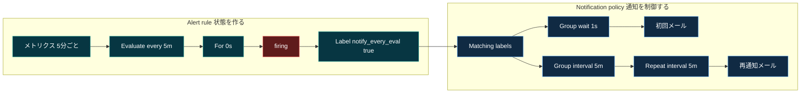
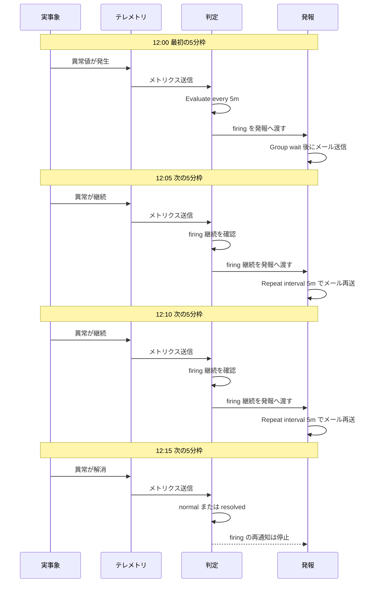
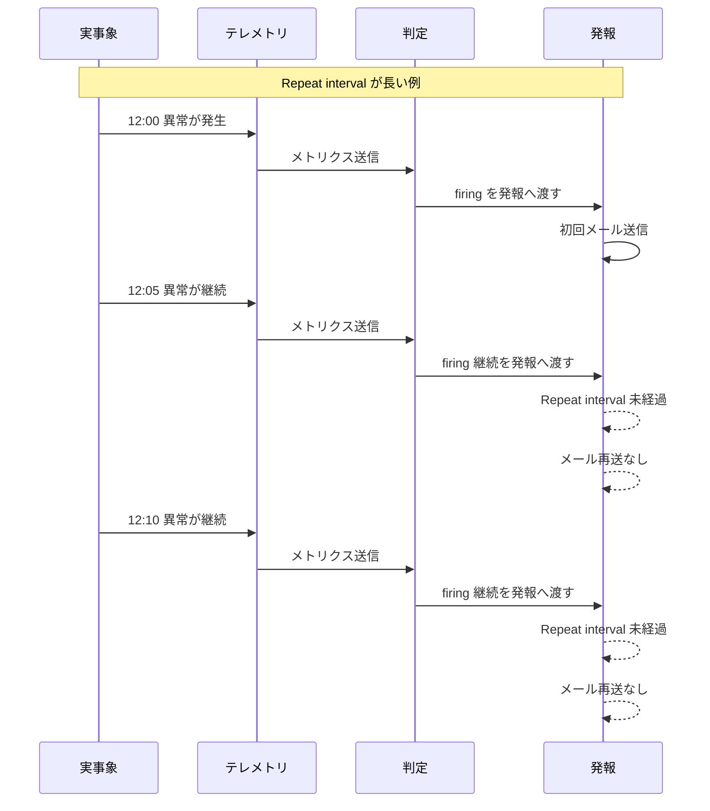
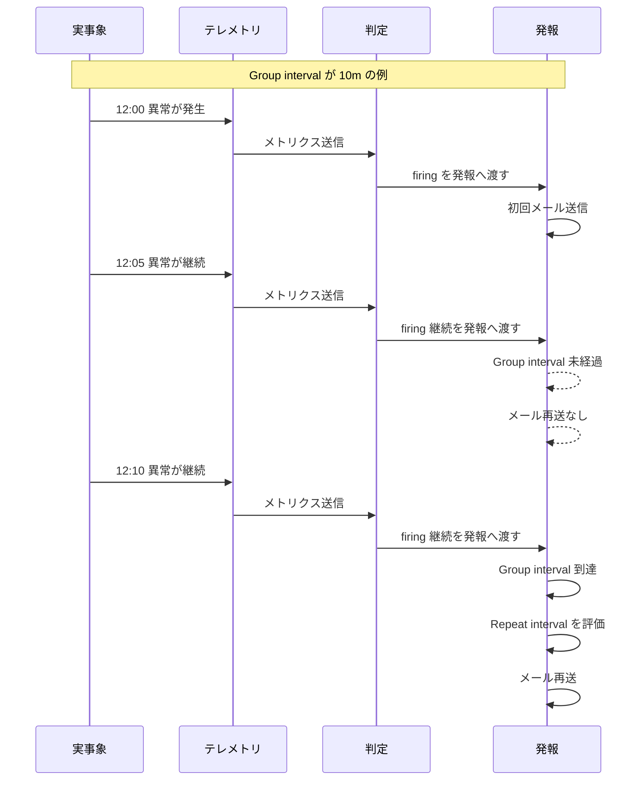
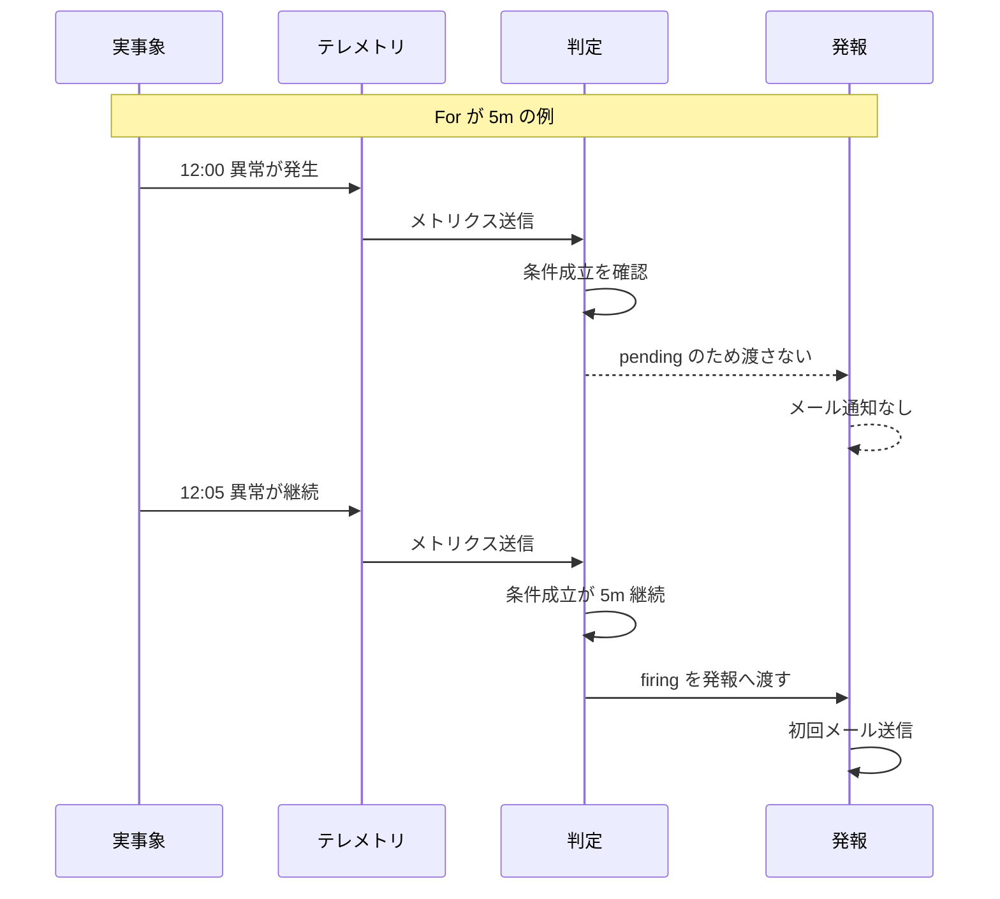
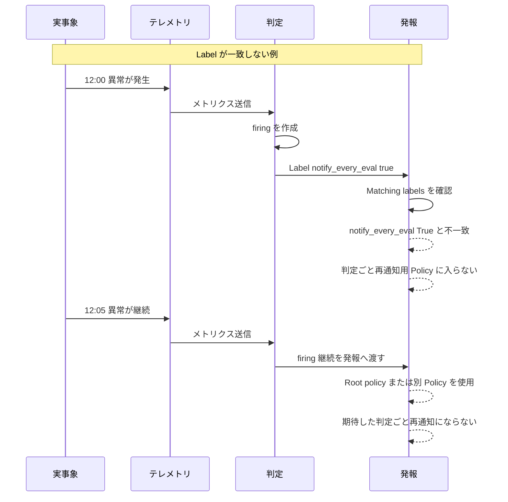
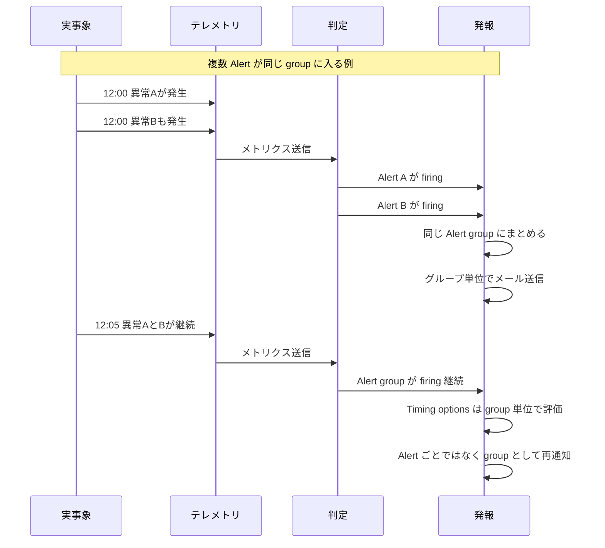

:::message
「[一般消費者が事業者の表示であることを判別することが困難である表示](https://www.caa.go.jp/policies/policy/representation/fair_labeling/guideline/assets/representation_cms216_230328_03.pdf)」の運用基準に基づく開示: この記事は記載の日付時点で[株式会社ソラコム](https://soracom.jp/)に所属する社員が執筆しました。ただし、個人としての投稿であり、株式会社ソラコムとしての正式な発言や見解ではありません。
:::

## TL;DR

- SORACOM Lagoon 3 / Grafana Alerting では、同じ条件が続いている 2 回目以降の評価は「新しい Alert」ではなく「同じ Alert の firing 継続」として扱われます。
- デフォルトの通知設計は、`normal -> firing` のときに発報し、`firing -> normal` のときに復旧通知を送るように、同じ Alert のメール通知を抑える方向で動きます。
- firing 継続中も判定のたびにメールを再通知したい場合は、Alert rule の評価間隔だけでなく、Notification policy の `Group interval` と `Repeat interval` を評価間隔にそろえます。
- この記事では 5 分周期のメトリクスを例に、`Evaluate every = 5m`、`Group interval = 5m`、`Repeat interval = 5m` にそろえる設定を扱います。
- Lagoon 3 では通知までの時間が厳密には保証されないため、「評価時刻と完全に同じ秒で通知する」設定ではなく、「評価タイミングに合わせて再通知される状態に近づける」設定として考えるのが安全です。
- 5 分周期でメトリクスを送る場合は、クエリ範囲を `last 5m` ぴったりにせず、`last 10m` や `last 15m` など少し広めに取ると、取り込みタイミングのずれを吸収しやすくなります。

## はじめに

SORACOM Lagoon 3 / Grafana Alerting の通知は、通常、Alert の状態変化をきっかけに送られます。
たとえば `normal -> firing` で異常発生を通知し、`firing -> normal` で復旧通知を送る、という使い方です。

この動きは、同じ Alert が firing のまま続いている間に何度もメールを送らないためには便利です。
一方で、設備監視やバッテリー監視のように「条件が解消していない間は、判定のたびに気づけるようにしたい」というケースもあります。

この記事では、メトリクスが 5 分に 1 回送られる環境を例に、firing 継続中の Alert を判定のたびにメール再通知する設定を整理します。

期待する動きは以下のようなものです。

```text
12:00 評価 -> firing -> メール通知
12:05 評価 -> firing 継続 -> メール再通知
12:10 評価 -> firing 継続 -> メール再通知
12:15 評価 -> normal -> firing 通知は送られない
```

このとき重要なのは、Alert rule の評価間隔だけでは再通知の間隔は決まらないことです。
Alert rule が 5 分ごとに評価されていても、Notification policy 側の再通知間隔が長いままだと、firing が続いてもメールは毎回送られません。

## 全体構成

今回の設定対象は、主に以下の 2 か所です。

| 対象 | 役割 |
|---|---|
| Alert rule | メトリクスを何分ごとに評価し、どの条件で firing にするかを決めます。 |
| Notification policy | firing になった Alert をどの Contact point に送り、どの間隔で再通知するかを決めます。 |

流れとしては、Alert rule で条件を評価し、Alert rule に設定した Label を使って Notification policy にルーティングします。
Notification policy にマッチした Alert は、Email の Contact point に通知されます。

```text
5分ごとのメトリクス
  -> Alert rule で5分ごとに評価
  -> 条件成立で firing
  -> Label で Notification policy にルーティング
  -> Email に初回通知または再通知
```

Lagoon 3 の公式ドキュメントでも、Alert rule、Contact point、Notification policy を組み合わせて Alert を制御する流れとして説明されています。

- [SORACOM Lagoon 3: Alert の概要](https://users.soracom.io/ja-jp/docs/lagoon-v3/alert-overview/)
- [SORACOM Lagoon 3: Alert rule を設定する](https://users.soracom.io/ja-jp/docs/lagoon-v3/setup-alert-rule/)
- [SORACOM Lagoon 3: Notification policy を設定する](https://users.soracom.io/ja-jp/docs/lagoon-v3/setup-notification-policy/)

## 事前準備

この記事では、以下が準備できている前提で進めます。

- SORACOM Lagoon 3 にログインできること
- Contact point や Alert rule を編集できる Lagoon ユーザーであること
- 5 分周期で送信されるメトリクスがあること
- 通知先にするメールアドレスを用意していること

## GUI で設定する手順

ここからは Lagoon 3 の画面操作で設定します。
この記事では、次の値で説明します。
実際の Alert 名、Folder、メールアドレス、しきい値は環境に合わせて変更してください。

| 項目 | 例 |
|---|---|
| Contact point 名 | `Mail-repeat-5m` |
| Alert rule 名 | `Battery alert repeat 5m` |
| Folder | `takao2` |
| Group | `Five minute evaluation` |
| Label | `notify_every_eval=true` |
| 通知先メールアドレス | `member@example.com` |

:::message
Notification policy では Contact point と Label を指定します。そのため、先に Email の Contact point を作り、次に Alert rule に Label を付け、最後に Notification policy で両者を関連付ける順にすると確認しやすいです。
:::

### ステップ 1: Email の Contact point を作成する

まず、Alert の通知先になる Email の Contact point を作成します。
Contact point は Editor ロールの Lagoon ユーザーで設定します。
画面に [New contact point] が表示されない場合は、Lagoon ユーザーのロールを確認してください。

1. Lagoon コンソールにログインします。
2. 左メニューの [Alerting] を開きます。
3. [Contact points] をクリックします。
4. [New contact point] をクリックします。
5. [Name] に `Mail-repeat-5m` を入力します。
6. [Contact point type] で [Email] を選択します。
7. [Addresses] に通知先メールアドレスを入力します。
8. 必要に応じて [Subject] と [Message] を設定します。空欄のままにするか、Grafana の default template を使う構成でもかまいません。
9. resolved 通知が不要な場合は [Disable resolved message] を有効にします。復旧通知も受け取りたい場合は無効のままにします。
10. [Save contact point] をクリックします。


公式ドキュメントのとおり、Email の Contact point では [Addresses] に通知先メールアドレスを指定します。
複数指定する場合は `;` で区切ります。
また、登録可能なメールアドレスは最大 25 件で、通知先メールアドレスを多く登録した場合はアラートメールの送信が遅延する場合があります。
今回のように再通知間隔を短くする構成ではメール数が増えやすいため、実運用では宛先を必要最小限にするか、チーム用のメーリングリストなどに集約するのが無難です。

参考:

- [SORACOM Lagoon 3: Contact point を設定する](https://users.soracom.io/ja-jp/docs/lagoon-v3/setup-contact-point/)

### ステップ 2: Alert rule の条件と評価間隔を設定する

次に、5 分ごとに評価する Alert rule を作成します。

1. 左メニューの [Alerting] を開きます。
2. [Alert rules] をクリックします。
3. [New alert rule] をクリックします。
4. [Lagoon managed alert] が選択されていることを確認します。
5. Query で監視対象のリソースと系列を選択します。
6. 5 分周期のメトリクスでは、評価範囲を `last 5m` ぴったりにせず、`now-10m to now` や `now-15m to now` など余裕を持たせます。
7. Expression で Reduce や Threshold を設定し、firing にしたい条件を作ります。
8. [Preview] をクリックし、条件の評価結果が想定どおりになることを確認します。


Query や Expression の中身は監視したいメトリクスによって変わります。
この記事の主題は通知間隔なので、既存の Alert 条件がある場合は、その条件を使ったまま次の評価間隔と Label の設定を確認してください。

続いて、Alert 条件の評価間隔を設定します。

1. [Evaluate every] に `5m` を入力します。
2. [for] に `0` を入力します。


`Evaluate every` は Alert rule の評価間隔です。
`for` は、Alert 条件を満たしてから Alert rule の State が `Firing` に変化するまでの待機時間です。
この間は条件を満たしていても `pending` として扱われ、通常は通知されません。
`0` にすると、条件を満たした評価で即座に `Firing` になります。

参考:

- [SORACOM Lagoon 3: Alert rule を設定する](https://users.soracom.io/ja-jp/docs/lagoon-v3/setup-alert-rule/)
- [SORACOM Lagoon 3: 温度が 24 ℃を上回ったら担当者にメールで通知する](https://users.soracom.io/ja-jp/docs/lagoon-v3/setup-simple-alert/)

### ステップ 3: Alert rule の詳細を設定する

Alert rule の名前、保存先、評価 Group を設定します。

1. [Rule name] に `Battery alert repeat 5m` を入力します。
2. [Folder] で保存先 Folder を選択します。スクリーンショットの例では `takao2` を選択しています。
3. [Group] に `Five minute evaluation` を入力します。


ここで設定する `Group` は、Alert rule の評価間隔を共有するためのグループです。
Notification policy で使う Alert group とは別の機能なので、混同しないようにします。

### ステップ 4: Alert rule に Label を設定する

続いて、Notification policy で使う Label を設定します。
現在の Lagoon 3 / Grafana Alerting の画面では、Label は [Notifications] セクションの [Custom Labels] で設定します。

1. [Notifications] セクションまでスクロールします。
2. [Custom Labels] の [Labels] に `notify_every_eval` を入力します。
3. 値に `true` を入力します。
4. Alert rule の内容を確認して [Save] をクリックします。


`notify_every_eval=true` は、判定のたびに再通知したい Alert を Notification policy に振り分けるための目印です。
Label 自体が通知を送るわけではありません。

### ステップ 5: 判定ごと再通知用の Notification policy を作成する

最後に、Alert rule の Label と Email の Contact point を関連付ける Notification policy を作成します。
ここでは Root policy ではなく、Specific routing の Policy を追加します。
画面に [New policy] や編集操作が表示されない場合は、Contact point と同様に Lagoon ユーザーのロールを確認してください。

1. 左メニューの [Alerting] を開きます。
2. [Notification policies] をクリックします。
3. [New policy] をクリックします。
4. [Matching labels] で [Add matcher] をクリックします。
5. [Label] に `notify_every_eval` を入力します。
6. [Operator] で `=` を選択します。
7. [Value] に `true` を入力します。
8. [Contact point] で、ステップ 1 で作成した `Mail-repeat-5m` を選択します。
9. 他の sibling policy も評価したい明確な理由がなければ、[Continue matching subsequent sibling nodes] はオフにします。

以下のスクリーンショットでは、画面再現用に既存の `dummy_email_will_not_send` を選択しています。
実運用では、ステップ 1 で作成した Email の Contact point を選択してください。


続いて Timing options を上書きします。

1. [Override general timings] をオンにします。
2. [Group wait] に `1s` を設定します。
3. [Group interval] に `5m` を設定します。
4. [Repeat interval] に `5m` を設定します。
5. [Save policy] または [Save] をクリックします。


Specific routing を使うと、`notify_every_eval=true` の Alert だけに、評価間隔に合わせた再通知設定を適用できます。
Root policy のタイミングを短くすると、他の Alert まで短い間隔で再通知される可能性があるため、対象 Alert が限定されている場合は Specific routing に分ける方が扱いやすいです。

参考:

- [SORACOM Lagoon 3: Notification policy を設定する](https://users.soracom.io/ja-jp/docs/lagoon-v3/setup-notification-policy/)

### ステップ 6: 動作確認する

Alert rule を保存すると評価が始まります。
条件が成立したら、Alert group に firing の Alert が表示され、Notification policy の条件に一致した Contact point へ通知されます。

確認するポイントは以下です。

- Alert rule の State が `Firing` になること
- Alert rule に `notify_every_eval=true` の Label が付いていること
- Notification policy の Matching labels が `notify_every_eval=true` と完全一致していること
- Email の Contact point に初回通知が届くこと
- firing が継続している間、前回通知からおおむね 5 分後に再通知されること

Lagoon 3 では、Alert rule の State が `Firing` になってから Contact point に実際に通知されるまでに数十秒から 1 分以上かかる場合があります。
そのため、メールの到着時刻が評価時刻と秒単位で一致しなくても、すぐに設定ミスとは判断せず、Notification policy の Label と Timing options を確認します。

## 各パラメータの意味

まず、今回の設定でどのパラメータがどこに効くのかを図にすると、以下のようになります。



左側の Alert rule は、メトリクスを評価して Alert の状態を作る部分です。
右側の Notification policy は、firing になった Alert をどこに送り、初回通知や再通知をどの間隔で出すかを制御する部分です。

### Evaluate every = 5m

`Evaluate every` は、Alert rule を何分ごとに評価するかを決める設定です。
今回はメトリクスが 5 分に 1 回送信される前提なので、Alert rule も 5 分ごとに評価します。

ただし、これだけでは判定のたびのメール再通知にはなりません。
Alert rule の評価は Alert の状態を更新するための設定であり、通知の再送間隔は Notification policy 側で制御されます。

### For / Pending period = 0s

`For` または `Pending period` は、条件が成立してから `firing` に遷移するまでの待機時間です。
この間は条件を満たしていても `pending` として扱われ、通常は通知されません。
`0s` にすると、条件を満たした評価で即座に firing になります。

```text
条件成立 -> すぐ firing
```

たとえば `5m` にすると、最初の条件成立時は `pending` になり、条件が 5 分以上継続して初めて `firing` になります。
これは一時的なスパイクや瞬間的なデータの揺れで通知しないためには有効です。
一方で、最初の通知はその分だけ遅れます。
今回のように「最初の判定から通知したい」場合は `0s` が向いています。

### Label: notify_every_eval = true

この Label は、通知を直接発火させる設定ではありません。
役割は、この Alert を専用の Notification policy にルーティングするための目印です。

```text
Alert rule に notify_every_eval=true を付ける
  -> Notification policy の Matching labels と一致する
  -> 判定ごと再通知用の Timing options が適用される
```

Label を使って Policy を分けることで、他の Alert の通知間隔には影響を与えず、対象 Alert だけを判定ごとの再通知にできます。

### Group wait = 1s

`Group wait` は、新しい Alert group に対する最初の通知を送る前に待つ時間です。
Grafana Alerting では、複数の Alert をまとめて通知するため、最初の通知前に少し待つ仕組みがあります。

今回の設定では `1s` としているため、firing になった後、できるだけ早く初回通知を送る意図になります。

```text
新しく firing になった
  -> 1秒待つ
  -> 初回メール通知
```

ただし、Lagoon 3 の公式ドキュメントでは、実際に Contact point に通知されるまでの時間は保証されず、数十秒から数分かかる場合があると説明されています。
そのため、`Group wait = 1s` は「Lagoon 3 / Grafana の通知処理に渡す前の待ち時間を短くする」設定であり、メールが必ず 1 秒後に届くことを保証するものではありません。

### Group interval = 5m

`Group interval` は、同じ Alert group に対して次の通知を送れるようになるまでの間隔です。
Alert group に新しい firing Alert が追加されたり、既存の Alert が resolved になったりした場合、この間隔に従って次の通知が送られます。

今回のように `Repeat interval = 5m` で再通知したい場合は、`Group interval` も 5 分にそろえるのが重要です。

### Repeat interval = 5m

`Repeat interval` は、同じ Alert group が変化せず firing のまま続いている場合に、リマインダーとして再通知するまでの間隔です。
今回の要件では、この設定が中心になります。

Grafana Alerting の公式ドキュメントでは、`Repeat interval` は `Group interval` がリセットされるタイミングで評価されると説明されています。
また、`Repeat interval` は `Group interval` 以上で、かつ `Group interval` の倍数である必要があります。

そのため、5 分ごとに再通知したい場合は、以下をそろえます。

```yaml
Group interval: 5m
Repeat interval: 5m
```

`Repeat interval = 5m` だけを設定し、`Group interval = 10m` のままにすると、再通知の判定自体が 10 分ごとのタイミングになり、期待通りに 5 分ごとには送られない可能性があります。

参考:

- [Grafana: Group alert notifications](https://grafana.com/docs/grafana/latest/alerting/fundamentals/notifications/group-alert-notifications/)

## なぜ判定のたびに再通知できるのか

Grafana Alerting では、同じ Alert が 2 回連続で条件を満たした場合、2 回目を「新しい Alert」として扱うわけではありません。
内部的には、同じ Alert instance または同じ Alert group が firing のまま継続している状態です。

```text
1回目の評価: 条件成立 -> firing に遷移
2回目の評価: 同じ Alert が firing のまま継続
3回目の評価: 同じ Alert が firing のまま継続
```

そのため、通常は評価のたびに新規通知が送られるわけではありません。
firing 継続中の再通知は、Notification policy の `Repeat interval` によって制御されます。

今回の設定では、以下の 2 つの周期を 5 分にそろえています。

```text
Alert rule の評価間隔: 5分
Notification policy の再通知間隔: 5分
```

その結果、firing が継続している間、5 分ごとの評価タイミングに合わせて再通知される動きに近づきます。

## タイムライン例

以下は動作イメージです。
実際の通知時刻は Lagoon 3 のデータ取得タイミング、Alert 評価タイミング、通知処理、メール配送によって前後します。



図のポイントは、12:05 や 12:10 の判定が新しい Alert を作っているのではなく、同じ Alert group の firing 継続を確認している点です。
判定が firing を発報へ渡し、発報側の `Group wait` や `Repeat interval` に従ってメール送信またはメール再送が行われます。

resolved 通知を送るかどうかは、Contact point や Notification policy の設定に依存します。
運用上、復旧通知も必要な場合は、firing 通知だけでなく resolved 通知の扱いもあわせて確認してください。

## 5分周期メトリクスでのクエリ範囲

メトリクスが 5 分に 1 回しか送信されない場合、評価範囲を `last 5m` ぴったりにすると、送信タイミングや Lagoon 3 側の取得タイミングのずれで、期待したデータ点が評価範囲から外れることがあります。
このような環境では、通知間隔とは別に、クエリの評価範囲にも少し余裕を持たせます。

```text
Query range: last 10m または last 15m
```

SORACOM Harvest Data や Lagoon 3 のデータソースを使う場合も、考え方は同じです。
メトリクス送信間隔と完全に同じ幅だけを見るのではなく、取り込みや評価タイミングのずれを吸収できる範囲を指定します。

## うまくいかない設定例

### Repeat interval が長い

`Repeat interval` がデフォルトのまま長い場合、firing が継続していても 5 分ごとには再通知されません。

```text
12:00 firing -> メール通知
12:05 firing 継続 -> メール通知なし
12:10 firing 継続 -> メール通知なし
...
```

::::details シーケンス図で見る



::::

firing 継続中のリマインダー通知を短くしたい場合は、Notification policy 側で `Repeat interval` を明示的に設定します。

### Group interval が Repeat interval より長い

`Repeat interval = 5m` でも、`Group interval = 10m` になっていると、同じ Alert group への通知判定が 10 分間隔に制限される可能性があります。

```text
12:00 firing -> メール通知
12:05 firing 継続 -> Group interval の都合で再通知されない可能性
12:10 firing 継続 -> メール再通知
```

::::details シーケンス図で見る



::::

5 分ごとの再通知を狙う場合は、`Group interval` も `5m` にそろえます。

### For / Pending period が長い

`For / Pending period = 5m` の場合、最初の条件成立ではまだ firing になりません。

```text
12:00 条件成立 -> pending、通知なし
12:05 条件成立継続 -> firing、通知
```

::::details シーケンス図で見る



::::

これは一時的な異常を抑制するには有効ですが、最初の通知を 1 評価分遅らせます。
今回のように最初の条件成立から通知したい場合は、`0s` にします。

### Label が Notification policy にマッチしていない

Alert rule 側の Label と Notification policy 側の Matching labels が一致していないと、意図した Policy にルーティングされません。

```text
Alert rule:
  notify_every_eval=true

Notification policy:
  notify_every_eval=True
```

::::details シーケンス図で見る



::::

このように大文字小文字や値がずれていると、別の Policy、または Root policy が使われます。
Label の key と value は完全一致で確認しましょう。

### Alert group に複数の Alert がまとまっている

Notification policy の Timing options は Alert group に対して適用されます。
同じ Alert group に複数の Alert が入る場合、通知は Alert ごとに 1 通ずつではなく、グループ単位でまとめられます。

::::details シーケンス図で見る



::::

対象 Alert だけを分けて扱いたい場合は、Label と Matching labels だけでなく、必要に応じて `Group by` の設計も確認してください。

## まとめ

SORACOM Lagoon 3 / Grafana Alerting で firing 継続中も判定のたびにメール再通知したい場合、Alert rule と Notification policy の両方をそろえる必要があります。

```yaml
Alert rule:
  Evaluate every: 5m
  For / Pending period: 0s
  Labels:
    notify_every_eval: true

Notification policy:
  Matching labels:
    notify_every_eval: true
  Contact point:
    Email
  Override general timings: ON
  Group wait: 1s
  Group interval: 5m
  Repeat interval: 5m
```

重要なのは、2 回連続で条件を満たしても、2 回目は新しい Alert ではなく同じ Alert の firing 継続として扱われる点です。
そのため、評価間隔だけでなく、firing 継続中の再通知を制御する `Repeat interval` を設定します。

また、`Repeat interval` は `Group interval` のリセット時に評価されるため、判定のたびの再通知を狙うなら `Group interval` も評価間隔にそろえます。
