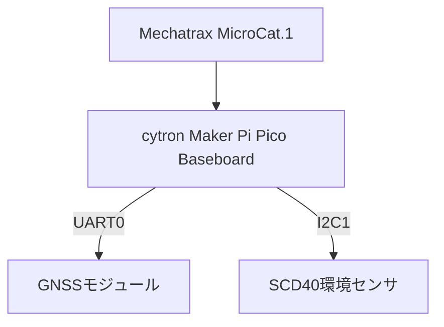
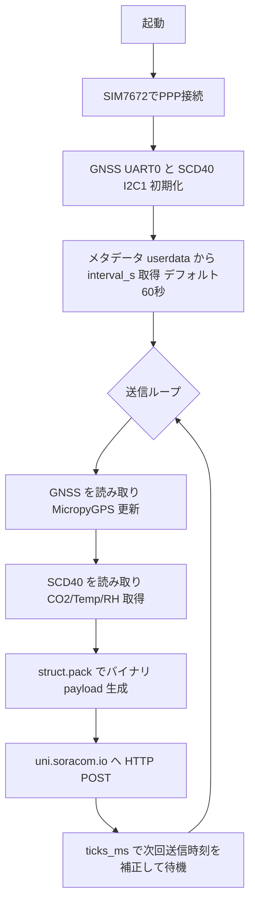

:::message
「[一般消費者が事業者の表示であることを判別することが困難である表示](https://www.caa.go.jp/policies/policy/representation/fair_labeling/guideline/assets/representation_cms216_230328_03.pdf)」の運用基準に基づく開示: この記事は記載の日付時点で[株式会社ソラコム](https://soracom.jp/)に所属する社員が執筆しました。ただし、個人としての投稿であり、株式会社ソラコムとしての正式な発言や見解ではありません。
:::

:::message
本記事は[積みボード/デバイスくずしAdvent Calendar 2025](https://qiita.com/advent-calendar/2025/tsumiboard)の18日目の記事です。
日頃積んだままになっているIoTデバイスに電源とSIMを入れて動かしつつ、今度もう一度動かしたくなったときにすぐ動かせるようにするための手順やノウハウをまとめ超個人的な備忘録です。
:::

## はじめに

MECHATRAX の MicroCat.1 を Raspberry Pi Pico（MicroPython）と組み合わせ、UART 接続の GNSS と I2C 接続の SCD40 を REPL で一歩ずつ確認する手順をまとめます。NMEA の生データ確認から `micropyGPS` でのパース、環境センサの動作確認までを「基本編」として記録しました。

## 使用機器
- MECHATRAX MicroCat.1

https://store.mechatrax.com/product.php?id=84

- cytron Technologies Maker Pi Pico Baseboard

https://www.switch-science.com/products/8350

- M5Stack用GPSユニット v1.1（UART0 接続、モジュール TXD → GP0、RXD → GP1）

https://www.switch-science.com/products/10037

- M5Stack用SCD40搭載CO2ユニット（温湿度センサ付き）（I2C1 接続、SCL = GP7、SDA = GP6、100kHz）

https://www.switch-science.com/products/8496



セットアップ写真


SIMの挿入


Baseboardだけの状態

## 使用ライブラリ

- GNSS: [micropyGPS](https://github.com/inmcm/micropyGPS) を `.mpy` 化して `lib/` に配置
- 環境センサ: [peter-l5/MicroPython_SCD4X](https://github.com/peter-l5/MicroPython_SCD4X) を `.mpy` 化して `lib/` に配置
- `.mpy` 生成には `mpy-cross` を使用

## センサ値の取得

VSCodeの拡張機能「MicroPico」を使って、MicroCat.1に接続します。

https://zenn.dev/takao2704/articles/mechatrax-microcat1-ide

の内容を前提にして作業を進めていきます。
個人的な趣味で、VSCodeにこだわっていますが、Thonnyなど他のIDEでも同様に進められます。

microCat.1に接続できていることを確認しましょう。


VSCodeのターミナルでREPLを開きます。


### GPSモジュール（UART）

Pico の UART0 で GNSS を読む手順です。屋外や窓際で衛星を掴ませてから試すとスムーズです。

#### UART に流れてくるデータを 1 行だけ確認

```python
from machine import UART, Pin
uart = UART(0, baudrate=115200, tx=Pin(0), rx=Pin(1), timeout=1000, timeout_char=100)
uart.readline()

# b'$GNRMC,082056.00,A,3545.30185,N,13939.70345,E,0.37,,261225,,,A,V*25\\r\\n'
```


- 上のように NMEA センテンスが返れば配線とボーレートは正しく、`None` のときは数秒待つか屋外で再試行します。

#### ループで流しっぱなしにする

引き続き、REPLを使って確認を進めていきます。
以下のコードを実行して、UARTからのNMEAセンテンスが連続で表示されることを確認します。

```python
while True:
    line = uart.readline()
    print(line.decode("ascii").strip())

```


- 生 NMEA が連続で見えるので、どのセンテンスが出ているかを把握できます。停止は `Ctrl+C`。

#### micropyGPS を入れて Pico へ送る

緯度経度などの必要な情報を取り出すにはNMEAセンテンスをパースする必要があります。
当然このような汎用的な処理は既存ライブラリに任せるのが良いでしょう。ここではmicropyGPSライブラリを使います。

microcat.1にライブラリを入れていく手順は以下の通りです。

今回は、`mpy-cross` を使って `.mpy` を作り、`lib/` に置いてから `./scripts/upload.sh` で microcat.1 に転送する方針とします。

REPLではなくシェルを開きます。


.mpyを作成して microcat.1 に転送するために使用する`upload.sh`スクリプトはこちらです。ダウンロードして実行できるようにしておいてください。
https://raw.githubusercontent.com/takao2704/public-zenn-docs/refs/heads/main/files/upload.sh


以下を実行していきます。

```bash
# 必要に応じてvenvなどで環境を分けてください
python3 -m pip install --user mpy-cross

# lib: .mpy を置く場所(microcat.1のlib/に対応)
# third_party/micropyGPS: 元ソースを置く場所
mkdir -p lib third_party/micropyGPS

# ソース・ファイルを取得
curl -sS -L https://raw.githubusercontent.com/inmcm/micropyGPS/master/micropyGPS.py \
     -o third_party/micropyGPS/micropyGPS.py

# ライセンスも含めておく
curl -sS -L https://raw.githubusercontent.com/inmcm/micropyGPS/master/LICENSE \
     -o third_party/micropyGPS/LICENSE

# .mpy 化して lib/ に置く
mpy-cross -o lib/micropyGPS.mpy third_party/micropyGPS/micropyGPS.py

# microcat.1 にアップロード
./upload.sh                 
# ./scripts/upload.sh /dev/cu.usbmodemXXXX  # ポートを指定したい場合
```

#### micropyGPS でパースして人間向けに表示する

ライブラリを介して、GPS情報を取得します。

`test.py` など適当名前のファイルを作成します。


`test.py` に以下のコードを貼り付けます。

```python
from machine import UART, Pin
from micropyGPS import MicropyGPS
from utime import ticks_ms, ticks_diff

uart = UART(0, baudrate=115200, tx=Pin(0), rx=Pin(1), timeout=1000, timeout_char=100)
gps = MicropyGPS(local_offset=9)  # JST は +9

last_sec = None
last_print = 0

while True:
    line = uart.readline()
    if not line:
        continue
    try:
        sentence = line.decode("ascii").strip()
    except UnicodeError:
        continue
    for ch in sentence:
        gps.update(ch)
    # 位置が有効になったら 1 秒に 1 回だけ表示する
    if gps.valid and gps.clean_sentences > 0:
        sec = int(gps.timestamp[2]) if gps.timestamp else -1
        now = ticks_ms()
        if sec != last_sec and ticks_diff(now, last_print) > 500:
            last_sec = sec
            last_print = now
            print("Lat:", gps.latitude_string(), "Lon:", gps.longitude_string(),
                  "Speed(km/h):", gps.speed_string('kph'),
                  "Sats:", gps.satellites_in_use,
                  "Time:", gps.timestamp, "Date:", gps.date)
```


「▷RUN」を押して実行します。


REPLに緯度経度、速度、衛星数、日時が表示されれば成功です。


- `gps.valid` が `True` のときだけ出力し、秒が変わったときに表示することで同じ内容の連続出力を抑制します。
- 生 NMEA も残したいときは `print(sentence)` を併記するとデバッグしやすくなります。

- 1 秒おきに表示したい場合は `ticks_ms()` で間引いてください。

### 環境センサ（I2C）
次に、SCD40 を I2C1 につないで CO2・温湿度を読んでみます。

#### 1. I2C デバイスが見えているか REPL で確認

以下のコードを REPL で実行し、`0x62`（10 進数で 98）が返れば SCD40 が認識されています。
```python
from machine import I2C, Pin
i2c = I2C(1, scl=Pin(7), sda=Pin(6), freq=100_000)
i2c.scan()
[98]   # 0x62 が返れば SCD40 を認識
```


#### SCD40 ライブラリを用意して Pico に入れる

先ほどと同様に、`.mpy` にして `lib/` へ置くだけです。

```bash
# third_party/scd4x_peter: 元ソースを置く場所
mkdir -p third_party/scd4x_peter

# ソース・ファイルを取得
curl -sS -L https://raw.githubusercontent.com/peter-l5/MicroPython_SCD4X/master/scd4x.py \
     -o third_party/scd4x_peter/scd4x.py

# ライセンスも含めておく
curl -sS -L https://raw.githubusercontent.com/peter-l5/MicroPython_SCD4X/master/LICENSE \
     -o third_party/scd4x_peter/LICENSE

# .mpy 化して lib/ に置く
mpy-cross -o lib/scd4x.mpy third_party/scd4x_peter/scd4x.py

# microcat.1 にアップロード
./upload.sh
# ./scripts/upload.sh /dev/cu.usbmodemXXXX  # ポートを指定したい場合
```

- 使うときは `from scd4x import SCD4X`。

#### スクリプトで計測する

```python
from machine import I2C, Pin
from utime import sleep
from scd4x import SCD4X  # lib/scd4x.mpy を使う

i2c = I2C(1, scl=Pin(7), sda=Pin(6), freq=100_000)
sensor = SCD4X(i2c)

sensor.start_periodic_measurement()
print("Waiting for first measurement (about 5s)...")
sleep(5)

try:
    while True:
        if sensor.data_ready:
            co2 = sensor.CO2
            temp = sensor.temperature
            rh = sensor.relative_humidity
            print("CO2: {} ppm | Temp: {:.2f} C | RH: {:.2f} %".format(co2, temp, rh))
        sleep(1)
except KeyboardInterrupt:
    print("Stopping...")
finally:
    sensor.stop_periodic_measurement()
```

- 初回取得まで約 5 秒かかるので待機します。以降は 5 秒間隔で CO2・温度・湿度を取得します。
- `read_measurement()` は無く、`CO2` / `temperature` / `relative_humidity` プロパティで取得します（プロパティが内部で `_read_data()` を呼び出してキャッシュ更新）。

## 通信インターフェースの制御

BG770A（SIM7672）を MicroPython から直接たたいて、HTTP と TCP/UDP での送受信を試します。SIM7672 ドライバと MicroPython 標準の `socket` / `requests` だけで再現します。

[基本的にはMicroCat.1のチラシ](https://mechatrax.com/uploads/microcat1-pre-flyer-correct.pdf)に書かれているサンプルコードを参考に実行していきます。


### SIM7672 ドライバで PPP を張る

まずはREPL から以下を実行します。

```python
import SIM7672

m = SIM7672.modem()
m.active(True)
m.connect('soracom.io', 'sora', 'sora', 'IP', 3)
# ちょっと待つ
m.isconnected()
m.ifconfig()

```


いけました。

- `m.connect()` が PPP を確立し、`ifconfig()` で IP が取れれば LTE 側の準備完了です。
- 切断するときは `m.disconnect()`。

これで土管ができたので、あとは `socket` や `requests` で通信できるはずです。
（このあたり別のブログで深堀りします。）

### HTTP でメタデータを取得する

土管ができたので、SORACOM メタデータサービスへ HTTP GET を投げてみます。

チラシによると、標準でrequestsを入れているなので信じてそのまま使います。
先程の続きで、REPL から以下を実行します。

::: message
ソラコムでメタデータを取得するには、SIM グループでメタデータサービスを有効化しておく必要があります。SORACOM コンソールの SIM グループ設定で「メタデータサービス」をオンにしてください。
https://users.soracom.io/ja-jp/docs/air/use-metadata/#%e3%83%a1%e3%82%bf%e3%83%87%e3%83%bc%e3%82%bf%e3%82%b5%e3%83%bc%e3%83%93%e3%82%b9%e3%82%92%e8%a8%ad%e5%ae%9a%e3%81%99%e3%82%8b
:::

```python
import requests

url = "http://metadata.soracom.io/v1/subscriber"
resp = requests.get(url)
print("Status:", resp.status_code)
print(resp.text)
resp.close()
```

実行例：


urlを変えて、ユーザーデータも取得してみます。
```python
url = "http://metadata.soracom.io/v1/userdata"
resp = requests.get(url)
print("Status:", resp.status_code)
print(resp.text)
resp.close()
```

実行例：


メタデータに設定した内容が正しく表示されていました。


これでGETリクエストは成功です。

### HTTP POST で Harvest Data へ送る

Harvest Data を有効化して SIM グループで、Unified Endpoint (`http://uni.soracom.io/`) に JSON を POST します。

:::message
本作業の前にSORACOM コンソールの SIM グループ設定で「Harvest Data」をオンにしてください。
https://users.soracom.io/ja-jp/docs/harvest/enable-data/
:::

セッションを維持しながら先程の続きで、1行ずつ REPL で実行していきます。

```python
payload = {"temp": 20.0,"lat":35.677097,"lon":139.73295}
resp = requests.post("http://uni.soracom.io/", json=payload)
print("Status:", resp.status_code)
resp.close()
```

実行例：

- ステータスコード 201 が返れば Harvest 側に保存されています。本文が空でも送信は成功しています。

### バイナリペイロードを組み立てる

`struct.pack("<fdd", ...)` で `float + double + double`（20 バイト）を 1 つのバイト列にまとめます。
バイナリパーサーは `temperature::float:32:little-endian latitude::float:64:little-endian longitude::float:64:little-endian` とします。

https://users.soracom.io/ja-jp/docs/binary-parser/usage/


このあとの、TCP/UDP 送信用ペイロードを組み立てるコードを REPL から実行します。

```python
import struct

TELEMETRY_TEMP = 20.0
TELEMETRY_LAT = 35.677097
TELEMETRY_LON = 139.73295

payload = struct.pack("<fdd",TELEMETRY_TEMP,TELEMETRY_LAT,TELEMETRY_LON)
print("payload length:", len(payload))
```

実行例：


| オフセット | 型 | 意味 | サイズ |
| --- | --- | --- | --- |
| 0 byte | `float` | 温度 (`TELEMETRY_TEMP`) | 4 byte |
| 4 byte | `double` | 緯度 (`TELEMETRY_LAT`) | 8 byte |
| 12 byte | `double` | 経度 (`TELEMETRY_LON`) | 8 byte |

### TCP でバイナリを送る

MicroPython 標準の `socket`（`usocket`）をそのまま使います。

ここまでの動作に引き続いて、REPL から以下を実行します。

```python
import usocket as socket

TCP_HOST = "uni.soracom.io"
TCP_PORT = 23080
TCP_TIMEOUT = 10

addr = socket.getaddrinfo(TCP_HOST, TCP_PORT)[0][-1]
sock = socket.socket()

sock.settimeout(TCP_TIMEOUT)
sock.connect(addr)
sock.send(payload)
resp = sock.recv(64)
print("TCP recv:", resp)
sock.close()
```

実行例：


- `getaddrinfo()` で IPv4/IPv6 を問わず解決し、`socket.socket()` だけで TCP クライアントを張れます。

### UDP でバイナリを送る

同じペイロードを UDP でも送信します。Unified Endpoint は TCP/UDP 共通で `uni.soracom.io:23080` です。

引き続き、REPL から以下を実行します。

```python
UDP_HOST = "uni.soracom.io"
UDP_PORT = 23080
UDP_TIMEOUT = 10

addr = socket.getaddrinfo(UDP_HOST, UDP_PORT)[0][-1]
sock = socket.socket(socket.AF_INET, socket.SOCK_DGRAM)

sock.settimeout(UDP_TIMEOUT)
sock.sendto(payload, addr)
resp = sock.recv(64)
print("UDP recv:", resp)
sock.close()
```

実行例：


- TCP と UDP の差分は `SOCK_STREAM` か `SOCK_DGRAM` かだけで、MicroPython の標準 `socket` で両方書けます。

### Harvest Data で確認する

Harvest Data コンソールで対象 SIM の「データ」タブを開き、HTTP POST で送った JSON と、TCP/UDP のバイナリが保存されていることを確認してください。バイナリは設定したパーサーに従って `temperature` / `latitude` / `longitude` に展開されます。


## 仕上げ

ここまでで確認した流れをスクリプトにまとめて、MicroCat.1 上で動かせば完成です。GNSS から位置情報を取得し、SCD40 から環境情報を取得して、SORACOM Harvest Data に送信するまでを 1 つのスクリプトで実行できます。

LTEのセッションを確立し
最初にメタデータ（userdata）で取得した
```json
{
  "interval_s": 10
}
```
の `interval_s` を使って、送信間隔を10秒に設定して、

その後はセンサーからの情報取得と送信を繰り返すようにします。

### 完成スクリプト例（GNSS + SCD40 + Harvest Data 送信）

UART0 に GNSS、I2C1 に SCD40 を接続し、SIM7672（UART1）で PPP を張る前提です。メタデータに `userdata.interval_s` が無い場合は 60 秒で送信します。


```python
import time
import ujson
import struct
import requests
import SIM7672
from machine import UART, Pin, I2C
from micropyGPS import MicropyGPS
from scd4x import SCD4X

# GNSS (UART0)
GNSS_UART = UART(0, baudrate=115200, tx=Pin(0), rx=Pin(1), timeout=1000, timeout_char=100)
gps = MicropyGPS(local_offset=9)

# SCD40 (I2C1)
i2c = I2C(1, scl=Pin(7), sda=Pin(6), freq=100_000)
scd = SCD4X(i2c)
scd.start_periodic_measurement()

# SIM7672 (PPP)
modem = SIM7672.modem()
modem.active(True)
modem.connect('soracom.io', 'sora', 'sora', 'IP', 3)
while not modem.isconnected():
    time.sleep(0.5)
print("PPP:", modem.ifconfig())

def fetch_interval(default=60):
    try:
        resp = requests.get("http://metadata.soracom.io/v1/userdata", timeout=10)
        data = ujson.loads(resp.text)
        resp.close()
        return int(data.get("interval_s", default))
    except Exception as e:
        print("metadata error:", e)
        return default

def read_gnss(timeout_ms=5000):
    deadline = time.ticks_add(time.ticks_ms(), timeout_ms)
    while time.ticks_diff(deadline, time.ticks_ms()) > 0:
        line = GNSS_UART.readline()
        if not line:
            continue
        try:
            sentence = line.decode("ascii").strip()
        except UnicodeError:
            continue
        for ch in sentence:
            gps.update(ch)
        if gps.valid and gps.clean_sentences > 0:
            lat = gps.latitude[0] + gps.latitude[1] / 60
            lon = gps.longitude[0] + gps.longitude[1] / 60
            return (lat, lon, gps.satellites_in_use)
    return (None, None, 0)

def read_scd40():
    try:
        if scd.data_ready:
            return (scd.CO2, scd.temperature, scd.relative_humidity)
    except Exception:
        pass
    return (None, None, None)

def build_payload(co2, temp, rh, lat, lon):
    temp_val = temp if temp is not None else 20.0
    lat_val = lat if lat is not None else 0.0
    lon_val = lon if lon is not None else 0.0
    return struct.pack("<fdd", float(temp_val), float(lat_val), float(lon_val))

interval = fetch_interval()
print("send interval (s):", interval)
interval_ms = int(interval * 1000)
next_at = time.ticks_add(time.ticks_ms(), interval_ms)

while True:
    lat, lon, sats = read_gnss()
    co2, temp, rh = read_scd40()
    payload = build_payload(co2, temp, rh, lat, lon)

    # JSON で Harvest に送る（バイナリを使いたい場合は前述の TCP/UDP 例を利用）
    body = {"co2": co2, "temp": temp, "rh": rh, "lat": lat, "lon": lon, "sats": sats}
    try:
        resp = requests.post("http://uni.soracom.io/", json=body, timeout=10)
        print("POST status:", resp.status_code, "body:", resp.text)
        resp.close()
    except Exception as e:
        print("POST error:", e)

    # 送信間隔を一定にする（処理時間分を補正）
    next_at = time.ticks_add(next_at, interval_ms)
    wait_ms = time.ticks_diff(next_at, time.ticks_ms())
    if wait_ms < 0:
        # 遅れているときは直ちに送信スケジュールを積み直す
        next_at = time.ticks_add(time.ticks_ms(), interval_ms)
    else:
        time.sleep_ms(wait_ms)
```

#### 処理フロー（Mermaid）



上記の内容を`test.py` としてVSCodeのエディタに保存し、左下の「▷RUN」ボタンを押して実行します。


- GNSS を UART0 に置いたため、SIM7672（UART1）と競合しません。GNSS が無い場合は `read_gnss()` が `None` を返し、緯度経度は 0.0 として送信されます。
- SCD40 が未接続のときは CO2/温度/湿度が `None` で送られます。必要に応じてデフォルト値を差し込んでください。
- バイナリ送信に切り替える場合は、ここで組み立てた `payload` を前述の TCP/UDP 例で送信すれば Harvest Data のバイナリパーサーで展開できます。

ちゃんと動いたら、ファイル名を `main.py` に変更して microCat.1 にアップロードしてください。電源投入時に自動実行されます。


しばらくして、右下に

の表示が出れば後は再起動したら自動的に動きます。

お疲れ様でした！！
