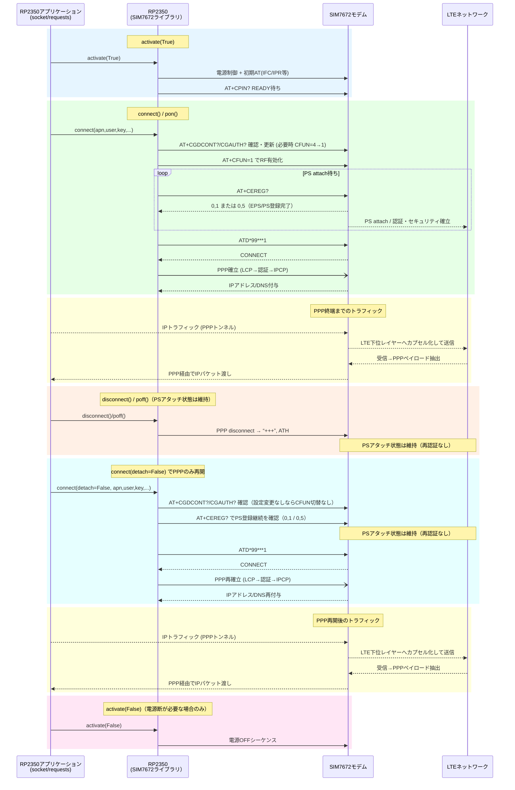

:::message
「[一般消費者が事業者の表示であることを判別することが困難である表示](https://www.caa.go.jp/policies/policy/representation/fair_labeling/guideline/assets/representation_cms216_230328_03.pdf)」の運用基準に基づく開示: この記事は記載の日付時点で[株式会社ソラコム](https://soracom.jp/)に所属する社員が執筆しました。ただし、個人としての投稿であり、株式会社ソラコムとしての正式な発言や見解ではありません。
:::

:::message
本記事は[積みボード/デバイスくずしAdvent Calendar 2025](https://qiita.com/advent-calendar/2025/tsumiboard)の19日目の記事です。
日頃積んだままになっているIoTデバイスに電源とSIMを入れて動かしつつ、今度もう一度動かしたくなったときにすぐ動かせるようにするための手順やノウハウをまとめ超個人的な備忘録です。
:::

## はじめに

MicroPython から MicroCat.1 を使って通信する場合、典型的には次のようなコードになります。

```python
import SIM7672

m = SIM7672.modem()
m.active(True)
m.connect('soracom.io', 'sora', 'sora', 'IP', 3)
```

この数行で LTE 回線が使えるようになりますが、`connect()` が何をしているのかはよくわかりません。

このブログではこの数行でどのようなシーケンスが起きているのか、
* LTE の attach はどこで行われているのか
* APN 設定や PDP コンテキストはいつ確立されるのか
* PPP はどのレイヤで動いているのか
* `active(True)` と `connect()` の違いは何か

といった点を深堀りして行きます。

本記事では、**SIM7672.py の実装と実際のログ**を元に、
MicroCat.1 における通信処理をレイヤごとに分解して解説します。


## 全体像：MicroPython + PPP 方式の通信スタック

MicroCat.1 の通信構成は、いわゆる **PPP（Point-to-Point Protocol）方式**です。


この構成の重要なポイントは以下です。

### MicroPython (RP2350) 側のスタック

* **HTTP / requests**: アプリケーション層の HTTP クライアント
* **TCP/UDP / socket**: トランスポート層（Python の socket API）
* **IP / lwIP**: ネットワーク層（軽量 TCP/IP スタック）
* **PPP / Network.ppp**: データリンク層（PPP プロトコル）
* **UART / Machine.uart**: 物理層（シリアル通信）

### プロトコルブリッジ

* **PPP (ATD*99#)**: モデム側での PPP セッション確立
* **UART (serial)**: 物理的なシリアル接続

### SIM7672 Modem 側のスタック

* **IP**: ネットワーク層（PDP Context / APN: soracom.io）
* **PDCP**: Packet Data Convergence Protocol（パケット圧縮・暗号化）
* **RLC**: Radio Link Control（再送制御）
* **MAC**: Medium Access Control（無線リソース割当）
* **PHY**: 物理層（LTE Radio）

### データフロー

* **左→中央**: PPP フレームとして UART 経由でモデムへ
* **中央→右**: PDP Context を通じて IP パケットを LTE 網へ
* **IP 層**: マイコン側とモデム側で論理的に接続（点線）

つまり、IP 層より上はマイコンが処理、IP 層より下の無線部分はモデムが処理という明確な分担です。

これは、`AT+NETOPEN` や `AT+CIPOPEN` を使うモデム内蔵 TCP/IP（ATソケット方式）とは別物です。




## SIM7672 ライブラリの役割

`SIM7672.py` は「通信ライブラリ」というより、`PPP を開始できる状態を整えるためのモデム制御ライブラリ`です。

具体的には次の処理を担います。

* 電源・リセット制御
* AT コマンドによる状態確認
* PSアタッチ完了待ち
* PDPコンテキスト設定の整合性確認
* PPP ダイヤルのトリガ

IP通信そのもの（TCP/UDP/HTTP）は一切行いません。


## 実際のログ取得手順と抜粋

ソースコードを見た感じ理屈的にはここまでの記述のようになるのですが、百聞は一見にしかず、論より証拠です。実際に `connect()` 実行時の AT コマンドログを取得してみましょう。

### REPL 実行例（`debug=True`）

`debug=True` を付けると、`connect()` 内部の AT 送受信が REPL にそのまま出ます。実際の接続シーケンスは次の通りです。
`#`から始まる行は説明のために追加したコメントです。


:::details `debug=True`実行例ログ全文
```
MicroPython v1.27.0-1.gfc07f56013 on 2025-12-11; MechaTracks MicroCat.1 with RP2350
Type "help()" for more information or .help for custom vREPL commands.

>>> import SIM7672
>>> m = SIM7672.modem(debug=True)
>>> m.active(True)
>>> m.connect('soracom.io', 'sora', 'sora', 'IP', 3)
# ここから AT ログ抜粋
# コマンド"AT"の送信
AT

b'AT\r\r\n'
b'OK\r\n'

# コマンド"AT+CEREG?"（PSアタッチ状態確認）の送信
AT+CEREG?

b'AT+CEREG?\r\r\n'

# コマンド"+CEREG: 0,5"の受信(PSアタッチ完了)
# おそらく、前回実施した接続設定により電源ON時に自動アタッチされている
b'+CEREG: 0,5\r'
b'\n'
b'\r\n'
b'OK\r\n'

# コマンド"AT+IFC?"(フロー制御設定確認)の送信
AT+IFC?

b'AT+IFC?\r\r\n'

# コマンド"+IFC: 0,0"の受信(フロー制御なし)
b'+IFC: 0,0\r\n'
b'\r\n'
b'OK\r\n'

# コマンド"AT+IFC=2,2"(RTS/CTS設定)の送信
AT+IFC=2,2

b'AT+IFC=2,2\r\r\n'

# コマンド"OK"の受信
b'OK\r\n'

# コマンド"AT+IPR?"(ボーレート確認)の送信
AT+IPR?

b'AT+IPR'
b'?\r\r\n'

# コマンド"+IPR: 115200"の受信(ボーレート115200)
b'+IPR: 115200\r\n'
b'\r\n'
b'OK\r\n'

# コマンド"AT+CPIN?"(SIM状態確認)の送信
AT+CPIN?

b'AT+CPIN?\r\r\n'

# コマンド"+CPIN: READ"の受信(SIM準備完了)
b'+CPIN: READ'
b'Y\r\n'
b'\r\n'
b'OK\r\n'

# コマンド"AT+CGDCONT?"(PDPコンテキスト確認)の送信
AT+CGDCONT?

b'AT+CGDCONT?\r\r\n'

# コマンド"+CGDCONT: 1,"IP","soracom.io",164.98.251"の受信(PDP設定確認)
b'+CGDCONT: 1'
b',"IP","sorac'
b'om.io","10.'
b'164.98.251"\r'
b'\n'
b'\r\n'
b'OK\r\n'

# コマンド"AT+CGAUTH?"(認証設定確認)の送信
AT+CGAUTH?

b'AT+CGAUTH?\r\r\n'

# コマンド"+CGAUTH: 1,2,"sora","sora""の受信(認証設定確認)
b'+CGAUTH: 1,2'
b',"sora","sor'
b'a"\r\n'
b'\r\n'
b'OK\r\n'

# コマンド"CFUN=4"(RF一時停止)の送信
AT+CFUN=4

b'AT+CFUN'
b'=4\r'
b'\r\n'
b'OK\r\n'

# コマンド"AT+CGDCONT=1,"IP","soracom.io""(PDP設定更新)の送信
AT+CFUN=1

b'AT+CFUN=1\r\r\n'
b'OK\r\n'

# コマンド"AT+CPIN?"(SIM状態確認)の送信
AT+CPIN?

b'AT+CPIN?\r\r\n'
b'+CPIN: READY\r\n'
b'\r\n'
b'OK\r\n'

# コマンド"AT+CEREG?"（PSアタッチ状態確認）の送信（リセット後初回）
AT+CEREG?

b'AT+CEREG?\r\r\n'

# コマンド"+CEREG: 0,2"の受信(まだサーチ中)
b'+CEREG: 0,2\r\n'
b'\r\n'
b'OK\r\n'

# コマンド"AT+CEREG?"（PSアタッチ状態確認）の送信（2回目）
AT+CEREG?

b'AT+CER'
b'EG?\r\r\n'

# コマンド"+CEREG: 0,2"の受信(まだサーチ中)
b'+CEREG: 0,2\r\n'
b'\r\n'
b'OK\r\n'

# コマンド"AT+CEREG?"（PSアタッチ状態確認）の送信（3回目）
AT+CEREG?

b'AT+CER'
b'EG?\r\r\n'

# コマンド"+CEREG: 0,2"の受信(まだサーチ中)
b'+CEREG: 0,2\r\n'
b'\r\n'
b'OK\r\n'

# コマンド"AT+CEREG?"（PSアタッチ状態確認）の送信（4回目）
AT+CEREG?

b'AT+CERE'
b'G?\r\r\n'

# コマンド"+CEREG: 0,2"の受信(まだサーチ中)
b'+CEREG: 0,2\r\n'
b'\r\n'
b'OK\r\n'

# コマンド"AT+CEREG?"（PSアタッチ状態確認）の送信（5回目）
AT+CEREG?

b'AT+CERE'
b'G?\r\r\n'

# コマンド"+CEREG: 0,2"の受信(まだサーチ中)
b'+CEREG: 0,2\r\n'
b'\r\n'
b'OK\r\n'

# コマンド"AT+CEREG?"（PSアタッチ状態確認）の送信（6回目）
AT+CEREG?

b'AT+CER'
b'EG?\r\r\n'

# コマンド"+CEREG: 0,5"の受信(ローミング登録完了)
b'+CEREG: 0,5\r\n'
b'\r\n'
b'OK\r\n'

# コマンド"ATD*99***1#"(PPPダイヤル)の送信
ATD*99***1#

b'ATD*99***1#\r'
b'\r'
b'\n'

# コマンド"CONNECT"の受信(PPP確立完了)
b'CONNECT\r\n'
>>> 
```
:::
#### ざっくり解説
RTS/CTS への切り替え（`AT+IFC=2,2`）、ボーレート確認（`AT+IPR?`）、APN と認証の確認（`AT+CGDCONT?` / `AT+CGAUTH?`）、必要に応じた RF 一時停止（`CFUN=4/1`）、PSアタッチ完了待ち（`CEREG=0,1/0,5`）、そして `ATD*99***1#` による PPP 開始までの一連が分かります。

このログから、CEREG の登録完了を待ったうえで `ATD*99***1#` により PPP ネゴシエーションが始まり、IPCP で IP/DNS が付与されていることが分かります。

## `active(True)` 内の処理

`active(True)` は 通信を開始する API ではありません。

### 役割

ログを出すことができないので、(ソースコード)[https://github.com/mechatrax/micropython/blob/fc07f5601332d42e2a475a5d970e74b580a3f034/ports/rp2/boards/MTX_MICROCAT1/modules/SIM7672.py#L216C48-L216C49]を見てみましょう。

```python
    def active(self, activate=None, reset=True):
        if activate is True:
            if reset and self.__status_pin.value() == 1:
                self.reset()
            else:
                self.poweron()
            return
        if activate is False:
            self.poweroff()
            return
        return self.__status_pin.value() == 1
```

* モデム電源 ON / OFF 制御
* 必要に応じたリセット

ここから呼ばれている`poweron()` / `poweroff()`は電源制御のための GPIO 操作のみを行っており、ATコマンドや、PPP制御は含みません。
つまり、モデムの電源を入れたり切ったりするだけです。

### `reset=True` の意味

* デフォルトの `active(True)` は **すでに電源が入っている場合にリセットをかける**
  * `status` ピンが 1 なら `reset()` を実行し、RF/PSアタッチ/PPP を含めて全て再起動
  * 完全にやり直すときは便利だが、PSアタッチを維持したいケースでは無駄になる
* 電源が落ちている場合はそのまま `poweron()` を実行
* 既存の状態を残したまま電源オン確認だけしたい場合は `active(True, reset=False)` を使う

## `connect()` 内の処理

`connect()` は **PPP を張るための API**です。呼び出し時に APN/ユーザー名/パスワード/PDP タイプを与え、`security=3`（CHAP|PAP 許可）で認証方式も指定します。

### 実際の処理フロー（`debug=True` のログより）

* AT 疎通を確認し、`AT+IFC=2,2` で RTS/CTS に切り替えたうえで `AT+IPR?` で UART のボーレートを確認します。
* `AT+CPIN?` で SIM 状態を確認し、`AT+CEREG?` で登録状況を確認します（`0,1` はホーム登録、`0,5` はローミング登録）。
* `AT+CGDCONT?` / `AT+CGAUTH?` で PDP と認証設定を照合し、更新が必要なら `CFUN=4` で RF を一時停止してから設定し、`CFUN=1` で復帰します。
* `CEREG` が `0,1` または `0,5` になるまでポーリングし、PSアタッチ完了を待ちます。
* `ATD*99***1#` で PPP セッションを要求し、LCP → PAP/CHAP → IPCP の順にネゴシエートして IP アドレスと DNS を取得します。

この時点で初めて **IPアドレスと DNS**が得られます。

### CEREG の見方（抜粋）

* `0,1` 登録（ホーム） / `0,5` 登録（ローミング） → PPP 続行
* `0,2` サーチ中 → 一定時間待つ
* `0,3` 拒否 / `0,4` 一時的にサービス無し / `0,90` UTRAN/E-UTRAN 拒否 / `0,99` 不明 → SIM・電波・APN を切り分ける


## PSアタッチ・PDP・PPP の関係整理

ここで、いくつかの種類のセッションについての制御が出てきたので、混同しやすい3つを整理します。
最初のプロトコル・スタックと各ライブラリの関係図を再掲します。
ここに各セッションにどのような名前がついているかを対応させたものが以下です。


| 項目 | 意味 |
| --- | --- |
| PSアタッチ（Packet-Switched attach） | LTE ネットワークへの登録 |
| PDP コンテキスト（Packet Data Protocol context） | APN・認証を含むデータセッション定義 |
| PPP（Point-to-Point Protocol） | マイコンとモデム間のリンクプロトコル（IP をペイロードとして運ぶ） |

* PSアタッチが完了しないと PDP は使えない
* PDP が存在しないと PPP は張れない（`ATD*99***1#` は指定 CID の PDP を参照する）
* IPアドレスは PPP の IPCP で取得される（上記ログの `CONNECT` 後に lwIP が IPCP ネゴシエーションを行い、`ifconfig()` で確認可能）

## `disconnect()` / `active(False)` / `active(reset=True)` / `poweroff()` の違い

この4つは **切るレイヤが全く違います**。実装を見ると、`active(False)` は内部で `poweroff()` を呼ぶだけで RF だけをオフにする経路はありません。`active(reset=True)` は電源が入っている場合にハードリセットをかけ、再起動させます。

| API                  | 切るもの | 影響・復帰 |
| -------------------- | --- | --- |
| `disconnect()`       | PPP のみ | PSアタッチ・PDP を維持しつつ PPP を終了。再 `connect()` が速い |
| `active(False)`      | モデム電源（= `poweroff()`） | GPIO で電源断。PPP / PSアタッチ / PDP など状態は全て消失。復帰は `active(True)` → `connect()` |
| `active(reset=True)` | モデムを再起動（リセットピン駆動） | 電源 ON 時は `reset()` で再起動（PS/PDP/PPP は落ちるが電源断より復帰が速い）。電源 OFF 時は `poweron()`。状態維持したいなら `active(True, reset=False)` |
| `poweroff()`         | モデム電源 | UART を初期化に戻してから電源断し、`status` ピン 0 まで待機。復帰コスト大（PSアタッチもやり直し） |


## シーケンスに含まれないAT コマンドで情報を取得したいときにはどうすればいいか？

実は今回のブログ、これを調べたかったために書いたものになります。
これまでの記述の通りconnect()を行うと、modemの電源を入れるだけではなくPSアタッチをして、PDPコンテキストを確立し、さらにPPPセッションを確立するところまで一気に行います。

PPP 確立後、UART は `データモード` になるため、この状態で AT コマンドを送ると PPP フレームとして扱われてしまいます。

例えば、モデムの情報や、電波状況、SIMに関する情報を取得したい場合はLTE modemがATコマンドを受け付ける`コマンドモード`のときに実行する必要があります。
そのタイミングは以下の2つです。

1. `active(True)` を実行してモデムの電源を入れた直後（PSアタッチ前）
2. `disconnect()` を実行して PPP セッションを切断した直後（PSアタッチ・PDP は維持）

現時点で試した結果、1. のタイミングではうまくいったのですが、2. のタイミングではうまくいきませんでした。
ひとまず、1. のタイミングであれば以下のようにして AT コマンドを送ることができます。

下記をローカルのファイルに保存して、IDEの`RUN`ボタンをクリックし、MicroCat.1上で実行してください。

```python
import SIM7672, time

def main():
    print("[INIT] modem/debug")
    m = SIM7672.modem(debug=True)
    m.active(True)

    send = getattr(m, '__send')
    recv = getattr(m, '__receive')
    uart = getattr(m, '__uart')

    time.sleep_ms(15000)

    def send_wait(label, cmd, timeout=5000):
        print(f"[CMD] {label} -> {cmd}")
        if not cmd.endswith('\r\n'):
            cmd += '\r\n'
        uart.read(uart.any())
        send(cmd)
        buf = []
        deadline = time.ticks_add(time.ticks_ms(), timeout)
        while time.ticks_diff(deadline, time.ticks_ms()) > 0:
            line = recv(timeout=50)
            if line is None:
                continue
            buf.append(line)
            if line.endswith('OK') or 'ERROR' in line:
                break
        print(f"[RESP] {label}:", buf)
        time.sleep_ms(200)
        return buf

    # connect前に実行したいATをここで全部流す
    for label, cmd in [
        ("ATI",     "ATI"),
        ("CSQ",     "AT+CSQ"),
        ("CEREG",   "AT+CEREG?"),
        ("CIMI",    "AT+CIMI"),
        ("CICCID",  "AT+CICCID"),
        ("COPS?",   "AT+COPS?"),
        ("CPSI?",   "AT+CPSI?"),
        ("CBC",     "AT+CBC"),
        ("CPMUTEMP","AT+CPMUTEMP"),
    ]:
        send_wait(label, cmd)

    print("[STEP] connect PPP")
    m.connect('soracom.io', 'sora', 'sora', 'IP', 3)

    print("[DONE]")

if __name__ == "__main__":
    main()


```

実行結果例


:::details 実行結果全文
```
MicroPython v1.27.0-1.gfc07f56013 on 2025-12-11; MechaTracks MicroCat.1 with RP2350
Type "help()" for more information or .help for custom vREPL commands.

>>> 
[INIT] modem/debug
[CMD] ATI -> ATI
b'ATI\r\r\n'
b'Manufacturer: '
b'SIMCOM INCOR'
b'PORATED\r\n'
b'Model: SIM7672'
b'JP-MNGV\r\n'
b'Revision: V1.9'
b'.05\r\n'
b'IMEI: 86985xxxxxxxxxx'
b'430\r\n'
b'\r\n'
b'OK\r\n'
[RESP] ATI: ['ATI', 'Manufacturer: SIMCOM INCORPORATED', 'Model: SIM7672JP-MNGV', 'Revision: V1.9.05', 'IMEI: 86985xxxxxxxxxx', '', 'OK']
[CMD] CSQ -> AT+CSQ
b'AT+CSQ\r\r\n'
b'+CSQ: 99,99\r\n'
b'\r\n'
b'OK\r\n'
[RESP] CSQ: ['AT+CSQ', '+CSQ: 99,99', '', 'OK']
[CMD] CEREG -> AT+CEREG?
b'AT+CEREG?\r\r\n'
b'+CEREG: 0,2\r\n'
b'\r\n'
b'OK\r\n'
[RESP] CEREG: ['AT+CEREG?', '+CEREG: 0,2', '', 'OK']
[CMD] CIMI -> AT+CIMI
b'AT+CIMI\r\r\n'
b'90131xxxxxxxxxx\r'
b'\n'
b'\r\n'
b'OK\r\n'
[RESP] CIMI: ['AT+CIMI', '90131xxxxxxxxxx', '', 'OK']
[CMD] CICCID -> AT+CICCID
b'AT+CI'
b'CCID\r\r\n'
b'+ICCID: 8942310'
b'xxxxxxxxxxxxx'
b'\r\n'
b'\r\n'
b'OK\r\n'
[RESP] CICCID: ['AT+CICCID', '+ICCID: 89423xxxxxxxxxx', '', 'OK']
[CMD] COPS? -> AT+COPS?
b'AT+COPS?\r\r\n'
b'+COPS: 0,2,"44010",7'
b'\r\n'
b'\r\n'
b'OK\r\n'
[RESP] COPS?: ['AT+COPS?', '+COPS: 0,2,"44010",7', '', 'OK']
[CMD] CPSI? -> AT+CPSI?
b'AT+CPSI?\r'
b'\r\n'
b'+CPSI: LTE,Online,'
b'440-10,0x169'
b'8,39683652,'
b'181,EUTRAN-B'
b'AND28,9510,3'
b',3,20,61,41'
b',3\r\n'
b'\r\n'
b'OK\r\n'
[RESP] CPSI?: ['AT+CPSI?', '+CPSI: LTE,Online,440-10,0x1698,39683652,181,EUTRAN-BAND28,9510,3,3,20,61,41,3', '', 'OK']
[CMD] CBC -> AT+CBC
b'AT+CBC\r'
b'\r\n'
b'+CBC: 3.978V\r\n'
b'\r\n'
b'OK\r\n'
[RESP] CBC: ['AT+CBC', '+CBC: 3.978V', '', 'OK']
[CMD] CPMUTEMP -> AT+CPMUTEMP
b'AT+CPMUTEMP\r'
b'\r\n'
b'+CPMUTEMP: 23\r\n'
b'\r\n'
b'OK\r\n'
[RESP] CPMUTEMP: ['AT+CPMUTEMP', '+CPMUTEMP: 23', '', 'OK']
[STEP] connect PPP
AT

b'AT\r\r\n'
b'OK\r\n'
AT+CEREG?

b'AT+CEREG?\r'
b'\r\n'
b'+CEREG: 0,2\r\n'
b'\r\n'
b'OK\r\n'
AT+IFC?

b'AT+IFC?\r\r\n'
b'+IFC: 0,0\r\n'
b'\r\n'
b'OK\r\n'
AT+IFC=2,2

b'AT+IFC=2,'
b'2\r\r\n'
b'OK\r\n'
AT+IPR?

b'AT+IPR?\r'
b'\r\n'
b'+IPR: 115200\r\n'
b'\r\n'
b'OK\r\n'
AT+CPIN?

b'AT+CPIN?\r\r\n'
b'+CPIN: READY'
b'\r\n'
b'\r\n'
b'OK\r\n'
AT+CGDCONT?

b'AT+CGDCONT?\r\r\n'
b'+CGDCONT: 1,"I'
b'P","soracom'
b'.io"\r\n'
b'\r\n'
b'OK\r\n'
AT+CGAUTH?

b'AT+CGAUTH?\r\r\n'
b'+CGAUTH: 1,2,'
b'"sora","sor'
b'a"\r\n'
b'\r\n'
b'OK\r\n'
AT+CFUN=4

b'AT+CFUN='
b'4\r'
AT+CFUN=1

b'AT+CFUN'
b'=1\r'
AT+CPIN?

b'AT+CPIN?'
b'\r'
b'\r\n'
b'OK\r\n'
b'AT+CFUN=1\r\r\n'
b'OK\r\n'
AT+CPIN?

b'AT+CPIN?'
b'\r\r\n'
b'+CPIN: READY\r\n'
b'\r\n'
b'OK\r\n'
AT+CEREG?

b'AT+CEREG?\r\r'
b'\n'
b'+CEREG: 0,2\r\n'
b'\r\n'
b'OK\r\n'
AT+CEREG?

（繰り返し）

b'AT+CEREG?\r'
b'\r\n'
b'+CEREG: 0,2\r\n'
b'\r\n'
b'OK\r\n'
AT+CEREG?

b'AT+CEREG?\r'
b'\r\n'
b'+CEREG: 0,5\r\n'
b'\r\n'
b'OK\r\n'
ATD*99***1#

b'ATD*99***1#\r'
b'\r\n'
b'CONNECT\r\n'
[DONE]

>>> 

```
:::

とりあえずここまでです。