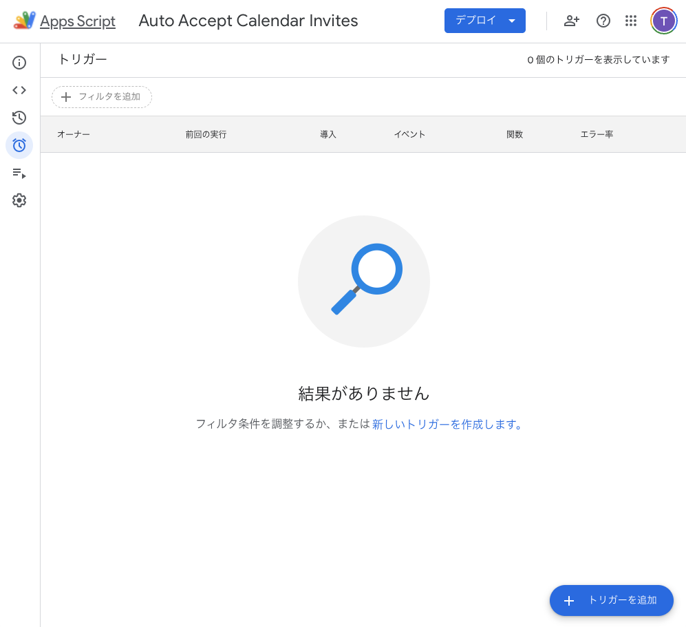

## やりたいこと
Google Calendar で飛んできたinvitationに対して、ノールックでYesを返せるようになる。

## 背景（現状の問題点の整理）

私は普段の仕事では、Google Calendarを使って予定を管理しています。
所属企業（ソラコム）では社内の予定を調整する際には各人のgoogle calendarを見て空き時間に予定を入れて良いことになっています。
これは予定調整のためのオーバーヘッドがなくなるためなれると非常に楽です。
この予定調整のオーバーヘッド削減を社外の方とのミーティング調整にもできるだけ適用したいので、最近は何度かお話したことがある方に対してはgoogle appointment schedulingのURLリンクを公開して、ここから空いてるところで予告なく予定を入れてくださいとお願いしています。
このようにしてミーティングの予定を調整するための調整を極力少なくする事ができたのですが、いくつか運用上の問題が顕在化します。
それは、

「未承諾の予定は入っていないのと同じ問題」

です。

google appointment scheduling経由で入ってくる予定は、自分のカレンダー自体に予定が作られるので、自動的に承諾したのと同じ状態になるので良いのですが、問題となるのは普通にgoogle calendarのinvitationを受け取った場合です。
この場合、invitationを受け取った時点では、承諾したことにはなりません。
この状態で予定を放置すると、google appointment schedulingとしては、空き時間であると解釈されてしまい、運が悪いとダブルブッキングが発生してしまいます。
特に、オーバーヘッドありで予定を調整してくれる同僚が、調整先のお客様に打ち合わせ日時を候補として打診するタイミングで、「block_hogehoge」という予定を入れてくれるのですがこれを承諾できずに放置することがダブルブッキングの悲劇を引き起こす原因となります。

## 解決策
上記のような形で起こるダブルブッキングの悲劇を防ぐために、Google Calendarのinvitationを受け取った時点で自動的に承諾するようにします。
つまり、ノールックイエスマンになります。

## 実装方法
Google Apps Script (GAS) を使って、Google Calendarのinvitationを受け取った時点で自動的に承諾するようにします。

### Google Apps Scriptの設定

1. [script.google.com](https://script.google.com)にアクセスします。
1. 「新しいプロジェクト」をクリックします。

    

1. プロジェクト名を入力します（例: "Auto Accept Calendar Invites"）。

    

1. 以下のコードをコピーしてエディタに貼り付けます。

    ```javascript
    function autoAcceptInvitesSimple() {
        const cal = CalendarApp.getDefaultCalendar();
        const horizon = new Date(Date.now() + 1000*60*60*24*30);   // 30 日先
        const invites = cal
            .getEvents(new Date(), horizon)
            .filter(ev => ev.getMyStatus() === CalendarApp.GuestStatus.INVITED);

        invites.forEach(invite => {
            const s = invite.getStartTime();
            const e = invite.getEndTime();

            // ① 招待の前後 8 時間幅で “かぶり得るイベント” を一括取得
            const windowStart = new Date(s.getTime() - 8*60*60*1000);
            const conflicts = cal.getEvents(windowStart, e).some(ev =>
            ev.getId() !== invite.getId() &&                    // 自分自身を除外
            [CalendarApp.GuestStatus.YES,
            CalendarApp.GuestStatus.OWNER,
            CalendarApp.GuestStatus.MAYBE,
            CalendarApp.GuestStatus.UNSPECIFIED].includes(ev.getMyStatus()) &&
            ev.getStartTime() < e && ev.getEndTime() > s        // 部分重複判定
            );

            if (!conflicts) {
            invite.setMyStatus(CalendarApp.GuestStatus.YES);    // 競合なし → 承諾
            }
        });
    }
    ```
1. 保存ボタンを押します。

    

1. フローを可視化すると、以下のようになります。
    ```mermaid
    flowchart TD
        A[関数 autoAcceptInvitesSimple を開始] --> B[デフォルトカレンダーを取得]
        B --> C[30日後までのイベントを取得]
        C --> D[ステータスが INVITED のイベントに絞り込む]
        D --> E{招待イベントがあるか？}

        E -->|はい| F[各招待イベントについて処理]
        F --> G[イベント開始・終了時刻を取得]
        G --> H[開始の8時間前から終了までのイベントを取得]
        H --> I[以下の条件で競合イベントを検出]
        I --> J{競合イベントあり？}

        J -->|あり| K[何もしない（未承諾）]
        J -->|なし| L[ステータスを YES にして承諾]

        K --> M[次の招待イベントへ]
        L --> M

        M -->|すべて処理済み| N[関数終了]
        E -->|いいえ| N

    ```

### トリガーの設定

1. エディタの左側の「時計」アイコンをクリックして、トリガーの設定画面を開きます。

    

1. 「トリガーを追加」をクリックします。

1. 以下のように設定して「保存」します。

    - 実行する関数を選択: `autoAcceptInvitesSimple`
    - 実行するデプロイを選択: `Head`
    - イベントのソースを選択: `カレンダーから`
    - カレンダーの詳細を入力: `カレンダー更新済み`
    - カレンダーのオーナーのメールアドレス: `自分のメールアドレス`

    

1. なんやかんや出てくるメッセージをAllowします。

1. こんな感じになったらOKです。

    

## 動作確認
1. Google Calendarで、他のアカウントから自分のカレンダーにイベントを招待します。
2. 招待を受け取ったアカウントで、Google Calendarを開きます。
3. 招待イベントが自動的に承諾されていることを確認します。

以上、お疲れ様でした。

## 補足

今回は、既存の予定が
- YES: 出席
- OWNER: 主催者
- MAYBE: 未定
- UNSPECIFIED: 不明
となっている場合は、承諾しないようにしていますがmaybeの場合は承諾する場合はこのチェックを外しても良いかもしれません。

将来的にはinvitation元のメールアドレスをチェックして、特定のドメイン（例: `soracom.com`）からの招待のみを承諾するようにすることや、本文の内容を生成AIで解析して、重要そうな場合のみ承諾するようにすることも考えられます。
今回はノールックYESマンを目指すので、あえてそういったチェックは入れていません。

