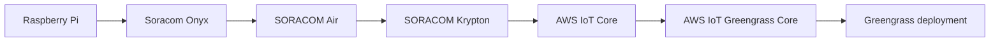
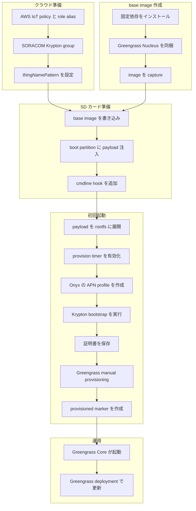

:::message
「[一般消費者が事業者の表示であることを判別することが困難である表示](https://www.caa.go.jp/policies/policy/representation/fair_labeling/guideline/assets/representation_cms216_230328_03.pdf)」の運用基準に基づく開示: この記事は記載の日付時点で[株式会社ソラコム](https://soracom.jp/)に所属する社員が執筆しました。ただし、個人としての投稿であり、株式会社ソラコムとしての正式な発言や見解ではありません。
:::

## TL;DR

- AWS IoT Greengrass Core は、フィジカル AI 時代の現場ゲートウェイに対して、アプリケーションやモデル推論処理を後から配布・更新するための基盤として使えます。
- Greengrass Core を現場に置くには、AWS IoT Thing、X.509 証明書、token exchange role alias、Greengrass Nucleus の初期設定が必要です。
- Soracom Onyx を挿した Raspberry Pi では、SORACOM Air の回線認証を使って SORACOM Krypton から AWS IoT 証明書を払い出し、その証明書で Greengrass Core を manual provisioning できます。
- 本気でゼロタッチを目指すなら、Raspberry Pi の OS イメージ、初回起動 payload、クラウド設定、Greengrass deployment を別々のライフサイクルとして設計する必要があります。
- 本記事は設計編です。コマンドと検証手順は実装検証編で扱います。

## はじめに

AWS re:Invent 2025 の文脈では、フィジカル AI とエッジ側の更新可能なアーキテクチャの関係が語られていました。SORACOM 公式ブログでも、現場側に置いた処理を後から更新し続ける仕組みとして AWS IoT Greengrass が紹介されています。

https://blog.soracom.com/ja-jp/2026/01/14/physical-ai-updatable-architecture/

Greengrass は、現場ゲートウェイ上でコンポーネントを動かし、AWS IoT Core と連携しながらエッジ側の処理を管理できます。カメラ、センサー、PLC、ローカルネットワーク上の機器などを束ね、推論処理や前処理、キャッシュ、現場側の制御ロジックを更新していく用途では、有力な選択肢になります。

ただし、Greengrass を使う前には Greengrass Core device 自体を AWS IoT に登録する必要があります。ここには AWS IoT Thing、証明書、秘密鍵、AWS IoT policy、token exchange role alias、Greengrass Nucleus の設定が関わります。

前回の記事では、SORACOM から AWS IoT Core へつなぐ方法として Beam / Funnel / Krypton の使い分けを整理しました。

https://zenn.dev/takao2704/articles/soracom-aws-iot-core-integration-guide

この記事では、その中で触れた Krypton と Greengrass の組み合わせについて、Soracom Onyx を挿した Raspberry Pi を現場ゲートウェイとして配布する前提で設計を整理します。

## 記事の分担

長くなりすぎるため、記事を 2 本に分けます。

| 記事 | 扱う内容 |
|---|---|
| 設計編 | Krypton の役割、Greengrass Core の初期プロビジョニング、Raspberry Pi image と payload のライフサイクル設計 |
| 実装検証編 | AWS / SORACOM 設定、Raspberry Pi 上の手動実行、base image 作成、SD カード注入、first boot の動作確認 |

サンプル実装は以下に置いています。

https://github.com/takao2704/soracom-onyx-krypton-greengrass-setup

## 全体構成

構成は次のようになります。



Raspberry Pi は Soracom Onyx の cellular 回線で SORACOM Air に接続します。その回線から SORACOM Krypton の AWS IoT bootstrap endpoint を呼び出し、AWS IoT の証明書、秘密鍵、Root CA、Thing 情報を取得します。

取得した証明書一式を Greengrass Core 用の配置にコピーし、Greengrass Nucleus を manual provisioning で systemd service として起動します。起動後のアプリケーションやモデル更新は、Greengrass deployment 側に寄せます。

## SORACOM Krypton とは

SORACOM Krypton は、デバイスの初期プロビジョニングを助けるサービスです。デバイスが SORACOM の認証を受けたうえで、クラウドサービスを使うための認証情報や登録情報を取得できるようにします。

AWS IoT 連携では、Krypton は AWS IoT の Thing 登録、デバイス証明書と秘密鍵の発行、証明書への AWS IoT policy の適用を行い、デバイスが AWS IoT Core に接続するための設定を返します。事前にデバイスごとの証明書を作って SD カードやファイルシステムに埋め込むのではなく、デバイス起動時の初期設定として証明書を払い出せるのがポイントです。

Krypton を使うには、SORACOM 側に AWS IoT のプロビジョニングに使う認証情報を登録し、SIM group に Krypton の設定を追加します。AWS IoT 向けの設定では、たとえば次の情報を group に持たせます。

| 設定 | 役割 |
|---|---|
| `credentialsId` | SORACOM 認証情報ストアに登録した AWS 認証情報 |
| `policyName` | 発行した証明書へ attach する AWS IoT policy |
| `thingNamePattern` | デバイスが Thing 名を指定しない場合に使う命名規則 |
| `host` | AWS IoT Core の Data endpoint |

デバイス側は、SORACOM Air の回線認証や SORACOM Endorse による SIM 認証を使って Krypton にアクセスします。本記事の構成では Soracom Onyx で SORACOM Air に接続し、Air の回線認証で Krypton の AWS IoT bootstrap endpoint を呼び出します。

ここで重要なのは、Krypton はデータ転送サービスではないことです。Beam や Funnel のように継続的なテレメトリを転送する経路ではなく、AWS IoT に接続するための初期認証情報を払い出す役割を持ちます。また、Greengrass そのものを動かすサービスでもありません。Krypton が払い出した証明書を、Greengrass Core の manual provisioning に使う、という関係です。

## なぜ Krypton を使うのか

Greengrass Core は AWS IoT Core と接続するため、Core device は AWS IoT Thing として扱われます。つまり、Greengrass の話を始める前に、デバイスごとの X.509 証明書、秘密鍵、Thing、AWS IoT policy が必要になります。

ここを手作業で作ることもできますが、現場に配る Raspberry Pi や SD カードに事前生成した秘密鍵を入れると、運用上の扱いが難しくなります。複数台展開では、証明書の重複、配布イメージへの秘密鍵混入、個体ごとの設定差し替えが問題になります。

SORACOM Krypton を使うと、SORACOM Air の回線認証を使って AWS IoT 向けの証明書を払い出せます。今回の構成では、Raspberry Pi から以下の endpoint を SORACOM Air 回線経由で呼び出します。

```text
https://krypton.soracom.io:8036/v1/provisioning/aws/iot/bootstrap
```

この手順は SORACOM Air の回線認証を使います。SORACOM Endorse の SIM 認証を使う構成ではありません。

デバイス側に AWS の管理 credential や SORACOM API credential を置かず、現地でデバイスごとの証明書を作ることが、この構成の大きな狙いです。

## Greengrass は manual provisioning にする

Greengrass Core software のインストールには、AWS credential を使って必要な AWS リソースを作成しながら進める方法と、事前に用意した AWS IoT リソースと証明書を使って manual provisioning する方法があります。

今回の構成では、Krypton が払い出した証明書を使いたいので manual provisioning に寄せます。サンプルスクリプトでは、Krypton のレスポンスから以下を保存します。

```text
/opt/soracom-krypton/aws-iot/private.pem.key
/opt/soracom-krypton/aws-iot/certificate.pem.crt
/opt/soracom-krypton/aws-iot/AmazonRootCA1.pem
/opt/soracom-krypton/aws-iot/config.json
```

その後、Greengrass Core の root path に証明書を配置し、`config.yaml` を作って `Greengrass.jar --init-config` を実行します。

```yaml
---
system:
  certificateFilePath: "/greengrass/v2/device.pem.crt"
  privateKeyPath: "/greengrass/v2/private.pem.key"
  rootCaPath: "/greengrass/v2/AmazonRootCA1.pem"
  rootpath: "/greengrass/v2"
  thingName: "<thing-name-from-krypton>"
services:
  aws.greengrass.Nucleus:
    componentType: "NUCLEUS"
    configuration:
      awsRegion: "ap-northeast-1"
      iotRoleAlias: "GreengrassV2TokenExchangeCoreDeviceRoleAlias"
      iotDataEndpoint: "<AWS_IOT_DATA_ENDPOINT>"
      iotCredEndpoint: "<AWS_IOT_CRED_ENDPOINT>"
```

実際の `config.yaml` はスクリプト内で生成します。記事では値を伏せていますが、`AWS_IOT_DATA_ENDPOINT`、`AWS_IOT_CRED_ENDPOINT`、`GREENGRASS_ROLE_ALIAS` は Raspberry Pi 側の `device.env` で渡します。

## Raspberry Pi イメージまで含めて設計する

Greengrass と Krypton の手順だけを見ると、「初回起動時にスクリプトを流せばよい」と考えたくなります。しかし、製品ライフサイクルまで真面目に考えると、ゼロタッチの出発点は Raspberry Pi の OS イメージです。

現場へ配った Raspberry Pi が最初に持っているものは、SD カードに焼かれた OS イメージです。初回起動時にネットワークが使える保証はありません。Soracom Onyx を挿していても、`soracom.io` APN の profile、NetworkManager / ModemManager、USB mode 切り替え、Java runtime、Greengrass Nucleus zip が揃っていなければ、Krypton や Greengrass の処理に到達できません。

そのため、配布物を次のように分けて考えます。

| レイヤー | 変わる頻度 | 配布物 | 例 |
|---|---:|---|---|
| OS / base image | 低 | Raspberry Pi OS image | NetworkManager、ModemManager、usb-modeswitch、Java、curl、Greengrass Nucleus zip |
| first boot payload | 中 | boot partition に注入する tarball | `setup_eg25.sh`、`setup-raspi.sh`、systemd unit、必要に応じて `device.env` |
| cloud-side configuration | 中 | AWS / SORACOM 側の設定 | AWS IoT policy、role alias、Krypton group、`thingNamePattern` |
| application / model deployment | 高 | Greengrass deployment | コンポーネント、推論ランタイム、モデル artifact、設定更新 |

Greengrass の強みは、起動後のアプリケーションやモデルを deployment で更新できることです。一方、modem を認識するための OS パッケージ、NetworkManager の有無、Java runtime、Nucleus zip の同梱有無は、初回起動前の image に寄せた方が安定します。

## image 戦略の選択肢

### 選択肢 1: 初回起動で全部インストールする

もっとも単純な方法は、Raspberry Pi OS の素の image を焼き、first boot で `apt install`、Onyx 設定、Krypton、Greengrass をすべて実行する方法です。

これは手元検証では便利ですが、ゼロタッチ配布には向きません。APN 設定前は apt repository に到達できない可能性があり、cellular 接続が不安定な場所で package install を始めると、失敗時の原因が「通信」「パッケージ」「証明書」「Greengrass」のどこにあるのか追いにくくなります。

### 選択肢 2: Raspberry Pi Imager や cloud-init に寄せる

Raspberry Pi Imager のカスタマイズや cloud-init は、ユーザー作成、SSH 有効化、Wi-Fi 設定、簡単な first boot コマンドには便利です。

ただし、製品として複数台に同じ前提を持たせる用途では、OS 依存パッケージや Greengrass Nucleus zip まで first boot に寄せると不安定になります。また、既存の `user-data` を上書きすると、配布者が Raspberry Pi Imager で入れた設定と衝突しやすくなります。

### 選択肢 3: 完全なカスタム OS イメージを作る

台数が増え、リリース管理、再現性、監査、ロールバックまで考える段階では、専用のイメージビルド pipeline に寄せるのが自然です。`pi-gen` や Packer のような仕組みで、OS バージョン、追加パッケージ、Nucleus zip、ベース設定を再現可能に作り、image manifest と checksum を管理します。

これは製品運用としては強い方法です。一方で、PoC や初期検証の段階からすべてを image build pipeline に載せると、変更のたびに image 作成と検証が必要になり、Krypton / Greengrass の本筋を試す速度が落ちます。

### 今回の選択: base image と payload を分ける

今回のサンプルでは、完全な image build pipeline までは作らず、次の中間形にしています。

- 固定依存は `tools/prepare-base-image.sh` で base image に入れる
- batch ごとに変わるものは `tools/inject-sd.sh` で boot partition に注入する
- first boot は package install ではなく、前提確認、Onyx 設定、Krypton bootstrap、Greengrass manual provisioning に集中する
- 成功後のアプリケーションやモデル更新は Greengrass deployment に任せる

この分担にしておくと、PoC では手元の base image を clone / capture して進められます。将来、台数や運用要件が増えたら、`prepare-base-image.sh` 相当の処理を image build pipeline に移し、同じ設計をより再現性の高い形にできます。

重要なのは、秘密鍵や証明書を base image に入れないことです。base image は複数台で共通にし、デバイス固有の AWS IoT 証明書は現地初回起動時に Krypton で払い出します。

## ゼロタッチキッティングの流れ

ゼロタッチキッティングの全体プロシージャは次のようになります。



クラウド準備と base image 作成は、現地投入前に済ませる作業です。SD カード準備では、共通の base image を書き込んだあと、first boot script や systemd unit を boot partition へ注入します。ゼロタッチで完結させる場合は、batch ごとの `device.env` も payload に含めるか、書き込み済み root filesystem の `/opt/krgg/device.env` に配置します。

現地で Raspberry Pi を起動すると、payload が root filesystem に展開され、Onyx の APN 設定、Krypton bootstrap、Greengrass manual provisioning が順に実行されます。

## 設計上の注意点

### 起動直後は soracom.io APN で通信できるとは限らない

fresh な Raspberry Pi OS では、Soracom Onyx を挿していても、起動直後から `soracom.io` APN で通信できるとは限りません。Krypton bootstrap は SORACOM Air 回線経由で成功させる必要があるため、Krypton より前に cellular profile と SORACOM サービス向け route が必要です。

### first boot で apt install しない

初回起動時に cellular 接続がまだ安定していない状態で `apt install` を始めると、失敗時の見立てが難しくなります。そのため、固定依存はベースイメージへ入れます。

### Thing name と MQTT clientId は個体ごとに一意にする

複数台の Greengrass Core が同じ Thing name や MQTT clientId を使うと、AWS IoT Core 側で接続を奪い合う状態になります。実際の検証でも、同じ名前を使うと `SESSION_TAKEN_OVER` が発生し得ることが分かっています。

ゼロタッチ運用では、Raspberry Pi 側の `KRYPTON_THING_NAME` を空にし、SORACOM Krypton group 側の `thingNamePattern` に任せるのが扱いやすいです。たとえば次のように、SIM ごとに一意になる値を含めます。

```text
takao-rpi-krypton-$imsi
```

### first boot は再試行できるようにする

現地では、起動直後の modem 認識、radio attach、NetworkManager の state 変化、電波状態などで失敗することがあります。失敗したら終わりの one-shot ではなく、systemd timer で再試行できるようにします。

### base image と Greengrass deployment の責務を分ける

OS パッケージ、modem 認識、NetworkManager、Java runtime のように、初回起動前から必要なものは base image 側で管理します。一方、アプリケーション、推論モデル、設定ファイルの更新は、Greengrass deployment 側に寄せます。

この境界を曖昧にすると、アプリケーションの小さな変更のために SD カード image を作り直すことになります。逆に、OS や modem 周りの変更を Greengrass component だけで吸収しようとすると、初回起動前の問題を解決できません。

## まとめ

フィジカル AI の文脈では、現場側のソフトウェアやモデル推論処理を後から更新できることが重要になります。その実行基盤として Greengrass を使う場合でも、最初に越えるべき壁は Greengrass Core の初期プロビジョニングです。

Soracom Onyx と SORACOM Krypton を組み合わせると、デバイスに AWS 管理 credential や事前生成した秘密鍵を持たせず、SORACOM Air の回線認証を使って AWS IoT 証明書を払い出せます。その証明書を Greengrass Core の manual provisioning に使うことで、現場ゲートウェイを Greengrass Core として起動できます。

さらに、固定依存をベースイメージへ入れ、batch ごとの設定を boot partition payload として注入し、first boot を systemd timer で再試行可能にすると、現地で SSH できることを前提にしない配布に近づけられます。

実装検証編では、この設計をサンプルリポジトリのスクリプトでどのように実現しているかを、コマンドとログ確認の粒度で見ていきます。

## 参考

https://github.com/takao2704/soracom-onyx-krypton-greengrass-setup

https://blog.soracom.com/ja-jp/2026/01/14/physical-ai-updatable-architecture/

https://zenn.dev/takao2704/articles/soracom-aws-iot-core-integration-guide

https://users.soracom.io/ja-jp/docs/krypton/aws-iot/

https://docs.aws.amazon.com/greengrass/v2/developerguide/manual-installation.html

https://docs.aws.amazon.com/greengrass/v2/developerguide/greengrass-components.html
