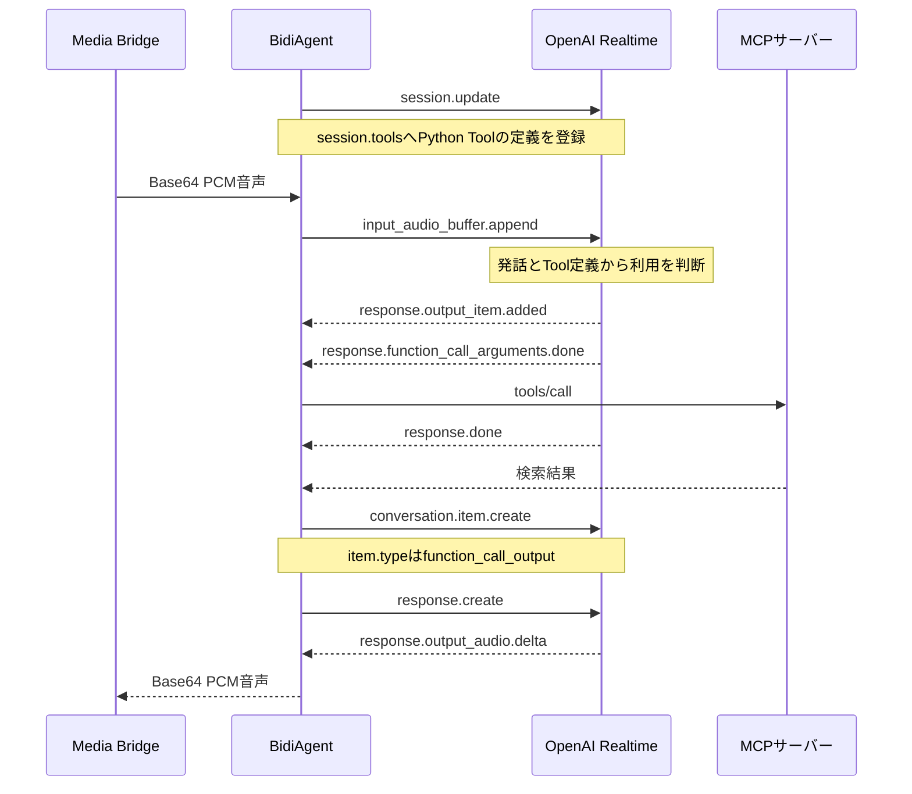
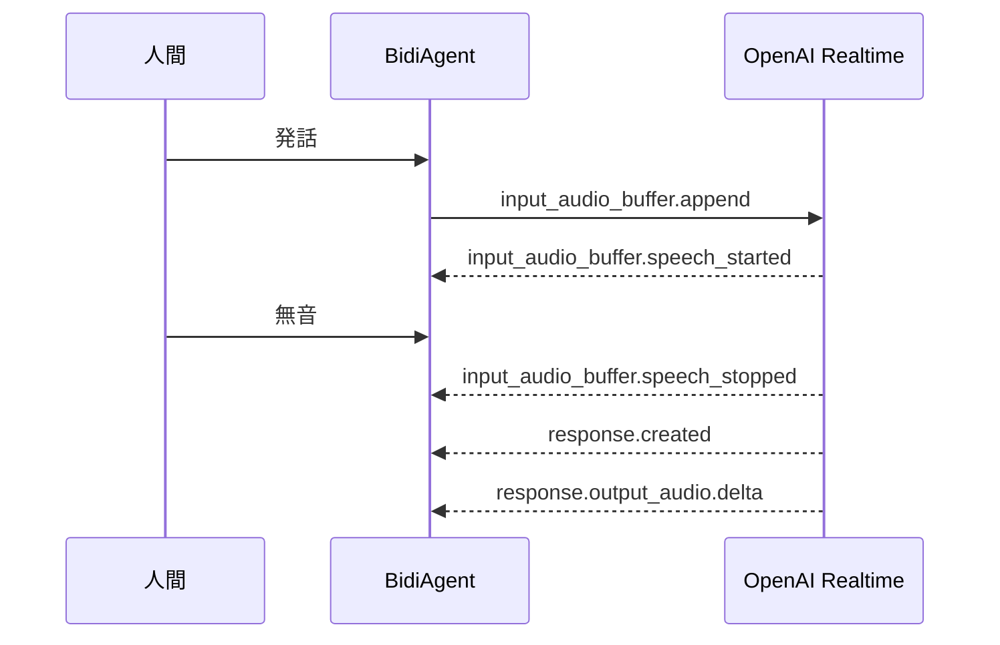
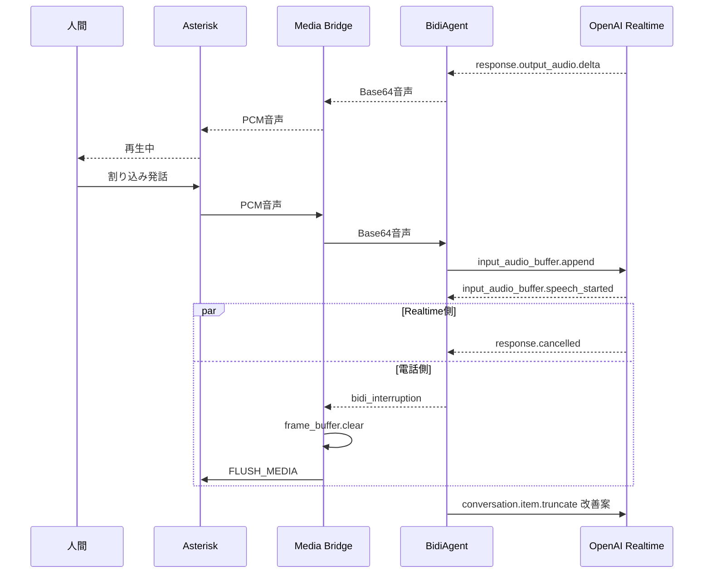

:::message
「[一般消費者が事業者の表示であることを判別することが困難である表示](https://www.caa.go.jp/policies/policy/representation/fair_labeling/guideline/assets/representation_cms216_230328_03.pdf)」の運用基準に基づく開示: この記事は記載の日付時点で[株式会社ソラコム](https://soracom.jp/)に所属する社員が執筆しました。ただし、個人としての投稿であり、株式会社ソラコムとしての正式な発言や見解ではありません。
:::

:::message
この記事は2026年8月時点のOpenAI Realtime APIと、検証用PoCの実装をもとにしています。イベント名や設定項目は変更される可能性があるため、実装時はOpenAIの公式ドキュメントも確認してください。
:::

## TL;DR

この記事は、Asterisk、AgentCore、OpenAI Realtime、MCPで構成した電話AIのうち、AgentCore Runtime上のBidiAgentとOpenAI Realtimeを結ぶWebSocketで、音声、Function Call、MCPの結果を変換したイベント、割り込みがどう流れるかを扱います。

- BidiAgentとOpenAI Realtimeの間では、Base64化したPCM音声と制御情報が、`type`の異なるJSONイベントとして1本のWebSocketを流れます。AgentとMCPサーバーの間は別のStreamable HTTP接続です。
- 接続時にBidiAgentが、利用できるPython Toolの名前、説明、引数をRealtime APIへ伝えます。モデルが会話に必要なToolを選ぶと、BidiAgentが対応するPython Toolを実行し、MCPへ`tools/call`という種類のリクエストを送ります。
- Realtime APIがToolの実行を求める段階と、Toolの結果を使って回答する段階は分かれています。Toolの実行が終わると、BidiAgentが結果をRealtime APIへ返し、その結果を使った回答生成を開始するよう指示します。
- Server VAD（Voice Activity Detection、音声区間検出）が発話の終了を検知すると、最初の回答生成は自動で始まります。Function Call後は、Toolの結果を受け取ったBidiAgentが次の回答生成を開始するようRealtime APIへ指示します。

## はじめに

この記事は、次の記事で紹介したPoCを前提にしています。

https://zenn.dev/takao2704/articles/asterisk-agentcore-realtime-architecture

このPoCのうち、主に取り上げるのは、AgentCore Runtimeで動くBidiAgentとOpenAI Realtimeを結ぶWebSocketです。AgentアプリとMCPサーバーの間は別のStreamable HTTP接続です。MCPの結果をRealtime APIへ戻す処理まで扱います。


この構成を設計する中で、MCPから得た結果を変換したFunction Call関連イベントと、PCM音声に対応するイベントが同じWebSocketセッションを流れると分かりました。そこで、次の疑問が湧きました。

> PCMとMCPの検索結果は、同じWebSocket上でごちゃ混ぜにならないのか。

この記事では、この疑問を起点に、BidiAgentとOpenAI Realtimeの間でイベントがどう流れるのかを深掘りします。調査の過程で気になったFunction Call前後のResponse、Server VAD、発話割り込みについてもまとめます。

OpenAI Realtime APIとのWebSocketでは、音声も制御も独立したJSONイベントです。PCMはBase64文字列として音声イベントに入ります。一方、Tool実行結果を`conversation.item.create`イベントの`function_call_output`項目として送る形式は、[Realtime APIの仕様](https://developers.openai.com/api/docs/guides/realtime-conversations#function-calling)です。今回のPoCが実装しているのは、MCPの戻り値をこの形式へ変換して送る部分です。1本の接続を共有しても、1つのJSONに両方を詰めるわけではありません。

音声AI Agentの構成パターンについては、[音声UIからToolまで、音声AI Agentの構成を整理する](https://zenn.dev/takao2704/articles/voice-agent-tools-mcp-basics)をご確認ください。

## 接続ごとのデータ形式

PoCには複数の接続があり、流れるデータも異なります。

| 接続 | 方式 | 主に流れるデータ |
| --- | --- | --- |
| Asterisk ↔ Media Bridge | WebSocket | PCM16と電話制御イベント |
| Media Bridge ↔ AgentCore Runtime | WebSocket | Base64音声を含むJSON |
| BidiAgent ↔ OpenAI Realtime | WebSocket | JSONテキストイベント |
| Agent ↔ MCPサーバー | Streamable HTTP | MCPのリクエストとレスポンス |

[OpenAIのWebSocketガイド](https://developers.openai.com/api/docs/guides/realtime-websocket)では、Realtime APIとの送受信をJSONへシリアライズしたテキストイベントとして扱います。入力PCMはBase64へ変換して`input_audio_buffer.append`へ入れます。

```json
{
  "type": "input_audio_buffer.append",
  "audio": "BASE64_ENCODED_PCM"
}
```

Realtime APIが生成した音声もBase64文字列です。[BidiAgent](https://strandsagents.com/docs/user-guide/concepts/bidirectional-streaming/agent/)は`delta`をBase64文字列として受け取ります。今回のAgentアプリは24 kHzから16 kHzへ変換して再びBase64化し、Media BridgeがPCMへデコードします。

```json
{
  "type": "response.output_audio.delta",
  "response_id": "resp_abc123",
  "delta": "BASE64_ENCODED_PCM"
}
```

MCPから受け取った結果は、Agentが`function_call_output`へ変換します。`output`はJSONをシリアライズした文字列です。

```json
{
  "type": "conversation.item.create",
  "item": {
    "type": "function_call_output",
    "call_id": "call_abc123",
    "output": "{\"ok\":true,\"results\":[{\"title\":\"検索結果\"}]}"
  }
}
```

OpenAI Realtime APIへは、1イベントずつ送ります。

```text
WebSocket message 1: input_audio_buffer.append
WebSocket message 2: input_audio_buffer.append
WebSocket message 3: conversation.item.create
WebSocket message 4: response.create
```

WebSocketのメッセージ境界とJSONの`type`が、音声追加、Tool結果の登録、応答開始を区別します。

## Function Call前後のResponse

Realtime APIのResponseは、HTTPレスポンスではなく、モデルが生成する1回分の応答です。Function Callを挟む場合は、Toolを要求するResponse Aと、Tool結果を使って話すResponse Bができます。

### Base64音声からTool実行へ進む流れ

BidiAgentのイベントループには、音声入力、Realtime APIからの制御イベント、Tool実行結果が別々のイベントとして流れます。音声を解釈してToolを使うか決めるのはRealtimeモデルです。BidiAgentがPCMを解析してToolを選ぶわけではありません。

Realtime APIがMCPサーバーを探索してToolの存在を知るわけではありません。[OpenAI RealtimeのFunction Calling](https://developers.openai.com/api/docs/guides/realtime-conversations#function-calling)では、クライアントが`session.update`の`session.tools`、または`response.create`の`response.tools`へ利用可能な関数を設定します。各Toolの定義には、関数名、説明、引数のJSON Schemaが含まれます。`tool_choice: "auto"`なら、モデルが発話と定義を照合してToolを使うか判断します。

今回のPoCでは、`@tool`を付けた3つのPython関数を`AGENT_TOOLS`へまとめ、`BidiAgent(tools=AGENT_TOOLS)`へ渡しています。Strandsが各関数をOpenAI形式へ変換し、WebSocket接続開始時の`session.update`でRealtime APIへ登録します。それぞれのPython Toolが内部でMCPサーバーへ`tools/call`を送るため、Realtime APIから見えるのはMCP Toolそのものではなく、MCP呼び出しを包んだPython Toolです。

その後の流れは次のとおりです。

1. BidiAgentがBase64化されたPCMを`input_audio_buffer.append`で送ります。
2. Realtimeモデルが発話と登録済みToolの定義を照合し、必要ならFunction Callを生成します。
3. Realtime APIが`response.output_item.added`の`function_call`項目でTool名と`call_id`を返し、`response.function_call_arguments.done`で確定した引数を返します。
4. BidiAgentが該当するPython Toolを非同期に実行します。今回のPython ToolはMCPサーバーへ`tools/call`を送ります。
5. BidiAgentがToolの戻り値を`function_call_output`としてRealtime APIへ返します。



[Realtime APIのFunction Calling](https://developers.openai.com/api/docs/guides/realtime-conversations#function-calling)では、`response.done`内の`response.output`に`type: function_call`、関数名、引数、`call_id`が入ります。

このPoCが使うStrandsのBidiAgentは、引数がそろった`response.function_call_arguments.done`の時点でToolを非同期実行します。そのため、MCP呼び出しの開始とResponse Aの末尾が短時間重なることがあります。Response Bは、MCP結果を登録して`response.create`を送るまで始まりません。

### call_idによる対応付け

モデルが複数のToolを呼ぶ場合でも、`call_id`を使えば結果の戻し先を特定できます。今回のStrands実装では、次の3つに同じ値が入ります。

```text
Realtimeのcall_id
  = StrandsのtoolUseId
  = function_call_outputのcall_id
```

AgentはRealtime APIから受け取った`call_id`をStrandsの`toolUseId`として保持し、Tool終了後に同じ値を`function_call_output.call_id`へ戻します。

### function_call_outputの役割

`conversation.item.create`で`function_call_output`を送る操作は、Toolの実行結果を会話へ登録します。登録後にAgentが`response.create`を送ると、Realtime APIがその結果を使ってResponse Bを生成します。

| 操作 | Realtime API側で起きること |
| --- | --- |
| `conversation.item.create` | Tool結果を会話へ追加する |
| `response.create` | 追加済みの結果を使って生成を始める |

Agentは2つのイベントを分けて送るため、複数のTool結果を待つ、検索結果を短くする、古いターンの結果を捨てる、といった判断を間に挟めます。

### MCP実行中の状態

MCP実行中は、Realtime API、Agent、MCPクライアントの状態が分かれます。

| 実行主体 | 状態 |
| --- | --- |
| Realtime API | Response Aを完了する段階で、Response Bはまだ作成していない |
| Agent | Toolタスクを実行している |
| MCPクライアント | 別のStreamable HTTPセッションで`tools/call`を実行している |

人間がMCP実行中に別の質問を始めても、`response.cancel`ではMCPタスクを止められません。Agent側でToolタスクをキャンセルするか、ターン番号を照合して古い結果を捨てます。結果をすでに登録していても、古いターンなら`response.create`を送りません。

## Server VAD（音声区間検出）とresponse.create

VADはVoice Activity Detectionの略で、音声から人が話し始めたか、話し終えたかを検出する仕組みです。Server VADではRealtime APIが検出します。[OpenAIのVADガイド](https://developers.openai.com/api/docs/guides/realtime-vad)にある`create_response`と`interrupt_response`で、検出後の動作を切り替えられます。

| 設定 | 発話終了の検出 | Responseの開始 | 発話開始時の割り込み |
| --- | --- | --- | --- |
| `create_response: true`、`interrupt_response: true` | Realtime API | Realtime APIが自動開始 | Realtime APIが自動キャンセル |
| 両方を`false` | Realtime API | Agentが`response.create`を送信 | Agentが必要に応じて`response.cancel`を送信 |
| `turn_detection: null` | Agent | `input_audio_buffer.commit`後に`response.create`を送信 | Agentが`response.cancel`を送信 |

自動応答では、`session.audio.input.turn_detection`に2つの項目を設定します。

```json
{
  "type": "session.update",
  "session": {
    "type": "realtime",
    "audio": {
      "input": {
        "turn_detection": {
          "type": "server_vad",
          "create_response": true,
          "interrupt_response": true
        }
      }
    }
  }
}
```



Server VADが最初のResponse Aを自動作成しても、Function Call後のResponse Bは別です。Agentは`function_call_output`を登録してから`response.create`を送ります。

## BidiAgent以降の音声チャンク制御

Realtime APIが返した音声は、BidiAgent、Media Bridge、Asteriskを順に通って電話で再生されます。発話割り込みでは、各層に残った音声をそれぞれ止める必要があります。

### 発話割り込み

`interrupt_response: true`では、Realtime APIが`input_audio_buffer.speech_started`を検出すると、進行中のResponseをキャンセルして`response.cancelled`を返します。VADを無効にした場合や`interrupt_response: false`の場合は、Agentが`response.cancel`を送ります。

どちらの経路でも、すでに電話側へ届いた音声は残ります。WebSocket接続ではクライアントが再生位置を管理するため、[OpenAIの割り込み手順](https://developers.openai.com/api/docs/guides/realtime-conversations#handling-interruptions)に沿って再生停止と会話履歴の切り詰めを行います。



最後の`conversation.item.truncate`は、必要な処理を示したもので、現在のPoCには未実装です。

| 層 | 操作 | 対象 |
| --- | --- | --- |
| Realtime API | 自動キャンセルまたは`response.cancel` | これから生成する出力 |
| Media Bridge | `frame_buffer.clear()` | 20msフレームへ整形中の端数PCM |
| Asterisk | `FLUSH_MEDIA` | 送信済みで再生待ちのPCM |
| Realtime APIの会話履歴 | `conversation.item.truncate` | 人間が聞いていないAssistant音声 |
| AgentのTool管理 | タスクキャンセルまたはターン照合 | 古いMCP結果 |

`conversation.item.truncate`には、対象の`item_id`、`content_index`、実際に再生した位置を表す`audio_end_ms`を指定します。

```json
{
  "type": "conversation.item.truncate",
  "item_id": "item_abc123",
  "content_index": 0,
  "audio_end_ms": 1500
}
```

今回のMedia Bridgeは、Strandsの`bidi_interruption`を受けると、PCMフレームバッファを消去してAsteriskへ`FLUSH_MEDIA`を送ります。`response.cancel`の明示送信と`conversation.item.truncate`は実装していません。

デプロイ用設定では`HALF_DUPLEX_MODE=true`です。この設定ではAgent音声の再生中に人間側のPCMを捨てるため、barge-inは動きません。割り込みを有効にするには`HALF_DUPLEX_MODE=false`へ変更し、電話端末から回り込むエコーへの対策も必要です。

## BidiAgentとOpenAI Realtime間のイベント順序

[OpenAIのRealtime conversationsガイド](https://developers.openai.com/api/docs/guides/realtime-conversations#push-to-talk)では、WebSocket接続のイベントは同じチャネルを同じ順序で流れると説明されています。1回の`send`で送ったJSONは1つのWebSocketメッセージになるため、Base64音声の途中に別イベントの文字列が入ってJSONが壊れることはありません。

一方、Agent内では音声入力とTool実行が別の非同期タスクです。現在使っているStrandsの`_send_event`は、イベントを`json.dumps`してWebSocketへ送りますが、複数イベントを束ねる送信キューや排他制御は持っていません。

`function_call_output`と`response.create`の間に、音声追加が入る可能性はあります。

```text
Toolタスク:  conversation.item.createを送信
音声タスク:  input_audio_buffer.appendを送信
Toolタスク:  response.createを送信
```

各JSONは壊れません。Agentが意図した会話ターンの順序を保てるかは別の問題です。

## まとめ

OpenAI Realtime APIとのWebSocketでは、PCMをBase64化した音声イベントと、`function_call_output`などの制御イベントが別々のJSONとして流れます。1本の接続上で多重化されますが、メッセージの中身は混ざりません。

`function_call_output`はTool結果の登録です。Agentが続けて`response.create`を送ると、Realtime APIが結果を使った次のResponseを作ります。

発話割り込みはRealtime APIだけでは完結しません。電話で実際に止めるには、Responseのキャンセル、Media Bridgeの端数PCM、Asteriskの再生キュー、Realtime APIの会話履歴をそれぞれ処理します。MCP実行中なら、Toolタスクまたは古いターンの結果も対象です。

## 参考資料

- [Realtime API with WebSocket](https://developers.openai.com/api/docs/guides/realtime-websocket)
- [Realtime conversations](https://developers.openai.com/api/docs/guides/realtime-conversations)
- [Voice activity detection](https://developers.openai.com/api/docs/guides/realtime-vad)
- [BidiAgent - Strands Agents](https://strandsagents.com/docs/user-guide/concepts/bidirectional-streaming/agent/)
- [voice-agent-demo](https://github.com/takao2704/voice-agent-demo)
