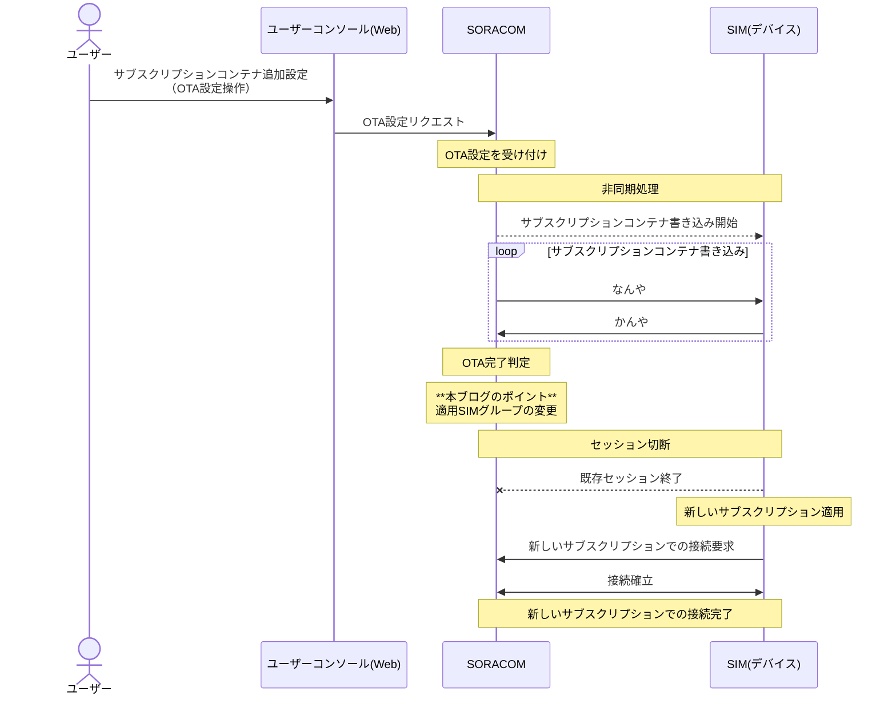

:::message
「[一般消費者が事業者の表示であることを判別することが困難である表示](https://www.caa.go.jp/policies/policy/representation/fair_labeling/guideline/assets/representation_cms216_230328_03.pdf)」の運用基準に基づく開示: この記事は記載の日付時点で[株式会社ソラコム](https://soracom.jp/)に所属する社員が執筆しました。ただし、個人としての投稿であり、株式会社ソラコムとしての正式な発言や見解ではありません。
:::

## やりたいこと

SIMのプラン（サブスクリプション）のOTA（Over The Air）による変更が完了したと同時に、そのSIMが所属しているグループを移動させます。

サブスクリプションコンテナのOTAはユーザーコンソールなどで設定した後に実施されるのですが、通信状態やその間に行われるいろいろな処理の実施進捗によって実際にサブスクリプションが切り替わって新しいプランが適用されるタイミングは異なります。

本ブログではサブスクリプションの切り替わりと同時にSIMグループを変更して、SORACOM Beamなどのグループの設定をジャスト・イン・タイムで変更する方法を紹介します。



## 実現方法

　サブスクリプションコンテナのOTA完了をイベントハンドラで検知し、検知したと同時にSORACOM FluxのWebhookを実行します。
　SORACOM FluxのWebhookをトリガーにして、SORACOM APIを実行し、SIMのグループを変更します。

## 準備するもの

- SORACOM アカウント
- SORACOM IoT SIM
- SORACOM Beamなどの転送先のサーバー（この部分は本ブログでは言及しません）

## 手順

### SIMとグループの設定

0. （前提）移行前のSIMはすべて同じグループに入っているものとします。
 今回の例では以下のように、すべてのSIMが「group_from」というグループに入っているものとします。
 

1. 移行後の新しいグループを作成します。
 ハンバーガーメニューから「SIMグループ」を選択し、
 
 「追加」をクリックします。
 
 今回は「group_to」という名前のグループを作成します。
 この後の手順でこのグループのIDを使用しますので、メモしておきます。
 
 作成が完了したら必要な設定（Beam等の転送設定etc.）を行います。

### SORACOM Fluxの設定

1. SORACOM Fluxを設定します。
 ハンバーガーメニューから「SORACOM Flux」の中にある「Flux アプリ」を選択します。
 
 「+新しいFluxアプリを作成する」から新しいFluxアプリを作成します（進次郎構文）。
 
 適当な名前をつけます。
 
 チャネルを作成します。
 
 「API/マニュアル実行」を選択します。
 
 デフォルトの名称のまま「次へ」と「作成する」をクリックします。
 遷移した画面の中のイベントソースの設定欄にある「+Incoming Webhookを作成する」をクリックします。
 
 デフォルトの名称のまま作成するをクリックします。
 先程の画面に戻ったら、「webhook URLを表示する」をクリックして、メモします。
 
 Studioの画面に戻ります。
 
 青いブロックから伸びる灰色の土管をクリックして、「アクション」のタブを選択します。
 
 +アクションを追加」をクリックします。
 「SORACOM API」を選択してOKをクリックします。
 
 アクションの実行条件に

 ```
 payload.otastatus == "finished"
 ```

 を入力します。
 
 configのAPI検索フォームに
 'setsimgropup'と入力して、「setSimGroup （IoT SIM を SIM グループに所属させる）」を選択します。
 
 URL欄のプレイスホルダーを`${payload.simId}`として、全体が以下のようになればOKです。

 ```
 /v1/sims/${payload.simId}/set_group
 ```

 HTTPボディは先ほどメモした移行後のグループIDを設定します。.

 ```json
 {
  "groupId": "移行後のグループID"
 }
 ```

 以下のようになっていればOKです。
 

 注意点を理解したらチェックボックスを入れて、新しくSAMを作成するを選択して、アウトプットを有効化して、送信先チャネルを新しく作成して作成をクリックします。
 

 以下のような感じになっていればOKです。
 

 基本はこれでOKなのですが、進捗やエラーの確認をするためにslackに通知をするようにします。
 下記を参考にして、slackのIncoming Webhookを作成します。
 <https://users.soracom.io/ja-jp/guides/other-services/notifications/slack-app-incoming-webhook/>

 先ほど設定したSORACOM APIとパラレルになるように「slack通知」アクションを追加します。
 

1. イベントハンドラーを設定します。
 ハンバーガーメニューから「イベントハンドラー」を選択します。
 
 「+イベント作成」をクリックします。
 
 イベント名を「」

2. 移行前のグループにあるSIMをOTAで新しいサブスクリプションに変更します。
3. OTAが完了するのを待ちます。
