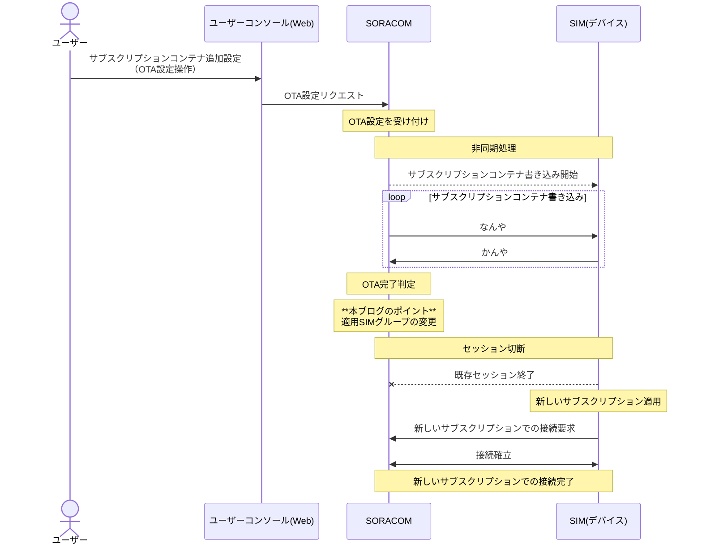

:::message
「[一般消費者が事業者の表示であることを判別することが困難である表示](https://www.caa.go.jp/policies/policy/representation/fair_labeling/guideline/assets/representation_cms216_230328_03.pdf)」の運用基準に基づく開示: この記事は記載の日付時点で[株式会社ソラコム](https://soracom.jp/)に所属する社員が執筆しました。ただし、個人としての投稿であり、株式会社ソラコムとしての正式な発言や見解ではありません。
:::

## やりたいこと

SIMのプラン（サブスクリプション）のOTA（Over The Air）による変更が完了したと同時に、そのSIMが所属しているグループを移動させます。

サブスクリプションコンテナのOTAはユーザーコンソールなどで設定した後に実施されるのですが、通信状態やその間に行われるいろいろな処理の実施進捗によって実際にサブスクリプションが切り替わって新しいプランが適用されるタイミングは異なります。

本ブログではサブスクリプションの切り替わりと同時にSIMグループを変更して、SORACOM Beamなどのグループの設定をジャスト・イン・タイムで変更する方法を紹介します。



## 実現方法

　サブスクリプションコンテナのOTA完了をイベントハンドラで検知し、検知したと同時にSORACOM FluxのWebhookを実行します。
　SORACOM FluxのWebhookをトリガーにして、SORACOM APIを実行し、SIMのグループを変更します。

## 準備するもの

- SORACOM アカウント
- SORACOM IoT SIM
- SORACOM Beamなどの転送先のサーバー（この部分は本ブログでは言及しません）

## 手順

### SIMとグループの設定

今回の記事ではサブスクリプションコンテナのOTAが実行されたことをトリガに、そのSIMを新たなグループに移動させる方法を説明します。
したがって、対象のSIMはすでに特定のグループに所属していることと、移行後のグループが作成されていることが前提となります。


0. （前提）移行前のSIMはすべて同じグループに入っているものとします。
 今回の例では以下のように、すべてのSIMが「group_from」というグループに入っているものとします。
 

1. 移行後の新しいグループを作成します。
 ハンバーガーメニューから「SIMグループ」を選択し、
 
 「追加」をクリックします。
 
 今回は「group_to」という名前のグループを作成します。
 この後の手順でこのグループのIDを使用しますので、メモしておきます。
 
 作成が完了したら必要な設定（Beam等の転送設定etc.）を行います。

### SORACOM Fluxの設定

この節で説明する設定を実施すると、OTAが完了したというWebhookの通知を受けたあとに実行される、グループの変更を行うSORACOM APIの実行に関するSORACOM Fluxの設定を行います。

最終的に下記のようなフローを作成します。手順は後述します。
    

1. トリガ設定
    イベントハンドラーからのwebhook受信(OTA完了通知)を受信します。
    イベントソース : API/マニュアル実行
    設定：Incoming webhook
    出力チャネル： API Cnannel
    

2. SORACOM API アクション
    入力チャネル： API Channel
    :::details APIアクションブロックの設定

    入力されるpayload
    ```json
    {
        "imsi": "9xxxxxxxxxxxxx",
        "simId": "89423xxxxxxxxxxxx",
        "subscription": "planXX", //新しくOTAするプラン名
        "otastatus": "finished" // OTAの進捗状況 started, finished, error
    }
    ```

    設定内容    
    | 大項目 | 詳細項目| 設定値 | 備考 |
    | --- | ------ | --- | ------ |
    | CONDITION | アクションの実行条件 | payload.otastatus == "finished" |  |
    | CONFIG | URL | POST /v1/sims/${payload.simId}/set_group | [setSimGroup](https://users.soracom.io/ja-jp/tools/api/reference/#/Sim/setSimGroup)を選択し、`{sim_id}`プレースホルダは`${payload.simId}`とする |
    | CONFIG | HTTPボディ | {<br>  "groupId": "{移行後のグループのUUID}"<br>} |  |
    |OUTPUT | アクションのアウトプットを別のチャネルに送信する | 無効 | |

    設定画面（例）
    
    :::

3. OTAの進捗を通知
    入力チャネル： Output Channel
    :::details Slack通知アクションの設定

    入力されるpayload
    ```json
    {
        "imsi": "9xxxxxxxxxxxxx",
        "simId": "89423xxxxxxxxxxxx",
        "subscription": "planXX", //新しくOTAするプラン名
        "otastatus": "finished" // OTAの進捗状況 started, finished, error
    }
    ```
    設定内容    
    | 大項目 | 詳細項目| 設定値 | 備考 |
    | --- | ------ | --- | ------ |
    | CONDITION | アクションの実行条件 | 空欄 |  |
    | CONFIG | URL | `https://hooks.slack.com/services`から始まるURL | sebhookURLは[こちら](https://users.soracom.io/ja-jp/guides/other-services/notifications/slack-app-incoming-webhook/#slack-app-%e3%81%ae-incoming-webhook-%e3%81%ae-webhook-url-%e3%82%92%e7%99%ba%e8%a1%8c%e3%81%99%e3%82%8b)の方法を参照してして入手する |
    | CONFIG | Payload |  |  |
    |OUTPUT | アクションのアウトプットを別のチャネルに送信する | 無効 | |

    

    :::

#### 設定手順
SORACOM Fluxを設定手順です。
1. ハンバーガーメニューから「SORACOM Flux」の中にある「Flux アプリ」を選択します。

    

2. 「+新しいFluxアプリを作成する」から新しいFluxアプリを作成します。

    

3. 適当な名前をつけます。

    

4. チャネルを作成します。

    

5. 「API/マニュアル実行」を選択します。

    

6. デフォルトの名称のまま「次へ」と「作成する」をクリックします。
    遷移した画面の中のイベントソースの設定欄にある「+Incoming Webhookを作成する」をクリックします。

     

7. デフォルトの名称のまま作成するをクリックします。
    先程の画面に戻ったら、「webhook URLを表示する」をクリックして、メモします。

    

8. Studioの画面に戻ります。

    

9. 青いブロックから伸びる灰色の土管をクリックして、「アクション」のタブを選択します。

    

10. 「+アクションを追加」をクリックします。
    「SORACOM API」を選択してOKをクリックします。

    
     アクションの実行条件に

    ```
        payload.otastatus == "finished"
    ```
    を入力します。

11. configのAPI検索フォームに
    'setsimgropup'と入力して、「setSimGroup （IoT SIM を SIM グループに所属させる）」を選択します。

        

    URL欄のプレイスホルダーを`${payload.simId}`として、全体が以下のようになればOKです。

    ```
    /v1/sims/${payload.simId}/set_group
    ```

    HTTPボディは先ほどメモした移行後のグループIDを設定します。

    ```json
    {
        "groupId": "移行後のグループID"
    }
    ```

12. 以下のようになっていればOKです。

    

13. 注意点を理解したらチェックボックスを入れて、新しくSAMを作成するを選択して、アウトプットを有効化せずに「作成」をクリックします。

    

14. 以下のような感じになっていればOKです。

    

15. 基本はこれでOKなのですが、進捗やエラーの確認をするためにslackに通知をするようにします。

16. 下記を参考にして、slackのIncoming Webhookを作成します。

    https://users.soracom.io/ja-jp/guides/other-services/notifications/slack-app-incoming-webhook/

17. 先ほど設定したSORACOM APIとパラレルになるように、トリガから伸びているAPI Channelと書かれたグレーの土管をクリックして、アクションのタブを選択します。
    「slack通知」アクションを追加します。

    

18. 以下のようになっていたら完成です。

    

### イベントハンドラーの設定

OTA完了をトリガにして、さきほどの作業で作成したSORACOM Fluxの一連のフローを実行するためのトリガとなるWebhookを叩くためのイベントハンドラーを設定します。
冒頭で解説した通り、サブスクリプションコンテナのOTAは非同期処理で実施されるため、OTAの完了をタイムリーに監視するためにイベントハンドラー機能を使用する必要があります。

1. イベントハンドラーを設定します。
    ハンバーガーメニューから「イベントハンドラー」を選択します。

    

2. 「+イベント作成」をクリックします。

    

3. イベント名を「OTA_finished」とします。
    （このあと、同様の手順で「OTA_finished」,および「OTA_failed」というイベントを作成します。）
    設定内容は以下のとおりです。

    設定内容
    | 項目 | フィールド1 | フィールド2 | フィールド3 | フィールド4 | 備考 |
    | --- | ------ | --- | ------ | ------ | ------ |
    | 監視対象 | `グループ` | 現行のグループ名を入力して出てくるグループから選択 |N/A|N/A| グループ選択後はUUIDのみになっている<br>グループを監視対象とすることで、そのグループに所属するすべてのSIMのOTAステータス監視対象となるのがポイント |
    | ルール | `SIMにサブスクリプションが追加されたら実行` | 成功 | 再評価を行わない |  |  |
    | アクション | アクション：指定のURLにリクエストを送る | 実行するタイミング：すぐに実行 | オフセット（分）：0 | URL: `https://g.api.soracom.io/v1/flux/incoming_webhooks/`から始まるアドレス | URLはSORACOM FluxのIncoming webhookのURL |
    | アクション（続き）| Method : POST | Content Type : `application/json` を選択| HTTP Header のキー：設定なし|HTTP Header の値:設定なし||
    | アクション（続き）| Body : `{"imsi":"${imsi}","simId":"${simId}","subscription":"${subscription}","otastatus":"${otaStatus}"}` |  |  |  |  |


    下記のような設定になっていればOKです。
    


4. 同様に、ルールの設定のステータスが、「失敗」と「開始」について同様の設定でイベントを作成する。


### OTAの実行

1. 移行前のグループにあるSIMに対してOTAの予約をかけます。
    通常の手順であればユーザーコンソールの「[SIM管理画面](https://console.soracom.io/sims?coverage_type=g)」から、対象のSIMを選択します。

    

2. 「操作」から「サブスクリプションを追加」を選択します。

    

3. 追加するサブスクリプション（プラン）を選択し、「サブスクリプションを追加」をクリックします。
    

あとは、Fluxの設定が正しく行われていれば、OTAが完了したタイミングでグループの変更が実施されます。