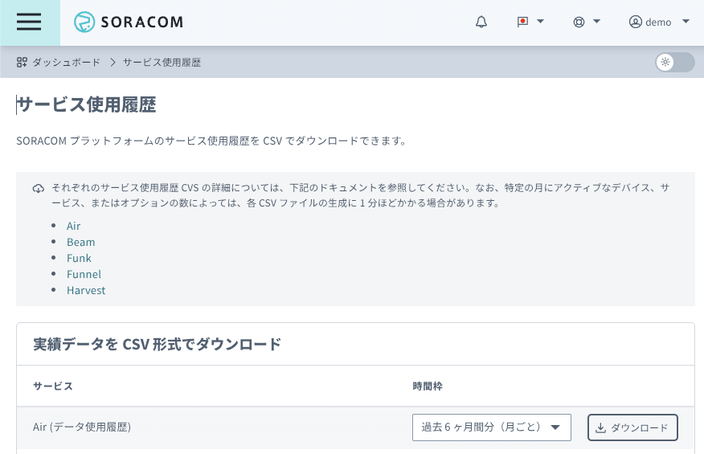
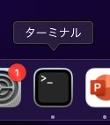
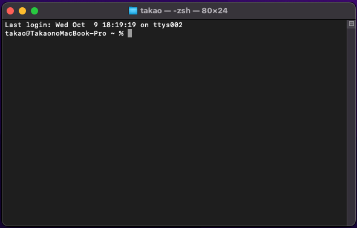

:::message
「[一般消費者が事業者の表示であることを判別することが困難である表示](https://www.caa.go.jp/policies/policy/representation/fair_labeling/guideline/assets/representation_cms216_230328_03.pdf)」の運用基準に基づく開示: この記事は記載の日付時点で[株式会社ソラコム](https://soracom.jp/)に所属する社員が執筆しました。ただし、個人としての投稿であり、株式会社ソラコムとしての正式な発言や見解ではありません。
:::
## やりたいこと
ソラカメの画角内で人が動いたらパトライトが点灯するようにします。

## 準備するもの
- SORACOM アカウント
- ソラカメ
- SORACOM Air
- LTEルーター
- パトライト（HTTP対応）
- スイッチングハブ
- LANケーブル
- 設定用PC

## 手順

### 配線接続

### LTEルーターの設定
[こちら](https://users.soracom.io/ja-jp/guides/devices/ud-lt2/setup/)の手順に従ってLTEルーター(UD-LT2)を設定します。
https://users.soracom.io/ja-jp/guides/devices/ud-lt2/setup/

LAN側のIPアドレスを変えます。

ネットワーク設定から、LANを選択してIP1に`192.168.10.100/24`を入力し、更新をクリックします
(UD-LT2のLANポートのIPアドレスが192.168.10.100になります)。

IPアドレスが変わってしまうので、
http://192.168.10.100/　にアクセスして、UD-LT2の設定画面に入りなおします。

UD-LT2に送信したコマンドをパトライトに転送する設定（DNAT設定）を行う
1. UD-LT2 の設定画面で [転送設定] → [NAT] → [追加] の順にクリックしてます。
 

2. 以下のように設定し,
保存します。

 |項目 | 値 |
 |---|---|
 |NAT 設定| DNAT |
 |プロトコル| TCP |
 |初期アドレスタイプ| interface |
 |インターフェイス| 4G |
 |初期ポート| 50080 |
 |マッピングアドレス| 192.168.10.1 |
 |マッピングポート| 80 |

### パトライトの設定
パトライトの設定画面 http://192.168.10.1/ にアクセス

言語を変更

パスワードを設定

設定完了

さっきのパスワードでログイン

DHCPに設定
ネットワーク設定 -> IPアドレス設定方法を「自動的に取得する」を選択肢、設定をクリック

コマンド受信設定で、HTTPコマンド受信設定が「有効」になっていることを確認

右上のmacアドレスをメモ

もう一度、UD-LT2の設定画面（http://192.168.10.100）に戻ります。

パトライトに対して、常に`192.168.10.1`がDHCPで割り当てられるように、DHCPの予約を設定します。

Ir-5lanに

### ソラカメの設定
:::details ソラカメが初めての方はこちら(購入から設置まで)！

### SORACOMのアカウント作成など
https://users.soracom.io/ja-jp/guides/getting-started/create-account/

カバレッジタイプはJPで。

### ソラカメの購入〜セットアップまで

https://sora-cam.com/setup/

実は最近はソラカメのセットアップにアプリを使わなくても良くなっていたりする。

### ソラカメの設置

設置に関する知見はここにたくさん溜まっています。
https://weathernews.jp/s/topics/202403/180215/

:::

何はともあれ、カメラが正常に動作しているか確認しましょう。

「ソラコムクラウドカメラサービス」 -> 「デバイス管理」

デバイスの一覧表示で、先ほど登録したカメラがオンラインになっていることを確認します。

さらに、カメラの名前をクリックすると、カメラの映像が表示されます。

:::message
この画面を見続けていると月72時間までの動画エクスポート時間無料枠を消費してしまうので注意しましょう。
:::

### SORACOM Fluxの設定

### ソラカメの通知を設定する

