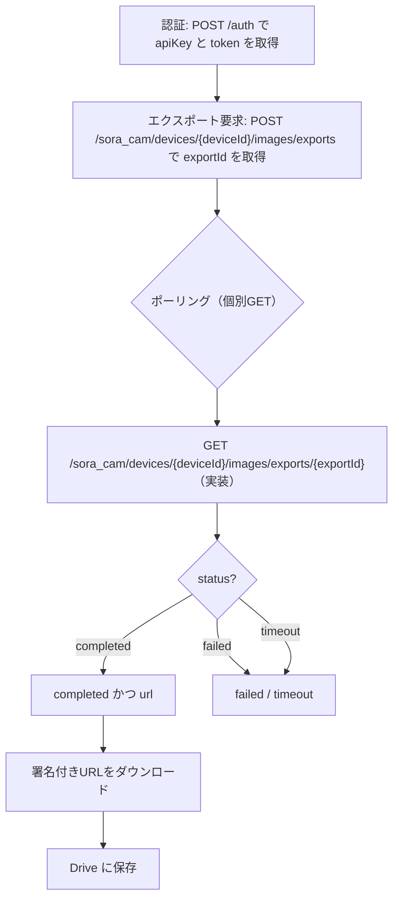

:::message
「[一般消費者が事業者の表示であることを判別することが困難である表示](https://www.caa.go.jp/policies/policy/representation/fair_labeling/guideline/assets/representation_cms216_230328_03.pdf)」の運用基準に基づく開示: この記事は記載の日付時点で[株式会社ソラコム](https://soracom.jp/)に所属する社員が執筆しました。ただし、個人としての投稿であり、株式会社ソラコムとしての正式な発言や見解ではありません。
:::

## やりたいこと
Google Apps Script（GAS）を使って、ソラカメの静止画を SORACOM APIでエクスポートしてGoogle Drive に保存する作業を自動化します。

## 構成図


## 前提条件

### 必要なもの
- SORACOM アカウント
- ソラカメ関連
    - ソラカメ（AtomCam2）
    - Wifi環境
    - ソラカメライセンス(常時録画ライセンス 7日間プラン)  

:::details ソラカメが初めての方はこちら(購入から設置まで)！

### SORACOMのアカウント作成など
https://users.soracom.io/ja-jp/guides/getting-started/create-account/

カバレッジタイプはJPで。

### ソラカメの購入〜セットアップまで

https://sora-cam.com/setup/

実は最近はソラカメのセットアップにアプリを使わなくても良くなっていたりする。

### ソラカメの設置

設置に関する知見はここにたくさん溜まっています。
https://weathernews.jp/s/topics/202403/180215/

:::

- Google アカウントと Google Drive
  - GAS が利用可能であること

## 事前準備


### カメラチェック

:::details カメラのチェック

何はともあれ、カメラが正常に動作しているか確認しましょう。

「ソラコムクラウドカメラサービス」 -> 「デバイス管理」


デバイスの一覧表示で、先ほど登録したカメラがオンラインになっていることを確認します。


さらに、カメラの名前をクリックすると、カメラの映像が表示されます。


    :::message
    この画面を見続けていると月72時間までの動画エクスポート時間無料枠を消費してしまうので注意しましょう。
    :::

:::

### SORACOM APIキーを発行する

:::details SORACOM APIキーの発行

ソラカメの録画データから画像を取得するために、SORACOM APIを利用します。
APIを利用するためには、APIキーを発行する必要がありますので、以下の手順でAPIキーを発行しましょう。
1. 右上のログインしているユーザー名（ルートユーザーであればメールアドレス、SAMユーザーであればSAMユーザー名）をクリックして出てくるメニューから、「セキュリティ」をクリック
    

2. 「ユーザー」タブで「SAMユーザー作成」をクリック
    

3. 後で見たときに何をするためのSAMユーザーかわかるように名前をつけます。必要に応じて概要にも記載して「作成」をクリックします。
    

4. 作ったSAMユーザーが一覧に表示されていることを確認して、名前をクリックします。
    

5. 権限を設定します。
    
    直接指定で以下をコピペしてください。

    ```json
    {
     "statements": [
        {
        "api": [
            "SoraCam:exportSoraCamDeviceRecordedImage",
            "SoraCam:getSoraCamDeviceExportedImage",
            "OAuth2:authorize"
        ],
        "effect": "allow"
        }
    ]
    }
    ```
:::


### GAS プロジェクト作成
1. Google ドライブで「+ New」→「Google Sheets」でスプレッドシートを新規作成します。

2. 「Extensions」 → 「App Script」でGASの編集画面を表示

3. エディタ（Apps Script IDE）が開いたら、デフォルトのファイルにコードを貼り付けられるよう準備します。


### スクリプトプロパティ設定
1. GAS エディタの「歯車マーク」→「Project Settings」を開きます。

2. 一番下の「Add script property」をクリックします。

2. 次のキーを追加し、値を保存します。
   - SORACOM_AUTH_KEY_ID（例: keyId-xxxx）
   - SORACOM_AUTH_KEY（例: secret-xxxx）


## コード全文（コピペ用）
ここからコピペ

```javascript
/**
 * ========== 設定 ==========
 * Script Properties に以下を保存してください（GASエディタ: サービス > プロジェクトのプロパティ > スクリプトのプロパティ）
 * - SORACOM_AUTH_KEY_ID  (例: keyId-xxxx)
 * - SORACOM_AUTH_KEY     (例: secret-xxxx)
 * - LOG_SPREADSHEET_ID   (任意: ログ出力先のスプレッドシートID。未設定かつコンテナバインド時は「このスプレッドシート」に出力)
 * - LOG_SHEET_NAME       (任意: シート名。省略時 'log')
 */
const SORACOM_API_BASE = 'https://api.soracom.io/v1';

/**
 * エクスポートして対象exportIdの画像をDriveへ保存するワンショット関数
 * @param {string} deviceId  例: '7CXXXXXXXXX'
 * @param {string} [folderId] 保存先フォルダID（省略時はマイドライブ直下）
 * @param {number} [timeMs]   画像のタイムスタンプ（ms, 省略時は「今」）
 */
function runExportAndSave(deviceId, folderId, timeMs) {
  const startedAt = Date.now();
  const ts = typeof timeMs === 'number' ? timeMs : Date.now();

  // 1) 認証
  const { apiKey, token } = soracomAuth();

  // 2) エクスポート要求（exportId を受け取る）
  const exportId = requestImageExport({ deviceId, timeMs: ts, apiKey, token });
  Logger.log('requested exportId: ' + exportId);

  // 3) ポーリングして対象exportIdが completed になったらURL取得
  const result = waitExportCompleted({ deviceId, exportId, apiKey, token });
  if (!result || result.status !== 'completed' || !result.url) {
    throw new Error('Export did not complete. status=' + (result && result.status));
  }
  Logger.log('export completed for exportId: ' + exportId);

  // 4) 取得した署名付きURLを使ってDriveへ保存
  const file = saveImageUrlToDrive(result.url, folderId);
  Logger.log('Saved: ' + file.getName() + ' -> ' + file.getUrl());

  // スプレッドシートへログ（任意: LOG_SPREADSHEET_ID が設定されている場合のみ）
  const elapsedMs = Date.now() - startedAt;
  try {
    appendLog({ runAt: startedAt, imageTs: ts, elapsedMs, driveUrl: file.getUrl() });
  } catch (e) {
    Logger.log('appendLog failed: ' + e);
  }
  return file.getUrl();
}

/* ================= Soracom API ヘルパー ================= */

/**
 * Soracom認証。成功すると { apiKey, token } を返す。
 * 必要なら簡易キャッシュ（30分）しています。
 */
function soracomAuth() {
  const props = PropertiesService.getScriptProperties();
  const cacheKeyApi = 'SORACOM_API_KEY';
  const cacheKeyToken = 'SORACOM_TOKEN';
  const cacheKeyExp = 'SORACOM_TOKEN_EXPIRES_AT';

  const now = Date.now();
  const exp = Number(props.getProperty(cacheKeyExp) || '0');
  if (exp && now < exp) {
    const apiKey = props.getProperty(cacheKeyApi);
    const token  = props.getProperty(cacheKeyToken);
    if (apiKey && token) return { apiKey, token };
  }

  const authKeyId = props.getProperty('SORACOM_AUTH_KEY_ID');
  const authKey   = props.getProperty('SORACOM_AUTH_KEY');
  if (!authKeyId || !authKey) throw new Error('SORACOM_AUTH_KEY_ID / SORACOM_AUTH_KEY が未設定です');

  const url = `${SORACOM_API_BASE}/auth`;
  const resp = UrlFetchApp.fetch(url, {
    method: 'post',
    contentType: 'application/json',
    payload: JSON.stringify({ authKeyId, authKey }),
    muteHttpExceptions: true,
  });
  const code = resp.getResponseCode();
  if (code < 200 || code >= 300) {
    throw new Error('Auth failed: HTTP ' + code + ' ' + resp.getContentText());
  }
  const json = JSON.parse(resp.getContentText());
  const apiKey = json.apiKey;
  const token  = json.token;
  if (!apiKey || !token) throw new Error('Auth response missing apiKey/token');

  // 有効期限までを厳しめに30分とする（トークン実体はもっと長いが安全側）
  const expiresAt = now + 30 * 60 * 1000;
  props.setProperty(cacheKeyApi, apiKey);
  props.setProperty(cacheKeyToken, token);
  props.setProperty(cacheKeyExp, String(expiresAt));

  return { apiKey, token };
}

/**
 * 画像エクスポートを要求し、exportIdを返す
 */
function requestImageExport({ deviceId, timeMs, apiKey, token }) {
  const url = `${SORACOM_API_BASE}/sora_cam/devices/${encodeURIComponent(deviceId)}/images/exports`;
  const resp = UrlFetchApp.fetch(url, {
    method: 'post',
    contentType: 'application/json',
    payload: JSON.stringify({ time: timeMs }),
    headers: {
      'X-Soracom-API-Key': apiKey,
      'X-Soracom-Token': token,
      'Accept': 'application/json',
    },
    muteHttpExceptions: true,
  });
  const code = resp.getResponseCode();
  if (code < 200 || code >= 300) {
    throw new Error('requestImageExport failed: HTTP ' + code + ' ' + resp.getContentText());
  }
  const json = JSON.parse(resp.getContentText());
  if (!json.exportId) throw new Error('exportId not found in response: ' + resp.getContentText());
  return json.exportId;
}

/**
 * exports一覧を取得（descで新しい順）
 */
function listExports({ deviceId, apiKey, token, limit }) {
  const url = `${SORACOM_API_BASE}/sora_cam/devices/${encodeURIComponent(deviceId)}/images/exports?limit=${limit || 10}&sort=desc`;
  const resp = UrlFetchApp.fetch(url, {
    method: 'get',
    headers: {
      'X-Soracom-API-Key': apiKey,
      'X-Soracom-Token': token,
      'Accept': 'application/json',
    },
    muteHttpExceptions: true,
  });
  const code = resp.getResponseCode();
  if (code < 200 || code >= 300) {
    throw new Error('listExports failed: HTTP ' + code + ' ' + resp.getContentText());
  }
  return JSON.parse(resp.getContentText());
}

/**
 * 個別GETでエクスポートの状態を取得
 */
function getExportStatus({ deviceId, exportId, apiKey, token }) {
  const url = `${SORACOM_API_BASE}/sora_cam/devices/${encodeURIComponent(deviceId)}/images/exports/${encodeURIComponent(exportId)}`;
  const resp = UrlFetchApp.fetch(url, {
    method: 'get',
    headers: {
      'X-Soracom-API-Key': apiKey,
      'X-Soracom-Token': token,
      'Accept': 'application/json',
    },
    muteHttpExceptions: true,
  });
  const code = resp.getResponseCode();
  if (code < 200 || code >= 300) {
    throw new Error('getExportStatus failed: HTTP ' + code + ' ' + resp.getContentText());
  }
  return JSON.parse(resp.getContentText());
}

/**
 * 指定exportIdが completed になるまでポーリングして結果を返す
 * タイムアウトや指数バックオフ込み
 */
function waitExportCompleted({ deviceId, exportId, apiKey, token }) {
  const timeoutMs = 60 * 1000; // 最大1分待つ（必要に応じて延長可）
  const started = Date.now();
  let interval = 1000; // 1秒から
  while (Date.now() - started < timeoutMs) {
    const hit = getExportStatus({ deviceId, exportId, apiKey, token });
    if (hit) {
      if (hit.status === 'completed' && hit.url) return hit;
      if (hit.status === 'failed') throw new Error('Export failed: ' + exportId);
      // initializing / processing の場合は待つ
    }
    Utilities.sleep(interval);
    interval = Math.min(interval * 1.6, 5000); // 上限5秒でゆるやかに増加
  }
  throw new Error('Timed out waiting for export ' + exportId);
}

/* ================= Drive 保存ヘルパー ================= */

/**
 * 署名付きURLの画像をDriveに保存
 * @param {string} url  署名付きURL
 * @param {string} [folderId] 保存先フォルダ（未指定ならマイドライブ）
 * @returns {GoogleAppsScript.Drive.File}
 */
function saveImageUrlToDrive(url, folderId) {
  const resp = UrlFetchApp.fetch(url, {
    muteHttpExceptions: true,
    followRedirects: true,
    validateHttpsCertificates: true,
  });
  const code = resp.getResponseCode();
  if (code < 200 || code >= 300) {
    throw new Error('Download failed: HTTP ' + code);
  }

  const ct = resp.getHeaders()['Content-Type'] || resp.getBlob().getContentType();
  const blob = resp.getBlob().setContentType(ct);

  // ファイル名（URL末尾をデコード、拡張子無ければContent-Typeから補完）
  const ext = (ct && ct.startsWith('image/')) ? ('.' + ct.split('/')[1]) : '.jpg';
  const base = url.split('?')[0].split('#')[0];
  let name = decodeURIComponent(base.substring(base.lastIndexOf('/') + 1) || 'image');
  if (!/\.[a-z0-9]+$/i.test(name)) name += ext;

  if (folderId) {
    const folder = DriveApp.getFolderById(folderId);
    return folder.createFile(blob.setName(name));
  } else {
    return DriveApp.createFile(blob.setName(name));
  }
}

/* ================= スプレッドシート ログ出力ヘルパー ================= */

/**
 * 実行結果をスプレッドシートへ1行追記（LOG_SPREADSHEET_ID が未設定ならスキップ）
 * 追加カラム: runAt, imageTimestamp, elapsedMs, driveUrl
 * runAt / imageTimestamp は Date として書き込み（スプレッドシート側のタイムゾーン設定に依存）
 */
function appendLog({ runAt, imageTs, elapsedMs, driveUrl }) {
  const props = PropertiesService.getScriptProperties();
  const ssId = props.getProperty('LOG_SPREADSHEET_ID');

  // スプレッドシートの決定: 指定があればID優先、無ければアクティブ（コンテナバインド想定）
  let ss = null;
  if (ssId) {
    ss = SpreadsheetApp.openById(ssId);
  } else {
    ss = SpreadsheetApp.getActiveSpreadsheet();
    if (!ss) {
      // 時間主導トリガーなどで Active が無いケース。ID未設定ならスキップ。
      return;
    }
  }

  const sheetName = props.getProperty('LOG_SHEET_NAME') || 'log';
  let sheet = ss.getSheetByName(sheetName);
  if (!sheet) sheet = ss.insertSheet(sheetName);

  // ヘッダーが無ければ付与
  if (sheet.getLastRow() === 0) {
    sheet.appendRow(['runAt', 'imageTimestamp', 'elapsedMs', 'driveUrl']);
  }

  sheet.appendRow([new Date(runAt), new Date(imageTs), elapsedMs, driveUrl]);
}
 
/* ========== 動作確認用サンプル ==========
   必要に応じて引数を変えて実行してください。
*/
function sampleRun() {
  const deviceId = '7CXXXXXXXXX';  // 実機の Device ID に置換してください（例）
  const folderId = null;             // 保存フォルダID（未指定ならマイドライブ直下）
  const timeMs   = Date.now();       // 取得したい時刻（ms）。省略可（現在時刻）
  const url = runExportAndSave(deviceId, folderId, timeMs);
  Logger.log('Done: ' + url);
}
```

## 使い方
1. スクリプトプロパティに SORACOM_AUTH_KEY_ID / SORACOM_AUTH_KEY を保存します。
2. サンプル実行は `sampleRun` 内の deviceId（実機のID）と必要に応じて folderId を編集して保存します。`runExportAndSave(deviceId, folderId, timeMs)` を直接実行しても構いません。
3. Apps Script エディタ上部の関数選択メニューで `sampleRun` を選び「実行」をクリックします。成功すると、Drive に作成されたファイルの URL がログに出力されます。
注: 初回実行時は権限承認ダイアログが表示されます。内容を確認のうえ許可してください（UrlFetchApp と DriveApp のアクセス権が必要）。

引数の詳細:
- deviceId: ソラカメ のデバイスID。例: 7CXXXXXXXXX。実環境の値を使用。
- folderId: 保存先フォルダの ID。未指定時はマイドライブ直下に保存。
- timeMs: 画像のタイムスタンプ（ミリ秒）。省略時は現在時刻。

保存先フォルダの指定方法:
1. Google Drive で保存したいフォルダを開き、URL の末尾に含まれる ID（例: https://drive.google.com/drive/folders/XXXXXXXXXXXXX の XXXXX... 部分）をコピーします。
2. `runExportAndSave()` の第2引数にその ID を渡します。

### GASをスタンドアロンで作成した場合のスプレッドシートへの記録（任意）
ここまでの手順で、スプレッドシートのextentionsとしてGASを設定しており、ログなどが自動的に、スタンドアロンで構築した場合
1. 新規にスプレッドシートを作成し、URL の ID（例: https://docs.google.com/spreadsheets/d/XXXXXXXXXXX/... の XXXXX... 部分）を控えます。
2. GAS エディタの「歯車マーク」→「Project Settings」を開きます。

3. 一番下の「Add script property」をクリックします。
   - LOG_SPREADSHEET_ID: スプレッドシートID
   - LOG_SHEET_NAME: シート名（任意、省略時は 'log'）
4. 実行すると、runAt, imageTimestamp, elapsedMs, driveUrl の4列が1行ずつ追記されます（初回は認可ダイアログに Spreadsheet のアクセス許可が追加されます）。

## 処理の流れ（概要）

- 認証: AuthKeyId/AuthKey で SORACOM API に認証し、POST /auth のレスポンスから apiKey と token を取得（簡易キャッシュは30分）。
- エクスポート要求: 指定時刻の静止画エクスポートを要求し、exportId を受領。
- ポーリング: 個別GET GET /sora_cam/devices/{deviceId}/images/exports/{exportId} を定期的に実行して対象 exportId の状態を確認。
- 完了とURL取得: status が completed になれば署名付きURL（通常10分程度の有効期限）を取得。
- ダウンロードと保存: 署名付きURLから画像を取得し、Drive に保存（フォルダ指定可）。
- タイムアウト/指数バックオフ: 最大1分待機。待ち時間は 1秒 から開始し 1.6倍で伸長（上限5秒）。

## 定期実行をする場合
1. GAS エディタ左側メニューを開き、時計マークの「Triggers」より、右下の「+ Add Trigger」をクリック。

2. 実行関数に `sampleRun` または `runExportAndSave` を選択し、Time-driven(時間主導型)の間隔を設定。
3. 初回実行時は権限承認ダイアログに従って許可。
4. 認証キャッシュは30分のため、過度な頻度での認証は不要です。ポーリング間隔や実行間隔は API レートを考慮して設定。

## 料金・レート制限・セキュリティの注意
- SORACOM API や ソラカメの利用には料金・レート制限が適用される場合があります。最新の料金表・ドキュメントを確認してください。
- AuthKeyId / AuthKey はスクリプトプロパティに保管し、ログやソースに直書きしないでください。
- ログ出力には秘密情報を含めないようにします（本コードはトークン値を出力しません）。
- 署名付きURLは有効期限（通常10分程度）があるため、第三者に共有しないでください。

## 参考リンク・関連記事
外部リンク:
- SORACOM Developers: API リファレンス（ソラカメ）
　https://users.soracom.io/ja-jp/tools/api/reference/#/SoraCam
- ソラカメ ドキュメント
　https://users.soracom.io/ja-jp/docs/soracom-cloud-camera-services/
- Google Apps Script: UrlFetchApp
  https://developers.google.com/apps-script/reference/url-fetch/url-fetch-app
- Google Apps Script: DriveApp
　https://developers.google.com/apps-script/reference/drive/drive-app
- Google Apps Script: 時間主導型トリガー
  https://developers.google.com/apps-script/guides/triggers/installable
- ソラカメ: exportSoraCamDeviceRecordedImage（POST /sora_cam/devices/{deviceId}/images/exports）
  https://users.soracom.io/ja-jp/tools/api/reference/#/SoraCam/exportSoraCamDeviceRecordedImage
- ソラカメ: getSoraCamDeviceExportedImage（GET /sora_cam/devices/{deviceId}/images/exports/{exportId}）
  https://users.soracom.io/ja-jp/tools/api/reference/#/SoraCam/getSoraCamDeviceExportedImage

## まとめ
- SORACOM API で静止画をエクスポートし、署名付きURLから GAS で Drive 保存できます。
- コードはそのまま貼り付けて、スクリプトプロパティと deviceId を設定すれば実行可能です。
- ポーリングにより完了を待機し、タイムアウトや失敗も考慮しています。
- 定期実行はトリガーで容易に設定でき、運用にも拡張可能です。