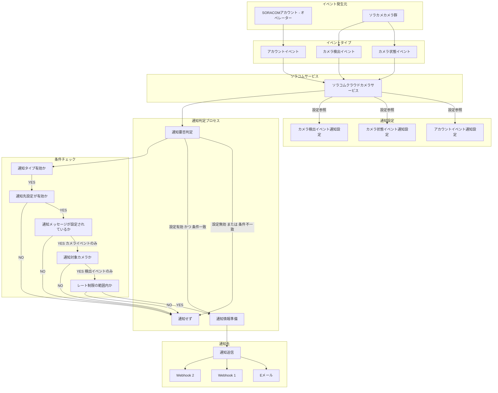

:::message
「[一般消費者が事業者の表示であることを判別することが困難である表示](https://www.caa.go.jp/policies/policy/representation/fair_labeling/guideline/assets/representation_cms216_230328_03.pdf)」の運用基準に基づく開示: この記事は記載の日付時点で[株式会社ソラコム](https://soracom.jp/)に所属する社員が執筆しました。ただし、個人としての投稿であり、株式会社ソラコムとしての正式な発言や見解ではありません。
:::

## やりたいこと
ソラカメごとに異なるメールアドレスに対してソラカメの通知を送信するようにします。

## 背景
ソラカメには




    %% スタイル設定
    classDef orange fill:#f9f,stroke:#333,stroke-width:2px;
    classDef green fill:#9f9,stroke:#333,stroke-width:2px;
    classDef red fill:#f99,stroke:#333,stroke-width:2px;

    class G,H,I orange
    class J orange
    class L green
    class K red

    %% 注釈

    note right of G
      デバイス追加 削除 共有
      レート制限なし
    end

    note right of H
      デバイスオンライン オフライン
      クラウド常時録画停止
      レート制限なし
      最大15分遅延あり
    end

    note right of I
      モーション検知 サウンド検出
      レート制限あり
    end

    note left of M
      通知先は設定画面ごとに1セット
      メールは最大3件 Webhookは最大2件
    end

    note left of J3
      カメラ状態と検出イベントのみ対象
      通知対象カメラの選択が必要
    end

    note left of J4
      カメラ検出イベントのみ
      時間あたりの通知可能数に制限あり
    end

    note left of N
      ルートユーザーで設定
      件名と本文は必須
    end

    note left of O
      URL メソッド ボディは必須
      ヘッダー設定は可能 JSON形式に対応
    end

    note left of P
      Webhook 1と同様
    end

    note right of P
      Public beta機能
      カメラ通知は有料
    end
```


