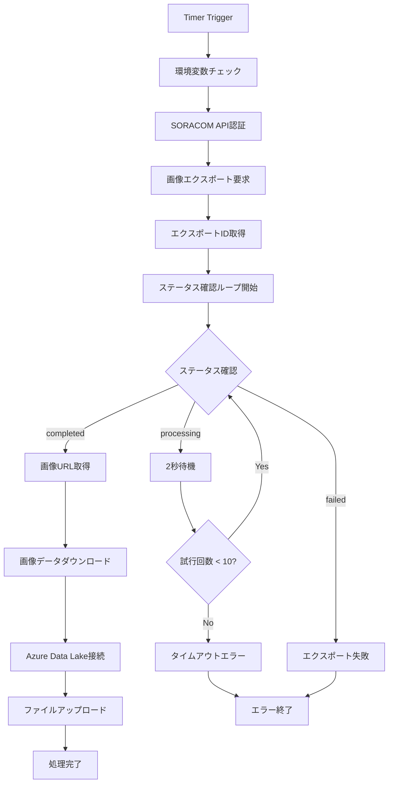

:::message
「[一般消費者が事業者の表示であることを判別することが困難である表示](https://www.caa.go.jp/policies/policy/representation/fair_labeling/guideline/assets/representation_cms216_230328_03.pdf)」の運用基準に基づく開示: この記事は記載の日付時点で[株式会社ソラコム](https://soracom.jp/)に所属する社員が執筆しました。ただし、個人としての投稿であり、株式会社ソラコムとしての正式な発言や見解ではありません。
:::

## やりたいこと

Azure Data Factoryを経由して様々な分析サービスに接続するために、SORACOMのソラカメで撮影した画像をAzure Data Lake Storageに保存していきます。
このブログでは、Azure Functionsを使用して5分ごとにSORACOMのソラカメから画像を取得し、Azure Data Lake Storageに保存する仕組みを構築します。

## システム構成図


## 必要な情報

セットアップを開始する前に、以下の情報を準備してください：


### 必要なもの
- SORACOM アカウント
- ソラカメ関連
    - ソラカメ（AtomCam2）
    - Wifi環境
    - ソラカメライセンス(常時録画ライセンス 7日間プラン)  

:::details ソラカメが初めての方はこちら(購入から設置まで)！

### SORACOMのアカウント作成など
https://users.soracom.io/ja-jp/guides/getting-started/create-account/

カバレッジタイプはJPで。

### ソラカメの購入〜セットアップまで

https://sora-cam.com/setup/

実は最近はソラカメのセットアップにアプリを使わなくても良くなっていたりする。

### ソラカメの設置

設置に関する知見はここにたくさん溜まっています。
https://weathernews.jp/s/topics/202403/180215/

:::
- Microsoft Azure アカウント


## カメラチェック

:::details カメラのチェック

何はともあれ、カメラが正常に動作しているか確認しましょう。

「ソラコムクラウドカメラサービス」 -> 「デバイス管理」


デバイスの一覧表示で、先ほど登録したカメラがオンラインになっていることを確認します。


さらに、カメラの名前をクリックすると、カメラの映像が表示されます。


    :::message
    この画面を見続けていると月72時間までの動画エクスポート時間無料枠を消費してしまうので注意しましょう。
    :::

:::

## SORACOM APIキーを発行する

:::details SORACOM APIキーの発行

ソラカメの録画データから画像を取得するために、SORACOM APIを利用します。
APIを利用するためには、APIキーを発行する必要がありますので、以下の手順でAPIキーを発行しましょう。
1. 右上のログインしているユーザー名（ルートユーザーであればメールアドレス、SAMユーザーであればSAMユーザー名）をクリックして出てくるメニューから、「セキュリティ」をクリック
    

2. 「ユーザー」タブで「SAMユーザー作成」をクリック
    

3. 後で見たときに何をするためのSAMユーザーかわかるように名前をつけます。必要に応じて概要にも記載して「作成」をクリックします。
    

4. 作ったSAMユーザーが一覧に表示されていることを確認して、名前をクリックします。
    

5. 権限を設定します。
    
    直接指定で以下をコピペしてください。

    ```json
    {
     "statements": [
        {
        "api": [
            "SoraCam:exportSoraCamDeviceRecordedImage",
            "SoraCam:getSoraCamDeviceExportedImage",
            "OAuth2:authorize"
        ],
        "effect": "allow"
        }
    ]
    }
    ```

6. 「認証設定」のタブに移り、「認証キーを生成」作成します。
    

7. 生成された認証キーをメモ帳などにコピーして保存しておきます。
    画面を閉じてしまうと再度表示されないので注意してください。
    

:::

### SORACOM情報
ここまでの作業で以下の情報が入手されたものとして進めていきます。
- **SORACOM Auth Key ID**: `keyId-xxxxxxxxxx`
- **SORACOM Auth Key**: `secret-xxxxxxxxxx` 
- **SORACOM Device ID**: `xxxxxxxxxx`

## ステップ1: Azure Storage Account の作成

### 1-1. Azure Portalにログイン
1. https://portal.azure.com にアクセス
2. Azureアカウントでログイン

### 1-2. ストレージアカウントの作成
1. Azure Portal上部の検索バーで「ストレージ アカウント」と検索
2. 「ストレージ アカウント」をクリック

3. 「+ 作成」ボタンをクリック


### 1-3. 基本設定
以下の通り入力してください：


| 項目 | 値 |
|------|-----|
| **サブスクリプション** | 使用するサブスクリプションを選択 |
| **リソースグループ** | 新規作成: `soracam-rg` |
| **ストレージアカウント名** | `soracamstorage` + 任意の数字（例：`soracamstorage001`） |
| **地域** | `Japan East` |
| **プライマリ サービス** | `Azure Blob Storage または Azure Data Lake Storage Gen2` |
| **パフォーマンス** | `Standard` |
| **冗長性** | `ローカル冗長ストレージ (LRS)` |

### 1-4. 詳細設定
「詳細」タブで以下を設定：


| 項目 | 値 |
|------|-----|
| **階層型名前空間を有効にする** | ✅ チェック（重要！） |
| **最小 TLS バージョン** | `バージョン 1.2` |

その他の設定はデフォルトのままでOKです。

### 1-5. 作成完了
1. 「確認および作成」をクリック
2. 検証が完了したら「作成」をクリック
3. デプロイが完了するまで待機（約2-3分）


### 1-6. コンテナの作成
1. 作成されたストレージアカウントにアクセス

2. 左メニューの「データストレージ」→「コンテナー」をクリック

3. 「+ コンテナー」をクリック
4. コンテナー名に `soracam-images` と入力

5. パブリックアクセスレベルは「プライベート」のまま
6. 「作成」をクリック


### 1-7. アクセスキーの確認
1. ストレージアカウントで「アクセス キー」をクリック

2. 「接続文字列」の「表示」をクリック

3. **key1の接続文字列**をコピーしてメモ帳に保存
   - 形式: `DefaultEndpointsProtocol=https;AccountName=...`

## ステップ2: Azure Functions App の作成

### 2-1. Functions Appの作成
1. Azure Portal上部の検索バーで「関数アプリ」と検索
2. 「関数アプリ」をクリック

3. 「+ 作成」をクリック


### 2-2. 基本設定
ホスティングオプションは「従量課金」を選択します。


関数アプリの作成画面では以下の通り入力：


| 項目 | 値 |
|------|-----|
| **サブスクリプション** | 同じサブスクリプションを選択 |
| **リソースグループ** | `soracam-rg`（既存を選択） |
| **関数アプリ名** | `soracam-functions` + 任意の数字 |
| **オペレーティング システム** | `Linux(legacy)` |
| **ランタイム スタック** | `Python` |
| **バージョン** | `3.12` |
| **地域** | `Japan East` |


### 2-3. 作成完了
1. 「確認および作成」をクリック
2. 「作成」をクリック
3. デプロイが完了するまで待機（約3-5分）

## ステップ3: 環境変数の設定

### 3-1. Functions Appの設定画面へ
1. 作成されたFunctions Appにアクセス

2. 左メニューの「設定」→「構成」をクリック

3. 「ここをクリックして [環境変数] メニューに移動する」をクリック


### 3-2. 環境変数の追加
「アプリ設定」タブから「+追加」をクリックして、以下の環境変数を**1つずつ**追加：


#### Azure Storage設定
| 名前 | 値 |
|------|-----|
| `AZURE_STORAGE_CONNECTION_STRING` | ステップ1-7でコピーした接続文字列 |
| `AZURE_STORAGE_CONTAINER_NAME` | `soracam-images` |

#### SORACOM設定
| 名前 | 値 |
|------|-----|
| `USE_SORACOM_API` | `true` |
| `SORACOM_AUTH_KEY_ID` | あなたのSORACAM Auth Key ID(keyId-から始まる文字列) |
| `SORACOM_AUTH_KEY` | あなたのSORACAM Auth Key(secret-から始まる文字列) |
| `SORACOM_DEVICE_ID` | あなたのSORACAM Device ID |


### 3-3. 設定の保存
1. すべての環境変数を追加したら「適用」をクリック
2. 「確認」で確定

## ステップ4: Python関数コードの作成

### 4-1. 関数の作成
1. Functions Appで「概要」->「関数」をクリック

2. Azure portalで作成の「関数の作成」をクリック
4. 「Timer Trigger」を選択し、次へ

5. ジョブの種類: 新しいアプリの作成
6. Provide a function name: `SoraCamFunction`
6. スケジュール: `0 */5 * * * *`（5分間隔）

7. 「作成」をクリック


### 4-2. プロジェクトファイルの作成
このプロジェクトには、既に以下のファイルが準備していきます。
```
azure-soracam/
├── requirements.txt          # Python依存関係
├── host.json                # Azure Functions設定
└── SoraCamFunction/         # Azure Function
    └── __init__.py         # メイン関数コード
```

### 4-3. requirements.txtの設定
1. 以下の内容のファイルを `requirements.txt` として作成

```txt
azure-functions
azure-storage-file-datalake
requests
python-dateutil
```

### 4-4. host.jsonの設定
1. `host.json` ファイルを作成
2. 以下の内容をコピー＆ペースト

```json
{
  "version": "2.0",
  "logging": {
    "applicationInsights": {
      "samplingSettings": {
        "isEnabled": true,
        "excludedTypes": "Request"
      }
    }
  },
  "extensionBundle": {
    "id": "Microsoft.Azure.Functions.ExtensionBundle",
    "version": "[3.*, 4.0.0)"
  },
  "functionTimeout": "00:10:00"
}
```

### 4-5. メイン関数コードの設定
1. `SoraCamFunction/__init__.py` ファイルを作成
2. 以下のコードをコピー＆ペースト

:::details 関数（`__init__.py`）コード

```python
import datetime
import json
import logging
import os
import azure.functions as func
import requests
from azure.storage.filedatalake import DataLakeServiceClient
from typing import Dict, Optional

def main(mytimer: func.TimerRequest) -> None:
    """
    SORACOM SoraCam画像を定期取得してAzure Data Lake Storageに保存
    """
    utc_timestamp = datetime.datetime.utcnow().replace(
        tzinfo=datetime.timezone.utc).isoformat()

    logging.basicConfig(level=logging.INFO)
    logger = logging.getLogger(__name__)
    
    logger.info(f'SoraCam Function開始: {utc_timestamp}')
    
    if mytimer.past_due:
        logger.info('タイマーが遅延しています')

    try:
        logger.info('=== SORACOM画像取得プロセス開始 ===')
        
        # SORACOM認証情報チェック
        required_vars = ['SORACOM_AUTH_KEY_ID', 'SORACOM_AUTH_KEY', 'SORACOM_DEVICE_ID']
        missing_vars = [var for var in required_vars if not os.environ.get(var)]
        
        if missing_vars:
            logger.error(f"SORACOM環境変数が不足: {', '.join(missing_vars)}")
            raise ValueError(f"SORACOM環境変数が不足: {', '.join(missing_vars)}")
        
        # Azure Storage認証情報チェック
        azure_vars = ['AZURE_STORAGE_CONNECTION_STRING', 'AZURE_STORAGE_CONTAINER_NAME']
        missing_azure_vars = [var for var in azure_vars if not os.environ.get(var)]
        
        if missing_azure_vars:
            logger.error(f"Azure Storage環境変数が不足: {', '.join(missing_azure_vars)}")
            raise ValueError(f"Azure Storage環境変数が不足: {', '.join(missing_azure_vars)}")
        
        logger.info("全ての必要な環境変数が設定されています")
        
        # SORACOM APIから画像取得
        image_data = fetch_soracom_image()
        
        # Azure Data Lake Storageに保存
        save_result = save_to_data_lake(image_data)
        
        logger.info('=== 画像保存完了 ===')
        logger.info(f'ファイル: {save_result["file_path"]}')
        logger.info(f'サイズ: {save_result["size"]} bytes')
        
    except Exception as e:
        logger.error(f'エラー発生: {str(e)}', exc_info=True)
        raise

def fetch_soracom_image() -> Dict:
    """SORACOM APIから画像を取得"""
    logger = logging.getLogger(__name__)
    
    # 環境変数の存在チェックと値のマスキング表示
    auth_key_id = os.environ.get('SORACOM_AUTH_KEY_ID')
    auth_key = os.environ.get('SORACOM_AUTH_KEY')
    device_id = os.environ.get('SORACOM_DEVICE_ID')
    
    logger.info(f"認証情報チェック - AuthKeyId: {'***' + auth_key_id[-4:] if auth_key_id and len(auth_key_id) > 4 else 'None'}")
    logger.info(f"認証情報チェック - AuthKey: {'***' + auth_key[-4:] if auth_key and len(auth_key) > 4 else 'None'}")
    logger.info(f"認証情報チェック - DeviceId: {device_id}")
    
    # SORACOM API認証
    auth_data = {
        "authKeyId": auth_key_id,
        "authKey": auth_key
    }
    
    # 認証トークン取得
    try:
        logger.info("SORACOM API認証開始...")
        auth_response = requests.post(
            'https://api.soracom.io/v1/auth',
            json=auth_data,
            headers={'Content-Type': 'application/json'},
            timeout=30
        )
        auth_response.raise_for_status()
        logger.info("SORACOM API認証成功")
        
        token_data = auth_response.json()
        api_key = token_data['apiKey']
        token = token_data['token']
        logger.info(f"取得したAPIKey: {'***' + api_key[-8:] if len(api_key) > 8 else 'short_key'}")
        logger.info(f"取得したトークン: {'***' + token[-8:] if len(token) > 8 else 'short_token'}")
    except requests.exceptions.RequestException as e:
        logger.error(f"SORACOM API認証エラー: {e}")
        if hasattr(e, 'response') and e.response is not None:
            logger.error(f"認証レスポンス: Status={e.response.status_code}, Body={e.response.text}")
        raise
    
    # 画像エクスポート要求
    current_time = int(datetime.datetime.utcnow().timestamp() * 1000)
    export_data = {
        "deviceId": device_id,
        "time": current_time
    }
    
    logger.info(f"画像エクスポート要求開始 - DeviceId: {device_id}, Time: {current_time}")
    
    try:
        export_response = requests.post(
            f'https://api.soracom.io/v1/sora_cam/devices/{device_id}/images/exports',
            json={'time': current_time},
            headers={
                'X-Soracom-API-Key': api_key,
                'X-Soracom-Token': token,
                'Content-Type': 'application/json'
            },
            timeout=30
        )
        
        logger.info(f"エクスポート応答: Status={export_response.status_code}")
        
        if export_response.status_code != 200:
            logger.error(f"エクスポート失敗: Status={export_response.status_code}")
            logger.error(f"エクスポート応答内容: {export_response.text}")
            
        export_response.raise_for_status()
        logger.info("画像エクスポート要求成功")
        
    except requests.exceptions.RequestException as e:
        logger.error(f"画像エクスポート要求エラー: {e}")
        if hasattr(e, 'response') and e.response is not None:
            logger.error(f"エクスポートエラー詳細: Status={e.response.status_code}, Body={e.response.text}")
        raise
    
    export_id = export_response.json()['exportId']
    
    # エクスポート完了待機
    import time
    logger.info(f"エクスポート完了待機開始 - ExportId: {export_id}")
    
    for attempt in range(10):
        logger.info(f"エクスポートステータス確認中 - 試行{attempt + 1}/10")
        
        try:
            status_response = requests.get(
                f'https://api.soracom.io/v1/sora_cam/devices/{device_id}/images/exports/{export_id}',
                headers={
                    'X-Soracom-API-Key': api_key,
                    'X-Soracom-Token': token,
                    'Content-Type': 'application/json'
                },
                timeout=30
            )
            status_response.raise_for_status()
            
            status_data = status_response.json()
            logger.info(f"エクスポートステータス: {status_data.get('status', 'unknown')}")
            
            if status_data['status'] == 'completed':
                image_url = status_data['url']
                logger.info("画像エクスポート完了")
                break
            elif status_data['status'] == 'failed':
                logger.error(f"SORACOM画像エクスポートが失敗: {status_data}")
                raise Exception('SORACOM画像エクスポートが失敗しました')
            
        except requests.exceptions.RequestException as e:
            logger.error(f"ステータス確認エラー (試行{attempt + 1}): {e}")
            if attempt == 9:  # 最後の試行
                raise
        
        time.sleep(2)
    else:
        logger.error("エクスポートがタイムアウトしました")
        raise Exception('SORACOM画像エクスポートがタイムアウトしました')
    
    # 画像データ取得
    image_response = requests.get(image_url, timeout=30)
    image_response.raise_for_status()
    
    logger.info(f"SORACOM画像取得成功: {len(image_response.content)} bytes")
    
    return {
        'data': image_response.content,
        'size': len(image_response.content),
        'content_type': 'image/jpeg',
        'timestamp': datetime.datetime.utcnow(),
        'source_url': image_url,
        'device_id': device_id,
        'api_key': api_key,
        'token': token
    }

def save_to_data_lake(image_data: Dict) -> Dict:
    """Azure Data Lake Storageに画像を保存"""
    logger = logging.getLogger(__name__)
    
    # Azure Storage接続
    connection_string = os.environ.get('AZURE_STORAGE_CONNECTION_STRING')
    container_name = os.environ.get('AZURE_STORAGE_CONTAINER_NAME')
    
    service_client = DataLakeServiceClient.from_connection_string(connection_string)
    file_system_client = service_client.get_file_system_client(container_name)
    
    # ファイル名生成 (例: 2025/01/28/soracam_20250128_120500_123.jpg)
    timestamp = image_data['timestamp']
    filename = f"soracam_{timestamp.strftime('%Y%m%d_%H%M%S')}_{timestamp.microsecond//1000:03d}.jpg"
    file_path = f"{timestamp.strftime('%Y/%m/%d')}/{filename}"
    
    # メタデータ
    metadata = {
        'capture_time': timestamp.isoformat() + 'Z',
        'content_type': image_data['content_type'],
        'device_id': image_data['device_id'],
        'source': 'soracom_api',
        'file_size': str(image_data['size'])
    }
    
    # ファイルアップロード
    file_client = file_system_client.get_file_client(file_path)
    file_client.upload_data(
        image_data['data'],
        overwrite=True,
        metadata=metadata
    )
    
    logger.info(f"Data Lake Storage保存完了: {file_path}")
    
    return {
        'file_path': file_path,
        'size': image_data['size'],
        'upload_time': datetime.datetime.utcnow().isoformat()
    }
```
:::

**重要:** プロジェクトルート（azure-soracam）全体をデプロイフォルダとして使用します。


処理フローは以下のとおりです。




### 4-6. VSCode でプロジェクトを開く
1. VSCode を起動
2. 「ファイル」→「フォルダーを開く」
3. `azure-soracam` フォルダ（プロジェクトルート）を選択
4. VSCodeがAzure Functionsプロジェクトを認識することを確認

### 4-7. Azure にサインイン
1. VSCode で `Ctrl+Shift+P`（コマンドパレット）
2. 「Azure: Sign In」を実行
3. ブラウザが開くのでAzureアカウントでログイン

### 4-8. Functions App にデプロイ
1. VSCode左サイドバーの「Azure」アイコンをクリック
2. 「Functions」セクションを展開
3. 作成した Functions App（`soracam-functions-xxx`）を選択

4. デプロイ先の関数を右クリックして「Deploy to Function App...」を選択

5. フォルダを選択してデプロイ確認で「Deploy」を選択

6. デプロイ完了まで待機（数分）


## ステップ5: 動作確認

### 5-1. 関数の手動実行
1. 関数一覧で `SoraCamFunction` をクリック
2. 「テスト/実行」をクリック

3. 「実行」をクリック
4. ログを確認（実行には30秒程度かかります）


### 5-3. 保存された画像の確認
1. ストレージアカウントにアクセス
2. 「データストレージ」→「コンテナー」

3. `soracam-images` をクリック

4. `2025/01/28/` のようなフォルダ構造で画像が保存されていることを確認

5. 画像ファイルを確認


これで、ソラカメの画像が5分間隔で自動的にAzure Data Lake Storageに保存されるシステムが完成しました。

