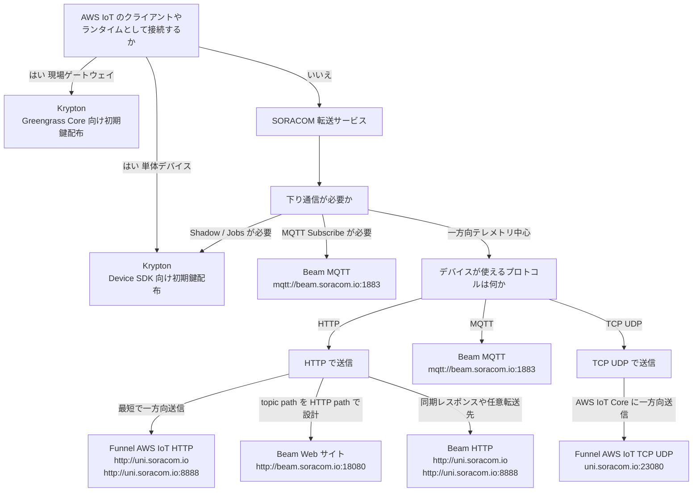

:::message
「[一般消費者が事業者の表示であることを判別することが困難である表示](https://www.caa.go.jp/policies/policy/representation/fair_labeling/guideline/assets/representation_cms216_230328_03.pdf)」の運用基準に基づく開示: この記事は記載の日付時点で[株式会社ソラコム](https://soracom.jp/)に所属する社員が執筆しました。ただし、個人としての投稿であり、株式会社ソラコムとしての正式な発言や見解ではありません。
:::

## TL;DR

- 最初に、AWS IoT Core に「AWS IoT のクライアント/ランタイムとして接続する」のか、「SORACOM の転送サービスからメッセージを入れる」のかを分けます。
- AWS IoT のクライアント/ランタイムとして接続するなら、選択する SORACOM サービスは Krypton です。単体デバイスでは AWS IoT Device SDK、現場ゲートウェイでは AWS IoT Greengrass で、Krypton が払い出した認証情報を使います。
- Krypton は SDK や Greengrass を提供するものではなく、AWS IoT 証明書、秘密鍵、Thing 登録の初期プロビジョニングを簡素化します。
- AWS IoT Core に SORACOM の転送サービスからメッセージを入れるなら、SORACOM Beam / Funnel を中心に、下り通信の要否、デバイス側のプロトコル制約、HTTP の使い方、Unified Endpoint 対応可否で選びます。
- Beam は SDK 不要化と認証情報配布のオフロード、Krypton は認証情報配布や初期登録の簡素化、という役割の違いがあります。

## はじめに

SORACOM から AWS IoT Core にデータを送る方法はいくつかあります。
代表的には、SORACOM Beam の MQTT エントリポイントを使う方法、Beam の Web サイトエントリポイントから AWS IoT Core の HTTPS Publish API を呼び出す方法、SORACOM Funnel の AWS IoT アダプターを使う方法、SORACOM Krypton で認証情報を払い出して AWS IoT Device SDK や Greengrass Core から接続する方法などです。

https://x.com/inaniwan/status/906863449157771266

こうなると、「どの機能を使えば AWS IoT Core と連携できるか」よりも、「どういう要件ならどれを選ぶべきか」の整理が重要になります。

この記事では、AWS IoT Device SDK や AWS IoT Greengrass を使う場合も含めて、最終的に選ぶ SORACOM サービスを SORACOM Beam / Funnel / Krypton のどれにするか、判断の順番に沿って整理します。

:::message
この記事は選定ガイドです。各サービスの詳細な設定手順は、公式ドキュメントや個別の記事を参照してください。
:::

## まず全体像

最初の分岐は、AWS IoT Core に「AWS IoT のクライアント/ランタイムとして接続する」のか、「SORACOM の転送サービスからメッセージを入れる」のかです。
図で候補サービスを選び、後半の「エントリポイント早見表」で「どのエントリポイントに送るか」まで落とし込みます。



AWS IoT のクライアント/ランタイムとして接続する場合、選択する SORACOM サービスは Krypton です。
そのうえで、単体デバイスでは AWS IoT Device SDK、現場ゲートウェイでは Greengrass で、Krypton が払い出した認証情報を使います。
一方、AWS IoT Core の MQTT topic にメッセージを入れ、AWS IoT Rules 以降で処理するのが主目的なら、Beam / Funnel を中心に考えます。

フローで選択する SORACOM サービスの概要を表にすると、以下のようになります。

| 要件 | 選択する SORACOM サービス | 判断のポイント |
|---|---|---|
| 単体デバイスで Shadow / Jobs / SDK を使う | Krypton | AWS IoT Device SDK で使う証明書、秘密鍵、Thing 登録の初期プロビジョニングを簡素化する |
| 現場ゲートウェイで集約、ローカル処理、アプリ配布を行う | Krypton | Greengrass Core で使う証明書、秘密鍵、Thing 登録の初期プロビジョニングを簡素化する |
| MQTT の下り通信も使う | Beam MQTT | MQTT は話せるが TLS や証明書管理をデバイスに持たせたくない |
| AWS IoT Core に一方向送信したい | Funnel AWS IoT アダプター | 最短で入れたい、Unified Endpoint や IMSI などのプレースホルダーを活かしたい |
| HTTP path を AWS IoT Core の topic にする | Beam Web サイト | HTTP-only デバイスから topic path を設計したい |
| HTTP で任意の HTTP/HTTPS 転送先に同期転送したい | Beam HTTP | 固定した転送元パスから任意の HTTP/HTTPS 転送先へ送りたい |

## 判定 1: AWS IoT のクライアント/ランタイムとして接続したいか

AWS IoT のクライアント/ランタイムとして接続するとは、AWS IoT Core の Thing、X.509 証明書、MQTT 接続、Shadow、Jobs、Device SDK、Greengrass のデプロイ管理などを設計の中心に置くことです。

この場合は、Beam / Funnel でメッセージを転送する構成とは考えるレイヤーが変わります。
Beam / Funnel は「メッセージを転送する」機能であり、デバイス自身を AWS IoT のクライアントとして扱う機能ではないためです。

この系統では、単体デバイスで AWS IoT Device SDK を使う場合も、現場ゲートウェイで Greengrass を使う場合も、AWS IoT Core に対してクライアント/ランタイムとして接続します。
つまり、Beam / Funnel でメッセージを転送する方式とはレイヤーが違います。
SORACOM 側の選択肢としては、AWS IoT Device SDK や Greengrass そのものではなく、それらで使う AWS IoT のデバイス認証情報プロビジョニングを簡素化する Krypton を選択します。
Krypton は「SDK や Greengrass を不要にする仕組み」ではなく、「AWS IoT のデバイス認証情報プロビジョニングを簡素化する仕組み」として検討します。

### 単体デバイスを AWS IoT Thing として扱うなら AWS IoT Device SDK

単体デバイスを AWS IoT Thing として扱い、AWS IoT Device SDK で MQTT 接続するなら、デバイス自身が AWS IoT Core のクライアントになります。
このとき、デバイス証明書や Thing 登録の初期プロビジョニングを簡素化したい場合に、SORACOM Krypton が候補になります。

Krypton は、デバイスごとの AWS IoT 証明書発行や Thing 登録を簡素化するための機能です。
デバイスは Krypton で払い出された認証情報を使い、その後は AWS IoT Device SDK や MQTT クライアントで AWS IoT Core に接続します。

この選択肢が向いているのは、以下のようなケースです。

- AWS IoT Device Shadow の `desired` / `reported` / `delta` を使いたい
- AWS IoT Jobs でリモート操作や OTA のような処理を扱いたい
- デバイスを Thing として登録し、Thing name や clientId を軸に権限管理したい
- AWS IoT Device SDK が提供する再接続、MQTT、Shadow、Jobs まわりの実装を使いたい

ただし、Krypton は SDK 不要化の仕組みではありません。
Krypton が簡素化するのは、認証情報の発行、配布、初期登録の部分です。
払い出された認証情報を使って AWS IoT Core に接続する処理は、デバイス側の SDK やアプリケーションで実装します。

### 現場ゲートウェイで集約やローカル処理をするなら Greengrass

AWS IoT Greengrass は、AWS IoT Core への単なる転送経路ではなく、現場側に置くエッジ実行基盤です。
Linux などが動くゲートウェイで複数デバイスを集約し、ローカル処理、アプリ配布、コンポーネント更新、ローカル MQTT、Stream Manager などを扱いたい場合に検討します。

Greengrass が向いているのは、以下のようなケースです。

- センサー、PLC、カメラ、BLE、Modbus、Serial 機器などを現場ゲートウェイで集約する
- 回線断や遅延があっても、現場側で処理や一時保存を行いたい
- すべての生データをクラウドへ送らず、フィルタリングや集計をしてから送信したい
- エッジ側アプリケーションを fleet にデプロイ、更新、ロールバックしたい
- ローカル MQTT や Greengrass component の管理モデルを使いたい

Greengrass 前提の構成では、Greengrass Core 自身が AWS IoT Core と接続し、Greengrass の機能でメッセージ中継やコンポーネント管理を行います。
そのため、Greengrass Core 上の本線の送信経路として Beam / Funnel をすすめる価値は通常は小さくなります。

一方で、Greengrass Core も AWS IoT Core に接続するため、AWS IoT の証明書、秘密鍵、Thing 登録が必要です。
SORACOM Air の回線認証が使える現場ゲートウェイでは、SORACOM Krypton で AWS IoT の証明書を払い出し、Greengrass Core の初期鍵配布を簡素化する構成を検討します。

Greengrass 前提で SORACOM サービスを並べると、位置づけは次のようになります。

| SORACOM サービス | Greengrass 前提での位置づけ |
|---|---|
| Krypton | Greengrass Core の AWS IoT 証明書、秘密鍵、Thing 登録の初期プロビジョニングを簡素化する主候補 |
| Beam | Core 上の既存アプリを SDK なしで送信したい、または Greengrass 管理外の軽量デバイスを別経路で転送したい場合の補助 |
| Funnel | Greengrass 管理外の一方向テレメトリを AWS IoT Core に入れる別系統の経路 |

Beam には、SDK 不要化と認証情報配布のオフロードという 2 つの側面があります。
Greengrass Core 上で AWS IoT SDK や Greengrass component を使う設計が自然であれば、Beam の SDK 不要化メリットは相対的に小さくなります。
一方、既存アプリケーションをほぼ変えずに HTTP、MQTT、TCP、UDP で送信したい場合は、Beam を補助経路として見る価値があります。

## 判定 2: 下り通信が必要か

AWS IoT のクライアント/ランタイムとして接続せず、Beam / Funnel を中心に考える場合でも、下り通信が必要かどうかは重要です。
ここで Shadow / Jobs が必要だと分かった場合は、フローチャートのとおり判定 1 の Krypton 側に戻ります。

ここでいう下り通信には 2 種類あります。

| 下り通信の種類 | SORACOM 側の選択肢 |
|---|---|
| Shadow / Jobs のような AWS IoT の予約 topic と SDK のモデルで扱いたい | Krypton。払い出した認証情報を AWS IoT Device SDK で使う |
| MQTT の publish / subscribe で独自 command topic を購読したい | Beam MQTT |

Shadow / Jobs を使いたいのであれば、Beam / Funnel ではなく Krypton 側に戻ります。
実装としては、Krypton が払い出した認証情報を AWS IoT Device SDK で使います。
これは単なる下りメッセージではなく、AWS IoT の Thing、予約 topic、状態同期、ジョブ実行状態まで含むモデルだからです。

一方で、「AWS IoT Core の MQTT broker にある独自 topic を subscribe して、コマンドを受けたい」という用途であれば、Beam MQTT は候補に残ります。
Beam MQTT は、デバイスからは MQTT、Beam からは MQTT または MQTTS で転送できます。
デバイス側が MQTT は実装できるものの、TLS や X.509 証明書管理が負担になる場合に向いています。

SORACOM Funnel は、パブリッククラウドへのアップロードに特化した非同期転送です。
デバイス宛の下り通信や、転送先の処理結果をすぐにデバイスへ返す用途には向きません。

## 判定 3: デバイスが自然に使えるプロトコルは何か

次に、デバイス側が無理なく使えるプロトコルを確認します。
ここで無理をすると、選定したクラウド連携方式よりも、ファームウェアや通信モジュール側の実装負荷が問題になります。

### HTTP が使える場合

HTTP が使えるなら、Beam Web サイト、Beam HTTP、Funnel が候補になります。
この段階では候補の列挙に留め、HTTP の使い方は次の判定 4 で分けます。

| 方式 | 次に見ること |
|---|---|
| Beam Web サイト | HTTP path を topic path として設計したいか |
| Beam HTTP | 任意の HTTP/HTTPS 転送先や同期レスポンスを扱いたいか |
| Funnel | 最短で AWS IoT Core に一方向送信したいか |

Beam Web サイトは、デバイスから以下のような HTTP リクエストを送り、Beam が AWS IoT Core の HTTPS Publish API に転送する構成です。

```bash
curl -v 'http://beam.soracom.io:18080/topics/telemetry/site-a/line-1/device-001?qos=1' \
  -H 'content-type: application/json' \
  --data '{"temp":24.1,"status":"ok"}'
```

AWS IoT Core の HTTPS Publish API は `/topics/<topicName>?qos=1` という URL で Publish します。
そのため、HTTP-only のデバイスでも、Beam Web サイトエントリポイントを使うことで、HTTP path を AWS IoT Core の topic 設計に対応させられます。

一方、Funnel は AWS IoT アダプターを使って AWS IoT Core に Publish できます。
Funnel の非同期性は特徴ではありますが、AWS IoT Core 自体も MQTT topic と Rules を中心にした非同期なメッセージング基盤です。
そのため、AWS IoT Core に Publish する前段としては、「非同期であること」だけを主メリットにするよりも、Unified Endpoint との相性や、転送先 URL に `#{imsi}`、`#{simId}`、`#{imei}` のようなプレースホルダーを使えることを主なメリットとして見る方が実務的です。

### MQTT が使える場合

MQTT が使える場合は、まず MQTT のどこまでをデバイス側で持てるかを確認します。

| デバイス側でできること | 向く選択肢 |
|---|---|
| MQTT はできるが MQTTS や X.509 証明書管理が厳しい | Beam MQTT |
| MQTTS と証明書管理までできる | AWS IoT Core 直接接続も可能。初期プロビジョニングを SORACOM に寄せるなら Krypton |
| Shadow / Jobs / Thing 管理まで使いたい | Krypton。払い出した認証情報を AWS IoT Device SDK で使う |

Beam MQTT は、デバイス側の MQTT スタックを活かしつつ、TLS や認証情報管理を SORACOM 側に寄せられる選択肢です。
また、MQTT の Publish だけでなく Subscribe も扱えるため、独自 topic による下り通信が必要な場合にも候補に残ります。

### TCP / UDP が使いやすい場合

マイコンや通信モジュールの都合で HTTP や MQTT よりも TCP / UDP が扱いやすい場合は、AWS IoT Core への一方向送信として Funnel AWS IoT アダプターを検討します。

| 方式 | 向くケース |
|---|---|
| Funnel | TCP/UDP のデータを AWS IoT Core に一方向テレメトリとして入れたい |

実装時は、Funnel の送信データ形式と `payloadsOnly` の設定を確認します。
TCP/UDP やバイナリ送信では、AWS IoT Core に届く `payloads` の見え方が HTTP/JSON 送信時と異なるため、必要に応じて Binary Parser や Orbit で AWS IoT Rules が扱いやすい形式に整えます。

Beam の TCP -> TCP/TCPS は、AWS IoT Core 連携の主役にはしにくいです。
AWS IoT Core は raw TCP の任意バイト列を受けるサービスではなく、MQTT over TLS、MQTT over WebSocket Secure、HTTPS などのアプリケーションプロトコルを要求します。

Beam TCP/UDP -> HTTP/HTTPS も技術的には TCP/UDP を HTTP/HTTPS に変換できます。
ただし、本記事の前提である AWS IoT Core への Publish では、基本的には選びません。
AWS IoT Core の HTTPS Publish API を呼んでも、デバイスが得られるのは Publish API の成否であり、Rules Engine や後段 subscriber の処理結果ではありません。
そのため、Beam TCP/UDP -> HTTP/HTTPS にしたからといって、AWS IoT Core 連携でレスポンスから得られる情報量が増えるわけではありません。

特殊な例として、デバイスが MQTT パケットは作れるが TLS だけできない、という状況は考えられます。
しかし、その用途は Beam MQTT が正面から扱っています。
AWS IoT Core に Publish するための選定ガイドでは、Beam TCP/UDP -> HTTP/HTTPS や TCP -> TCP/TCPS は基本的に主役から外してよいでしょう。

## 判定 4: HTTP では何を重視するか

HTTP が使える場合は、フローチャートの HTTP 分岐で「最短で一方向送信したいのか」「topic path を HTTP path で設計したいのか」「同期レスポンスや任意転送先を扱いたいのか」を分けます。

| 判断 | 選択する SORACOM サービス | 第一候補のエントリポイント |
|---|---|---|
| 最短で AWS IoT Core に一方向送信したい | Funnel AWS IoT アダプター HTTP | `http://uni.soracom.io` または `http://uni.soracom.io:8888` |
| HTTP path を AWS IoT Core の topic path として設計したい | Beam Web サイト | `http://beam.soracom.io:18080` |
| 任意の HTTP/HTTPS 転送先や同期レスポンスを扱いたい | Beam HTTP | `http://uni.soracom.io` または `http://uni.soracom.io:8888` |

Funnel は AWS IoT アダプターにデータを渡す用途として考えるとわかりやすいです。
デバイスは投げっぱなしでよく、AWS IoT Core に Publish できればよい場合に向いています。

一方、Beam は HTTP path、HTTPS Publish API の成否、MQTT Subscribe のように、転送のふるまいをデバイス側から意識したい場合に向いています。
ただし、AWS IoT Core への Publish では、同期レスポンスが返っても Publish API の成否が中心です。
Beam TCP/UDP -> HTTP/HTTPS を選んでも、IoT Core の後段処理結果が追加で得られるわけではありません。

## 判定 5: Unified Endpoint を使える方式か

ここまでで候補サービスが見えたら、その方式が Unified Endpoint に対応しているかを確認します。
Unified Endpoint で使える Beam / Funnel のエントリポイントであれば、基本的には `uni.soracom.io` を第一候補にします。
デバイスは同じ宛先に送信し、SIM グループ側の設定で Harvest Data、Beam、Funnel などへ転送できます。

これにより、次のような運用がしやすくなります。

- PoC では Harvest Data で可視化し、本番では Funnel で AWS IoT Core に転送する
- 移行期間だけ Harvest Data と AWS IoT Core の両方に送る
- デバイスのファームウェアを変更せず、転送先サービスを切り替える
- Unified Endpoint の前段で Binary Parser や Orbit を使い、デバイスの送信形式を保ったまま後段の形式変更に対応する

つまり、Unified Endpoint に対応している方式では、あえて Beam や Funnel の直接エントリポイントを選ぶ理由は通常は小さくなります。
注意が必要なのは、Beam の一部エントリポイントが Unified Endpoint 経由では使えないことです。

| 目的 | 基本方針 | デバイスが使うエントリポイント |
|---|---|---|
| HTTP で AWS IoT Core に一方向送信 | Funnel AWS IoT アダプターを Unified Endpoint 経由で使う | `http://uni.soracom.io` または `http://uni.soracom.io:8888` |
| TCP/UDP で AWS IoT Core に一方向送信 | Funnel AWS IoT アダプターを Unified Endpoint 経由で使う | `uni.soracom.io:23080` |
| HTTP で任意 HTTP/HTTPS に転送 | Beam HTTP を Unified Endpoint 経由で使う | `http://uni.soracom.io` または `http://uni.soracom.io:8888` |
| HTTP path を AWS IoT Core の topic にする | Unified Endpoint 非対応のため Beam Web サイトを直接使う | `http://beam.soracom.io:18080` |
| MQTT の Publish / Subscribe を使う | Unified Endpoint 非対応のため Beam MQTT を直接使う | `mqtt://beam.soracom.io:1883` |

Beam Web サイト、Beam MQTT、Beam TCP -> TCP/TCPS は Unified Endpoint 経由では使えません。
HTTP path を AWS IoT Core の topic として扱いたい場合は Beam Web サイトを直接使い、MQTT の Subscribe が必要な場合は Beam MQTT を直接使います。

## 補足: 認証方式をどう考えるか

AWS IoT Core 連携では、X.509 と SigV4 の違いも整理しておくと判断しやすくなります。

| 認証方式 | 向くケース |
|---|---|
| X.509 | MQTT/MQTTS、Thing、clientId、Shadow、Jobs、デバイス単位の証明書やポリシーを使いたい |
| SigV4 | HTTPS Publish や MQTT over WSS を IAM 権限で呼びたい |
| X.509 over HTTPS | HTTPS Publish だが証明書ベースに統一したい |

X.509 は、AWS IoT のデバイス ID として振る舞う構成に向いています。
MQTT 接続、Thing、Shadow、Jobs、接続状態検知、デバイス単位の IoT policy といった機能を使うなら、X.509 を中心に設計します。

SigV4 は、IAM 権限で HTTPS Publish API を呼びたい場合に向いています。
Beam Web サイトで SigV4 を使う構成では、デバイスに AWS 認証情報や SigV4 署名処理を持たせず、Beam 側で署名して AWS IoT Core に Publish できます。

Beam Web サイトは SigV4 だけでなく、転送先への HTTPS 接続で X.509 クライアント証明書も利用できます。
AWS IoT Core の HTTPS Publish を IAM 権限で扱いたいなら SigV4、証明書と IoT policy に寄せたいなら X.509 over HTTPS を検討します。

選んだ SORACOM サービスに重ねると、認証方式は次のように効きます。

| 選択する SORACOM サービス | 主に効く認証 | 見方 |
|---|---|---|
| Krypton | X.509 | Device SDK や Greengrass Core が使う証明書、秘密鍵、Thing 登録の初期プロビジョニングを簡素化する |
| Beam MQTT | X.509 | AWS IoT Core へ MQTTS 転送するための証明書を SORACOM 側に持たせ、デバイスには持たせない |
| Beam Web サイト | SigV4 または X.509 over HTTPS | Beam が HTTPS Publish API を呼び、デバイスは HTTP だけを話す。IAM 権限で扱うなら SigV4、証明書ベースで扱うなら X.509 を使う |
| Funnel AWS IoT アダプター | Funnel の AWS IoT アダプター設定 | デバイスは AWS 認証情報を持たず、SORACOM 側の転送設定で AWS IoT Core に入れる |

ここで、Beam / Funnel / Krypton の違いを認証情報の置き場所で見ると、次のようになります。

| 観点 | Beam / Funnel | Krypton |
|---|---|---|
| SDK 不要化 | 汎用的な HTTP/MQTT/TCP/UDP スタックで送れる | SDK や MQTT/HTTPS 実装は別途必要 |
| 認証情報配布のオフロード | 認証情報を SORACOM 側に置き、デバイスには持たせない | 初期プロビジョニングで証明書や設定を払い出す |
| AWS IoT の Thing/Shadow/Jobs 活用 | 基本はメッセージ転送なので弱い | デバイスが AWS IoT クライアントになるので強い |

つまり、Beam / Funnel は「デバイスを軽くする」方向の選択肢です。
Krypton は「デバイスを AWS IoT の正規クライアントにしつつ、初期登録や認証情報配布を簡素化する」方向の選択肢です。

## エントリポイント早見表

ここまでの判定を、SORACOM 側で使うサービスとデバイスが実際に送信するエントリポイントに落とすと以下のようになります。
Unified Endpoint で使える方式は、Unified Endpoint を第一候補として記載します。

| SORACOM サービス / 用途 | デバイスが使うエントリポイント |
|---|---|
| Funnel AWS IoT アダプター HTTP | `http://uni.soracom.io` / `http://uni.soracom.io:8888` |
| Funnel AWS IoT アダプター TCP/UDP | `uni.soracom.io:23080` |
| Beam Web サイト | `http://beam.soracom.io:18080` |
| Beam HTTP | `http://uni.soracom.io` / `http://uni.soracom.io:8888` |
| Beam MQTT | `mqtt://beam.soracom.io:1883` |
| Krypton（Device SDK 利用） | 初期プロビジョニングは `https://krypton.soracom.io:8036`。運用時は AWS IoT Device SDK が AWS IoT Core のデータエンドポイントに接続 |
| Krypton（Greengrass Core 利用） | 初期プロビジョニングは `https://krypton.soracom.io:8036`。運用時は Greengrass Core が AWS IoT Core に接続 |

:::message
Beam Web サイト、Beam MQTT、Beam TCP -> TCP/TCPS は Unified Endpoint 経由では使えないため、各サービスの直接エントリポイントを使います。Unified Endpoint 対応方式では、直接エントリポイントは既存構成の読み替えや切り分けで確認する情報として扱い、選定上は Unified Endpoint を第一候補にします。
:::

:::message
Krypton のエントリポイントは、SORACOM Air のセルラー回線認証を使う場合の例です。その他の認証方式では利用する API が異なるため、Krypton API リファレンスを確認してください。
:::

## 選ぶ理由と注意点

### 選ぶ理由

| SORACOM サービス / 用途 | 選ぶ理由 |
|---|---|
| Funnel AWS IoT アダプター | 最短で一方向テレメトリを AWS IoT Core に入れたい。Unified Endpoint や IMSI などのプレースホルダーを活かしたい |
| Beam Web サイト | HTTP-only デバイスから、HTTP path を AWS IoT Core の topic path として設計したい |
| Beam HTTP | 任意の HTTP/HTTPS 転送先へ送りたい。同期レスポンスを扱いたい |
| Beam MQTT | MQTT は話せるが MQTTS や証明書管理をデバイスに持たせたくない。独自 topic の Subscribe も使いたい |
| Krypton（Device SDK 利用） | Thing、Shadow、Jobs、Device SDK を使いたい。証明書発行や初期登録を簡素化したい |
| Krypton（Greengrass Core 利用） | 現場ゲートウェイで複数デバイス集約、ローカル処理、アプリ配布をしたい。SORACOM Air の回線認証で Greengrass Core の初期鍵配布を簡素化したい |

### 注意点

| SORACOM サービス / 用途 | 注意点 |
|---|---|
| Funnel AWS IoT アダプター | 下り通信や転送先レスポンスの即時取得には向かない |
| Beam Web サイト | Unified Endpoint 経由では使えない。認証方式は SigV4 または X.509 over HTTPS から選べる。HTTPS Publish は publish only |
| Beam HTTP | Unified Endpoint 対応方式。AWS IoT Core の topic を path で柔軟に変える用途では Web サイトの方が向く |
| Beam MQTT | Unified Endpoint 経由では使えない。Shadow / Jobs の管理モデルを使うなら AWS IoT Device SDK を検討 |
| Krypton（Device SDK 利用） | Krypton は SDK 不要化ではない。デバイス側に AWS IoT 接続実装が必要 |
| Krypton（Greengrass Core 利用） | Greengrass は通信プロキシではなくエッジ実行基盤。Krypton は Greengrass の代替ではなく初期プロビジョニングの補助 |

:::message
Beam TCP/UDP -> HTTP/HTTPS は、AWS IoT Core 以外の任意の HTTP/HTTPS エンドポイントへ TCP/UDP データを変換して送りたい場合の Beam の機能です。AWS IoT Core への Publish を前提にした本記事では、TCP/UDP デバイスの本線は Funnel AWS IoT アダプターと考えます。
:::

## まとめ

AWS IoT Core 連携の選定では、SORACOM サービスと AWS 側の SDK / ランタイムを同じ選択肢として横並びに比較すると混乱します。

まず、AWS IoT Core にクライアント/ランタイムとして接続するのか、SORACOM の転送サービスからメッセージを入れるのかを分けます。
前者なら、選択する SORACOM サービスは Krypton です。単体デバイスでは AWS IoT Device SDK、現場ゲートウェイでは Greengrass で、Krypton が払い出した認証情報を使います。

AWS IoT Core の MQTT topic に一方向テレメトリを Publish する用途なら、Beam / Funnel を中心に、下り通信、デバイス側プロトコル、HTTP で重視すること、Unified Endpoint の順に絞り、最後に認証方式とデバイスが送信するエントリポイントを確定します。

実務上の短い結論は次のとおりです。

- 最短で一方向テレメトリを AWS IoT Core に入れるなら Funnel。Unified Endpoint を第一候補にし、HTTP は `http://uni.soracom.io` / `http://uni.soracom.io:8888`、TCP/UDP は `uni.soracom.io:23080`
- HTTP-only で topic path を自分で設計したいなら Beam Web サイト。エントリポイントは `http://beam.soracom.io:18080`。認証方式は SigV4 または X.509 over HTTPS から選ぶ
- HTTP で任意の HTTP/HTTPS 転送先や同期レスポンスを扱いたいなら Beam HTTP。Unified Endpoint を第一候補にし、HTTP は `http://uni.soracom.io` / `http://uni.soracom.io:8888`
- MQTT はできるが TLS や証明書管理を避けたいなら Beam MQTT。エントリポイントは `mqtt://beam.soracom.io:1883`
- 送信先変更や Harvest Data 併用を見越すなら Unified Endpoint 対応方式。HTTP は `http://uni.soracom.io` / `http://uni.soracom.io:8888`、TCP/UDP は `uni.soracom.io:23080`
- Shadow / Jobs / Thing / SDK を使う単体デバイスなら Krypton。初期プロビジョニングは `https://krypton.soracom.io:8036`、運用時は AWS IoT Device SDK が AWS IoT Core に接続
- Greengrass を使う現場ゲートウェイなら Krypton。初期プロビジョニングは `https://krypton.soracom.io:8036`、運用時は Greengrass Core が AWS IoT Core に接続
- Beam TCP/UDP -> HTTP/HTTPS は、AWS IoT Core 連携では基本的に主役にしない
- TCP -> TCP/TCPS は AWS IoT Core 連携の主役にはしない

どの方式も「AWS IoT Core に送れる」だけで選ぶのではなく、デバイス側の実装制約と、AWS IoT 側で使いたい機能のレイヤーをそろえて選ぶのが重要です。

## 参考資料

- [SORACOM Beam の特徴](https://users.soracom.io/ja-jp/docs/beam/feature/)
- [SORACOM Beam: MQTT エントリポイント](https://users.soracom.io/ja-jp/docs/beam/mqtt/)
- [SORACOM Beam: Web サイトエントリポイント](https://users.soracom.io/ja-jp/docs/beam/website/)
- [SORACOM Beam: HTTP エントリポイント](https://users.soracom.io/ja-jp/docs/beam/http/)
- [SORACOM Beam: TCP → HTTP/HTTPS エントリポイント](https://users.soracom.io/ja-jp/docs/beam/tcp-http/)
- [SORACOM Beam: UDP → HTTP/HTTPS エントリポイント](https://users.soracom.io/ja-jp/docs/beam/udp-http/)
- [SORACOM Funnel の特徴](https://users.soracom.io/ja-jp/docs/funnel/feature/)
- [SORACOM Funnel: エントリポイント一覧](https://users.soracom.io/ja-jp/docs/funnel/entry-points/)
- [SORACOM Funnel: AWS IoT アダプターを使用する](https://users.soracom.io/ja-jp/docs/funnel/aws-iot/)
- [Unified Endpoint の特徴](https://users.soracom.io/ja-jp/docs/unified-endpoint/feature/)
- [Unified Endpoint: エントリポイント一覧](https://users.soracom.io/ja-jp/docs/unified-endpoint/entry-points/)
- [SORACOM Krypton: AWS IoT の証明書を発行しデバイスを登録する](https://users.soracom.io/ja-jp/docs/krypton/aws-iot/)
- [SORACOM Krypton プロビジョニング API リファレンス](https://users.soracom.io/ja-jp/tools/krypton-api/)
- [AWS IoT Core: Device communication protocols](https://docs.aws.amazon.com/iot/latest/developerguide/protocols.html)
- [AWS IoT Core: HTTPS publish](https://docs.aws.amazon.com/iot/latest/developerguide/http.html)
- [AWS IoT Core: AWS IoT Device Shadow service](https://docs.aws.amazon.com/iot/latest/developerguide/iot-device-shadows.html)
- [AWS IoT Core: AWS IoT Jobs](https://docs.aws.amazon.com/iot/latest/developerguide/iot-jobs.html)
- [AWS IoT Greengrass: How AWS IoT Greengrass works](https://docs.aws.amazon.com/greengrass/v2/developerguide/how-it-works.html)
