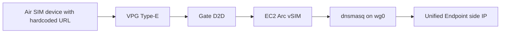
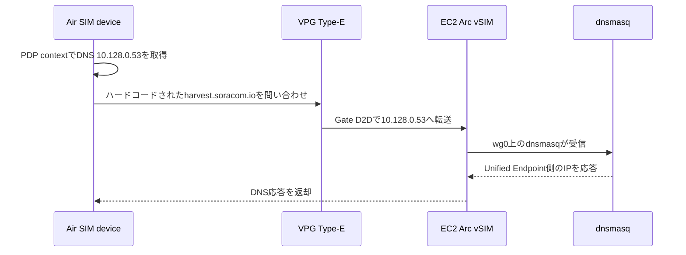

## はじめに

マイコンデバイスのファームウェアに、データ送信先 URL をハードコードしてしまうことがあります。
たとえば、SORACOM Harvest Data に送るつもりで `harvest.soracom.io` をコード内に直接書いて出荷した後で、送信先を Unified Endpoint に切り替えたくなった、というケースです。

本来であればファームウェアを更新して送信先を `uni.soracom.io` などに変更するのが素直です。
ただし、すでに現地に設置済みのデバイスがある場合や、OTA 更新の仕組みがない場合、ファームウェア更新だけで対応するのは難しくなります。

そこで今回は、デバイスのファームウェアを変えずに、SIM グループ側の Custom DNS と閉域内 DNS サーバーで名前解決結果を差し替える PoC を実施しました。
デバイスのコード上は `harvest.soracom.io` のままですが、DNS 応答として Unified Endpoint 側へ向ける IP アドレスを返す、という考え方です。

この記事では、Route 53 Resolver Inbound Endpoint を使わずに、`VPG Type-E + Gate D2D + EC2 上の Arc vSIM + dnsmasq` で Air SIM デバイスの DNS を閉域内で上書きする PoC をまとめます。
この構成のポイントは、SORACOM の Custom DNS に設定する DNS サーバーが、必ずしも Route 53 Resolver Inbound Endpoint である必要はない、という点です。
Air SIM デバイスから IP 到達可能な場所に DNS サーバーを置ければ、その DNS サーバーを Custom DNS として参照させられます。
その DNS サーバーで特定 FQDN の応答だけを書き換えれば、デバイスが接続する送信先 IP を変えられます。
さらに、Route 53 Resolver Inbound Endpoint を作らずに済むため、PoC や小規模な用途ではコスト面でも扱いやすい構成になります。

今回の検証対象は以下です。

```text
harvest.soracom.io -> 100.127.69.42
```

この PoC では、`harvest.soracom.io` に送るコードをハードコードしてしまったデバイスを、DNS の差し替えによって Unified Endpoint 側へ向ける例として扱います。
なお、DNS で差し替えられるのは名前解決結果です。
HTTP の Host ヘッダーや HTTPS の SNI / 証明書検証など、アプリケーション層でホスト名を見ている通信では別途確認が必要です。

ポイントは、DNS サーバーを EC2 のパブリック側に公開しないことです。
EC2 には SORACOM Arc vSIM を入れ、WireGuard インターフェース上の UE IP `10.128.0.53` だけで `dnsmasq` を待ち受けます。
Air SIM デバイスは SIM グループの Custom DNS として `10.128.0.53` を取得し、Gate D2D 経由でその DNS サーバーへ問い合わせます。

## 構成

全体像は以下の通りです。



やっていることを分解すると、以下の 3 点です。

1. Air SIM デバイスから IP 到達可能な場所に DNS サーバーを置く
2. SIM グループの Custom DNS で、その DNS サーバーの IP アドレスを配布する
3. DNS サーバー側で、ハードコード済み FQDN の応答だけを別の送信先 IP に変える

今回の場合、DNS サーバーは EC2 上にあります。
ただし、Air SIM デバイスから見た到達先は EC2 の Public IP や Private IP ではなく、SORACOM Arc vSIM の UE IP `10.128.0.53` です。
Gate D2D によって Air SIM デバイスからこの UE IP へ到達できるため、Custom DNS の参照先として利用できます。

今回作成した主なリソースは以下です。
公開記事のため、SIM ID、IMSI、VPG ID、Group ID、Arc SIM ID、EC2 Instance ID、Public IP、Security Group ID などの識別子はマスクしています。

| 項目 | 値 |
|---|---|
| VPG | Type-E |
| SIM グループ | PoC 用グループ |
| Arc vSIM | EC2 上の DNS サーバー用 |
| DNS UE IP | `10.128.0.53` |
| Device Subnet CIDR | `10.128.0.0/9` |
| EC2 Region | `ap-northeast-1` |
| EC2 Private IP | `10.60.1.169` |
| EC2 inbound 53/tcp, 53/udp | 開放しない |
| EC2 操作経路 | SSM Session Manager |

EC2 の Security Group では 53/tcp, 53/udp を開けていません。
DNS の問い合わせはインターネットからではなく、SORACOM Arc の WireGuard インターフェース `wg0` を通して到達させます。

## SORACOM 側の設定

SORACOM 側では、PoC 用に以下を用意しました。

- VPG Type-E
- Air SIM と Arc vSIM を所属させる SIM グループ
- EC2 上で使う Arc vSIM
- Arc vSIM の UE IP として使う `10.128.0.53`
- Gate D2D で Air SIM 側から Arc vSIM 側へ到達できる経路
- SIM グループの Custom DNS として `10.128.0.53`

Air SIM デバイスが再接続すると、PDP context の DNS として `10.128.0.53` が配布されます。
この時点で、Air SIM デバイスから見る DNS サーバーは EC2 のプライベート IP やパブリック IP ではなく、Arc vSIM の UE IP になります。

## EC2 と Arc vSIM の設定

EC2 上では WireGuard で SORACOM Arc に接続します。
今回の `wg0` の要点は以下です。

```ini
[Interface]
Address = 10.128.0.53/32

[Peer]
PersistentKeepalive = 25
AllowedIPs = <Arc vSIM設定由来のSORACOM閉域CIDR>, 10.128.0.0/9
```

重要なのは、`Address` を SIM グループの Custom DNS に設定する IP アドレスと合わせることです。
今回であれば `10.128.0.53/32` です。

また、`AllowedIPs` には Arc vSIM の設定由来の SORACOM 閉域 CIDR に加えて、Air SIM 側の Device Subnet CIDR である `10.128.0.0/9` を含めます。
これにより、Air SIM デバイスから Gate D2D 経由で EC2 上の Arc vSIM に到達できます。

NAT 配下やクラウド側の経路維持も考慮して、`PersistentKeepalive` は `25` にしています。

## dnsmasq の設定

EC2 上の `dnsmasq` は、WireGuard インターフェース `wg0` だけで待ち受けるようにしました。

```conf
address=/harvest.soracom.io/100.127.69.42
interface=wg0
bind-interfaces
server=1.1.1.1
server=8.8.8.8
```

この設定では、`harvest.soracom.io` だけを `100.127.69.42` に固定で返します。
デバイスのファームウェアは引き続き `harvest.soracom.io` を名前解決しますが、実際の接続先 IP は Unified Endpoint 側へ向ける想定です。
それ以外の名前解決は通常の upstream DNS に転送します。

`interface=wg0` と `bind-interfaces` を指定しているため、EC2 のパブリックインターフェースでは DNS を待ち受けません。
Security Group でも 53/tcp, 53/udp を開けていないため、外部公開の DNS サーバーにはなりません。

## EC2 側の確認

まず、EC2 側で `dnsmasq` が期待通りに応答することを確認します。

```bash
dig @10.128.0.53 harvest.soracom.io A +short
```

結果は以下です。

```text
100.127.69.42
```

通常の名前解決も確認します。

```bash
dig @10.128.0.53 example.com A +short
```

こちらは upstream DNS に転送され、通常の A レコードが返ることを確認しました。

加えて、Arc 経由で SORACOM 側に到達できることも確認します。

```bash
ping -I wg0 100.127.100.127
```

この疎通も OK でした。

## Air SIM デバイスでの確認

Air SIM 側では、デバイスが Custom DNS として `10.128.0.53` を取得していることと、`harvest.soracom.io` が期待した IP アドレスに解決されることを確認します。
この確認方法は、読者の環境に合わせて置き換えられます。
Linux や Windows 上のモデム制御ツールでも、マイコンのシリアルログでも、デバイス自身の DNS 解決結果を確認できれば十分です。

今回の PoC では EG25-G モデムを使い、AT コマンドで確認しました。
手元の macOS では EG25-G の `/dev/cu.*` が出なかったため、PyUSB 経由で AT コマンドを送るヘルパーと、`screen` から使える PTY ブリッジを用意しました。
これは検証環境固有の補助手段なので、仕組みは別記事「[macOSで/dev/cu.*が出ないEG25-GにPyUSBとPTYでATコマンドを送る](https://zenn.dev/takao2704/articles/eg25-g-pyusb-pty-at-console)」に切り出します。

SIM 情報は以下の AT コマンドで確認しました。

```text
AT+CIMI
AT+QCCID
```

公開記事では IMSI と ICCID はマスクしますが、PoC 対象の SIM が期待通りであることを確認できました。

次に、PDP context を有効化します。

```text
AT+CGDCONT=1,"IP","soracom.io"
AT+CGACT=1,1
AT+CGCONTRDP=1
```

結果は以下です。

```text
+CGCONTRDP: 1,6,soracom.io,10.130.59.244,,10.128.0.53,
```

この結果から、以下が確認できます。

| 項目 | 値 |
|---|---|
| APN | `soracom.io` |
| UE IP | `10.130.59.244` |
| Primary DNS | `10.128.0.53` |
| Secondary DNS | なし |

つまり、Air SIM デバイスが PoC 用 SIM グループの Custom DNS `10.128.0.53` を取得できています。

## DNS 上書きの確認

最後に、Air SIM デバイス側から `harvest.soracom.io` を名前解決します。

```text
AT+QIDNSGIP=1,"harvest.soracom.io"
```

結果は以下です。

```text
+QIURC: "dnsgip","100.127.69.42"
```

期待通り、`harvest.soracom.io` が `100.127.69.42` に解決されました。
デバイスから見ると送信先ホスト名は変わっていませんが、DNS 応答としては Unified Endpoint 側へ向ける IP アドレスに差し替わっています。

この結果により、Air SIM デバイスからの DNS 問い合わせが以下の経路で処理されたことを確認できました。



## 検証に使ったスクリプト

PoC では、SORACOM 側と AWS 側の作成、EC2 への設定投入、検証を分けて実行できるようにしました。

```text
scripts/create-soracom-poc.sh
scripts/apply-soracom-poc.sh
scripts/refresh-arc-session-config.sh
scripts/create-aws-ec2.sh
scripts/package-ec2-bundle.sh
scripts/ssm-upload-and-install-ec2.sh
scripts/setup-ec2-dnsmasq.sh
scripts/install-wireguard-arc-conf.sh
scripts/add-air-sims-to-poc.sh
scripts/verify-ec2.sh
scripts/verify-device.sh
```

EG25-G の AT コマンド確認用には以下を使いました。

```text
scripts/eg25-at.py
scripts/eg25-pty.py
```

`eg25-at.py` と `eg25-pty.py` は、macOS で `/dev/cu.*` が出ない EG25-G に AT コマンドを送るための補助スクリプトです。
この 2 つは DNS PoC の本筋ではないため、仕組みの詳細は別記事「[macOSで/dev/cu.*が出ないEG25-GにPyUSBとPTYでATコマンドを送る](https://zenn.dev/takao2704/articles/eg25-g-pyusb-pty-at-console)」に切り出しました。

## この構成のポイント

この PoC の一番のポイントは、Air SIM デバイスから IP 到達可能な場所に DNS サーバーを置けば、SORACOM の Custom DNS 設定でその DNS サーバーを参照させられることです。
Custom DNS は「この DNS サーバーを使いなさい」という情報を SIM グループ経由でデバイスに配布します。
そのため、デバイスがハードコード済みの FQDN を名前解決するときに、こちらで用意した DNS サーバーを経由させられます。

今回のように、その DNS サーバーで `harvest.soracom.io` の応答だけを差し替えれば、デバイスのコードはそのままでも接続先 IP を変えられます。
つまり、送信先 URL をハードコードしたマイコンデバイスでも、通信が DNS 解決に従って接続先 IP を決めているなら、SIM グループ側の設定と閉域内 DNS で送信先を制御できます。

もう一つのポイントは、DNS サーバーを AWS 側でインターネットに公開しないことです。

EC2 はパブリック IP を持っていますが、Security Group では 53/tcp と 53/udp を開けていません。
`dnsmasq` も `wg0` に bind しているため、DNS の受け口は SORACOM Arc 側に限定されます。

また、Route 53 Resolver Inbound Endpoint を使っていないため、AWS 側に専用の Resolver Endpoint を作成する必要がありません。
代わりに、EC2 上の Arc vSIM を閉域側の DNS サーバーとして扱い、Gate D2D で Air SIM デバイスから到達させています。
Resolver Endpoint のためだけに専用リソースを用意しないので、すでに小さな EC2 や Arc vSIM を使える前提ではコスト効率も良くなります。
もちろん、冗長化や常時稼働、監視まで含めると総コストは構成次第ですが、少なくとも PoC 段階ではかなり軽い構成で試せます。

ただし、この構成は自前で DNS サーバーを運用する形になります。
そのため、実運用で使う場合は少なくとも以下を検討する必要があります。

- `dnsmasq` の冗長化
- EC2 の障害時の切り替え
- DNS ログの取得と監査
- 上書き対象ドメインの管理方法
- upstream DNS 障害時の挙動
- SIM グループ単位での影響範囲
- Route 53 Resolver Inbound Endpoint を使う場合との運用コスト比較

今回の PoC は、Route 53 Resolver Inbound Endpoint の代替として常にこちらを使うべき、という主張ではありません。
ファームウェアを変えられないデバイスに対して、Air SIM デバイスから閉域内 DNS へ問い合わせる経路を Gate D2D と Arc vSIM で作り、DNS レベルで送信先を差し替えられることを確認するための検証です。

## まとめ

`VPG Type-E + Gate D2D + EC2 上の Arc vSIM + dnsmasq` により、Route 53 Resolver Inbound Endpoint を使わずに Air SIM デバイスの DNS を閉域内で上書きできました。

確認できたことは以下です。

- EC2 上の Arc vSIM が `10.128.0.53/32` として SORACOM 閉域に参加できた
- `dnsmasq` を `wg0` のみに bind して DNS を待ち受けできた
- EC2 の 53/tcp, 53/udp をインターネットに開けずに構成できた
- Air SIM デバイスが Custom DNS として `10.128.0.53` を取得できた
- Gate D2D 経由で Air SIM デバイスから EC2 上の `dnsmasq` に問い合わせできた
- ファームウェア上は `harvest.soracom.io` のまま、DNS 応答として `100.127.69.42` を返せた

PoC としては、Air SIM デバイスの DNS を SIM グループ単位で制御し、閉域内の任意の DNS サーバーに問い合わせさせる構成が成立することを確認できました。
これにより、送信先 URL がハードコードされたマイコンデバイスでも、条件が合えばファームウェアを変更せずに送信先を切り替える余地があることを確認できました。
