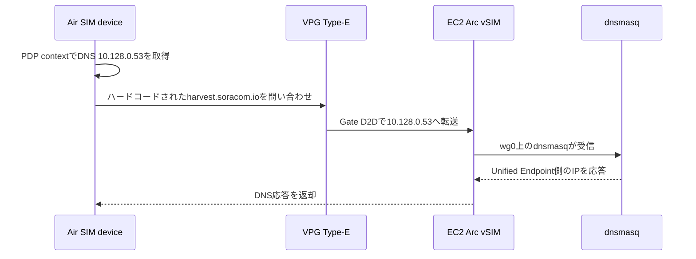

:::message
「[一般消費者が事業者の表示であることを判別することが困難である表示](https://www.caa.go.jp/policies/policy/representation/fair_labeling/guideline/assets/representation_cms216_230328_03.pdf)」の運用基準に基づく開示: この記事は記載の日付時点で[株式会社ソラコム](https://soracom.jp/)に所属する社員が執筆しました。ただし、個人としての投稿であり、株式会社ソラコムとしての正式な発言や見解ではありません。
:::

## TL;DR

- デバイスのファームウェアに 送信先URL（例：`harvest.soracom.io`） がハードコードされていても、DNS 応答を差し替えれば送信先 IP を変えられる場合があります。
- SORACOM のカスタムDNSには、Air SIM デバイスから IP 到達可能な DNS サーバーを指定できます。
- 今回は `VPG（Virtual Private Gateway）Type-E + Gate D2D + EC2 上の Arc vSIM + dnsmasq` で、`harvest.soracom.io` を `100.127.69.42` に解決させました。
- EC2 の 53/tcp, 53/udp はインターネットに公開せず、DNS の受け口は Arc vSIM に割り当てた IP アドレス `10.128.0.53` に限定します。


## はじめに

IoT デバイスを運用していると、デバイスからデータを送信するクラウド側の宛先を後から変更したくなることがあります。

たとえば、以下のようなケースです。

- レガシーな受信基盤から SORACOM Beam などを使う構成に移行したい
- SORACOM Harvest Data に直接送っていたデータを、Unified Endpoint 経由で SORACOM Beam などへ転送する構成に変えたい
- LAN 環境や閉域網内の受信先に送っていたデバイスを、セルラー通信経由でクラウド側の受信先へ送る構成に移行したい

これらはいずれも、デバイス側から見ると「送信先 URL を変えたい」という問題です。
本来であれば、ファームウェアを更新して送信先 URL を変更するのが素直です。
しかし、遠隔からのファームウェア更新（OTA）の仕組みがない、すでに現地に設置済みで回収が難しい、多数のデバイスが稼働している、といった場合は、ファームウェア更新だけで対応するのは難しくなります。

そこでこの記事では、デバイスのファームウェアを変えずに、SIM グループ側のカスタムDNSと閉域内 DNS サーバーで名前解決結果を差し替え、データ送信先を変更する方法を解説します。
題材として、Unified Endpoint の存在に気づかず、SORACOM Harvest Data のエントリポイントである `harvest.soracom.io` に送るコードをハードコードしてしまったデバイスを、Unified Endpoint 側のエントリポイントへ向ける例を扱います。
デバイスのコード上は `harvest.soracom.io` のままですが、DNS 応答として Unified Endpoint 側へ向ける IP アドレスを返す、という考え方です。

## 実現方法の絞り込みとトレードオフ

### 前提: ファームウェアは変えない

この記事では、ファームウェア更新は前提から外します。
OTA がない、現地回収が難しい、すでに多数のデバイスが稼働している、といった理由で、デバイス側の送信先 URL を変えられないケースに絞ります。

### DNS で差し替える対象

この前提で使えるのが、DNS の応答だけを変える方法です。
SORACOM の各エンドポイントはパブリック DNS にレコードが公開されています。
SORACOM Air に接続されていない読者の皆さんの手元でも、以下のように解決されると思います。

```bash
dig harvest.soracom.io A +short
dig uni.soracom.io A +short
dig unified.soracom.io A +short
```

応答例は以下です。

```text
100.127.111.111
100.127.69.42
100.127.69.42
```

| FQDN | IP アドレス |
|---|---|
| `harvest.soracom.io` | `100.127.111.111` |
| `uni.soracom.io` | `100.127.69.42` |
| `unified.soracom.io` | `100.127.69.42` |

そこで、対象デバイスだけ `harvest.soracom.io` を `100.127.69.42` に解決させます。

```text
harvest.soracom.io -> 100.127.69.42
```

`100.127.69.42` は、この構成例で Unified Endpoint 側の応答先として扱った観測値です。
パブリック DNS から応答されますが、インターネットから一般到達可能なグローバル IP として扱うものではなく、SORACOM Air などの通信経路から利用する宛先です。
Firewall やデバイス側の固定設定でも、FQDN を使えるなら FQDN を使う方が安全です。

:::message
SORACOM サポートサイトの FAQ「[SORACOM の各種エンドポイントの IP アドレスは固定ですか？](https://support.soracom.io/hc/ja/articles/360030871971-SORACOM-%E3%81%AE%E5%90%84%E7%A8%AE%E3%82%A8%E3%83%B3%E3%83%89%E3%83%9D%E3%82%A4%E3%83%B3%E3%83%88%E3%81%AE-IP-%E3%82%A2%E3%83%89%E3%83%AC%E3%82%B9%E3%81%AF%E5%9B%BA%E5%AE%9A%E3%81%A7%E3%81%99%E3%81%8B)」では、2026年5月時点では Unified Endpoint や SORACOM Harvest Data などのエンドポイントの IP アドレスはアクセス元デバイスによらず固定とされています。一方で、今後変更される可能性もあるため、IP アドレスで扱う場合はその点を考慮してください。
:::

この方式では、`dnsmasq` 側に `harvest.soracom.io -> 100.127.69.42` のような上書き設定を持ちます。
そのため、SORACOM 側の DNS レコードが変更された場合は、上書き先の IP アドレスも見直す必要があります。
実運用では、定期的に `uni.soracom.io` や `unified.soracom.io` の解決結果を監視し、変更を検知したら `dnsmasq` の設定を更新して再読み込みする運用を用意しておくと安全です。

### DNS サーバーの置き場所

通常は、デバイスが `harvest.soracom.io` をパブリック DNS で名前解決します。
これに対して SORACOM Air の SIM グループには、デバイスへ配布する DNS サーバーを指定するカスタムDNSがあります。
カスタムDNSには、対象デバイスから IP 到達できる DNS サーバーの IP アドレスを指定します。

DNS サーバーをインターネット上に公開して、カスタムDNSにそのグローバル IP アドレスを指定する方法も考えられます。
ただし今回は、DNS サーバーをインターネットに公開しません。
EC2 上に DNS サーバーを置き、SORACOM Arc vSIM で SORACOM 閉域に参加させます。
Air SIM デバイスからは Gate D2D 経由で EC2 上の Arc vSIM に到達させ、カスタムDNSには Arc vSIM に割り当てた IP アドレスを指定します。
SORACOM の画面や設定では、このような SIM / vSIM に割り当てられる IP アドレスが UE IP と表記されることがあります。
この記事では、以降は「Arc vSIM に割り当てた IP アドレス」と書きます。

### DNS サーバー実装の選定

閉域内に DNS サーバーを置く前提で、実装候補を比較します。

| 方法 | 向いているケース | トレードオフ |
|---|---|---|
| `dnsmasq` | 1 レコードだけ上書きする、軽く始めたい | シンプルで今回向き。高度な ACL や詳細なキャッシュ制御は弱い |
| Unbound | DNS サーバーとして堅く作りたい | 設定項目は増えるが、ACL やキャッシュ制御を扱いやすい |
| BIND | 権威 DNS として細かく管理したい | 今回の用途では大げさ。`soracom.io` 全体のゾーンを作ると他の名前解決を壊しやすい |
| CoreDNS | Kubernetes やコンテナ環境で運用したい | コンテナ基盤がある場合は扱いやすいが、単体 EC2 では `dnsmasq` の方が簡単 |
| Route 53 Resolver Inbound Endpoint | AWS 側の DNS 基盤と統合したい | マネージドで扱いやすい一方、専用リソースのコストが発生する |

今回の用途では、`dnsmasq` が一番素直です。
`harvest.soracom.io` だけを固定応答し、それ以外の名前解決は upstream DNS に転送できます。
今回のように SORACOM のエンドポイント名を解決するだけであれば、パブリック DNS でも解決できます。
社内ドメインや閉域網内の名前も解決したい場合は、それらを解決できる DNS に転送先を変更します。
もし BIND を使う場合でも、`soracom.io` 全体を権威ゾーンにするのではなく、`harvest.soracom.io` だけを上書き対象にする必要があります。

### インスタンスサイズ

インスタンスサイズは、DNS の 1 レコード上書きだけなら CPU よりもメモリと常時接続の安定性を見ます。
検証なら `t4g.nano` でも足りますが、OS、WireGuard、`dnsmasq`、ログ、監視エージェントまで含めると、本番最小は `t4g.micro` が扱いやすいです。
冗長化するなら `t4g.micro` を 2 台用意し、Arc vSIM も 2 つ作って、カスタムDNSの Primary / Secondary にそれぞれ指定する構成が費用対効果のよい落としどころです。
なお、EC2、VPG、SORACOM Arc の料金はリージョンや時期、契約条件によって変わるため、実運用前には最新の料金情報を確認してください。

### この構成で割り切ること

この記事では、`VPG Type-E + Gate D2D + EC2 上の Arc vSIM + dnsmasq` を使う構成に絞ります。
Route 53 Resolver Inbound Endpoint を使う構成と比べると、自前で DNS サーバーを運用する責任は増えます。
一方で、1 レコードの DNS 上書き用途ではかなり小さな EC2 で始められるため、低コストに構成しやすいのが利点です。

また、DNS で差し替えられるのは名前解決結果です。
HTTP の Host ヘッダーや HTTPS の SNI / 証明書検証など、アプリケーション層でホスト名を見ている通信では別途確認が必要です。

## 構成の詳細

冒頭の構成図を、通信経路と作成するリソースの観点で分解します。

やっていることを分解すると、以下の 3 点です。

1. Air SIM デバイスから IP 到達可能な場所に DNS サーバーを置く
2. SIM グループのカスタムDNSで、その DNS サーバーの IP アドレスを配布する
3. DNS サーバー側で、ハードコード済み FQDN の応答だけを別の送信先 IP に変える

この構成では、DNS サーバーは EC2 上にあります。
ただし、Air SIM デバイスから見た到達先は EC2 の Public IP や Private IP ではなく、Arc vSIM に割り当てた IP アドレス `10.128.0.53` です。
Gate D2D によって Air SIM デバイスからこの IP アドレスへ到達できるため、カスタムDNSの参照先として利用できます。

構成例で使う主なリソースは以下です。
公開記事のため、SIM ID、IMSI、VPG ID、Group ID、Arc SIM ID、EC2 Instance ID、Public IP、Security Group ID などの識別子はマスクしています。

| 項目 | 値 |
|---|---|
| VPG | Type-E |
| SIM グループ | 検証用グループ |
| Arc vSIM | EC2 上の DNS サーバー用 |
| DNS サーバーとして使う Arc vSIM の IP アドレス | `10.128.0.53` |
| Device Subnet CIDR | `10.128.0.0/9` |
| EC2 Region | `ap-northeast-1` |
| EC2 Private IP | マスク |
| EC2 inbound 53/tcp, 53/udp | 開放しない |
| EC2 操作経路 | SSM Session Manager |

EC2 の Security Group では 53/tcp, 53/udp を開けていません。
DNS の問い合わせはインターネットからではなく、SORACOM Arc の WireGuard インターフェース `wg0` を通して到達させます。

## SORACOM 側の設定

SORACOM 側では、Air SIM と EC2 側の Arc vSIM を同じ VPG Type-E / Gate D2D の到達範囲に入れます。
設定の中心は SIM グループです。

手順としては、以下の順番で考えると整理しやすいです。

1. VPG Type-E を作成し、Gate D2D でデバイス間通信できる状態にする
2. EC2 上の DNS サーバー用に Arc vSIM を用意し、Arc vSIM に割り当てる IP アドレスとして `10.128.0.53` を使う
3. Air SIM と Arc vSIM を同じ SIM グループ、または Gate D2D で相互到達できる構成に入れる
4. SIM グループの VPG 設定で、対象の VPG Type-E を紐付ける
5. 同じ SIM グループのカスタムDNSとして `10.128.0.53` を指定する

### 1. VPG Type-E を作成し、Gate D2D を有効にする

まず VPG Type-E を作成し、デバイスサブネットの IP アドレスレンジを確認します。
この例では Device Subnet CIDR として `10.128.0.0/9` を使っています。

同じ画面のデバイス LAN 設定で `SORACOM Gate C2D / D2D` を有効にします。
これにより、同じ VPG 配下にある Air SIM と Arc vSIM が Gate D2D で相互到達できる状態になります。

参考ドキュメント:

https://users.soracom.io/ja-jp/docs/vpg/create-vpg/

https://users.soracom.io/ja-jp/docs/gate/device-to-device/


### 2. Arc vSIM に 10.128.0.53 を割り当てる

EC2 上の DNS サーバー用に Arc vSIM を用意し、IP アドレスマップで `10.128.0.53` を割り当てます。
この IP アドレスが、あとで SIM グループのカスタムDNSに指定する参照先になります。

参考ドキュメント:

https://users.soracom.io/ja-jp/docs/vpg/ip-address-map/

スクリーンショットでは、Arc vSIM の IMSI をマスクしています。


### 3. Air SIM と Arc vSIM を同じ到達範囲に入れる

Air SIM と Arc vSIM は、同じ SIM グループに入れるか、別グループを使う場合でも同じ VPG Type-E / Gate D2D で相互到達できる構成にします。
画面例では、EC2 側で使う Arc vSIM が対象の SIM グループに所属していることを確認しています。
Air SIM 側も同じ考え方で、対象の SIM グループまたは同じ Gate D2D の到達範囲に入れます。

参考ドキュメント:

https://users.soracom.io/ja-jp/docs/group-configuration/configure-group/

スクリーンショットでは、SIM ID、ICCID、IMSI をマスクしています。


### 4. SIM グループに VPG Type-E を紐付ける

SIM グループの VPG 設定で、作成した VPG Type-E を紐付けます。
これにより、その SIM グループに所属する Air SIM が VPG 配下で通信するようになります。

参考ドキュメント:

https://users.soracom.io/ja-jp/docs/vpg/use-vpg/

スクリーンショットでは VPG ID をマスクしています。


### 5. SIM グループのカスタムDNSに 10.128.0.53 を指定する

最後に、同じ SIM グループの SORACOM Air for セルラー設定で、カスタムDNSを有効にして `10.128.0.53` を指定します。
ここに指定するのは、EC2 のプライベート IP やパブリック IP ではなく、EC2 上で動かす Arc vSIM に割り当てた IP アドレスです。

参考ドキュメント:

https://users.soracom.io/ja-jp/docs/air/configure-custom-dns/


Air SIM デバイスが再接続すると、PDP context の DNS として `10.128.0.53` が配布されます。
この時点で、Air SIM デバイスから見る DNS サーバーは EC2 のプライベート IP やパブリック IP ではなく、Arc vSIM に割り当てた IP アドレスになります。

## EC2 と Arc vSIM の設定

EC2 側では、DNS サーバーを動かす Linux インスタンスを用意し、その上で SORACOM Arc vSIM と `dnsmasq` を動かします。
ここでは Amazon Linux 2023 や Ubuntu など、WireGuard と `dnsmasq` が使える Linux を想定しています。

セットアップの流れは以下です。

1. EC2 インスタンスを作成する
2. SSM Session Manager などで EC2 に入れるようにする
3. Security Group では 53/tcp, 53/udp をインターネットに開放しない
4. EC2 に WireGuard と `dnsmasq` をインストールする
5. SORACOM Arc vSIM の WireGuard 設定を EC2 に配置する
6. `wg0` のアドレスを `10.128.0.53/32` にする
7. `dnsmasq` の外部向け待ち受けを `wg0` に限定する
8. `harvest.soracom.io` だけを `100.127.69.42` に上書きする

### 1. EC2 インスタンスを作成する

EC2 インスタンスは通常の手順で作成します。
この例では、東京リージョンに Linux インスタンスを 1 台用意しました。
DNS サーバー用途では大きなインスタンスは不要で、検証では小さなインスタンスから始められます。

スクリーンショットでは、インスタンス ID、IP アドレス、DNS 名などをマスクしています。


参考ドキュメント:

https://docs.aws.amazon.com/AWSEC2/latest/UserGuide/ec2-launch-instance-wizard.html

### 2. SSM Session Manager などで EC2 に入れるようにする

EC2 への操作経路は、SSM Session Manager を使いました。
これにより、SSH 用のインバウンドポートを開けずに EC2 上でコマンドを実行できます。
利用するには、EC2 に必要な IAM ロールを付与し、SSM Agent が動作しており、EC2 から Systems Manager へ HTTPS で到達できることが前提です。
プライベートサブネットで動かす場合は、NAT Gateway や VPC Endpoint などの到達経路も確認します。

AWS Console の接続画面で `SSM Session Manager` を選び、Ping status がオンライン、Session Manager connection status が Connected になっていることを確認します。


参考ドキュメント:

https://docs.aws.amazon.com/systems-manager/latest/userguide/session-manager.html

https://docs.aws.amazon.com/systems-manager/latest/userguide/session-manager-working-with-sessions-start.html

### 3. Security Group では 53/tcp, 53/udp をインターネットに開放しない

この構成では、DNS サーバーをインターネットに公開しません。
Air SIM デバイスからの DNS 問い合わせは、Gate D2D 経由で Arc vSIM に割り当てた IP アドレスに届かせます。

そのため、EC2 の Security Group では 53/tcp, 53/udp のインバウンドルールを追加しません。
画面例では、インバウンドルールが 0 件になっています。


参考ドキュメント:

https://docs.aws.amazon.com/AWSEC2/latest/UserGuide/ec2-security-groups.html

https://docs.aws.amazon.com/AWSEC2/latest/UserGuide/security-group-rules.html

### 4. WireGuard と dnsmasq をインストールする

パッケージのインストールは、ディストリビューションに合わせて行います。
後半で `dig` による確認も行うため、Amazon Linux 2023 では `bind-utils`、Ubuntu では `dnsutils` も入れています。
Amazon Linux 2023 であれば、たとえば以下のような形です。

```bash
sudo dnf install -y wireguard-tools dnsmasq bind-utils
```

Ubuntu であれば、以下のような形です。

```bash
sudo apt update
sudo apt install -y wireguard dnsmasq dnsutils
```

### 5. SORACOM Arc vSIM の WireGuard 設定を EC2 に配置する

SORACOM Arc vSIM のセッション設定から WireGuard の設定ファイルを作成し、EC2 上の `/etc/wireguard/wg0.conf` に配置します。
SORACOM Arc の設定手順は、公式ドキュメントも参照してください。

https://users.soracom.io/ja-jp/docs/arc/

そのうえで、`wg-quick@wg0` を有効化します。

```bash
sudo systemctl enable --now wg-quick@wg0
```

### 6. wg0 のアドレスを 10.128.0.53/32 にする

ここでのポイントは、EC2 のプライベート IP ではなく、Arc vSIM に割り当てた IP アドレスとして `10.128.0.53` を使うことです。
以降の `dnsmasq` は、この `wg0` 上の IP アドレスで待ち受けます。

`wg0` の要点は以下です。

```ini
[Interface]
Address = 10.128.0.53/32

[Peer]
PersistentKeepalive = 25
AllowedIPs = <Arc vSIM設定由来のSORACOM閉域CIDR>, 10.128.0.0/9
```

重要なのは、`Address` を SIM グループのカスタムDNSに設定する IP アドレスと合わせることです。
この例であれば `10.128.0.53/32` です。

また、`AllowedIPs` には Arc vSIM の設定由来の SORACOM 閉域 CIDR に加えて、Air SIM 側の Device Subnet CIDR である `10.128.0.0/9` を含めます。
これにより、Air SIM デバイスから Gate D2D 経由で EC2 上の Arc vSIM に到達できます。

NAT 配下やクラウド側の経路維持も考慮して、`PersistentKeepalive` は `25` にしています。

## dnsmasq の設定

EC2 上の `dnsmasq` は、外部向けの待ち受けを WireGuard インターフェース `wg0` に限定するようにしました。
ここからは、SSM Session Manager などで EC2 に入った後の操作です。

### 7. dnsmasq の外部向け待ち受けを wg0 に限定する

まず、`wg0` が起動していて `10.128.0.53/32` が付いていることを確認します。

```bash
ip addr show wg0
```

次に、`dnsmasq` の追加設定ファイルを作成します。
ここでは `/etc/dnsmasq.d/soracom-override.conf` として作成しています。

```bash
sudo tee /etc/dnsmasq.d/soracom-override.conf >/dev/null <<'EOF'
address=/harvest.soracom.io/100.127.69.42
interface=wg0
bind-interfaces
server=1.1.1.1
server=8.8.8.8
EOF
```

設定ファイルとして見ると、内容は以下です。

```conf
address=/harvest.soracom.io/100.127.69.42
interface=wg0
bind-interfaces
server=1.1.1.1
server=8.8.8.8
```

`interface=wg0` と `bind-interfaces` を指定しているため、EC2 のパブリック側や VPC 側のインターフェースでは DNS を待ち受けません。
Security Group でも 53/tcp, 53/udp を開けていないため、外部公開の DNS サーバーにはなりません。

設定を置いたら、`dnsmasq` を有効化して再起動します。

```bash
sudo systemctl enable dnsmasq
sudo systemctl restart dnsmasq
sudo systemctl status dnsmasq --no-pager
```

`dnsmasq` を `wg0` に bind しているため、`wg0` が起動する前に `dnsmasq` を起動すると失敗する場合があります。
その場合は、先に `wg-quick@wg0` を起動してから `dnsmasq` を再起動します。

```bash
sudo systemctl restart wg-quick@wg0
sudo systemctl restart dnsmasq
```

待ち受け状態は `ss` で確認できます。

```bash
sudo ss -lntup | grep ':53'
```

Air SIM デバイス向けには、`10.128.0.53:53` で待ち受けていれば、この構成で期待している状態です。
実際の出力例は以下です。

```text
udp   UNCONN 0      0                            127.0.0.1:53         0.0.0.0:*    users:(("dnsmasq",pid=28627,fd=6))
udp   UNCONN 0      0                          10.128.0.53:53         0.0.0.0:*    users:(("dnsmasq",pid=28627,fd=4))
udp   UNCONN 0      0                                [::1]:53            [::]:*    users:(("dnsmasq",pid=28627,fd=8))
tcp   LISTEN 0      32                         10.128.0.53:53         0.0.0.0:*    users:(("dnsmasq",pid=28627,fd=5))
tcp   LISTEN 0      32                           127.0.0.1:53         0.0.0.0:*    users:(("dnsmasq",pid=28627,fd=7))
tcp   LISTEN 0      32                               [::1]:53            [::]:*    users:(("dnsmasq",pid=28627,fd=9))
```

`127.0.0.1` と `[::1]` でも待ち受けていますが、EC2 の外部インターフェースでは待ち受けていません。
Air SIM デバイスから使う経路としては、`10.128.0.53:53` で待ち受けていることを確認します。

`dnsmasq` のサービス状態も確認します。

```bash
sudo systemctl status dnsmasq --no-pager
```

実際の出力例は以下です。
ホスト名に含まれる EC2 のプライベート IP はマスクしています。

```text
● dnsmasq.service - DNS caching server.
     Loaded: loaded (/usr/lib/systemd/system/dnsmasq.service; enabled; preset: disabled)
     Active: active (running) since Thu 2026-05-14 15:15:34 UTC; 2 days ago
    Process: 28625 ExecStart=/usr/sbin/dnsmasq (code=exited, status=0/SUCCESS)
   Main PID: 28627 (dnsmasq)
      Tasks: 1 (limit: 1014)
     Memory: 544.0K
        CPU: 15ms
     CGroup: /system.slice/dnsmasq.service
             └─28627 /usr/sbin/dnsmasq

May 14 15:15:34 <ec2-private-hostname> systemd[1]: Starting dnsmasq.service - DNS caching server....
May 14 15:15:34 <ec2-private-hostname> dnsmasq[28627]: started, version 2.90 cachesize 150
May 14 15:15:34 <ec2-private-hostname> dnsmasq[28627]: using nameserver 1.1.1.1#53
May 14 15:15:34 <ec2-private-hostname> dnsmasq[28627]: using nameserver 8.8.8.8#53
May 14 15:15:34 <ec2-private-hostname> dnsmasq[28627]: read /etc/hosts - 6 names
May 14 15:15:34 <ec2-private-hostname> systemd[1]: Started dnsmasq.service - DNS caching server..
```

### 8. harvest.soracom.io だけを 100.127.69.42 に上書きする

この設定では、`harvest.soracom.io` だけを `100.127.69.42` に固定で返します。
デバイスのファームウェアは引き続き `harvest.soracom.io` を名前解決しますが、実際の接続先 IP は Unified Endpoint 側へ向ける想定です。
それ以外の名前解決は通常の upstream DNS に転送します。

## EC2 側の確認

まず、EC2 側で `dnsmasq` が期待通りに応答することを確認します。

```bash
dig @10.128.0.53 harvest.soracom.io A +short
```

結果は以下です。

```text
100.127.69.42
```

通常の名前解決も確認します。

```bash
dig @10.128.0.53 example.com A +short
```

こちらは upstream DNS に転送され、通常の A レコードが返ることを確認しました。
実際の出力例は以下です。

```text
104.20.23.154
172.66.147.243
```

加えて、Arc 経由で SORACOM 側に到達できることも確認します。
ここでは、この検証で SORACOM 側への到達確認に使った `100.127.100.127` に、`wg0` を送信元インターフェースとして `ping` しています。
読者環境で同じ疎通確認先が使えるとは限らないため、実際には利用中の SORACOM 環境で確認できる宛先に置き換えてください。

```bash
ping -I wg0 100.127.100.127
```

この疎通も OK でした。
実際の出力例は以下です。

```text
PING 100.127.100.127 (100.127.100.127) from 10.128.0.53 wg0: 56(84) bytes of data.
64 bytes from 100.127.100.127: icmp_seq=1 ttl=64 time=9.65 ms
64 bytes from 100.127.100.127: icmp_seq=2 ttl=64 time=4.15 ms
64 bytes from 100.127.100.127: icmp_seq=3 ttl=64 time=3.98 ms
64 bytes from 100.127.100.127: icmp_seq=4 ttl=64 time=4.07 ms
64 bytes from 100.127.100.127: icmp_seq=5 ttl=64 time=3.99 ms
^C
--- 100.127.100.127 ping statistics ---
5 packets transmitted, 5 received, 0% packet loss, time 4005ms
rtt min/avg/max/mdev = 3.979/5.169/9.649/2.240 ms
```

## Air SIM デバイスでの確認

Air SIM 側では、デバイスがカスタムDNSとして `10.128.0.53` を取得していることと、`harvest.soracom.io` が期待した IP アドレスに解決されることを確認します。
この確認方法は、読者の環境に合わせて置き換えられます。
Linux や Windows 上のモデム制御ツールでも、マイコンのシリアルログでも、デバイス自身の DNS 解決結果を確認できれば十分です。

この例では Soracom Onyx を使い、AT コマンドで確認しました。
macOS から Soracom Onyx に AT コマンドを送る方法は、別記事「[macOSでSoracom OnyxにATコマンドを送る](https://zenn.dev/takao2704/articles/eg25-g-pyusb-pty-at-console)」にまとめています。
この記事では、その方法で AT コンソールを開けることを前提に、DNS の確認結果だけを扱います。

SIM 情報は以下の AT コマンドで確認しました。

```text
AT+CIMI
AT+QCCID
```

公開記事では IMSI と ICCID はマスクしますが、対象の SIM が期待通りであることを確認できました。

次に、PDP context を有効化します。

```text
AT+CGDCONT=1,"IP","soracom.io"
AT+CGACT=1,1
AT+CGCONTRDP=1
```

結果は以下です。

```text
+CGCONTRDP: 1,6,soracom.io,10.130.59.244,,10.128.0.53,
```

この結果から、以下が確認できます。

| 項目 | 値 |
|---|---|
| APN | `soracom.io` |
| デバイスに割り当てられた IP アドレス | `10.130.59.244` |
| Primary DNS | `10.128.0.53` |
| Secondary DNS | なし |

つまり、Air SIM デバイスが対象 SIM グループのカスタムDNSとして `10.128.0.53` を取得できています。

## DNS 上書きの確認

最後に、Air SIM デバイス側から `harvest.soracom.io` を名前解決します。

```text
AT+QIDNSGIP=1,"harvest.soracom.io"
```

結果は以下です。

```text
+QIURC: "dnsgip","100.127.69.42"
```

期待通り、`harvest.soracom.io` が `100.127.69.42` に解決されました。
デバイスから見ると送信先ホスト名は変わっていませんが、DNS 応答としては Unified Endpoint 側へ向ける IP アドレスに差し替わっています。

この結果により、Air SIM デバイスからの DNS 問い合わせが以下の経路で処理されたことを確認できました。



## まとめ

ファームウェアを変えずに IoT デバイスのデータ送信先を変更したい場合、SIM グループのカスタムDNSと閉域内 DNS サーバーを組み合わせる方法があります。
Air SIM デバイスから IP 到達可能な場所に DNS サーバーを置ければ、カスタムDNSによってデバイスにその DNS サーバーを参照させられます。
その DNS サーバーで特定 FQDN の応答だけを差し替えれば、送信先 URL がハードコードされたデバイスでも、条件が合えば接続先 IP を切り替えられます。

この記事では、その構成例として `VPG Type-E + Gate D2D + EC2 上の Arc vSIM + dnsmasq` を使い、Route 53 Resolver Inbound Endpoint を使わずに Air SIM デバイスの DNS を閉域内で上書きしました。
要点は以下です。

- EC2 上の Arc vSIM を `10.128.0.53/32` として SORACOM 閉域に参加させる
- `dnsmasq` の外部向け待ち受けを `wg0` に限定する
- EC2 の 53/tcp, 53/udp をインターネットに開けない
- Air SIM デバイスにカスタムDNSとして `10.128.0.53` を取得させる
- Gate D2D 経由で Air SIM デバイスから EC2 上の `dnsmasq` に問い合わせさせる
- ファームウェア上は `harvest.soracom.io` のまま、DNS 応答として `100.127.69.42` を返す

DNS サーバーをインターネットに公開せず、SORACOM Arc 側に割り当てた IP アドレスで待ち受けるため、DNS の受け口を SORACOM 閉域側に限定できます。
また、Route 53 Resolver Inbound Endpoint を作らずに済むため、小規模な検証や限定的な用途では軽い構成で始めやすいです。

一方で、この構成は自前で DNS サーバーを運用する形になります。
実運用では `dnsmasq` の冗長化、EC2 障害時の切り替え、DNS ログ、上書き対象ドメインの管理、upstream DNS 障害時の挙動、SIM グループ単位での影響範囲を検討する必要があります。
Route 53 Resolver Inbound Endpoint の代替として常にこちらを使うべきという話ではなく、ファームウェアを変えられないデバイスに対して、DNS レベルで送信先を差し替えるための構成例です。

## 参考ドキュメント

https://users.soracom.io/ja-jp/docs/vpg/create-vpg/

https://users.soracom.io/ja-jp/docs/gate/device-to-device/

https://users.soracom.io/ja-jp/docs/vpg/ip-address-map/

https://users.soracom.io/ja-jp/docs/group-configuration/configure-group/

https://users.soracom.io/ja-jp/docs/vpg/use-vpg/

https://users.soracom.io/ja-jp/docs/air/configure-custom-dns/

https://users.soracom.io/ja-jp/docs/arc/

https://users.soracom.io/ja-jp/docs/vpg/types/

https://docs.aws.amazon.com/AWSEC2/latest/UserGuide/ec2-launch-instance-wizard.html

https://docs.aws.amazon.com/systems-manager/latest/userguide/session-manager.html

https://docs.aws.amazon.com/systems-manager/latest/userguide/session-manager-working-with-sessions-start.html

https://docs.aws.amazon.com/AWSEC2/latest/UserGuide/ec2-security-groups.html

https://docs.aws.amazon.com/AWSEC2/latest/UserGuide/security-group-rules.html
