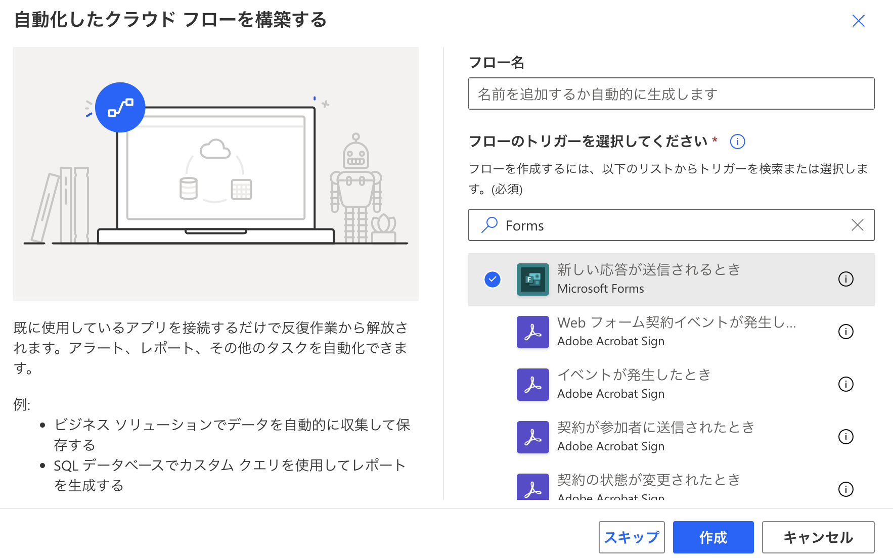
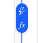

:::message
「[一般消費者が事業者の表示であることを判別することが困難である表示](https://www.caa.go.jp/policies/policy/representation/fair_labeling/guideline/assets/representation_cms216_230328_03.pdf)」の運用基準に基づく開示: この記事は記載の日付時点で[株式会社ソラコム](https://soracom.jp/)に所属する社員が執筆しました。ただし、個人としての投稿であり、株式会社ソラコムとしての正式な発言や見解ではありません。
:::

## やりたいこと
SORACOM Lagoonで可視化を行う際に、信号灯のように正常な場合は緑、異常な場合は赤のランプ表示で状態を確認できるダッシュボードを作る。

## 事前準備
1. SORACOM Harvest Dataにデータを貯める
https://users.soracom.io/ja-jp/docs/harvest/send-data/
※まだデータがない場合はデモデータが使えるので必須ではない

2. SORACOM Lagoon 3 の利用を開始する
https://users.soracom.io/ja-jp/docs/lagoon-v3/getting-started/

## 手順
1. Folder を作成する
    `Dashboards` の `Browse` タブ から `New` をクリックして

    

     `New Folder` を選択して

    

    適切なフォルダ名を入力して `Create` をクリックする
    

2. DashboardとTime Series(時系列の折れ線グラフ) Panel を作成する
    遷移した画面から `+ Create Dashboard` をクリックして

    

    `Add a new panel` を選択

    

    `Resource Type` で `Demo` を選択

    

    `Resources` で `Device-1`、`Properties`で`battery`を選択し、その状態で
    
    duplicate アイコンを2回クリックし、Query `B` と `C` の`Resources`を`Device-2`、`Device-3`に変更する。

    

    `Dashboard` に戻り、`Panel Title` をクリックして `More...`から`Duplicate` をクリック
    

    Timeseries Panel が2枚できました。
    

3. 信号機のようなランプ表示のパネルを作る

    `Panel Title` をクリックして出てくるプルダウンから `Edit` をクリック
    

    `Visualization` で `Soracom Image Panel` を選択
    

    `+ Add Image` を3回クリック
    

    `Image0`、`Image1`、`Image2` をそれぞれ以下のとおり設定する。
    
    |  | Image0 | Image1 | Image2 |
    |:---:|:---:|:---:|:---:|
    |Name|A-Device-1 battery|B-Device-2 battery|C-Device-3 battery|
    |Threshold | 0.3 / 0.7 | 0.3 / 0.7 | 0.3 / 0.7 |
    |X/Y Positions| 30 / 50 | 50 / 50 | 70 / 50 |

    `Save` をクリックして保存するとこのようなダッシュボードができます。
    

    `Device-1`のbattery値が`0.32`、`Device-2`のbattery値が`1`、`Device-3`のbattery値が`0`の場合の表示です。
    これでもいいのですが、これだとどのアイコンがどのデバイス／センサーの値かわからないので、アイコンごとにパネルを分けてしまうのも一つの手です。
    

以上、お疲れ様でした。

