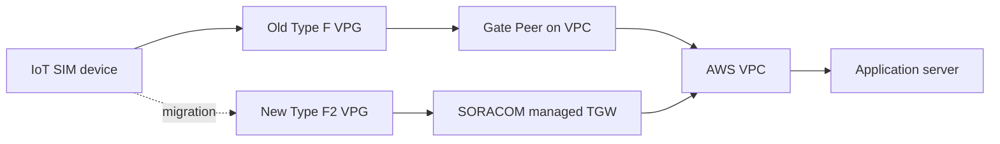

:::message
「[一般消費者が事業者の表示であることを判別することが困難である表示](https://www.caa.go.jp/policies/policy/representation/fair_labeling/guideline/assets/representation_cms216_230328_03.pdf)」の運用基準に基づく開示: この記事は記載の日付時点で[株式会社ソラコム](https://soracom.jp/)に所属する社員が執筆しました。ただし、個人としての投稿であり、株式会社ソラコムとしての正式な発言や見解ではありません。
:::

## TL;DR

- SORACOM VPG（Virtual Private Gateway） Type-F で SORACOM Canal の VPC Peering と SORACOM Gate C2D を使っている構成を、VPG Type-F2 + Canal Transit Gateway VPC アタッチメント接続へ段階移行する手順です。
- Type-F2 では、Gate C2D の VXLAN 終端や Junction Redirection を使わずに、クラウドと IoT SIM デバイス間の NAT なし双方向 IP 通信を構成できます。
- 新旧 VPG で同じデバイスサブネットと同じ IMSI-IP マッピングを用意できる場合、AWS 側で `/32` のより具体的な経路を追加して 1 台だけ先に移行できます。
- 先行切替で D2C / C2D を確認してから、メンテナンスウィンドウ内で AWS の `/9` 経路、SIM グループ、SIM セッションをまとめて切り替えます。

## はじめに

これまで、クラウドとデバイスの間で双方向通信を実現する場合、VPG Type-F + SORACOM Canal（VPC Peering）+ SORACOM Junction Redirection + Gate Peer という複雑な構成を取る必要がありました。
2024 年に VPG Type-F2 がリリースされたことで、SORACOM が管理する Transit Gateway と Transit Gateway VPC アタッチメント接続を使い、よりシンプルな構成で NAT なしの双方向通信を構成できるようになりました。
この記事では、これまで VPG Type-F で運用していたシステムを Type-F2 へ移行する手順をまとめます。

クラウドからデバイスへ到達する構成を SORACOM Gate C2D と呼びます。
接続先のクラウド側に Gate Peer を立て、VPG との間で VXLAN トンネルを作ることにより実現します。
また、デバイスからクラウドへの通信では SORACOM Junction Redirection を組み合わせる構成があります。

この構成は動作しますが、移行や運用では以下のような要素を意識する必要があります。

- SORACOM Canal の Amazon VPC Peering
- SORACOM Gate C2D の Gate Peer / VXLAN
- SORACOM Junction Redirection
- AWS 側のデバイスサブネット向けルート
- SIM グループとセッション再確立

VPG Type-F2 では、SORACOM が管理する Transit Gateway とお客様 VPC または Transit Gateway を接続し、VPG ルーティングテーブルと AWS 側ルートテーブルで双方向通信を成立させます。
Gate C2D の VXLAN 設定を移設するのではなく、クラウドからデバイスへの到達性を Type-F2 の Canal 経路へ置き換える、という考え方です。

この記事では、以下の移行を題材にします。

```text
移行前:
  VPG Type-F
  + SORACOM Canal Amazon VPC Peering
  + SORACOM Gate C2D
  + SORACOM Junction Redirection

移行後:
  VPG Type-F2
  + SORACOM Canal Transit Gateway VPC attachment
  + VPG routing table
  + AWS route table
```

この記事で扱うのは、Type-F2 VPG とお客様 VPC を Transit Gateway VPC アタッチメント接続でつなぐ構成です。
お客様が所有する Transit Gateway との peering、SORACOM Direct / Door、複数 VPC への展開、冗長化設計の詳細は扱いません。
また、各サービスの料金や対応リージョンは変わる可能性があるため、実作業前に公式ドキュメントで最新情報を確認してください。

## 全体構成



移行のポイントは、旧経路と新経路を一時的に並行して持つことです。

AWS のルート選択では、より長い prefix の経路が優先されます。
そのため、全体の `10.128.0.0/9` を旧 Gate Peer 向きに残したまま、先行切替対象の固定 IP だけ `/32` で新 Type-F2 側へ向けられます。

```text
10.128.0.0/9        -> 旧 Gate Peer
10.128.10.10/32     -> 新 Type-F2 Canal 経路
```

この状態で対象 SIM だけ新 VPG 用グループへ移し、セッションを張り直すと、1 台だけ Type-F2 経路で検証できます。
先行切替が成功したら、メンテナンスウィンドウで `10.128.0.0/9` の向き先を新 TGW へ切り替えます。

## 前提

この記事では、以下を前提にします。

- SORACOM 日本カバレッジで作業する
- SORACOM Air for セルラーの IoT SIM を利用している
- 旧 VPG Type-F で Canal と Gate C2D が動作している
- 対象 SIM の固定 IP を把握している
- 新旧 VPG で同じデバイスサブネットを設定できる
- 新 VPG に旧 VPG と同じ IMSI-IP マッピングを投入できる
- 接続先 VPC が新 VPG と同じ AWS リージョンにある
- 接続先 VPC の CIDR が SORACOM Canal の制約に抵触していない
- AWS VPC 側の対象 route table を把握している
- 検証に使う Security Group（SG）と Network ACL で必要な通信を許可できる
- 切替対象 SIM の一覧を事前に確定している
- CLI 例を使う場合は、作業端末で AWS CLI、SORACOM CLI、`jq` を利用できる

この記事の例では、以下のような変数名を使います。
実際の値は自分の環境に置き換えてください。

:::details CLI 例で使う変数名
```bash
AWS_REGION=ap-northeast-1

DEVICE_CIDR=10.128.0.0/9
VPC_CIDR=10.64.0.0/16
AWS_ACCOUNT_ID=<AWS_ACCOUNT_ID>
VPC_ID=<CUSTOMER_VPC_ID>

SUBNET_IDS=(<SUBNET_ID_A> <SUBNET_ID_B>)
ROUTE_TABLE_IDS=(<ROUTE_TABLE_ID_A> <ROUTE_TABLE_ID_B>)

OLD_GROUP_ID=<OLD_SIM_GROUP_ID>
NEW_GROUP_ID=<NEW_SIM_GROUP_ID>

OLD_VPG_ID=<OLD_TYPE_F_VPG_ID>
NEW_VPG_ID=<NEW_TYPE_F2_VPG_ID>
OLD_GATE_PEER_ENI_ID=<OLD_GATE_PEER_ENI_ID>
SORACOM_TGW_ID=<SORACOM_MANAGED_TGW_ID>
TGW_ATTACH_ID=<CUSTOMER_TGW_VPC_ATTACHMENT_ID>

EARLY_SWITCH_SIM_ID=<EARLY_SWITCH_SIM_ID>
EARLY_SWITCH_FIXED_IP=<EARLY_SWITCH_FIXED_UE_IP>
```
:::

:::message alert
本番 SIM を扱う場合は、必ずメンテナンスウィンドウを確保してください。
SIM グループ変更だけでは既存セッションは即時に新 VPG へ移りません。
セッション再確立のタイミングで通信断が発生します。
:::

:::message alert
VPG 作成、Canal の接続、AWS Transit Gateway VPC attachment には料金が発生する場合があります。
検証用に作った VPG や attachment を放置しないよう、検証完了後の削除判断も作業計画に含めてください。
:::

日本カバレッジの VPG では、接続先 VPC に `10.21.0.0/16` を含む CIDR を使えない制約があります。
この制約は [SORACOM Canal Transit Gateway VPC Attachment Configuration](https://developers.soracom.io/en/docs/canal/transit-gateway-vpc-attachment-configuration/#limitations) に記載されています。
既存 VPC の CIDR が該当する場合は、この手順だけでは移行できないため、VPC 側の再設計が必要です。

## 移行前に控えておく値

ロールバックできるように、作業前の状態を控えておきます。
最低限、以下を確認します。

| 項目 | 確認する内容 |
|---|---|
| 旧 VPG | VPG ID、デバイスサブネット、IP アドレスマップ |
| 旧 SIM グループ | グループ ID、VPG 設定、対象 SIM 一覧 |
| AWS route table | `10.128.0.0/9` の向き先、対象 route table ID |
| Gate Peer | 旧経路の ENI ID または route target |
| 検証通信 | D2C / C2D の確認に使う宛先 IP、ポート、SG / NACL |

AWS 側の route table は、変更前の画面をスクリーンショットで残しておくと戻しやすくなります。
CLI で作業ログとして保存する場合は、次のように JSON で保存します。

:::details CLI で route table の変更前状態を保存する
```bash
aws ec2 describe-route-tables \
  --region "$AWS_REGION" \
  --route-table-ids "${ROUTE_TABLE_IDS[@]}" \
  > before-cutover-route-tables.json
```
:::

## 移行の流れ

大きく分けると、次の順序で進めます。

1. 新 VPG Type-F2 を作成する
2. 新 VPG に IMSI-IP マッピングを登録する
3. 新 VPG 用の SIM グループを準備する
4. 新 VPG の Canal Transit Gateway VPC アタッチメント接続を作成する
5. 新 VPG のルーティングテーブルに VPC CIDR 宛ての static route を追加する
6. AWS 側で先行切替用 `/32` route を追加する
7. 先行切替対象 SIM だけ新グループへ移し、セッションを再確立する
8. D2C / C2D を検証する
9. 本番切替で AWS `/9` route、SIM グループ、セッションを切り替える
10. 先行切替用 `/32` route を削除する

GUI で設定できる部分は GUI を中心に進めます。
AWS route table の更新や SIM セッション再確立は、対象が少ない場合は GUI で進め、対象台数が多い場合だけ CLI の折り畳み例を使います。

## ステップ 1: 新 VPG Type-F2 を作成する

SORACOM ユーザーコンソールで Type-F2 の VPG を作成します。

1. SORACOM ユーザーコンソールで `メニュー` から `VPG` を開きます。
2. `VPG を追加` をクリックします。
3. VPG タイプに `Type-F2` を選びます。
4. ランデブーポイント、名前、デバイスサブネット IP アドレスレンジを入力します。
5. インターネットゲートウェイを要件に合わせて ON / OFF にします。
6. 作成後、VPG の状態が `実行中` になるまで待ちます。

設定例です。

| 項目 | 例 |
|---|---|
| VPG タイプ | Type-F2 |
| 名前 | `migration-type-f2` |
| ランデブーポイント | 東京 |
| デバイスサブネット IP アドレスレンジ | `10.128.0.0/9` |
| インターネットゲートウェイ | 要件に応じて ON / OFF |

<!-- screenshot: /images/soracom-vpg-type-f-to-f2-canal-migration/01-create-type-f2-vpg.png -->


移行する SIM の回線数が多い場合は、移行前後の VPG ID と対象回線数をサポート窓口までお伝えください。
大規模な切替では、事前に対象範囲を共有しておくと作業計画を立てやすくなります。

## ステップ 2: IMSI-IP マッピングを登録する

旧 VPG で利用している固定 IP マッピングを、新 VPG にも登録します。

1. SORACOM ユーザーコンソールで新 VPG の詳細画面を開きます。
2. `デバイス LAN 設定` を開きます。
3. `IP アドレスマップ` で `IP アドレスを追加` をクリックします。
4. 旧 VPG と同じ IMSI と IP アドレスを登録します。
5. 登録後、対象 SIM の IMSI と固定 IP が旧 VPG と一致していることを確認します。

Type-F2 側では static な IP アドレスマップとして表示されます。

<!-- screenshot: /images/soracom-vpg-type-f-to-f2-canal-migration/02-ip-address-map.png -->


登録対象が多い場合は、ユーザーコンソールのバッチ処理も利用できます。
CSV では [VirtualPrivateGateway の `putVirtualPrivateGatewayIpAddressMapEntry`](https://users.soracom.io/ja-jp/docs/batch-operation/csv-specs/#%E3%82%B5%E3%83%BC%E3%83%93%E3%82%B9-virtualprivategateway-vpg) を使って、VPG に接続する SIM へ特定の IP アドレスを割り当てます。

CLI で差分確認する場合は、旧 VPG と新 VPG の map をそれぞれ取得して比較します。
IP アドレスマップの一覧には VPG や Gate Peer の自動エントリも含まれるため、ここでは IMSI の形式に見えるエントリだけに絞っています。

:::details CLI で IP アドレスマップを比較する
```bash
soracom vpg list-ip-address-map-entries \
  --coverage-type jp \
  --vpg-id "$OLD_VPG_ID" |
jq -S '[.[] | select(.key | test("^[0-9]{15}$"))]' \
  > old-vpg-ip-address-map.json

soracom vpg list-ip-address-map-entries \
  --coverage-type jp \
  --vpg-id "$NEW_VPG_ID" |
jq -S '[.[] | select(.key | test("^[0-9]{15}$"))]' \
  > new-vpg-ip-address-map.json

diff -u old-vpg-ip-address-map.json new-vpg-ip-address-map.json
```
:::

確認ポイントは以下です。

- 登録件数が旧 VPG と一致している
- IMSI の差分がない
- IP アドレスの差分がない
- IP アドレスの重複がない

## ステップ 3: 新 VPG 用の SIM グループを準備する

次に、新 VPG を使う SIM グループを用意します。
既存グループを直接変更するとロールバックしにくいため、移行用の新グループを作っておくのが扱いやすいです。

1. SORACOM ユーザーコンソールで `SIM グループ` を開きます。
2. 移行用の新しい SIM グループを作成します。
3. 新グループの設定画面で `SORACOM Air for セルラー設定` を開きます。
4. VPG 設定で新 Type-F2 VPG を指定します。
5. 保存後、旧グループとの差分を確認します。

<!-- screenshot: /images/soracom-vpg-type-f-to-f2-canal-migration/03-sim-group-vpg-setting.png -->


CLI で設定する場合は次のようになります。

:::details CLI で SIM グループに新 VPG を設定する
```bash
soracom groups put-config \
  --coverage-type jp \
  --group-id "$NEW_GROUP_ID" \
  --namespace SoracomAir \
  --body "$(jq -cn --arg vpg_id "$NEW_VPG_ID" '[{"key":"useVpg","value":true},{"key":"vpgId","value":$vpg_id}]')"
```
:::

この時点では、まだ本番 SIM を新グループへ移しません。
旧グループとの差分を説明できる状態にしてから、次へ進みます。

確認ポイントは以下です。

- 新グループで `useVpg` が有効になっている
- `vpgId` が新 Type-F2 VPG を指している
- 旧グループに残す設定と、新グループへ移す設定を区別できている
- 本番 SIM がまだ新グループへ移動していない

## ステップ 4: Canal Transit Gateway VPC アタッチメント接続を作成する

新 VPG と接続先 VPC の間に、Canal Transit Gateway VPC アタッチメント接続を作成します。

1. SORACOM ユーザーコンソールで新 VPG の詳細画面を開きます。
2. `閉域網設定` を開きます。
3. `Transit Gateway VPC アタッチメント接続を追加` をクリックします。
4. AWS アカウント ID、VPC ID、AWS リージョン、名前を入力して接続を作成します。

入力する項目です。

| 項目 | 内容 |
|---|---|
| AWS アカウント ID | 接続先 VPC を所有する AWS account ID |
| VPC ID | 接続先 VPC ID |
| AWS リージョン | 例: `ap-northeast-1` |
| 名前 | 接続を識別できる名前 |

<!-- screenshot: /images/soracom-vpg-type-f-to-f2-canal-migration/04-create-tgw-vpc-attachment.png -->


SORACOM 側で接続を作成すると、AWS 側で実施するコマンドが画面に表示されます。
内容は大きく分けて次の 2 つです。

1. AWS Resource Access Manager（RAM）の resource share invitation を承諾する
2. AWS 側で Transit Gateway VPC attachment を作成する

まず AWS RAM コンソールで resource share invitation を承諾します。

1. AWS マネジメントコンソールで Resource Access Manager（RAM）を開きます。
2. `自分と共有` から pending の resource share invitation を探します。
3. SORACOM コンソールに表示された resource share ARN と一致することを確認します。
4. invitation を承諾します。

<!-- screenshot: /images/soracom-vpg-type-f-to-f2-canal-migration/05-ram-invitation.png -->


次に、AWS 側で Transit Gateway VPC attachment を作成します。

1. AWS マネジメントコンソールで VPC ダッシュボードを開きます。
2. リージョンが VPG のリージョンと一致していることを確認します。
3. `Transit Gateway アタッチメント` を開きます。
4. SORACOM コンソールに表示された Transit Gateway ID を指定します。
5. 接続先 VPC と、利用する Availability Zone ごとの subnet を選択します。
6. 作成後、attachment の状態が `available` になるまで待ちます。

<!-- screenshot: /images/soracom-vpg-type-f-to-f2-canal-migration/06-aws-tgw-vpc-attachment.png -->


AWS RAM コンソールで pending invitation が見えない場合は、SORACOM コンソールに表示された AWS CLI コマンドを使うと確実です。

SORACOM CLI で接続を作成する場合は、次のように作成できます。

:::details CLI で Canal attachment 作成から AWS 側 attachment 作成まで進める
```bash
soracom vpg create-transit-gateway-vpc-attachment \
  --coverage-type jp \
  --vpg-id "$NEW_VPG_ID" \
  --customer-aws-account-id "$AWS_ACCOUNT_ID" \
  --customer-vpc-id "$VPC_ID" \
  --name migration-type-f2-attachment
```

```bash
RESOURCE_SHARE_ARN=<RESOURCE_SHARE_ARN_FROM_SORACOM_CONSOLE>

INVITATION_ARN=$(
  aws ram get-resource-share-invitations \
    --region "$AWS_REGION" \
    --resource-share-arns "$RESOURCE_SHARE_ARN" \
    --query 'resourceShareInvitations[0].resourceShareInvitationArn' \
    --output text
)

aws ram accept-resource-share-invitation \
  --region "$AWS_REGION" \
  --resource-share-invitation-arn "$INVITATION_ARN"
```

続いて、VPC attachment を作成します。
サブネットは、接続先 VPC 内の利用する Availability Zone に合わせて選びます。

```bash
aws ec2 create-transit-gateway-vpc-attachment \
  --region "$AWS_REGION" \
  --transit-gateway-id "$SORACOM_TGW_ID" \
  --vpc-id "$VPC_ID" \
  --subnet-ids "${SUBNET_IDS[@]}" \
  --tag-specifications 'ResourceType=transit-gateway-attachment,Tags=[{Key=Name,Value=migration-type-f2-attachment}]'
```

作成直後は `pendingAcceptance` や `pending` になることがあります。
しばらく待つと AWS 側が `available`、SORACOM 側が `active` になります。

```bash
aws ec2 describe-transit-gateway-vpc-attachments \
  --region "$AWS_REGION" \
  --transit-gateway-attachment-ids "$TGW_ATTACH_ID" \
  --query 'TransitGatewayVpcAttachments[0].State' \
  --output text

soracom vpg get \
  --coverage-type jp \
  --vpg-id "$NEW_VPG_ID" |
jq '.soracomTransitGatewayVpcAttachments'
```
:::

AWS 側の attachment が `available` になったら、SORACOM 側の Transit Gateway VPC アタッチメント接続も `active` になっていることを確認します。

<!-- screenshot: /images/soracom-vpg-type-f-to-f2-canal-migration/07-soracom-aws-cli-instructions.png -->


## ステップ 5: VPG ルーティングテーブルを設定する

Type-F2 では、VPG からお客様 VPC へ向かう経路も設定します。
新 VPG の詳細画面でスタティックルートを追加します。

1. SORACOM ユーザーコンソールで新 VPG の詳細画面を開きます。
2. `ルーティングテーブル` を開きます。
3. `スタティックルートを追加` をクリックします。
4. 宛先ネットワークに VPC CIDR を入力します。
5. ゲートウェイに、作成した Transit Gateway VPC attachment ID を指定します。
6. 追加後、ルーティングテーブルに VPC CIDR 宛ての route が表示されることを確認します。

設定例です。

| 項目 | 値 |
|---|---|
| 宛先ネットワーク | `10.64.0.0/16` |
| ゲートウェイ | 作成した TGW VPC attachment ID |

CLI で作成する場合は次のようになります。
`--target` には、SORACOM コンソールの VPG ルーティングテーブルで Gateway として選ぶ Transit Gateway VPC attachment ID を指定します。

:::details CLI で VPG ルーティングテーブルを設定する
```bash
soracom vpg create-customer-route \
  --coverage-type jp \
  --vpg-id "$NEW_VPG_ID" \
  --destination-cidr "$VPC_CIDR" \
  --target "$TGW_ATTACH_ID"
```

確認します。

```bash
soracom vpg get \
  --coverage-type jp \
  --vpg-id "$NEW_VPG_ID" |
jq '.customerRoutes'
```
:::

ここまでで、新 Type-F2 側の受け口は準備できました。
まだ AWS の `10.128.0.0/9` route は旧 Gate Peer 向きのままにしておきます。

<!-- screenshot: /images/soracom-vpg-type-f-to-f2-canal-migration/08-vpg-routing-table.png -->


## ステップ 6: `/32` で 1 台だけ先行切替する

ここからは通信影響が出ます。
ここでの先行切替は、切替対象全体のうち代表 1 台だけを先に新経路へ移し、D2C / C2D の通信、固定 IP、アプリケーション影響を確認するための小さな事前確認です。
まず、1 台だけを先行切替対象として切り替えます。

AWS 側 route table に、先行切替対象 SIM の固定 IP だけ `/32` で追加します。
同じ宛先の route がすでにないことを確認してから追加します。

1. AWS マネジメントコンソールで VPC ダッシュボードを開きます。
2. アプリケーションサーバーが所属する subnet に関連付けられている route table を開きます。
3. `ルート` タブで、先行切替対象 SIM の固定 IP `/32` 宛て route がまだ無いことを確認します。
4. `ルートを編集` から `ルートを追加` をクリックします。
5. 送信先に先行切替対象 SIM の固定 IP `/32` を入力します。
6. ターゲットに SORACOM が共有した Transit Gateway ID を指定します。
7. 保存前に入力内容を確認し、問題なければ保存します。
8. 保存後、`10.128.0.0/9` は旧 Gate Peer 向き、先行切替用の `/32` だけ新 TGW 向きになっていることを確認します。

<!-- screenshot: /images/soracom-vpg-type-f-to-f2-canal-migration/09-aws-route-table-early-switch-32.png -->


この状態では、AWS 側から見ると先行切替対象の IP だけ新 TGW へ向かいます。
`10.128.0.0/9` は旧 Gate Peer 向きのままです。

次に、先行切替対象 SIM だけ新グループへ移動します。

1. SORACOM ユーザーコンソールで SIM 管理画面を開きます。
2. 先行切替対象の SIM を選択します。
3. `操作` からグループ変更を選びます。
4. 新 Type-F2 VPG を設定した移行用グループを選択して保存します。
5. SIM 詳細画面で group が新グループに変わったことを確認します。

<!-- screenshot: /images/soracom-vpg-type-f-to-f2-canal-migration/10-early-switch-sim-change-group.png -->


既存セッションは旧 VPG に残っているため、先行切替対象 SIM のセッションを再確立します。
SORACOM ユーザーコンソールで SIM 詳細画面を開き、セッションを削除または再接続させます。
再接続後に、SIM 詳細画面の `セッション詳細` で先行切替対象 SIM が online になったことを確認します。
続けてセッション履歴までスクロールし、`VPG` 列が新 VPG を指していることを確認します。
固定 IP が変わっていないことは、SIM 詳細画面または CLI / API の `ueIpAddress` でも確認します。

<!-- screenshot: /images/soracom-vpg-type-f-to-f2-canal-migration/11-early-switch-sim-new-vpg-online.png -->


CLI で確認と切替を行う場合は、次のようになります。

:::details CLI で先行切替用の /32 route 追加、グループ変更、セッション再確立を行う
```bash
EARLY_SWITCH_CIDR="${EARLY_SWITCH_FIXED_IP}/32"

aws ec2 describe-route-tables \
  --region "$AWS_REGION" \
  --route-table-ids "${ROUTE_TABLE_IDS[@]}" \
  --query "RouteTables[].Routes[?DestinationCidrBlock=='${EARLY_SWITCH_CIDR}']"
```

```bash
for rtb in "${ROUTE_TABLE_IDS[@]}"; do
  aws ec2 create-route \
    --region "$AWS_REGION" \
    --route-table-id "$rtb" \
    --destination-cidr-block "$EARLY_SWITCH_CIDR" \
    --transit-gateway-id "$SORACOM_TGW_ID"
done
```

```bash
soracom sims set-group \
  --coverage-type jp \
  --sim-id "$EARLY_SWITCH_SIM_ID" \
  --group-id "$NEW_GROUP_ID"
```

```bash
soracom sims delete-session \
  --coverage-type jp \
  --sim-id "$EARLY_SWITCH_SIM_ID"
```

```bash
soracom sims get \
  --coverage-type jp \
  --sim-id "$EARLY_SWITCH_SIM_ID" |
jq '{groupId, online:.sessionStatus.online, ueIpAddress:.sessionStatus.ueIpAddress, vpgId:.sessionStatus.vpgId}'
```

期待する状態です。

```json
{
  "groupId": "<NEW_SIM_GROUP_ID>",
  "online": true,
  "ueIpAddress": "<EARLY_SWITCH_FIXED_UE_IP>",
  "vpgId": "<NEW_TYPE_F2_VPG_ID>"
}
```
:::

## ステップ 7: 先行切替の D2C / C2D を確認する

先行切替対象 SIM が新 VPG に上がったら、双方向通信を確認します。

D2C は、デバイスから VPC 内のアプリケーションへ通信します。
アプリケーションサーバーのログや疎通確認画面で、送信元がデバイスの固定 IP として見えることを確認します。

:::details デバイスから VPC 内アプリケーションへ疎通確認するコマンド例
```bash
ping <APP_SERVER_PRIVATE_IP>
curl http://<APP_SERVER_PRIVATE_IP>/
```

```text
<EARLY_SWITCH_FIXED_UE_IP> - - "GET / HTTP/1.1" 200
```
:::

C2D は、VPC 内のアプリケーションサーバーからデバイスの固定 IP へ通信します。
検証では、デバイス側で一時的に HTTP server を立てると確認しやすいです。

:::details VPC 内アプリケーションサーバーからデバイスへ疎通確認するコマンド例
```bash
python3 -m http.server 18080 --bind "$EARLY_SWITCH_FIXED_IP"
```

アプリケーションサーバーから実行します。

```bash
curl http://<EARLY_SWITCH_FIXED_UE_IP>:18080/
```

デバイス側のログで、送信元が VPC 内サーバーの private IP になっていれば C2D も成立しています。

```text
<APP_SERVER_PRIVATE_IP> - - "GET / HTTP/1.1" 200
```
:::

:::message
デバイスが Wi-Fi など別の default route も持っている場合、D2C の戻りがセルラー側に出ないことがあります。
その場合は、検証用に VPC CIDR 宛ての route がセルラーインターフェースへ向くよう確認してください。
:::

例です。

:::details デバイス側の経路を確認するコマンド例
```bash
ip route get <APP_SERVER_PRIVATE_IP>
sudo ip route replace 10.64.0.0/16 via <UE_GATEWAY_IP> dev wwan0 metric 50
ip route get <APP_SERVER_PRIVATE_IP>
```
:::

ICMP や任意の TCP port を検証に使う場合は、VPC 側の SG / NACL、デバイス側の firewall、アプリケーションプロセスの bind address も確認します。
経路が正しくても、SG がデバイスサブネットからの inbound を許可していないと D2C は成功しません。

## ステップ 8: 本番切替を行う

先行切替が成功したら、メンテナンスウィンドウで本番切替に進みます。
ここで重要なのは、SIM グループ、AWS route、SIM セッションを矛盾しない順序で切り替えることです。

推奨する順序です。

1. 対象 SIM を新グループへ移動する
2. AWS の `10.128.0.0/9` route を新 TGW へ向ける
3. 対象 SIM のセッションを削除する
4. 全 SIM が新 VPG で online になったことを確認する
5. D2C / C2D を確認する
6. 先行切替用の `/32` route を削除する

この 1 から 3 の間隔はできるだけ短くします。
SIM グループを変えたあとに対象 SIM が自発的に再接続すると、新 VPG へ上がる一方で AWS 側 route が旧経路のまま、という時間帯が生まれます。
切替中はアプリケーション側の C2D 処理を一時停止する、または対象デバイスの再起動を抑止するなど、現場に合わせて通信影響を抑えます。

まず、対象 SIM を新グループへ移します。

1. SORACOM ユーザーコンソールで SIM 管理画面を開きます。
2. 切替対象 SIM を検索またはフィルタで絞り込みます。
3. 対象 SIM を選択し、グループを移行用の新グループへ変更します。
4. 変更対象の件数が想定どおりであることを確認して保存します。

画面例では 1 件の SIM を選択しています。
複数 SIM をまとめて選択した場合も、同じダイアログで変更対象と変更後のグループを確認してから保存します。
対象 SIM が多い場合は、ユーザーコンソールのバッチ処理も利用できます。
CSV では [Sim の `setSimGroup`](https://users.soracom.io/ja-jp/docs/batch-operation/csv-specs/#%E6%93%8D%E4%BD%9C-setsimgroup) を使って、複数の SIM を指定した SIM グループへ所属させられます。

<!-- screenshot: /images/soracom-vpg-type-f-to-f2-canal-migration/12-production-switch-change-group.png -->


次に、AWS の `10.128.0.0/9` route を新 TGW へ向けます。

1. AWS マネジメントコンソールで対象 route table を開きます。
2. `10.128.0.0/9` の route を編集します。
3. ターゲットを旧 Gate Peer から SORACOM が共有した Transit Gateway ID へ変更します。
4. 対象 route table すべてで同じ変更を行います。
5. 保存後、`10.128.0.0/9` が新 TGW 向きになっていることを確認します。

<!-- screenshot: /images/soracom-vpg-type-f-to-f2-canal-migration/13-production-switch-route-9.png -->


画面例では、旧 VPG 関連の補助 route も比較用に表示されています。
移行完了後に不要と判断した旧 route は、通信停止を確認してから削除します。

その後、対象 SIM のセッションを再確立します。
対象台数が少ない場合は SIM 詳細画面から順にセッションを削除し、再接続後に新 VPG 上で online になったことを確認します。
対象台数が多い場合は、下の CLI 例のように同時実行数を抑えて実行します。

本番切替後は、先行切替用に追加した `/32` route を削除します。
これを残すと、あとで `/9` だけロールバックしたときに先行切替対象 SIM だけ新経路に残る可能性があります。

CLI でまとめて実行する場合は次のようになります。

:::details CLI で本番切替をまとめて実行する
```bash
while read -r sim_id; do
  soracom sims set-group \
    --coverage-type jp \
    --sim-id "$sim_id" \
    --group-id "$NEW_GROUP_ID"
done < target-sim-ids.txt
```

```bash
for rtb in "${ROUTE_TABLE_IDS[@]}"; do
  aws ec2 replace-route \
    --region "$AWS_REGION" \
    --route-table-id "$rtb" \
    --destination-cidr-block "$DEVICE_CIDR" \
    --transit-gateway-id "$SORACOM_TGW_ID"
done
```

```bash
xargs -I{} -P 20 sh -c '
  soracom sims delete-session \
    --coverage-type jp \
    --sim-id "$1" || true
' _ {} < target-sim-ids.txt
```

全 SIM が新 VPG 上で online になっていることを確認します。

```bash
while read -r sim_id; do
  soracom sims get \
    --coverage-type jp \
    --sim-id "$sim_id" |
  jq '{simId, groupId, online:.sessionStatus.online, ueIpAddress:.sessionStatus.ueIpAddress, vpgId:.sessionStatus.vpgId}'
done < target-sim-ids.txt
```

```bash
EARLY_SWITCH_CIDR="${EARLY_SWITCH_FIXED_IP}/32"

for rtb in "${ROUTE_TABLE_IDS[@]}"; do
  aws ec2 delete-route \
    --region "$AWS_REGION" \
    --route-table-id "$rtb" \
    --destination-cidr-block "$EARLY_SWITCH_CIDR"
done
```

最終的な route table は、`10.128.0.0/9` だけが新 TGW 向きになっている状態です。

```bash
aws ec2 describe-route-tables \
  --region "$AWS_REGION" \
  --route-table-ids "${ROUTE_TABLE_IDS[@]}" \
  --query 'RouteTables[].Routes[?DestinationCidrBlock==`10.128.0.0/9`]'
```
:::

## ロールバック手順

先行切替のロールバックは、次の逆順です。

1. 先行切替対象 SIM を旧グループへ戻す
2. 先行切替用 `/32` route を削除する
3. 先行切替対象 SIM のセッションを削除する
4. 旧 VPG で online になり、固定 IP が維持されていることを確認する

GUI で実施する場合は、SORACOM ユーザーコンソールで先行切替対象 SIM のグループを旧グループへ戻し、AWS route table から先行切替用 `/32` route を削除します。
その後、SIM 詳細画面からセッションを再確立し、旧 VPG 側で online になったことを確認します。

:::details CLI で先行切替ロールバックを実行する
```bash
EARLY_SWITCH_CIDR="${EARLY_SWITCH_FIXED_IP}/32"

soracom sims set-group \
  --coverage-type jp \
  --sim-id "$EARLY_SWITCH_SIM_ID" \
  --group-id "$OLD_GROUP_ID"

for rtb in "${ROUTE_TABLE_IDS[@]}"; do
  aws ec2 delete-route \
    --region "$AWS_REGION" \
    --route-table-id "$rtb" \
    --destination-cidr-block "$EARLY_SWITCH_CIDR"
done

soracom sims delete-session \
  --coverage-type jp \
  --sim-id "$EARLY_SWITCH_SIM_ID"
```
:::

本番切替のロールバックは、対象 SIM を旧グループに戻し、`10.128.0.0/9` を旧 Gate Peer 向きに戻し、セッションを再確立します。
GUI で実施する場合は、SIM 管理画面で対象 SIM のグループを旧グループへ戻し、AWS route table で `10.128.0.0/9` のターゲットを旧 Gate Peer へ戻します。
変更後、対象 SIM のセッションを再確立し、旧 VPG で online になったことを確認します。

:::details CLI で本番切替ロールバックを実行する
```bash
while read -r sim_id; do
  soracom sims set-group \
    --coverage-type jp \
    --sim-id "$sim_id" \
    --group-id "$OLD_GROUP_ID"
done < target-sim-ids.txt

for rtb in "${ROUTE_TABLE_IDS[@]}"; do
  aws ec2 replace-route \
    --region "$AWS_REGION" \
    --route-table-id "$rtb" \
    --destination-cidr-block "$DEVICE_CIDR" \
    --network-interface-id "$OLD_GATE_PEER_ENI_ID"
done
```

その後、対象 SIM のセッションを削除し、旧 VPG で online になったことを確認します。

```bash
xargs -I{} -P 20 sh -c '
  soracom sims delete-session \
    --coverage-type jp \
    --sim-id "$1" || true
' _ {} < target-sim-ids.txt

while read -r sim_id; do
  soracom sims get \
    --coverage-type jp \
    --sim-id "$sim_id" |
  jq '{simId, groupId, online:.sessionStatus.online, ueIpAddress:.sessionStatus.ueIpAddress, vpgId:.sessionStatus.vpgId}'
done < target-sim-ids.txt
```
:::

## トラブルシュート

### SORACOM 側 attachment が `vpcAttachmentPending` のまま進まない

AWS RAM の invitation が承諾されているか、AWS 側の Transit Gateway VPC attachment が作成されているかを確認します。
AWS RAM コンソールで pending invitation が見えない場合は、SORACOM コンソールが表示する AWS CLI コマンドで承諾できます。

### AWS 側 attachment が `pending` のまま進まない

作成直後は非同期で状態が変わります。
数分待っても変わらない場合は、VPC ID、subnet ID、region、Transit Gateway ID が一致しているかを確認します。

### D2C は失敗するが C2D は成功する

デバイス側に Wi-Fi など別の default route がある場合、デバイスから VPC CIDR への通信がセルラー側へ出ていない可能性があります。
`ip route get <APP_SERVER_PRIVATE_IP>` で実際に使われるインターフェースを確認します。

### D2C は成功するが C2D は失敗する

AWS 側 route table、SG / NACL、デバイス側 firewall を確認します。
アプリケーションサーバーが所属する subnet の route table に、デバイスサブネット向け route が入っていることも確認してください。
複数の route table を使っている VPC では、main route table だけを変更しても、実際のサーバー subnet には反映されないことがあります。

### SIM グループを変えたのに VPG が変わらない

既存セッションは即時には新 VPG へ移りません。
SIM グループ変更後にセッションを再確立してください。
`delete-session` の API 応答に古い session 情報が残って見えることがあるため、最終確認は `soracom sims get` で行います。

### 本番切替後に先行切替対象だけロールバックされない

先行切替用の `/32` route が残っている可能性があります。
AWS では `/32` が `/9` より優先されるため、本番切替成功後は redundant な `/32` route を削除します。

## 運用上の注意点

### 料金

Type-F2 VPG、Canal の接続、AWS Transit Gateway VPC attachment、データ処理にはそれぞれ料金が発生する場合があります。
先行切替用に作った新 VPG や attachment を本番移行後も残す場合は、監視やロールバック目的で残す期間を明確にします。
不要になった旧 VPG、Gate Peer、Junction 設定、AWS route は、通信停止を確認してから削除します。

### セキュリティ

C2D を有効にすると、VPC 内の許可された送信元からデバイスの固定 IP へ到達できるようになります。
SG / NACL は検証用に広げたままにせず、アプリケーションサーバーの subnet または必要な private IP 範囲に絞ります。
検証用 HTTP server をデバイス上で起動した場合は、確認後に停止してください。

### 監視

切替中は、少なくとも以下を見ます。

- 対象 SIM の online 状態と VPG ID
- AWS route table の向き先
- アプリケーションの D2C access log
- C2D の成功率または timeout 数
- デバイス側の再接続ログ

## まとめ

VPG Type-F + Canal VPC Peering + Gate C2D + Junction Redirection の構成は、VPG Type-F2 + Canal Transit Gateway VPC アタッチメント接続へ段階移行できます。

重要なのは、いきなり全体を切り替えず、新旧 VPG を並行して用意し、より具体的な `/32` route で 1 台だけ先に検証することです。
先行切替で D2C / C2D を確認できれば、本番切替は「SIM グループ」「AWS `/9` route」「SIM セッション再確立」を同じメンテナンスウィンドウ内で扱う作業になります。

Type-F2 では Gate C2D の VXLAN 終端を移設するのではなく、VPG routing table と AWS route table で双方向 IP 通信の経路を作ります。
この違いを意識しておくと、rollback や段階移行の設計もしやすくなります。

## 参考

- SORACOM Canal の種類
  - https://users.soracom.io/ja-jp/docs/canal/types/
- SORACOM Canal を使用して閉域網で双方向通信する Transit Gateway VPC アタッチメント接続
  - https://users.soracom.io/ja-jp/docs/canal/tgw-vpc/
  - https://developers.soracom.io/en/docs/canal/transit-gateway-vpc-attachment-configuration/
- SORACOM Canal を使用して VPC Peering 接続を設定する
  - https://developers.soracom.io/en/docs/canal/vpc-peering-configuration/
- Virtual Private Gateway のタイプ
  - https://users.soracom.io/ja-jp/docs/vpg/types/
- VPG Type-F2 Configuration
  - https://developers.soracom.io/en/docs/vpg/type-f2-configuration/
- VPG ルーティングテーブルを利用する
  - https://users.soracom.io/ja-jp/docs/vpg/vpg-routing-table/
- クラウドからデバイスへアクセスする SORACOM Gate C2D
  - https://users.soracom.io/ja-jp/docs/gate/cloud-to-device/
- SORACOM Gate Overview
  - https://developers.soracom.io/en/docs/gate/
- SORACOM Junction Overview
  - https://developers.soracom.io/en/docs/junction/
- バッチ処理: CSV ファイルの要件
  - https://users.soracom.io/ja-jp/docs/batch-operation/csv-specs/
