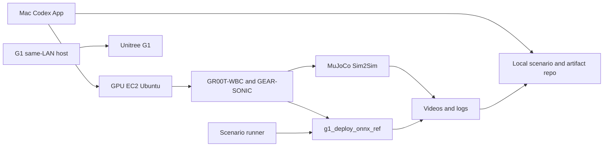
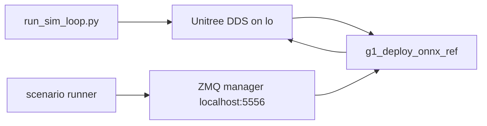

## TL;DR

- Unitree G1 を GR00T-WholeBodyControl（GR00T-WBC）/ GEAR-SONIC で動かす前段として、まずシミュレーションで安全に詰める環境を作りました。
- Mac はシナリオ編集と指示、GPU EC2 は build / TensorRT / MuJoCo / 録画を担当します。
- 実機 G1 は EC2 から WAN 越しに直接操作せず、MuJoCo Sim2Sim で歩行、停止、上半身動作、ログ、録画を先に確認します。
- 基準シナリオは `10 m 歩く -> 停止 -> 右手だけを握手風に差し出す -> 引き戻し`。

## はじめに

Unitree G1 のようなヒューマノイドを動かすとき、最初から実機で試すのは危険です。
転倒、関節への急な指令、停止時の制御解除、ネットワーク遅延など、ソフトウェアだけでは済まない失敗が起こり得ます。

今回は、いきなり実機へ行かず、MuJoCo 上で `立つ -> 歩く -> 止まる -> 右手を出す` までを順番に潰せる環境を作りました。

- policy が MuJoCo 上で安定して立てること
- planner target velocity で指定距離を歩けること
- 停止を「制御解除」ではなく「ゼロ速度 hold」として扱えること
- 停止後に上半身目標を滑らかに送れること
- 第三者視点の動画、odometry、接触診断ログを一緒に残せること

この記事では、2026-06-15 時点で手元の検証に使っている構成、役割分担、ログの見方を残します。

なお、ここで扱うのは実機投入前の Sim2Sim 検証です。
実機 G1 への投入はこの記事の範囲外で、EC2 から WAN 越しに実機を直接動かす構成も対象外です。

## この記事で使う用語

GR00T-WBC や Unitree SDK の用語が何度も出てくるので、この記事内での意味だけ先に揃えておきます。

| 用語 | この記事での意味 |
| --- | --- |
| Sim2Sim | MuJoCo 上で、実機相当の低レベル状態と指令を閉ループでつなぐ検証 |
| policy | 観測値から関節指令を作る制御モデル |
| planner | 目標速度や上半身目標を受け取り、policy に渡す入力を作る部分 |
| target velocity | planner に送る速度目標 |
| zero-velocity hold | 速度 0 の目標を送り続けて、control を解除せずに立位を保つ停止 |
| DDS（Data Distribution Service） / `rt/lowstate` / `lowcmd` | Unitree SDK / DDS の低レベル状態トピックと低レベル指令 |
| ZMQ manager（ZeroMQ ベースの入力管理プロセス） / publisher | planner target や上半身 target を送る入力口と送信側 |
| elastic band | 起動直後だけ仮想的に体を支える補助 |
| control handoff | 初期姿勢の補助から policy control へ移る切り替え |
| odostate / contact diagnostics | 位置・姿勢の推定ログと、接触や base z の異常を見る診断ログ |

## 全体構成

今回は、Mac、GPU EC2、将来の実機 G1 用ホストを別々の役割にしています。



役割は次のように分けています。

| 役割 | 担当 |
| --- | --- |
| シナリオ作成、実行指示、成果物確認 | Mac + Codex App |
| GPU、CUDA、TensorRT、MuJoCo、Isaac Lab、GR00T-WBC | EC2 |
| シナリオの ZMQ publish（送信） | `groot_wbc_scenarios` |
| Sim2Sim の起動、deploy、録画、ログ収集 | `ec2_codex_remote/run_closed_loop_recording.sh` |
| 実機制御 | 将来、G1 と同一 LAN 上のホストで実行 |

EC2 は実機を操作する端末ではなく、GPU が必要な build、TensorRT、Sim2Sim、録画処理に限定しています。
EC2 から WAN 越しに実機 G1 を直接動かす構成にはしていません。

:::message
この記事の `groot_wbc_scenarios` と `ec2_codex_remote` は、手元の検証用に作っている未公開 helper（補助スクリプト）です。
以降のコマンドは、同じ helper と YAML シナリオが手元にある前提の検証メモであり、GR00T-WBC 公式リポジトリだけを clone すればそのまま再現できる手順ではありません。
公開用に再現手順化する場合は、helper scripts と scenario YAML も合わせて公開する必要があります。
:::

## コンポーネントの役割と依存関係

公式リポジトリ、手元 helper、生成済み reference、実行時 artifact（動画やログなどの成果物）は混ざりやすいので、ここで役割を切り分けます。

| コンポーネント | 役割 | 主な依存関係 / 必須条件 |
| --- | --- | --- |
| Mac + Codex App | シナリオ編集、EC2 への実行指示、成果物確認 | EC2 への SSH / SSM 接続、ローカルの作業 repo |
| GPU EC2 | build、TensorRT engine 生成、Sim2Sim、録画、ログ収集 | GPU driver、CUDA、TensorRT、十分な EBS 容量、Git LFS asset |
| GR00T-WBC / GEAR-SONIC | policy、planner、MuJoCo sim、deploy binary（実行ファイル）の本体 | `download_from_hf.py` で取得する ONNX / checkpoint / sample data |
| Isaac Lab quickstart | policy が sample motion を tracking できるかの基準確認 | Isaac Lab 実行環境、`sonic_release/last.pt`、`sample_data/robot_filtered`、`sample_data/smpl_filtered` |
| `reference/quickstart_walk_forward/` | quickstart の walk-forward motion を deploy 側で読む CSV reference | sample motion から生成した `joint_pos.csv`、`joint_vel.csv`、body pose / velocity 系 CSV |
| MuJoCo sim loop | 仮想 G1 を動かし、DDS の `rt/lowstate` / `rt/lowcmd` 相当をやり取りする | `.venv_sim`、G1 model、WBC ONNX、startup elastic band 設定 |
| `g1_deploy_onnx_ref` | lowstate を読み、policy / planner を通して lowcmd を出す deploy process | MuJoCo sim loop、TensorRT、policy encoder / decoder、planner、reference CSV |
| `groot_wbc_scenarios` | planner target velocity と上半身 target を ZMQ で送る | deploy が `--input-type zmq_manager` で起動済み、`localhost:5556`、scenario YAML |
| `run_closed_loop_recording.sh` | sim / deploy / scenario / camera capture / odometry / diagnostics を 1 run にまとめる | 上記コンポーネント一式、camera port、`ffmpeg`、出力先 `artifacts/` |
| G1 same-LAN host | 将来の実機制御場所 | G1 と同一 LAN、`deploy.sh real`、安全確認、E-Stop（非常停止）、実機ログ取得 |

順番を崩すと `rt/lowstate` 待ちや `Init Done` 待ちで詰まるので、起動順も固定しています。

1. EC2 側で CUDA / TensorRT / GR00T-WBC / Git LFS asset を揃える
2. Isaac Lab quickstart で policy の基準動作を確認する
3. quickstart sample motion から deploy 用 reference を生成する
4. MuJoCo sim loop を起動して `rt/lowstate` が流れる状態にする
5. `g1_deploy_onnx_ref` を起動し、`Init Done` まで待つ
6. scenario runner から ZMQ manager に planner target / 上半身 target を送る
7. 動画、odometry、contact diagnostics、manifest を 1 run の artifact として保存する

## 事前準備と EC2 側の基本方針

今回の検証では Ubuntu 22.04 系の GPU AMI を使いました。
今回の基準 run では次の条件で足りました。

- リージョン: 近いリージョンを選ぶ。例では `ap-northeast-1`
- インスタンス: `g6e.xlarge` 程度から開始
- ルート EBS: 500 GB 以上を推奨
- 接続: Public SSH を開けず、SSM Session Manager 経由の SSH を使う
- 用途: GR00T-WBC の build、TensorRT engine 生成、MuJoCo Sim2Sim、Isaac Lab quickstart、録画

:::message alert
GPU EC2 と大きめの EBS volume は、起動中または volume を保持している間に課金が発生します。
実行後はインスタンスを停止または終了し、不要な EBS volume / snapshot が残っていないか確認します。
インスタンスタイプ、ストレージ、Public IPv4、データ転送の料金は変わるため、作成前に AWS の最新料金を確認してください。
:::

GR00T-WBC は TensorRT のバージョン差で挙動が変わる可能性があるため、x86_64 deploy では公式指定の TensorRT 10.13 系に揃えました。

ログや動画を見るときの前提は次の通りです。

| 項目 | 値 |
| --- | --- |
| 検証日時 | 2026-06-15 JST（manifest の `generated_at_utc=2026-06-14T23:08:56Z`） |
| EC2 | Deep Learning Base OSS Nvidia Driver GPU AMI（Ubuntu 22.04）20260609 / `g6e.xlarge` |
| GPU | NVIDIA L40S 46 GB class / driver 580.159.04 |
| TensorRT | x86_64 TensorRT 10.13 系を `$HOME/TensorRT` に配置 |
| GR00T-WBC | `NVlabs/GR00T-WholeBodyControl` commit `a9d20b2` ベース |
| 追加変更 | `ec2_codex_remote`、`groot_wbc_scenarios`、`reference/quickstart_walk_forward/` は手元 helper / 生成物 |
| helper revision | 2026-06-15 時点の手元 helper（未公開。公開 repo の commit では固定していません） |
| 基準シナリオ | `post_stop_upper_body_handshake_retract_v3_clear.yaml` |

EC2 上の作業ディレクトリは、記事中では次のように表します。

```text
~/unitree-groot/
  GR00T-WholeBodyControl/
  groot_wbc_scenarios/
  ec2_codex_remote/
  artifacts/
```

モデルと LFS asset は GR00T-WBC 側で取得します。

```bash
cd ~/unitree-groot/GR00T-WholeBodyControl
git lfs pull
pip install huggingface_hub

# deploy 用の ONNX と planner
python download_from_hf.py

# Isaac Lab quickstart で使う checkpoint と sample motion
python download_from_hf.py --training --no-smpl
python download_from_hf.py --sample
```

TensorRT は EC2 上に配置し、deploy 実行時に `TensorRT_ROOT` と `LD_LIBRARY_PATH` を通します。

```bash
export TensorRT_ROOT="$HOME/TensorRT"
export LD_LIBRARY_PATH="$HOME/TensorRT/lib:/opt/onnxruntime/lib:${LD_LIBRARY_PATH:-}"
```

## まず Isaac Lab quickstart からはじめよ

まず Isaac Lab quickstart で、policy が sample motion を追従できることを確認します。
ここが通らない状態で MuJoCo deploy 側を触ると、問題の切り分けが難しくなります。

quickstart では、主に次の checkpoint と sample motion を使います。

```text
checkpoint=sonic_release/last.pt
motion_file=sample_data/robot_filtered
smpl_motion_file=sample_data/smpl_filtered
```

quickstart の sample motion から、MuJoCo deploy 側で使う reference を生成しておきます。

```text
GR00T-WholeBodyControl/gear_sonic_deploy/reference/quickstart_walk_forward/
```

この reference は、後段の `g1_deploy_onnx_ref` で使う `joint_pos.csv`、`joint_vel.csv`、body pose / velocity 系 CSV を含みます。
シナリオ駆動に入る前に、まずこの reference を MuJoCo deploy 経由で再生できることを確認します。

## MuJoCo deploy のプロセス構成

MuJoCo 側では、sim loop、deploy、scenario publisher の 3 プロセスを並べて動かします。



1 つ目は MuJoCo の sim loop です。
headless EC2 では onscreen viewer を無効にします。

```bash
cd ~/unitree-groot/GR00T-WholeBodyControl
source .venv_sim/bin/activate

python gear_sonic/scripts/run_sim_loop.py \
  --interface sim \
  --no-enable-onscreen \
  --no-enable-offscreen \
  --wbc-model-path policy/GR00T-WholeBodyControl-Balance.onnx,policy/GR00T-WholeBodyControl-Walk.onnx
```

次に `g1_deploy_onnx_ref` を起動します。
これは `rt/lowstate` を読み、planner / policy を通した結果を lowcmd として MuJoCo 側へ返すプロセスです。
この例は MuJoCo Sim2Sim の `lo` 前提です。
`--disable-crc-check` も含め、実機 G1 向けの deploy コマンドとして使わないでください。

```bash
cd ~/unitree-groot/GR00T-WholeBodyControl/gear_sonic_deploy

./target/release/g1_deploy_onnx_ref lo \
  policy/release/model_decoder.onnx \
  reference/quickstart_walk_forward/ \
  --obs-config policy/release/observation_config.yaml \
  --encoder-file policy/release/model_encoder.onnx \
  --planner-file planner/target_vel/V2/planner_sonic.onnx \
  --input-type zmq_manager \
  --output-type zmq \
  --zmq-host localhost \
  --zmq-port 5556 \
  --disable-crc-check
```

3 つ目がシナリオ publisher（送信プロセス）です。
`groot_wbc_scenarios` は GR00T-WBC の ZMQ manager に対して、planner target velocity や上半身目標を publish します。

```bash
python3 ~/unitree-groot/groot_wbc_scenarios/groot_wbc_scenario_runner.py run \
  ~/unitree-groot/groot_wbc_scenarios/scenarios/post_stop_upper_body_handshake_retract_v3_clear.yaml \
  --execute
```

実際には、これらを個別に手で起動する代わりに、録画 wrapper からまとめて起動します。

## 録画 wrapper で 1 回の試行を artifact 化する

シミュレーションの 1 回の試行は、次の wrapper で artifact 化しています。

```bash
bash ~/unitree-groot/ec2_codex_remote/run_closed_loop_recording.sh
```

この wrapper で、1 回の試行に必要な起動、待ち合わせ、録画、ログ保存をまとめています。

- MuJoCo sim loop を headless で起動する
- `rt/lowstate` が出るまで待つ
- `g1_deploy_onnx_ref` が `Init Done` になるまで待つ
- scenario runner を起動する
- camera frame を ZMQ 経由で取得して MP4 にする
- odostate を CSV に保存する
- contact diagnostics を保存する
- `manifest.txt` に実行条件を書き出す
- deploy / sim / scenario / capture のログを保存する

出力は 1 run ごとにディレクトリを分けます。

```text
artifacts/<RUN_ID>/
  <RUN_ID>-handshake_inspect.mp4
  <RUN_ID>-handshake_azimuth_45.mp4
  <RUN_ID>-handshake_azimuth_135.mp4
  <RUN_ID>-handshake_azimuth_m135.mp4
  <RUN_ID>-multiview_2x2.mp4
  manifest.txt
  odostate.csv
  logs/
```

録画では、NVIDIA のプロセスが `127.0.0.1:5555` を使っていることがあるため、camera frame 用には `5565` を使っています。

## 安定化に使っている deploy 設定

そのままだと lowcmd が入り始めるタイミングで姿勢が崩れやすかったため、起動直後だけ elastic band を残す設定にしています。

```bash
ELASTIC_BAND_MODE=startup_vertical
ELASTIC_BAND_POINT_Z=0.83
ELASTIC_BAND_RELEASE_DELAY_S=4
ELASTIC_BAND_RELEASE_FADE_S=6
```

この設定の意図は、初期姿勢から lowcmd が入り、policy control に移るまでの間だけ垂直方向の補助を残し、その後に 6 秒かけて補助を 0 にすることです。

もう 1 つ重要なのは、シナリオの最後に deploy の control を stop しないことです。
シミュレーション上の「停止」は、control を解除することではなく、planner にゼロ速度を送って hold することとして扱います。

```bash
SEND_FINAL_STOP_COMMAND=0
```

これにより、歩行後の停止や上半身動作のあとも、policy control を維持したまま立位を保ちます。

## 現在の基準シナリオ

いま基準にしているのは、歩かせて止めたあとに右手だけを出すシナリオです。

```text
10 m 歩く
-> planner zero-velocity で停止
-> 右手だけを握手風に差し出す
-> 数秒 hold
-> neutral に引き戻す
-> zero-velocity hold
```

距離ベースの歩行と、停止後の YAML シナリオを組み合わせるため、wrapper には次の mode を使います。

```bash
SCENARIO_MODE=walk_until_distance_then_yaml
TARGET_DISTANCE_M=10.0
WALK_SPEED=0.35
WALK_HOLD_STOP_S=3
SEND_FINAL_STOP_COMMAND=0
```

停止後の右手ジェスチャーには、この YAML を使っています。

```text
groot_wbc_scenarios/scenarios/post_stop_upper_body_handshake_retract_v3_clear.yaml
```

このシナリオでは、左腕の target は neutral のまま固定し、右肩、右肘、右手首だけを `smootherstep` で滑らかに動かします。

```text
neutral -> prepare: 6 秒
prepare -> offer: 8 秒
offer hold: 4 秒
offer -> neutral 引き戻し: 8 秒
final hold: 4 秒
```

この調整で、正面寄りのカメラでも「両腕が上がった」ように見える状態を減らしています。

## 手元 helper での実行例

以下は、10 m 歩行と、接触しない握手風の右手ポーズを 4 視点で録画する実行例です。
この例も未公開 helper と YAML シナリオが手元にある前提です。
環境に合わせて `RUN_ID` と出力先を変えてください。

```bash
RUN_ID=distance10m_right_handshake_v3_clear
OUT_DIR="$HOME/unitree-groot/artifacts/$RUN_ID"

SCENARIO_MODE=walk_until_distance_then_yaml \
POST_SCENARIO="$HOME/unitree-groot/groot_wbc_scenarios/scenarios/post_stop_upper_body_handshake_retract_v3_clear.yaml" \
OUT_DIR="$OUT_DIR" \
VIDEO_OUT="$OUT_DIR/$RUN_ID.mp4" \
SIM_CAMERA_VIEW=handshake_multiview \
CAMERA_NAMES=handshake_inspect,handshake_azimuth_45,handshake_azimuth_135,handshake_azimuth_m135 \
CAMERA_PORT=5565 \
CAPTURE_SECONDS=115 \
FPS=25 \
TARGET_DISTANCE_M=10.0 \
WALK_MAX_DURATION_S=55 \
WALK_SPEED=0.35 \
WALK_RATE_HZ=10 \
WALK_HOLD_STOP_S=3 \
SEND_FINAL_STOP_COMMAND=0 \
ENABLE_ODOM_CAPTURE=1 \
ODOM_CAPTURE_SECONDS=115 \
DEPLOY_INPUT_TYPE=zmq_manager \
DEPLOY_PLANNER_FILE=planner/target_vel/V2/planner_sonic.onnx \
DEPLOY_MOTION_DATA_PATH=reference/quickstart_walk_forward/ \
ELASTIC_BAND_MODE=startup_vertical \
ELASTIC_BAND_POINT_Z=0.83 \
ELASTIC_BAND_RELEASE_DELAY_S=4 \
ELASTIC_BAND_RELEASE_FADE_S=6 \
ENABLE_CONTACT_DIAGNOSTICS=1 \
CONTACT_LOG_RATE_HZ=4 \
bash "$HOME/unitree-groot/ec2_codex_remote/run_closed_loop_recording.sh"
```

録画後は、4 視点の動画を 2x2 にまとめると確認しやすくなります。

:::details 4 視点動画を 2x2 にまとめる ffmpeg 例

```bash
ffmpeg -y \
  -i "$OUT_DIR/$RUN_ID-handshake_inspect.mp4" \
  -i "$OUT_DIR/$RUN_ID-handshake_azimuth_45.mp4" \
  -i "$OUT_DIR/$RUN_ID-handshake_azimuth_135.mp4" \
  -i "$OUT_DIR/$RUN_ID-handshake_azimuth_m135.mp4" \
  -filter_complex '[0:v]scale=640:480[v0];[1:v]scale=640:480[v1];[2:v]scale=640:480[v2];[3:v]scale=640:480[v3];[v0][v1][v2][v3]xstack=inputs=4:layout=0_0|640_0|0_480|640_480[v]' \
  -map '[v]' \
  -c:v libx264 \
  -pix_fmt yuv420p \
  "$OUT_DIR/$RUN_ID-multiview_2x2.mp4"
```

:::

## 動作確認で見るもの

動画だけだと転倒寸前の姿勢や stop command の影響を見落とすので、odostate と contact diagnostics も確認します。

この run では、少なくとも次を見ます。

- deploy が `Init Done` に到達していること
- scenario log で `reached=true` になっていること
- final planner distance が target に近いこと
- base z が立位として妥当な範囲にあること
- contact diagnostics に極端な base z 低下がないこと
- LowState loss や zero-quaternion crash がないこと
- 最後に stop command で control を解除していないこと

基準シナリオの 1 run では、以下のような結果になりました。

```text
target distance: 10.0 m
final planner distance: 10.0059 m
final horizontal displacement: 10.1919 m
path length: 11.7823 m
base z range: 0.7685 m to 0.7994 m
camera frames: 2875 frames x 4 cameras
deploy Init Done: yes
fall: no
LowState loss: no
zero-quaternion crash: no
```

動画では、歩行、停止、右手だけを差し出す動き、neutral への引き戻し（retract）を確認します。
正面に近い角度では腕と胴体が重なって見えることがあるため、上半身動作の確認には複数視点を残すのが有効です。

右手を差し出している時点の 4 視点です。


10 m 歩行から停止、右手を差し出して引き戻すまでの流れは、時系列サムネイルでも確認しています。


## 実機 deploy へ進むには？

この構成は、実機投入前の Sim2Sim 検証を目的にしています。
実機へ進む場合は、少なくとも次を別途確認します。

- G1 と同一 LAN 上のホストで `deploy.sh real` を実行する
- EC2 から WAN 越しに実機を直接動かさない
- 低速、短時間、無人領域、E-Stop（非常停止）ありで段階テストする
- 実機では急な generated pose（生成された姿勢目標）を送らない
- まず歩行なしの立位、次に短距離歩行、最後に上半身動作を足す
- 実機ログと動画を必ず残す

シミュレーションで `walk -> stop -> upper body -> retract` が通ることは、実機で安全に動くことを保証しません。
少なくとも、実機で試す前に `どの入力で、どこまで歩き、どのタイミングで止めたか` を後から追える状態になります。

## まとめ

今回は、EC2 を実機操作端末にせず、GPU が必要な処理と artifact 生成に寄せました。
Isaac Lab quickstart で policy の前提を見てから MuJoCo deploy に進み、最後に `10 m 歩く -> 停止 -> 右手を差し出す -> 引き戻し` を動画とログで残しました。

## 参考

- [GR00T-WholeBodyControl](https://nvlabs.github.io/GR00T-WholeBodyControl/)
- [GR00T-WBC installation deploy](https://nvlabs.github.io/GR00T-WholeBodyControl/getting_started/installation_deploy.html)
- [GR00T-WBC download models](https://nvlabs.github.io/GR00T-WholeBodyControl/getting_started/download_models.html)
- [GR00T-WBC quickstart](https://nvlabs.github.io/GR00T-WholeBodyControl/getting_started/quickstart.html)
- [GR00T-WBC streaming motion tracking](https://nvlabs.github.io/GR00T-WholeBodyControl/tutorials/zmq.html)
- [GR00T-WBC PICO VR whole-body teleop](https://nvlabs.github.io/GR00T-WholeBodyControl/tutorials/vr_wholebody_teleop.html)
