:::message
「[一般消費者が事業者の表示であることを判別することが困難である表示](https://www.caa.go.jp/policies/policy/representation/fair_labeling/guideline/assets/representation_cms216_230328_03.pdf)」の運用基準に基づく開示: この記事は記載の日付時点で[株式会社ソラコム](https://soracom.jp/)に所属する社員が執筆しました。ただし、個人としての投稿であり、株式会社ソラコムとしての正式な発言や見解ではありません。
:::

:::message
この記事は2026年7月時点の仕様と検証結果をもとにしています。音声モデル、API、MCP、Amazon Bedrock AgentCoreの仕様は変更される可能性があるため、実装時は各サービスの公式ドキュメントも確認してください。
:::

## TL;DR

- この記事では、音声UIとAI Agentをつなぐ音声経路、AI AgentとToolをつなぐツール経路を扱います。
- ブラウザやモバイルではWebRTC、電話ではSIP直結またはPBX経由を選べます。サーバーで音声を扱う場合はWebSocketが主な候補です。
- function toolとremote MCPはツール接続の方式です。AgentCoreは、Agentアプリを動かす実行基盤であり、3つ目のツール接続方式ではありません。

## はじめに

音声でやり取りしながら、必要に応じてMCPや外部APIを使えるAI Agentを作りたいと思いました。今回のデモでは、SORACOMの公式情報を検索して答える電話AIを題材にしています。

いざ構成を考えると、音声UIにはブラウザ、モバイルアプリ、電話があります。接続方法にはWebRTC、SIP、WebSocketがあり、Agent側にもSpeech-to-SpeechとChained Voice Pipelineがあります。さらに、ツール接続にはFunction toolとRemote MCP toolがあります。名前だけを並べると、どれが同じレイヤーの選択肢で、どこをつなぐ技術なのか分かりにくくなりました。

## 音声UI・AI Agent・Toolの接続

構成要素は、音声UI、AI Agent、Toolの3つです。

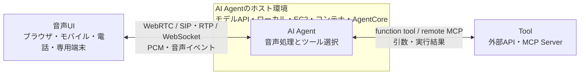

左側の矢印は音声経路、右側はツール経路です。AI Agent内の音声処理にはSpeech-to-SpeechとChained Voice Pipelineがあり、Agentアプリの実行場所は接続方式とは別に決めます。

## 音声UI別の接続方法

音声UIごとに、AI Agentまでの接続方法が変わります。Webブラウザ、モバイルアプリ、電話、専用端末の構成をToolまで含めて比べます。

| 音声UI | 音声の入口 | Agentまでの主な接続方法 | 例 |
|---|---|---|---|
| Webブラウザ | マイクとスピーカー | WebRTCで直接接続 | OpenAI Realtime WebRTC |
| モバイルアプリ | OSの音声API | WebRTC、またはバックエンド経由のWebSocket | OpenAI Realtime WebRTC、Gemini Live APIのクライアントSDK |
| 電話 | SIPとRTP | SIPで直接接続、またはPBXで終端してWebSocketへ中継 | OpenAI Realtime SIP、Asterisk |
| 専用端末・スピーカー | デバイスの音声SDK | PCMを音声ゲートウェイへ送り、WebSocketで接続 | 組み込みアプリと音声ゲートウェイ |

### Webブラウザ

ブラウザのマイクとスピーカーを使い、WebRTCでAI Agentへ直接接続します。

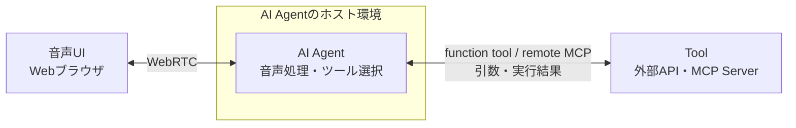

### モバイルアプリ

モバイルアプリからWebRTCで直接接続する方法と、アプリのバックエンドで音声を受けてWebSocketへ中継する方法があります。

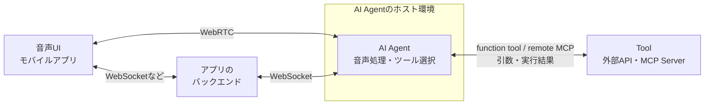

### 電話

音声モデルAPIがSIPを受けられる場合は電話を直接接続できます。PBXでSIPとRTPを終端し、PCMをWebSocketでAI Agentへ渡す構成もあります。

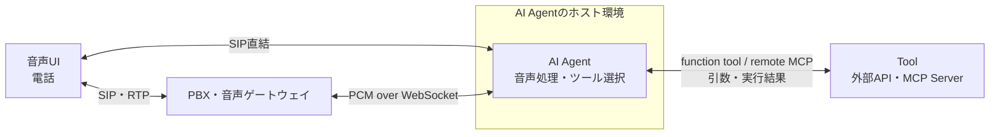

### 専用端末・スピーカー

端末の音声SDKからPCMを取り出し、デバイスアプリや音声ゲートウェイを経由してAI Agentへ送ります。

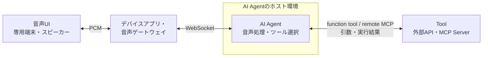

[OpenAI Realtimeの接続ガイド](https://developers.openai.com/api/docs/guides/realtime)は、ブラウザとモバイルにはWebRTC、サーバーが電話やメディアパイプラインから音声を受け取る構成にはWebSocket、電話の直結にはSIPを案内しています。すべての音声UIをWebSocketへ変換する必要はありません。

### 電話音声をAI Agentへ渡す方法

電話とAI Agentの間には、SIPを受ける仕組みと、通話音声をアプリへ渡す仕組みが必要です。選択肢には、音声モデルAPIへのSIP直結、PBXの外部メディア機能、マネージドな電話APIがあります。

| 方式 | 電話からAgentまでの経路 | 例 | アプリ側の担当 |
|---|---|---|---|
| 音声モデルAPIへSIP直結 | SIPトランク → 音声モデルAPI | ・[OpenAI Realtime SIP](https://developers.openai.com/api/docs/guides/realtime-sip) | SIPトランクの設定、通話制御イベント、ツール連携 |
| PBXの外部メディア機能 | 電話 → PBX → WebSocket、TCP、RTP | ・Asterisk `chan_websocket`<br>・Asterisk AudioSocket<br>・Asterisk ARI External Media | 選んだ方式に応じた音声フレーム、コーデック、送信タイミングの処理 |
| 電話APIのMedia Stream | 電話 → マネージド電話基盤 → WebSocket | ・[Twilio Bidirectional Media Streams](https://www.twilio.com/docs/voice/media-streams)<br>・[Telnyx Media Streaming](https://developers.telnyx.com/docs/voice/programmable-voice/media-streaming) | WebSocketイベント、指定された音声形式、再生バッファの制御 |

#### 音声モデルAPIへSIP直結

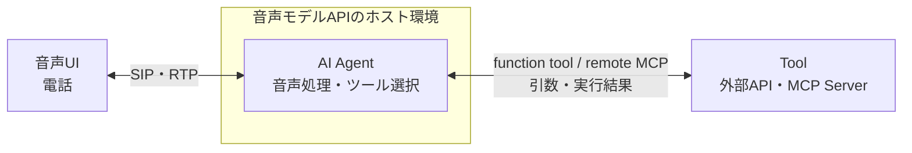

#### PBXの外部メディア機能

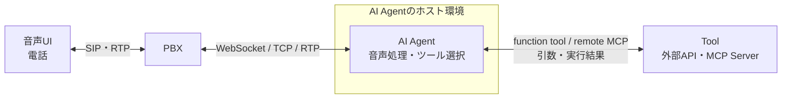

#### 電話APIのMedia Stream

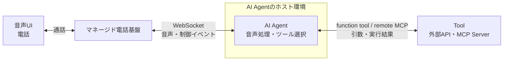

TwilioとTelnyxは、電話基盤側で通話を扱いながらWebSocketへ双方向に音声を流せます。自前のPBX運用を減らせる一方で、利用できるコーデック、リージョン、同時ストリーム数などはサービスの制約を受けます。

## 音声処理の2方式

[OpenAIのVoice agentsガイド](https://developers.openai.com/api/docs/guides/voice-agents)では、音声Agentを2つの方式に分けています。2方式の違いは、音声をどこでテキストへ変換するかです。

| 方式 | アプリから見える処理 | 向いている用途 |
|---|---|---|
| Speech-to-Speech | 1つの音声APIへ音声を送り、音声とツールイベントを受け取る | 低遅延、自然な会話、割り込み |
| Chained Voice Pipeline | STT、テキストAgent、TTSの各APIをアプリが順番につなぐ | 中間テキストの確認、既存Agentの再利用、承認を挟む処理 |

### Speech-to-Speech

利用者の音声を双方向のセッションへストリーミングし、同じセッションから回答音声とツールイベントを受け取ります。アプリケーションが毎ターンSTTとTTSを個別に呼ぶ必要はありません。

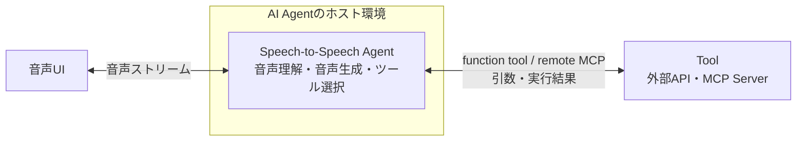

| サービス | API、モデル | 接続 | 日本語 |
|---|---|---|---|
| OpenAI | Realtime API、`gpt-realtime-2.1` | WebRTC、WebSocket、SIP | 今回のデモで日本語通話を検証 |
| Google | Gemini Live API | Stateful WebSocket、連携製品によるWebRTC | [公式の対応言語](https://ai.google.dev/gemini-api/docs/live-api/capabilities#supported-languages)に日本語あり |
| AWS | Amazon Bedrock、Nova 2 Sonic | Bidirectional Streaming API | 2026年7月時点の[公式言語一覧](https://docs.aws.amazon.com/ja_jp/nova/latest/nova2-userguide/sonic-language-support.html)に日本語なし |

音声とイベントが同時に流れるため、発話開始と終了、ツール実行、応答のキャンセル、再生済み音声の位置を管理します。OpenAI Realtimeでは、WebRTCまたはSIP接続時の未再生音声をサービス側が切り詰めます。WebSocket接続では、アプリが再生を止め、実際に再生した位置を`conversation.item.truncate`で通知します。

### Chained Voice Pipeline

STT、テキストAgent、TTSの3段階を、アプリケーションが明示的につなぎます。

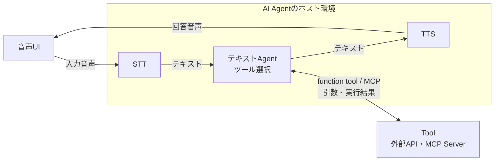

| 提供元 | STT API | テキストAgentのAPI、ライブラリ | TTS API |
|---|---|---|---|
| OpenAI | Transcription API | Responses API、Agents SDK（ライブラリ） | Speech API |
| AWS | Amazon Transcribe Streaming API | Amazon Bedrock ConverseStream API、Agentフレームワーク | Amazon Polly `StartSpeechSynthesisStream` |

AWSの組み合わせでは、Transcribeのストリーミング文字起こしとPollyの音声合成が日本語に対応しています。各段階を別のサービスへ差し替える構成も可能です。

既存のテキストAgentを再利用しやすく、文字起こしの確認やポリシーチェックを途中へ入れられます。発話が区切られるたびに各APIを通るため、Speech-to-Speechより待ち時間は増えます。

## ツール接続の2方式

どちらの方式でも、利用者の発話をもとにモデルがツールを選びます。違うのは、その先でツールへ接続し、実行結果をモデルへ戻す主体です。

| ツール接続方式 | 実行経路 | ツールを実行するもの | 自分で動かすもの |
|---|---|---|---|
| Function tool | Realtime → 自分のアプリ → APIまたはMCP | ブラウザ、モバイル、サーバー上の自分のコード | ツール実行コード。サーバーで動かす場合はAgent Runtimeも必要 |
| Remote MCP tool | Realtime → Remote MCP Server | OpenAI Realtime API | MCP Server。必要に応じて認証・設定用の薄いバックエンド |

### Function tool

[Realtimeのfunction calling](https://developers.openai.com/api/docs/guides/realtime-conversations#function-calling)では、Realtime APIがツール名と引数を生成します。自分のコードが引数を受け取り、APIやMCP Serverを呼び、`function_call_output`をRealtimeへ返します。

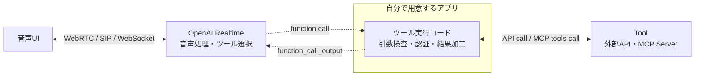

音声をWebSocketで中継する構成では、Agentアプリが音声経路にも入ります。WebRTCやSIPでRealtimeへ直接接続する構成では、Agentアプリはツール実行だけを担当します。

ツール実行コードはブラウザやモバイルアプリにも置けます。APIキー、閉域システム、独自の認可を扱う場合は、サーバーやAgent Runtimeへ置きます。Agentアプリ側で、引数検査、認証、承認、ログ、結果の加工を処理します。

今回のデモはFunction tool方式です。AgentCore上の`BidiAgent`がfunction callを受け取り、Python関数の内側からSORACOM Knowledge MCPの`tools/call`を実行します。MCPを使っていますが、Realtimeから見えるツールはfunction toolです。

### Remote MCP tool

[Realtime with tools](https://developers.openai.com/api/docs/guides/realtime-mcp)では、Remote MCP Serverの接続情報を`session.update`または`response.create`の`tools`へ設定します。Realtime API自身がMCP Clientとなり、ツール一覧の取得と`tools/call`を行います。

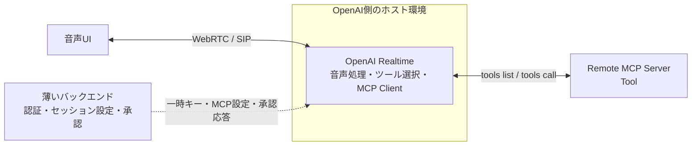

`tools`には、MCP Serverの場所と利用条件を指定します。

```json
{
  "type": "mcp",
  "server_label": "knowledge",
  "server_url": "https://example.com/mcp",
  "allowed_tools": ["search", "get_document"],
  "require_approval": "never"
}
```

Realtime APIが音声処理とMCP Clientを兼ねるため、音声とツールを中継する常駐Agentアプリは省けます。ブラウザやモバイルから直接接続する場合でも、一時キーの発行、`allowed_tools`の設定、MCP認証、承認イベント、利用者ごとの権限やログを扱うバックエンドは残ります。Remote MCP Server自体のホスティングも必要です。

### 方式の選び方

- 独自API、閉域システム、入力検査、独自の認可、結果加工、監査が必要ならFunction tool
- 既存のRemote MCP ServerへRealtimeから接続でき、アプリの中継コードを減らしたいならRemote MCP tool

:::message alert
Remote MCP Serverへ会話全体が自動送信されなくても、モデルがツール引数へ入れた情報は送信されます。認証情報や個人情報を音声入力からそのまま渡さず、`allowed_tools`で利用できるツールを絞ります。更新や送信を行うツールには`require_approval`で承認を求めます。
:::

## 参考資料

- [OpenAI Voice agents](https://developers.openai.com/api/docs/guides/voice-agents)
- [OpenAI Realtime and audio](https://developers.openai.com/api/docs/guides/realtime)
- [OpenAI Realtime API with WebRTC](https://developers.openai.com/api/docs/guides/realtime-webrtc)
- [OpenAI Realtime API with WebSocket](https://developers.openai.com/api/docs/guides/realtime-websocket)
- [OpenAI Realtime API with SIP](https://developers.openai.com/api/docs/guides/realtime-sip)
- [OpenAI Realtime conversations - Function calling](https://developers.openai.com/api/docs/guides/realtime-conversations#function-calling)
- [OpenAI Realtime with tools](https://developers.openai.com/api/docs/guides/realtime-mcp)
- [Twilio Media Streams](https://www.twilio.com/docs/voice/media-streams)
- [Telnyx Media Streaming](https://developers.telnyx.com/docs/voice/programmable-voice/media-streaming)
- [Gemini Live API capabilities](https://ai.google.dev/gemini-api/docs/live-api/capabilities)
- [Amazon Nova 2 Sonic - Getting started with speech-to-speech](https://docs.aws.amazon.com/nova/latest/nova2-userguide/sonic-getting-started.html)
- [Amazon Nova 2 Sonic - 言語サポート](https://docs.aws.amazon.com/ja_jp/nova/latest/nova2-userguide/sonic-language-support.html)
- [Amazon Transcribe - サポートされている言語](https://docs.aws.amazon.com/ja_jp/transcribe/latest/dg/supported-languages.html)
- [Amazon Polly - StartSpeechSynthesisStream](https://docs.aws.amazon.com/polly/latest/APIReference/API_StartSpeechSynthesisStream.html)
- [Asterisk WebSocket Channel Driver](https://docs.asterisk.org/Configuration/Channel-Drivers/WebSocket/)
- [Asterisk AudioSocket](https://docs.asterisk.org/Configuration/Channel-Drivers/AudioSocket/)
- [Model Context Protocol - Architecture overview](https://modelcontextprotocol.io/docs/learn/architecture)
- [Model Context Protocol - Tools](https://modelcontextprotocol.io/specification/2025-11-25/server/tools)
- [Amazon Bedrock AgentCore Runtime](https://docs.aws.amazon.com/bedrock-agentcore/latest/devguide/agents-tools-runtime.html)
- [Amazon Bedrock AgentCore - WebSocketによる双方向ストリーミング](https://docs.aws.amazon.com/bedrock-agentcore/latest/devguide/runtime-get-started-websocket.html)
- [SORACOM Knowledge MCPサーバーで利用できるツール](https://users.soracom.io/ja-jp/tools/soracom-knowledge-mcp-server/tools/)
