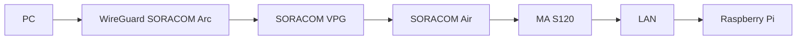

:::message
「[一般消費者が事業者の表示であることを判別することが困難である表示](https://www.caa.go.jp/policies/policy/representation/fair_labeling/guideline/assets/representation_cms216_230328_03.pdf)」の運用基準に基づく開示: この記事は記載の日付時点で[株式会社ソラコム](https://soracom.jp/)に所属する社員が執筆しました。ただし、個人としての投稿であり、株式会社ソラコムとしての正式な発言や見解ではありません。
:::

## やりたいこと
インターネットにアクセス可能なPCから、SORACOMとVPGのSIMベースルーティング機能を使って、MA-S120に接続されたLAN内の機器にLAN内のサブネットのIPアドレスを使ってアクセスします。
もう少し技術的な表現をすると、PC から WireGuard / SORACOM Arc を用いて SORACOM の VPG に接続し、VPG に収容された SORACOM Air（セルラー）側の経路を経由して、MA-S120 配下の Raspberry Pi に到達する構成を解説します。VPG を中核に据えることで、SIM（回線）を軸にした到達制御・セキュリティ制御・監視がしやすくなります。

## 構成


**アドレス情報:**
- Arc: 172.16.0.0/12
- SIM WAN: 172.16.0.0/12

## 役割（コンポーネント解説）
- PC:
  - 社内/自宅などから VPG へ WireGuard / SORACOM Arc でセキュア接続
  - 目的の Raspberry Pi 宛のトラフィックをトンネルへルーティング
- SORACOM VPG:
  - プライベートネットワークの中核。Arc/WireGuard の終端、Air セッションの収容点
  - SIM グループと紐付け、SIM ベースでの経路制御やアクセス制御を適用可能
- SORACOM Air (SIM):
  - セルラー経由で VPG に取り込まれる回線
  - MA-S120 のモバイル側セッションとして収容
- MA-S120:
  - LTE ルータ。セルラー（WAN）と LAN を中継
  - Raspberry Pi を収容し、ローカル側アドレス設計の要
- Raspberry Pi:
  - 到達対象のエッジ端末。固定 IP を推奨（例: 192.168.100.2/24、GW=192.168.10.1）

## そもそも
### VPGとは
https://users.soracom.io/ja-jp/docs/vpg/


### SIMベースルーティングとは
https://users.soracom.io/ja-jp/docs/vpg/sim-based-routing/

## 準備
### 必要なもの
- SORACOM アカウント
- SORACOM Air for セルラー SIM (グローバルSIM)
- MA-S120
- raspberry pi
- LANケーブル
- インターネットに接続可能な環境
- パソコン

### 事前実施済み作業
本記事では、以下の事前準備が完了していることを前提とします。
アクセスもとのPCのSORACOM ArcバーチャルSIMとSORACOM Air for セルラーSIMを同じグループに所属し、それぞれ通信ができる状態になっていることを確認してください。
- [ ] SORACOM アカウント作成

https://users.soracom.io/ja-jp/guides/getting-started/create-account/

- [ ] SORACOM Air for セルラー SIM (グローバルSIM) を購入

https://users.soracom.io/ja-jp/guides/getting-started/buy/

- [ ] 購入したSORACOM Air for セルラー SIMをSORACOMユーザーコンソールに登録

https://users.soracom.io/ja-jp/guides/getting-started/register-sim/

- [ ] SORACOM Arc バーチャルSIMを作成

https://users.soracom.io/ja-jp/docs/arc/create-virtual-sim/

- [ ] 対象 SIM（SORACOM Air）とバーチャルSIM（SORACOM Arc）をグループに所属

https://users.soracom.io/ja-jp/docs/group-configuration/configure-group/

- [ ] PC 側に WireGuard または SORACOM Arc クライアントが導入済み

https://users.soracom.io/ja-jp/docs/arc/soratun-overview/

- [ ] MA-S120 が SORACOM Air でモバイル接続できること

https://blog.soracom.com/ja-jp/2023/02/20/ma-s120-introduction/


## 手順

### 1. SORACOM 側の主にVPGの設定（VPG、Arc/WireGuard 設定、SIM グループ紐付けて SIM間通信まで確認する）

1. SORACOM ArcのvSIMとSORACOM AirのSIMを1回線ずつ用意して、同じグループに所属させます。
今回は「takao_D2D_test」というグループを作成しました。


1. type-FのVPGを作成します。


1. 適切な設定を選択してVPGを作成します。
インターネットゲートウェイ：今回の手順ではどちらでも問題ないです必要に応じて有効/無効を選択してください。
ランデブーポイント：SIMのサブスクリプションに応じて選択します。plan01s -> 最寄りの場所, planX3 -> フランクフルト
デバイスサブネットレンジ: 今回は172.16.0.0/12（クラスB）にしました。
ご自身のネットワーク設計に応じて適切な範囲を選択してください。


1. VPG建立


1. VPGにグループを紐づけます。


1. VPGとグループがひも付きました。

が、まだこのタイミングではSIMおよびvSIMはVPGに接続されていません。
IPアドレスが10.xx.xx.xxとなっていますが、一度セッションが切れて新たなセッションで接続される際にこのVPGに接続されて172.16.0.0/12となります。
SORACOMのセッションというのはVPGとのセッションと言っても過言ではないのです。

1. セッションを切ります。
チェックを入れて、

「操作」->「セッション切断」を選択します。


1. しばらくして、両方ともオンラインに復帰したらIPアドレスが更新されていることを確認しましょう。


1. SORACOM Arc の接続情報を更新しておきます。
SIM詳細のバーチャルSIMタブを開き、WireGuard設定をコピーします。

`Address =` の行から下をすべて更新します。


さらに、`AllowedIPs =` の行に `172.16.0.0/12`と、`192.168.100.0/24`を追加します。


1. PCのWireguardを接続してSORACOMに接続できることを確認します。
pong.soracom.ioにpingを飛ばしてみましょう。
```
takao@TakaonoMacBook-Pro ~ % ping pong.soracom.io
PING pong.soracom.io (100.127.100.127): 56 data bytes
64 bytes from 100.127.100.127: icmp_seq=0 ttl=64 time=253.293 ms
64 bytes from 100.127.100.127: icmp_seq=1 ttl=64 time=252.442 ms
64 bytes from 100.127.100.127: icmp_seq=2 ttl=64 time=260.202 ms
64 bytes from 100.127.100.127: icmp_seq=3 ttl=64 time=250.905 ms
64 bytes from 100.127.100.127: icmp_seq=4 ttl=64 time=266.012 ms
^C
--- pong.soracom.io ping statistics ---
5 packets transmitted, 5 packets received, 0.0% packet loss
round-trip min/avg/max/stddev = 250.905/256.571/266.012/5.696 ms
takao@TakaonoMacBook-Pro ~ % 

```

日本からフランクフルトまでの往復で250ms程度かかるようです。ルフトハンザもびっくりのスピードです。

この時点で、一度MA-S120のIPアドレスにpingを飛ばしてみましょう。
```
takao@TakaonoMacBook-Pro ~ % ping 172.29.220.112
PING 172.29.220.112 (172.29.220.112): 56 data bytes
Request timeout for icmp_seq 0
Request timeout for icmp_seq 1
Request timeout for icmp_seq 2
Request timeout for icmp_seq 3
^C
--- 172.29.220.112 ping statistics ---
5 packets transmitted, 0 packets received, 100.0% packet loss
takao@TakaonoMacBook-Pro ~ % 

```

返ってこないのが正解です。まだVPGのSIM間通信の機能がONになっていないからです。

1. VPGの設定に戻って、SIM間通信を有効にします。
「デバイスLAN設定」を開いて


1. 「SORACOM Gate C2D / D2Dを有効化する」をONにして保存します。


この状況でもう一度MA-S120にpingを飛ばしてみましょう。
```
takao@TakaonoMacBook-Pro ~ % ping 172.29.220.112
PING 172.29.220.112 (172.29.220.112): 56 data bytes
Request timeout for icmp_seq 0
64 bytes from 172.29.220.112: icmp_seq=0 ttl=255 time=1604.688 ms
64 bytes from 172.29.220.112: icmp_seq=1 ttl=255 time=604.462 ms
64 bytes from 172.29.220.112: icmp_seq=2 ttl=255 time=495.460 ms
64 bytes from 172.29.220.112: icmp_seq=3 ttl=255 time=550.525 ms
64 bytes from 172.29.220.112: icmp_seq=4 ttl=255 time=490.329 ms
64 bytes from 172.29.220.112: icmp_seq=5 ttl=255 time=496.360 ms
^C
--- 172.29.220.112 ping statistics ---
7 packets transmitted, 6 packets received, 14.3% packet loss
round-trip min/avg/max/stddev = 490.329/706.971/1604.688/403.507 ms
takao@TakaonoMacBook-Pro ~ % 
```
今度は返ってきました。

まずはここまででOKです。
ここからは一度MA-S120の設定に入ります。
この画面はまた戻ってくるので開いておきましょう。

### 2. MA-S120 の基本設定（APN、LAN 設計、必要に応じ静的ルート/NAT）
1. MA-S120 の下流にRaspberry Piを接続します。

1. Raspberry Pi のデスクトップからChromiumを起動して、MA-S120 の管理画面にアクセスします。
（この時点で、MA-S120のeth0は`192.168.253.253`(デフォルト), Raspberry Piのeth0はstaticに`192.168.253.250`となっているはずです。）

1. MA-S120のUI管理画面`https://192.168.253.253`にログインします。


1. 「Network関係」から「Ethernet設定」を開きます。
- ifup Method: Static
- IP Address: `192.168.100.1`
- Netmask: `255.255.255.0`
として、「即時反映」はOFFで「設定」をクリックします。


1. DHCPサーバーを設定します。
今回、Raspberry Pi にはDHCPでIPアドレスを払い出すことにします。
「Network関係」から「DHCPサーバー設定」を開きます。
- 設定するInterface: eth0
- リース範囲設定（開始アドレス）: `192.168.100.2`
- リース範囲設定（終了アドレス）: `192.168.100.254`
として、「eth0で有効」をONして「設定」をクリックします。
その後「起動」をクリックしてDHCPサーバーを起動します。

この時点ではまだDHCPサーバーは起動しておらず再起動によって起動します。

1. 再起動

電源マークをクリックして「REBOOT」をクリックします。


### 3. Raspberry Pi のネットワーク設定（IPアドレス / デフォルトゲートウェイの付与）

1. ラズベリーパイのEth0をDHCPに設定します。

IPアドレスが`192.168.100.x`になっていることを確認します。

今回の場合は`192.168.100.10`が払い出されました。
後で利用するのでMACアドレスを控えておきましょう。

1. Raspberry Pi に必ず192.168.100.10が割り当てられるように、MA-S120のDHCPサーバーでMACアドレスとIPアドレスの紐付けを行います。

1. PCにコンソールケーブルを接続します。

1. ターミナルソフトでシリアルコンソールに接続します。
macOSの場合
```
screen /dev/tty.usbserial-xxxx 115200
```

Windowsの場合
Tera Termなどのターミナルソフトで接続します。

1. rootでログインします。
ログイン後、`root@gemini:~#`という表示がされればOKです。

1. dnsmasqでRaspberry PiのMACアドレスとIPアドレスを紐付けます。
/etc/dnsmasq.confを適当なエディタで編集します。
最終行に以下の行を追加します。
```
dhcp-host=<Raspberry PiのMACアドレス>,192.168.100.100
```
MACアドレスは先ほど控えたものを利用してください。
PIアドレスは`192.168.100.100`にしましたが、`192.168.100.0/24`の範囲内であれば任意のアドレスを指定できます。

編集が済んだら保存して終了します。

1. dnsmasqを再起動します。
```
systemctl restart dnsmasq
```

特に応答はありません（エラーが出なければOK）。

1. raspberry piのIPアドレスが変化したか確認します。

さっきは`192.168.100.10`だったのが、`192.168.100.100`に変わっていますね。

### 4. SIMベースルーティングの設定と確認
1. SORACOM Arcを有効にしたPCからRaspberry Piにpingを飛ばしてみます。
```
takao@TakaonoMacBook-Pro ~ % ping 192.168.100.100
PING 192.168.100.100 (192.168.100.100): 56 data bytes
Request timeout for icmp_seq 0
Request timeout for icmp_seq 1
Request timeout for icmp_seq 2
Request timeout for icmp_seq 3
^C
--- 192.168.100.100 ping statistics ---
5 packets transmitted, 0 packets received, 100.0% packet loss
takao@TakaonoMacBook-Pro ~ % 
```
返ってこないのが正解です。VPGのSIM間通信は有効になっていますがSIMベースルーティングが有効になっていないからです。

1. VPGの設定に戻って、SIMベースルーティングを有効にします。
「デバイスLAN設定」を開いて、

「SIMベースルーティング」の設定をしていきます。

1. ルーティング設定の「追加」をクリックします。


1. 表示された入力欄にIPアドレスレンジとSIMを指定します。
IPアドレスレンジ: `192.168.100.0/24`
SIM: 先ほどMA-S120に挿入したSORACOM AirのSIMを指定します。

左下の保存ボタンをクリックします。

1. SIMベースルーティングを有効にします。

このあと、一度SORACOM AirとSORACOM Arcの両方のセッションを切断して再接続します。


この時点でSORACOM ArcのPCからRaspberry Piにpingを飛ばしてみましょう。
```
takao@TakaonoMacBook-Pro ~ % ping 192.168.100.100
PING 192.168.100.100 (192.168.100.100): 56 data bytes
Request timeout for icmp_seq 0
Request timeout for icmp_seq 1
Request timeout for icmp_seq 2
Request timeout for icmp_seq 3
Request timeout for icmp_seq 4
Request timeout for icmp_seq 5
Request timeout for icmp_seq 6
^C
--- 192.168.100.100 ping statistics ---
8 packets transmitted, 0 packets received, 100.0% packet loss
takao@TakaonoMacBook-Pro ~ % 

```
まだ通りませんね。おそらくMA-S120がこのパケットを処理できていないためです。

1. MA-S120のiptablesにルーティング設定を追加します。
webUIの「Network関係」->「Firewall設定」-> 「Filter設定」を開きます。
以下のように
In Zone: WAN
Out Zone: LAN
Service: ICMP
Protocol: Select by Service
Action: ACCEPT
を設定して「追加」をクリックします。

設定が完了すると以下の様になっているはずです。


1. 満を持して、もう一度PCからRaspberry Piにpingを飛ばしてみます。
```
takao@TakaonoMacBook-Pro ~ % ping 192.168.100.100
PING 192.168.100.100 (192.168.100.100): 56 data bytes
Request timeout for icmp_seq 0
64 bytes from 192.168.100.100: icmp_seq=0 ttl=62 time=1356.979 ms
64 bytes from 192.168.100.100: icmp_seq=1 ttl=62 time=491.483 ms
64 bytes from 192.168.100.100: icmp_seq=2 ttl=62 time=506.034 ms
64 bytes from 192.168.100.100: icmp_seq=3 ttl=62 time=500.845 ms
64 bytes from 192.168.100.100: icmp_seq=4 ttl=62 time=496.157 ms
64 bytes from 192.168.100.100: icmp_seq=5 ttl=62 time=491.567 ms
^C
--- 192.168.100.100 ping statistics ---
7 packets transmitted, 6 packets received, 14.3% packet loss
round-trip min/avg/max/stddev = 491.483/640.511/1356.979/320.455 ms
takao@TakaonoMacBook-Pro ~ % 
```

通りました。おめでとうございます。

あとは、必要なプロトコルを通すようにMA-S120のiptablesを設定していけばOKです。
例えばRaspberry Piでwebサーバーを立てているならば、HTTPを通すようにしたり、raspberry piにSSHでログインしたいならばSSHを通すようにしたりという感じです。
こんな具合にすると、


192.168.100.100でRaspberry PiにSSHでログインできるようになったり、


http://192.168.100.100 のwebサーバーにアクセスできるようになります（Apache2を起動しておいた場合）。


### 5. NATの設定（Advanced）
SORACOM ArcからRaspberry Piにアクセスできるようになりましたが、Raspberry PiからSORACOM Arcへの通信はどうでしょうか？
ArcのIPアドレスに対してpingを飛ばしてみましょう。

とおります。

このときのPC側で受信したPINGのパケットを見てみましょう。

PC側では以下のコマンドを起動しておきます。
```
sudo tcpdump -ni utun4 'icmp'
```
utun4というのがSORACOM Arcのインターフェースです。環境によって異なるので`ifconfig`で確認してください.
ここに流入するICMPパケットをキャプチャします。


raspberry pi 側からpingを飛ばします。


なんと、SORACOM Arc のPC側で受信したソースIPアドレスが`172.29.220.112`となっています。
これは、MA-S120のppp0インターフェースのIPアドレスです。
したがって、Raspberry PiからのパケットはMA-S120を経由してVPGに到達しますが、VPGから見ると送信元IPアドレスがMA-S120のIPアドレスに変換されています。

SIMベースルーティングを使うシチュエーションでは、MA-S120の下にあるRaspberry Piなどのエッジ端末からVPGに接続している別の端末に対して、ソースIPアドレスをローカルIPアドレスに変換したい場合があります。

このときは、MA-S120のNAT設定を変更します。
閉域で利用する前提で、MA-S120のppp0インターフェースから外部に出るパケットのソースIPアドレスがNATされないように設定します。
コンソールで以下のコマンドを実行します。
```
iptables -t nat -D POSTROUTING -o ppp0 -j MASQUERADE
```

:::message alert
本番運用では特定の宛先のみNATしないようにするほうが望ましいです。
その場合は以下のようなコマンドを用いましょう


```
# 例: 192.0.2.0/24 あては NAT しない
sudo iptables -t nat -I POSTROUTING 1 -o ppp0 -d 192.0.2.0/24 -j RETURN
# 既存の汎用 MASQUERADE は最後に残す
```

または、または一度ルールを作り直して条件付きにする方法：
```
sudo iptables -t nat -D POSTROUTING -o ppp0 -j MASQUERADE
sudo iptables -t nat -A POSTROUTING -o ppp0 '!' -d 192.0.2.0/24 -j MASQUERADE
```
といった具合に

:::

以下のコマンドで設定を永続化します。
```
sudo iptables-save | sudo tee /etc/iptables/rules-save
```

この状態でraspberry piからpingを飛ばしてみましょう。

以下のように、SORACOM ArcのPC側で受信したソースIPアドレスが`192.168.100.100`に変わっていればOKです。


お疲れ様でした！

## appendix

### 初期状態のMA-S120の設定

```
Ubuntu 22.04.5 LTS gemini ttyS0

gemini login: root  
Password: 
Welcome to Ubuntu 22.04.5 LTS (GNU/Linux 5.15.105 armv7l)

 * Documentation:  https://help.ubuntu.com
 * Management:     https://landscape.canonical.com
 * Support:        https://ubuntu.com/pro

The programs included with the Ubuntu system are free software;
the exact distribution terms for each program are described in the
individual files in /usr/share/doc/*/copyright.

Ubuntu comes with ABSOLUTELY NO WARRANTY, to the extent permitted by
applicable law.

root@gemini:~# ifconfig
eth0: flags=4163<UP,BROADCAST,RUNNING,MULTICAST>  mtu 1500
        inet 192.168.253.253  netmask 255.255.255.0  broadcast 192.168.253.255
        inet6 fe80::280:6dff:fea3:7b6  prefixlen 64  scopeid 0x20<link>
        ether 00:80:6d:a3:07:b6  txqueuelen 1000  (Ethernet)
        RX packets 5  bytes 1615 (1.6 KB)
        RX errors 0  dropped 0  overruns 0  frame 0
        TX packets 9  bytes 762 (762.0 B)
        TX errors 0  dropped 0 overruns 0  carrier 0  collisions 0
        device interrupt 27  base 0x8000  

lo: flags=73<UP,LOOPBACK,RUNNING>  mtu 65536
        inet 127.0.0.1  netmask 255.0.0.0
        inet6 ::1  prefixlen 128  scopeid 0x10<host>
        loop  txqueuelen 1000  (Local Loopback)
        RX packets 39  bytes 2940 (2.9 KB)
        RX errors 0  dropped 0  overruns 0  frame 0
        TX packets 39  bytes 2940 (2.9 KB)
        TX errors 0  dropped 0 overruns 0  carrier 0  collisions 0

root@gemini:~# 
```

ルーティング関連
```
root@gemini:~# sysctl net.ipv4.ip_forward
net.ipv4.ip_forward = 1
root@gemini:~# sudo iptables -S FORWARD
-P FORWARD DROP
-A FORWARD -m conntrack --ctstate ESTABLISHED -j ACCEPT
-A FORWARD -p icmp -j icmp-routing
-A FORWARD -i eth0 -j ACCEPT
-A FORWARD -i br0 -j ACCEPT
-A FORWARD -i ppp100 -j ACCEPT
-A FORWARD -o eth0 -j ACCEPT
-A FORWARD -o br0 -j ACCEPT
-A FORWARD -o ppp100 -j ACCEPT
-A FORWARD -i ppp0 -j logdrop-0
-A FORWARD -i ppp1 -j logdrop-0
-A FORWARD -i usb0 -j logdrop-0
-A FORWARD -i wlan0 -j logdrop-0
-A FORWARD -i eth1 -j ACCEPT
-A FORWARD -i wg+ -j ACCEPT
-A FORWARD -i wlisc -j ACCEPT
-A FORWARD -o eth1 -j ACCEPT
-A FORWARD -o wg+ -j ACCEPT
-A FORWARD -o wlisc -j ACCEPT
root@gemini:~# sudo iptables -L FORWARD -n -v
Chain FORWARD (policy DROP 0 packets, 0 bytes)
 pkts bytes target     prot opt in     out     source               destination         
    0     0 ACCEPT     all  --  *      *       0.0.0.0/0            0.0.0.0/0            ctstate ESTABLISHED
    0     0 icmp-routing  icmp --  *      *       0.0.0.0/0            0.0.0.0/0           
    0     0 ACCEPT     all  --  eth0   *       0.0.0.0/0            0.0.0.0/0           
    0     0 ACCEPT     all  --  br0    *       0.0.0.0/0            0.0.0.0/0           
    0     0 ACCEPT     all  --  ppp100 *       0.0.0.0/0            0.0.0.0/0           
    0     0 ACCEPT     all  --  *      eth0    0.0.0.0/0            0.0.0.0/0           
    0     0 ACCEPT     all  --  *      br0     0.0.0.0/0            0.0.0.0/0           
    0     0 ACCEPT     all  --  *      ppp100  0.0.0.0/0            0.0.0.0/0           
    0     0 logdrop-0  all  --  ppp0   *       0.0.0.0/0            0.0.0.0/0           
    0     0 logdrop-0  all  --  ppp1   *       0.0.0.0/0            0.0.0.0/0           
    0     0 logdrop-0  all  --  usb0   *       0.0.0.0/0            0.0.0.0/0           
    0     0 logdrop-0  all  --  wlan0  *       0.0.0.0/0            0.0.0.0/0           
    0     0 ACCEPT     all  --  eth1   *       0.0.0.0/0            0.0.0.0/0           
    0     0 ACCEPT     all  --  wg+    *       0.0.0.0/0            0.0.0.0/0           
    0     0 ACCEPT     all  --  wlisc  *       0.0.0.0/0            0.0.0.0/0           
    0     0 ACCEPT     all  --  *      eth1    0.0.0.0/0            0.0.0.0/0           
    0     0 ACCEPT     all  --  *      wg+     0.0.0.0/0            0.0.0.0/0           
    0     0 ACCEPT     all  --  *      wlisc   0.0.0.0/0            0.0.0.0/0           
root@gemini:~# sysctl net.ipv4.conf.all.rp_filter
net.ipv4.conf.all.rp_filter = 2
```

NAT設定
```
root@gemini:~# iptables -t nat -S
-P PREROUTING ACCEPT
-P INPUT ACCEPT
-P OUTPUT ACCEPT
-P POSTROUTING ACCEPT
-N awall-masquerade
-A POSTROUTING -o ppp0 -j MASQUERADE
-A POSTROUTING -o ppp1 -j MASQUERADE
-A POSTROUTING -o usb0 -j MASQUERADE
-A POSTROUTING -o wlan0 -j MASQUERADE
-A POSTROUTING -o eth1 -j MASQUERADE
-A POSTROUTING -o wg+ -j MASQUERADE
-A POSTROUTING -o wlisc -j MASQUERADE
-A POSTROUTING -m set --match-set awall-masquerade src -j awall-masquerade
-A awall-masquerade -m set ! --match-set awall-masquerade dst -j MASQUERADE
root@gemini:~# 
```

