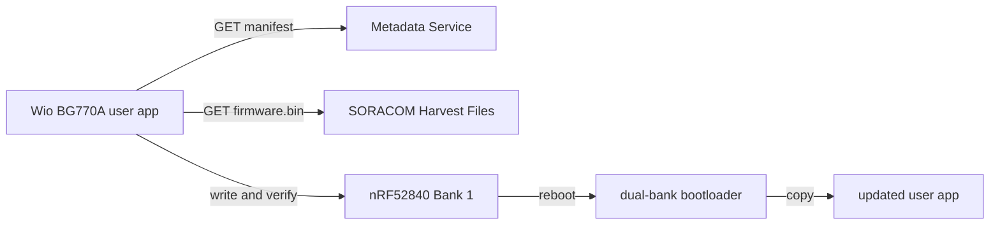

:::message
「[一般消費者が事業者の表示であることを判別することが困難である表示](https://www.caa.go.jp/policies/policy/representation/fair_labeling/guideline/assets/representation_cms216_230328_03.pdf)」の運用基準に基づく開示: この記事は記載の日付時点で[株式会社ソラコム](https://soracom.jp/)に所属する社員が執筆しました。ただし、個人としての投稿であり、株式会社ソラコムとしての正式な発言や見解ではありません。
:::

:::message alert
ここで構成するOTAは検証用のPoC（概念実証）です。電子署名の検証とアンチロールバック保護は未実装であり、そのまま本番用途に流用しないでください。
:::

## はじめに

`WioOtaAgent`は、Wio BG770Aの既存アプリケーションへLTE OTA（Over-The-Air）更新を追加するためのライブラリです。SORACOMメタデータサービスから更新情報を取得し、SORACOM Harvest Filesからファームウェアをダウンロードして、dual-bank bootloaderへ引き渡すまでを担当します。

この記事では、[WioCellular 0.3.15の`cellular-status`サンプル](https://github.com/SeeedJP/wio_cellular/tree/0.3.15/examples/cellular/cellular-status)への組み込みから、SORACOM経由での配信までを試します。

記事中の`ota_v1`と`ota_v2`は、このチュートリアルにおける「現在のアプリ」と「更新先のアプリ」を区別する名前です。Wio BG770Aのハードウェア版やbootloader版を示すものではありません。

## ライブラリが担当する範囲



| ライブラリ | 役割 |
|---|---|
| `WioOtaAgent` | manifest取得、アプリ側の判定コールバック呼び出し、更新フロー全体の制御 |
| `WioBg770aHttp` | BG770AのHTTPクライアントを使用し、大容量の応答をモデム内UFS経由で読み取る |
| `WioOta` | Bank 1の消去・書き込み、CRC16/SHA-256/vector tableの検証、bootloaderへの登録 |

HTTPボディをUART越しに直接ストリーミングすると受信が追いつかなかったため、BG770AのUFSにHTTP応答を保存し、512バイトごとに読み出してnRF52840のBank 1へ書き込む構成を採っています。

LTE接続や更新の運用方針は、ライブラリではなくユーザーアプリケーションが担当します。

| ユーザーアプリケーションが決めること | 例 |
|---|---|
| OTA確認を行うタイミング | 起動時、1日1回、メンテナンス時間帯 |
| 更新対象かどうか | バージョン番号、リリースID、端末グループ |
| その場で適用できるか | バッテリー残量、センサー処理、利用中かどうか |
| 更新後の通信設定 | LTE再接続、PSMへの復帰、結果通知 |

この分担により、ライブラリを使うために既存アプリケーション全体を置き換える必要はありません。

## 動作環境と前提条件

検証に用いた環境です。

- Wio BG770A HW v1.0
- SoftDevice S140 7.3.0
- dual-bank対応bootloader
- SORACOM IoT SIM
- PlatformIO
- WioCellular 0.3.15
- ArduinoJson 7.0.4

ビルドと実機検証は2026年8月30日に行いました。

HW v1.1は今回の検証対象外です。

### bootloaderを確認する

このライブラリは、SoftDevice S140 7.3.0を含むWio BG770A向けdual-bank bootloaderを前提にしています。導入済みか分からない場合は、次の手順で確認します。

1. Wio BG770AのRESETボタンを素早く2回押してDFUモードへ入る
2. USBドライブ`BOOT`がマウントされたことを確認する
3. `BOOT/INFO_UF2.TXT`を開き、bootloaderが0.9.1系、SoftDeviceが`S140 7.3.0`であることを確認する

検証機では次の内容を確認しました。

```text
UF2 Bootloader 0.9.1-33-g3cb5c65-dirty
Model: Seeed Wio BG770A
Board-ID: nRF52840-WioBG770A-v1
SoftDevice: S140 7.3.0
```

本記事で使用するSeeedJP Arduino Coreは、Wio BG770Aの最大アプリケーションサイズをdual-bank用の397,312バイトに設定しています。確認できない場合は、[Wio BG770Aユーザーマニュアル](https://seeedjp.github.io/Wiki/Wio_BG770A/user-manual.html)に従ってArduino IDEへSeeed K.K.のnRF52ボード定義を追加し、次の設定で「ブートローダを書き込む」を実行します。

- ボード: `Seeed Wio BG770A`
- Board Version: `1.0`
- SoftDevice: `S140 7.3.0`
- Programmer: `Bootloader DFU for Bluefruit nRF52`

この操作はUSB Serial DFUでbootloaderとSoftDeviceを更新します。現在のアプリケーション領域は消去されるため、完了後にOTA対応アプリケーションを書き込んでください。書き込み中はUSBケーブルを抜かないでください。実際のDFUコマンドは[SeeedJP Arduino Coreの`programmers.txt`](https://github.com/SeeedJP/Adafruit_nRF52_Arduino/blob/514f28ee405952ecc58558b5e0608a2b63d9901a/programmers.txt#L23-L30)で確認できます。

dual-bankレイアウトの制約上、ユーザーアプリケーションは最大397,312バイトです。`platformio.ini`で次の設定を必ず追加してください。

```ini
board_upload.maximum_size = 397312
```

また、本手順では簡略化のためSIMグループのPSMを無効化します。本番環境でPSMを使う場合は、detach、PSM無効化、reattach、OTA実行、元の電源ポリシーへの復帰を明示的に管理してください。

## 既存アプリへライブラリを追加する

検証中の実装は、`SeeedJP/wio_cellular`をフォークした次のリポジトリで公開しています。

- [Wio BG770A LTE OTA実装一式](https://github.com/takao2704/wio_cellular/tree/09f9721136bce9703ce1ae6a93191a8a91add533/extras/lte-ota-agent)
- [`cellular-status-ota`サンプル](https://github.com/takao2704/wio_cellular/tree/09f9721136bce9703ce1ae6a93191a8a91add533/extras/lte-ota-agent/examples/cellular-status-ota)
- [`WioOtaAgent`](https://github.com/takao2704/wio_cellular/tree/09f9721136bce9703ce1ae6a93191a8a91add533/extras/lte-ota-agent/lib/WioOtaAgent)
- [`WioBg770aHttp`](https://github.com/takao2704/wio_cellular/tree/09f9721136bce9703ce1ae6a93191a8a91add533/extras/lte-ota-agent/lib/WioBg770aHttp)
- [`WioOta`](https://github.com/takao2704/wio_cellular/tree/09f9721136bce9703ce1ae6a93191a8a91add533/extras/lte-ota-agent/lib/WioOta)

### 既存プロジェクトへコピーして使う

`lib/WioOta`、`lib/WioBg770aHttp`、`lib/WioOtaAgent`の3ディレクトリを、組み込み先PlatformIOプロジェクトの`lib`へコピーします。

```text
your-project/
├── lib/
│   ├── WioOta/
│   ├── WioBg770aHttp/
│   └── WioOtaAgent/
├── platformio.ini
└── src/
    └── main.cpp
```

この構成ではPlatformIOが`lib`を自動検出するため、`lib_extra_dirs`は不要です。

### リポジトリ内のサンプルを直接ビルドする

記事と同じ状態を取得するには、ブランチを指定してcloneし、実装ディレクトリへ移動します。

```bash
git clone --branch codex/lte-ota-agent https://github.com/takao2704/wio_cellular.git
cd wio_cellular/extras/lte-ota-agent
```

以降は、このディレクトリをリポジトリルートとしてコマンドを実行します。

```text
examples/cellular-status-ota/
├── platformio.ini
└── src/
    └── main.cpp
```

このサンプルだけは`examples/cellular-status-ota`からリポジトリ直下の`lib`を参照するため、`platformio.ini`に`lib_extra_dirs = ../../lib`を指定しています。

### `platformio.ini`

:::details platformio.ini 全文

```ini
[platformio]
src_dir = src

[env]
platform = https://github.com/SeeedJP/platform-nordicnrf52.git#8f55ff26c0822ffcbff978be1fddfb8c88c57577
platform_packages =
    framework-arduinoadafruitnrf52 @ https://github.com/SeeedJP/Adafruit_nRF52_Arduino.git#514f28ee405952ecc58558b5e0608a2b63d9901a
framework = arduino
board = seeed_wio_bg770a
board_upload.maximum_size = 397312
monitor_speed = 115200
build_flags =
    -DBOARD_VERSION_1_0
    -DCFG_LOGGER=0
lib_archive = no
lib_extra_dirs = ../../lib
lib_deps =
    seeedjp/WioCellular@0.3.15
    bblanchon/ArduinoJson@7.0.4

[env:ota_v1]
build_flags =
    ${env.build_flags}
    -DAPP_VERSION=1

[env:ota_v2]
build_flags =
    ${env.build_flags}
    -DAPP_VERSION=2
```

:::

これは既存のセルラー通信サンプルを流用したものです。`ota_v1`を現在のアプリ、`ota_v2`を更新先として、同じソースをビルドフラグだけで切り替えます。実際の製品では、この番号の代わりに既存のリリース番号やリリースIDを使用できます。

### 既存サンプルへの追加コード

ベースとなる既存サンプルに、OTAヘッダ、判定コールバック、進捗報告、Agent設定、通信確立後の`checkOta()`呼び出しを追加します。

```cpp
#include <WioOtaAgent.h>

wio_ota_agent::Decision decideUpdate(
    const wio_ota_agent::Manifest& manifest) {
  return manifest.version > APP_VERSION
             ? wio_ota_agent::Decision::kApply
             : wio_ota_agent::Decision::kNoUpdate;
}

void reportProgress(size_t received, size_t total) {
  if ((received % (16 * 1024)) == 0 || received == total) {
    Serial.printf("[OTA] progress %u/%u\n",
                  static_cast<unsigned>(received),
                  static_cast<unsigned>(total));
  }
}

wio_ota_agent::Result checkOta() {
  wio_ota_agent::Config config;
  config.target_hardware = "wio-bg770a-v1.0";
  config.manifest_host = "metadata.soracom.io";
  config.manifest_path = "/v1/userdata";
  config.allowed_firmware_host = "harvest-files.soracom.io";
  config.pdp_context_id = WioNetwork.config.pdpContextId;

  static wio_ota_agent::Agent agent{WioCellular, config, &Serial};
  return agent.check(decideUpdate, reportProgress);
}
```

通信が利用可能になったら`checkOta()`を一度呼びます。

```cpp
const auto result = checkOta();
```

判定コールバックはアプリケーション側の責務です。互換性のないリリースを拒否したり、電圧低下や作業中の場合に延期したり、検証のみ実行したり、即座に反映したりする判断を行えます。たとえば、端末の状態によって延期できます。

```cpp
if (batteryVoltageTooLow() || userApplicationIsBusy()) {
  return wio_ota_agent::Decision::kDefer;
}
```

`APP_VERSION`は本サンプルの方針であり、ライブラリとして必須ではありません。Git commit IDや不揮発メモリに保存した適用済みリリースIDなど、別のポリシーも採用できます。

| `Decision` | ライブラリの動作 |
|---|---|
| `kReject` | 対象外のmanifestとしてダウンロードしない |
| `kNoUpdate` | 更新なしとしてダウンロードしない |
| `kDefer` | 更新を延期し、現在のアプリケーションを継続する |
| `kDownloadAndVerify` | Bank 1へ保存・検証するが、更新は反映しない |
| `kApply` | 保存・検証後にbootloaderへ登録して再起動する |

## 手順1: 更新前と更新後のアプリをビルドする

リポジトリルートから次を実行します。

```bash
pio run -d examples/cellular-status-ota -e ota_v1 -e ota_v2
```

両方の環境でビルドが成功し、生成されるイメージは129,084バイトでした。これは397,312バイトの上限内に収まっています。

```text
Environment    Status
-------------  --------
ota_v1         SUCCESS
ota_v2         SUCCESS

Flash: [===       ] 32.5% (used 129084 bytes from 397312 bytes)
```

## 手順2: `firmware.bin`とmanifestの生成

リポジトリ付属のツールで、PlatformIOの`firmware.zip`から生バイナリとmanifestファイルを作成します。

**現在のアプリ（`ota_v1`）:**

```bash
python3 tools/firmware_manifest.py \
  examples/cellular-status-ota/.pio/build/ota_v1/firmware.zip \
  --version 1 \
  --url http://harvest-files.soracom.io/wio-bg770a/ota-example/v1/firmware.bin \
  --output dist/ota-example/v1/manifest.json \
  --firmware-output dist/ota-example/v1/firmware.bin
```

**更新先のアプリ（`ota_v2`）:**

```bash
python3 tools/firmware_manifest.py \
  examples/cellular-status-ota/.pio/build/ota_v2/firmware.zip \
  --version 2 \
  --url http://harvest-files.soracom.io/wio-bg770a/ota-example/v2/firmware.bin \
  --output dist/ota-example/v2/manifest.json \
  --firmware-output dist/ota-example/v2/firmware.bin
```

生成された更新先のmanifestです。`version`はライブラリが自動比較する値ではなく、ユーザーアプリケーションの判定コールバックへ渡されます。

```json
{
  "format": 1,
  "hardware": "wio-bg770a-v1.0",
  "version": 2,
  "url": "http://harvest-files.soracom.io/wio-bg770a/ota-example/v2/firmware.bin",
  "size": 129084,
  "crc16": "2f4f",
  "sha256": "25968e40476c60548cdc9ddab54c905ccf946005d3b286c778b9cd4fff2b2b74"
}
```

バイナリの整合性を別途確認できます。

```bash
shasum -a 256 dist/ota-example/v2/firmware.bin
wc -c dist/ota-example/v2/firmware.bin
```

## 手順3: SORACOM設定

SORACOM User Consoleの「SIM 管理」で対象SIMを確認し、「グループ」列のグループ名をクリックしてSIMグループ画面を開きます。以降の設定はSIMではなく、SIMが所属するグループへ保存されます。

### メタデータサービス

1. 「SORACOM Air for セルラー設定」を開く
2. 「メタデータサービス」を`ON`にする
3. 「読み取り専用」を`ON`にする
4. 「ユーザーデータ」に`dist/ota-example/v1/manifest.json`の内容を貼り付ける
5. 「JSON形式で保存」を`ON`にする
6. 「保存」をクリックする

OTA Agentは`GET /v1/userdata`だけを使用するため、「読み取り専用」を`ON`にしたまま動作します。「許可するオリジン」はブラウザからHTTPSでアクセスする場合の設定であり、本サンプルでは空欄のままです。


### PSM

同じ「SORACOM Air for セルラー設定」で「PSM タイマー設定」を無効（未設定）にします。本サンプルは起動直後にOTA確認を行うため、チュートリアルではPSM復帰処理を省略しています。変更した場合は「保存」をクリックします。


### SORACOM Harvest Files

1. SIMグループ画面で「SORACOM Harvest Files 設定」を開く
2. スイッチを`ON`にする
3. 「デフォルトパス」は空欄のままにする
4. 「保存」をクリックし、確認画面で「OK」をクリックする

本サンプルはmanifestに完全なファイルパスを持つため、「デフォルトパス」は使用しません。


:::message alert
SORACOM Harvest Filesは利用料が発生します。検証後に不要となったファイルは削除し、最新の料金を公式ページで確認してください。
:::

- https://users.soracom.io/ja-jp/docs/harvest/files-download/
- https://soracom.jp/services/harvest/

SORACOM User Consoleから生バイナリをアップロードします。

| ローカルファイル | Harvest Filesパス |
|---|---|
| `dist/ota-example/v1/firmware.bin` | `/wio-bg770a/ota-example/v1/firmware.bin` |
| `dist/ota-example/v2/firmware.bin` | `/wio-bg770a/ota-example/v2/firmware.bin` |

manifestが示すバイナリを固定で参照できるよう、バージョンごとに変更しないパスを使います。

最初はメタデータサービスのユーザーデータへ`dist/ota-example/v1/manifest.json`を設定してください。更新先のmanifestを先に入れると、最初のOTA確認で更新が始まります。

## 手順4: USBで最初のOTA対応アプリケーションを書き込む

チュートリアルでUSB書き込みが必要なのはこの一度だけです。

```bash
pio run -d examples/cellular-status-ota -e ota_v1 -t upload
```

失敗した場合はRESETをダブルクリックしてDFUモードに入り、再実行してください。

シリアルモニタは115200 bpsで開きます。

```bash
pio device monitor --baud 115200
```

### 更新前の動作を確認する

現在のアプリと同じversionのmanifestを取得すると、判定コールバックは`kNoUpdate`を返します。OTA確認後も既存アプリケーションが通常のメインループへ戻ることを確認してください。

メタデータサービスへversion 1のmanifestを設定し、USBで`ota_v1`を書き込んだ直後のログです。manifestをHTTP 200で取得し、更新なしと判定した後もversion 1のアプリケーションが動作し続けることを確認しました。

```text
[HTTP] manifest status=200 length=237
[OTA] application reports no update
[OTA] result=no update
```

## 手順5: 更新先のmanifestへ切り替える

メタデータサービスのユーザーデータを`dist/ota-example/v2/manifest.json`の内容に差し替えます。

本サンプルでは起動時に一度だけ`Agent::check()`を呼びます。manifest変更後はWio BG770A本体の電源を入れ直してください。RESETボタンはnRF52840をリセットしますが、セルラーモジュールの状態は残る場合があります。再現試験では、Wio BG770A全体の電源を入れ直します。

更新シーケンスです。

1. Metadata Serviceからmanifest取得
2. アプリケーションがmanifestを更新対象と判定
3. Harvest Filesから129,084バイトの`firmware.bin`をダウンロード
4. HTTP応答をBG770A UFSに保存
5. 512バイトブロックでBank 1へ書き込み
6. size/CRC16/SHA-256/vector tableを検証
7. BG770Aを停止し、bootloader settingsにBank 1を登録
8. nRF52840をリセット
9. bootloaderが更新先のアプリをBank 0へコピー

### 掲載手順どおりにOTAを実行した結果

2026年8月30日、Wio BG770A HW v1.0で`ota_v1`から`ota_v2`への更新を実行しました。固定IPアドレスではなく、掲載コードと同じ`metadata.soracom.io`および`harvest-files.soracom.io`を使用しています。

メタデータサービスをversion 2のmanifestへ差し替え、Wio BG770A全体の電源を入れ直すと、129,084バイトのダウンロードと検証が完了し、bootloaderへ引き渡されました。

```text
[HTTP] manifest status=200 length=237
[OTA] downloading version=2 size=129084
[HTTP] firmware status=200 length=129084
[OTA] progress 129084/129084
[OTA] image verified
[OTA] activated; rebooting
```

USBの再接続後、更新されたアプリケーションは同じversion 2のmanifestを取得し、更新なしと判定しました。version 2のメインループが継続していることも確認できました。

```text
[HTTP] manifest status=200 length=237
[OTA] application reports no update
[OTA] result=no update
[APP] version=2 uptime=100
```

| 確認項目 | 結果 |
|---|---|
| Metadata Serviceからのmanifest取得 | HTTP 200で取得 |
| Harvest Filesからのファームウェア取得 | 129,084バイトを取得 |
| BG770A UFSからBank 1への転送 | 512バイト単位で完了 |
| イメージ検証 | size、CRC16、SHA-256、vector tableが一致 |
| bootloaderへの引き渡し | Bank 1登録後に再起動 |
| 更新後のアプリケーション起動 | version 2でLTEへ再接続し、同じmanifestを更新なしと判定 |

更新先にも`WioOtaAgent`を組み込むことで、更新後のアプリケーションから次回以降のOTA確認を継続できます。

## 定期的な更新確認を行う場合

サンプルでは起動時に一度だけ`Agent::check()`を呼びます。製品アプリケーションでは1日1回など定期的に実行し、失敗または延期時だけ再試行間隔を短くできます。

次の定義を`main.cpp`の無名namespace内へ追加します。時刻比較は`millis()`のオーバーフローを考慮しています。

```cpp
constexpr uint32_t kDailyIntervalMs = 24UL * 60UL * 60UL * 1000UL;
constexpr uint32_t kRetryIntervalMs = 60UL * 60UL * 1000UL;

uint32_t nextOtaCheckAt = 0;

bool otaDeadlineReached(uint32_t now) {
  return static_cast<int32_t>(now - nextOtaCheckAt) >= 0;
}

void scheduleNextOtaCheck(wio_ota_agent::Result result) {
  const bool retry = result == wio_ota_agent::Result::kFailed ||
                     result == wio_ota_agent::Result::kDeferred;
  nextOtaCheckAt = millis() +
                   (retry ? kRetryIntervalMs : kDailyIntervalMs);
}
```

`setup()`で起動時の確認結果を受け取った直後に、次回確認を予約します。

```cpp
const auto result = checkOta();
Serial.printf("[OTA] result=%s\n", wio_ota_agent::resultString(result));
scheduleNextOtaCheck(result);
```

既存サンプルの`loop()`を置き換えます。`kApply`の場合は`checkOta()`の中で再起動するため、次回時刻の予約まで戻りません。

```cpp
void loop() {
  static uint32_t lastStatusAt = 0;
  WioCellular.doWorkUntil(100);

  const uint32_t now = millis();
  if (otaDeadlineReached(now)) {
    const auto result = checkOta();
    Serial.printf("[OTA] result=%s\n",
                  wio_ota_agent::resultString(result));
    scheduleNextOtaCheck(result);
  }

  if (now - lastStatusAt >= kStatusIntervalMs) {
    lastStatusAt = now;
    digitalToggle(LED_BUILTIN);
    Serial.printf("[APP] version=%d uptime=%lu\n", APP_VERSION,
                  static_cast<unsigned long>(now / 1000));
  }
}
```

この例は連続稼働中の24時間間隔です。再起動すると起動時確認へ戻ります。毎日決まった時刻に実行したい場合は、ネットワーク時刻と不揮発メモリに保存した最終確認日をユーザーアプリケーション側で管理してください。

## トラブルシューティング

### `image too large`

397,312バイトを超えています。`board_upload.maximum_size = 397312`を確認し、ビルド結果のFlash使用量を確認してください。

### ファームウェアダウンロードが停止または拒否される

manifestの`size`がHarvest Files上の実オブジェクトサイズと一致しているか確認してください。本PoCは固定`Content-Length`を前提としており、chunked transferには対応しません。

### `firmware host rejected`

manifest URLのhostが`allowed_firmware_host`と一致しません。manifestが意図せず改変されると任意hostへ飛ばされる可能性があるため、このチェックで遮断しています。

### `SoftDevice is enabled`

Bank 1書き込みの前にSoftDeviceを無効化する必要があります。BLEを使っている場合は、更新前にBLEを停止しSoftDeviceをdisableしてください。

### RESET後のセルラー通信が不安定

nRF52840だけをリセットすると、セルラーモジュール側に状態が残る場合があります。再現試験ではWio BG770A全体の電源を入れ直してください。製品ではOTA前後にモデムの`powerOff()`/`powerOn()`とPSMポリシーを明示的に管理します。

## ライブラリの制約と本番導入時の注意

- `Agent::check()`はブロッキングかつ非再入のAPIです。
- ダウンロード中断時の再開は行わず、次回チェックでBank 1を消去して最初からやり直します。
- 通信経路はHTTPを使用し、SORACOM Air → SORACOMサービスのパスを前提としています。
- CRC16とSHA-256は破損を検出できますが、配信元の真正性は確認できません。
- 電子署名検証とアンチロールバックは未実装です。
- 段階ロールアウトはユーザーアプリケーションまたは配信側で設計する必要があります。
- HW v1.1は検証対象外です。

本番導入前には、対象製品の電源条件と通信条件で、通信遮断、電源遮断、破損イメージ、容量超過を確認してください。電子署名検証とアンチロールバック保護も必要です。

## まとめ

既存アプリケーション側で実装する中心部分は、manifestに対する判定コールバックと`Agent::check()`を呼ぶタイミングです。最初のOTA対応アプリケーションをUSBで導入した後は、アプリケーション固有の更新方針を保ったまま、SORACOMメタデータサービスとSORACOM Harvest Filesから更新を配信できます。本番利用には、製品条件での障害試験、電子署名検証、アンチロールバック保護が必要です。

## 参考リンク

- Wio BG770A LTE OTA実装: https://github.com/takao2704/wio_cellular/tree/09f9721136bce9703ce1ae6a93191a8a91add533/extras/lte-ota-agent
- WioCellular 0.3.15: https://github.com/SeeedJP/wio_cellular/tree/0.3.15
- Wio BG770Aユーザーマニュアル: https://seeedjp.github.io/Wiki/Wio_BG770A/user-manual.html
- SORACOM Metadata Service: https://users.soracom.io/ja-jp/docs/air/use-metadata/
- SORACOM Harvest Files有効化: https://users.soracom.io/ja-jp/docs/harvest/enable-files/
- SORACOM Harvest Filesダウンロード: https://users.soracom.io/ja-jp/docs/harvest/files-download/
